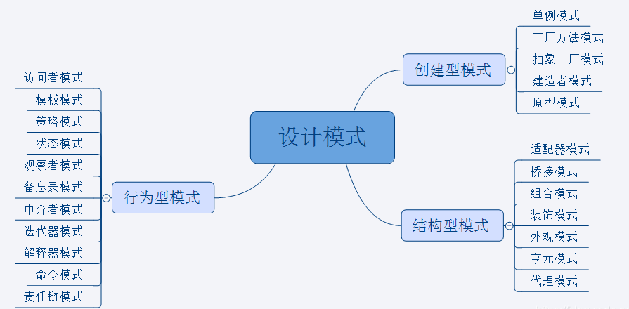
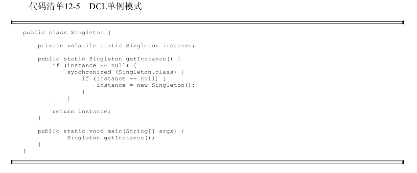
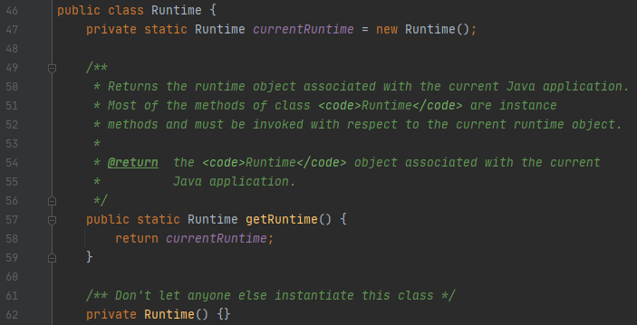
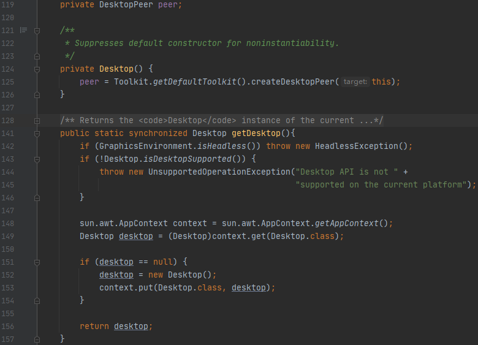

* Kramdown table of contents
{:toc .toc}


## 问题思考

- 说一说常用的设计模式，如何实现一个线程安全的单例模式，手写一个线程安全的单例模式。
- 双重校验单例模式需要加几层校验？为什么使用 volatile？不使用 volatile 会导致线程不安全吗？使用了 synchronized 为什么还需要使用 volatile？synchronized 保证了什么？
- 单例模式有哪几种实现方式？饿汉式单例模式和懒汉式单例模式的区别以及代码实现？
- 单例模式的实际应用场景？单例和多例的区别？

## 单例模式（Singleton）

定义：保证一个类仅有一个实例，并提供一个访问它的全局访问点。

特点：

> 1、单例模式只能有一个实例。
>
> 2、单例类必须创建自己的唯一实例。
>
> 3、单例类必须向其他对象提供这一实例。

## 单例模式的分类

- 饿汉式单例模式：立即加载
- 懒汉式单例模式：延迟加载

## 如何实现一个线程安全的单例模式

> 实现线程安全的单例模式需要防止反射、防止反序列化、防止 clone。
>
> 《Effective Java》第 3 条：用私有构造器或者枚举类型强化 Singleton 属性

## 单例模式的七种实现方式

### 懒汉式-双重校验单例模式



```java
public class Singleton implements Serializable, Cloneable {
    // 使用 volatile 禁止指令重排序
    private volatile static Singleton instance = null;

    // 私有化构造方法
    private Singleton() {
        // 防止反射
        if (instance != null) {
            throw new RuntimeException("单例模式不允许重复创建对象");
        }
    }

    public static Singleton getInstance() {
        if (instance == null) {                     // Single Checke
            synchronized (Singleton.class) {
                if (instance == null) {             // Double Checked
                    instance = new Singleton();
                }
            }
        }
        return instance;
    }

    // 防止 clone
    @Override
    protected Object clone() throws CloneNotSupportedException {
        return instance;
    }

    // 防止反序列化
    private Object readResolve() {
        return instance;
    }
}
```

> 懒汉式、线程安全
>
> 注意：防止反序列化需要实现 Serializable 接口并且重写 readResolve() 方法。防止 clone 需要实现 Cloneable 接口并且覆盖 Object 类的 clone() 方法。防止反射可以通过在构造方法中做判断，让它在被要求创建第二个实例的时候抛出异常。

### 懒汉式-静态内部类单例模式

```java
public class Singleton {
    private static class SingletonHolder {
        private static final Singleton INSTANCE = new Singleton();
    }

    private Singleton() {
    }

    public static Singleton getInstance() {
        return SingletonHolder.INSTANCE;
    }
}
```

> 懒汉式、线程安全

### 饿汉式-静态代码块单例模式

```java
public class Singleton {
    private static Singleton instance = null;

    static {
        instance = new Singleton();
    }

    private Singleton() {
    }

    public static Singleton getInstance() {
        return instance;
    }
}
```

> 饿汉式、线程安全

### 饿汉式-静态常量单例模式

```java
public class Singleton {
    private static final Singleton SINGLETON = new Singleton();

    private Singleton() {
    }

    public static Singleton getSingleton() {
        return SINGLETON;
    }
}
```

> 饿汉式、线程安全

### 懒汉式-同步代码块单例模式

```java
public class Singleton {
    private static Singleton instance = null;

    private Singleton() {
    }

    public static Singleton getInstance() {
        synchronized (Singleton.class) {
            if (instance == null) {
                instance = new Singleton();
            }
            return instance;
        }
    }
}
```

> 懒汉式、线程安全

### 懒汉式-同步方法单例模式

```java
public class Singleton {
    private static Singleton instance = null;

    private Singleton() {
    }

    public synchronized static Singleton getInstance() {
        if (instance == null) {
            instance = new Singleton();
        }
        return instance;
    }
}
```

> 懒汉式、线程安全

### 枚举类单例模式

```java
public enum Singleton {
    INSTANCE;
}

class Test {
    public static void main(String[] args) {
        Singleton instance1 = Singleton.INSTANCE;
        Singleton instance2 = Singleton.INSTANCE;
        System.out.println(instance1 == instance2);
    }
}
```

> 这种方法在功能上与静态常量单例模式相似，但更加简洁，无偿地提供了序列化机制，绝对防止多次实例化，即使是在面对复杂的序列化或者反射攻击的时候。虽然这种方法还没有广泛采用，但是**单元素的枚举类型经常成为实现 Singleton 的最佳方法**。注意，如果 Singleton 必须扩展一个超类，而不是扩展 Enum 的时候，则不宜使用这个方法（虽然可以声明枚举去实现接口）。

### 单例模式在 JDK 中的应用

```java
java.lang.Runtime#getRuntime()
java.awt.Desktop#getDesktop()
java.lang.System#getSecurityManager()
```





## 推荐阅读

- [如何正确地写出单例模式](http://wuchong.me/blog/2014/08/28/how-to-correctly-write-singleton-pattern/)