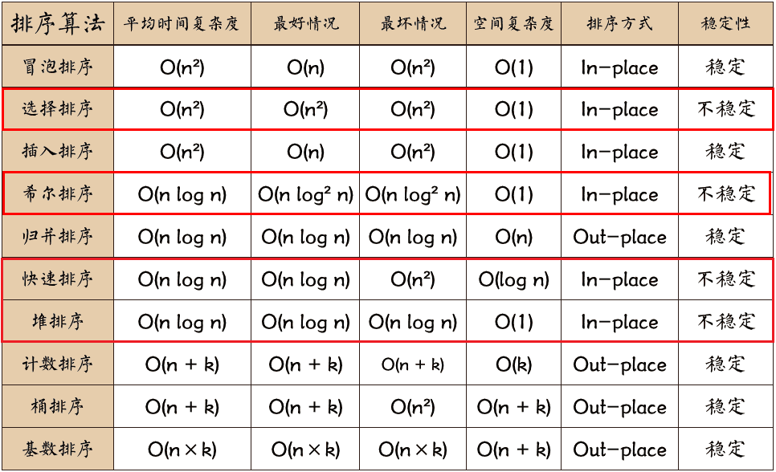
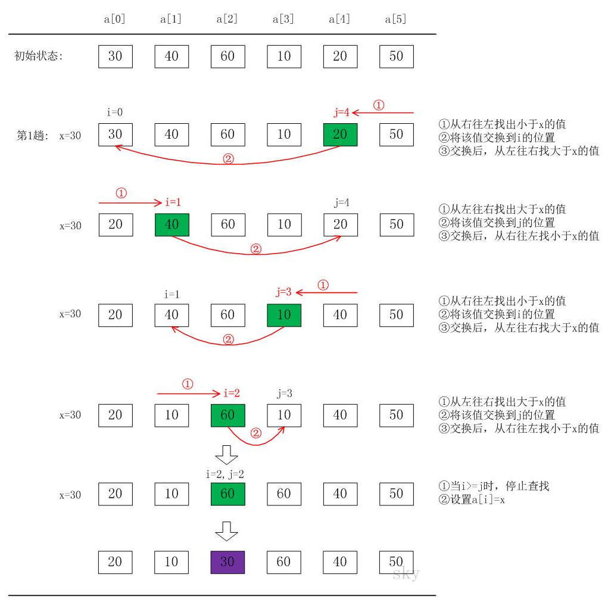

* Kramdown table of contents
{:toc .toc}
# 十大经典排序算法



不稳定的排序算法有：快速排序-希尔排序-选择排序-堆排序，简称：快希选堆。

# 冒泡排序

```java
/**
 * Created by hgnulb on 2020/10/24 19:53
 */
public class BubbleSort {
    public static void bubbleSort(int[] nums) {
        if (nums == null || nums.length == 0) {
            return;
        }
        int n = nums.length;
        boolean flag;
        for (int i = 0; i < n - 1; i++) {
            flag = true;
            for (int j = 0; j < n - 1 - i; j++) {
                if (nums[j] > nums[j + 1]) {
                    swap(nums, j, j + 1);
                    flag = false;
                }
            }
            if (flag) {
                break;
            }
        }
    }

    public static void swap(int[] nums, int i, int j) {
        int temp = nums[i];
        nums[i] = nums[j];
        nums[j] = temp;
    }

    public static void main(String[] args) {
        int[] nums = {2, 5, 4, 1, 3, 8, 6, 9, 7, 0};
        BubbleSort.bubbleSort(nums);
        System.out.println(Arrays.toString(nums));
    }
}
```

# 选择排序

```java
/**
 * Created by hgnulb on 2020/10/24 20:09
 */
public class SelectionSort {
    public static void selectionSort(int[] nums) {
        if (nums == null || nums.length == 0) {
            return;
        }
        int n = nums.length;
        for (int i = 0; i < n - 1; i++) {
            int minIndex = i;
            for (int j = i + 1; j < n; j++) {
                if (nums[j] < nums[minIndex]) {
                    minIndex = j;
                }
            }
            if (minIndex != i) {
                swap(nums, minIndex, i);
            }
        }
    }

    public static void swap(int[] nums, int i, int j) {
        int temp = nums[i];
        nums[i] = nums[j];
        nums[j] = temp;
    }

    public static void main(String[] args) {
        int[] nums = {2, 5, 4, 1, 3, 8, 6, 9, 7, 0};
        SelectionSort.selectionSort(nums);
        System.out.println(Arrays.toString(nums));
    }
}
```

# 插入排序

```java
/**
 * Created by hgnulb on 2020/10/24 20:17
 */
public class InsertionSort {
    public static void insertionSort(int[] nums) {
        if (nums == null || nums.length == 0) {
            return;
        }
        for (int i = 1; i < nums.length; i++) {
            int temp = nums[i];
            int j = i;
            while (j > 0 && temp < nums[j - 1]) {
                nums[j] = nums[j - 1];
                j--;
            }
            if (j != i) {
                nums[j] = temp;
            }
        }
    }

    public static void main(String[] args) {
        int[] nums = {2, 5, 4, 1, 3, 8, 6, 9, 7, 0};
        InsertionSort.insertionSort(nums);
        System.out.println(Arrays.toString(nums));
    }
}
```

# 归并排序

```java
class Solution {
    public int[] sortArray(int[] nums) {
        if (nums == null || nums.length < 2) {
            return nums;
        }
        mergeSort(nums, 0, nums.length - 1);
        return nums;
    }

    public void mergeSort(int[] nums, int left, int right) {
        if (left < right) {
            int mid = left + (right - left) / 2;
            mergeSort(nums, left, mid);
            mergeSort(nums, mid + 1, right);
            merge(nums, left, mid, right);
        }
    }

    public void merge(int[] nums, int left, int mid, int right) {
        int[] result = new int[right - left + 1];
        int p1 = left, p2 = mid + 1, p = 0;
        while (p1 <= mid && p2 <= right) {
            if (nums[p1] < nums[p2]) {
                result[p++] = nums[p1++];
            } else {
                result[p++] = nums[p2++];
            }
        }
        while (p1 <= mid) {
            result[p++] = nums[p1++];
        }
        while (p2 <= right) {
            result[p++] = nums[p2++];
        }
        for (int i = 0; i < p; i++) {
            nums[left + i] = result[i];
        }
    }
}
```

## [88. 合并两个有序数组](https://leetcode-cn.com/problems/merge-sorted-array/)

```java
class Solution {
    public void merge(int[] nums1, int m, int[] nums2, int n) {
        int p1 = m - 1;
        int p2 = n - 1;
        int p = m + n - 1;

        while (p1 >= 0 && p2 >= 0) {
            if (nums1[p1] > nums2[p2]) {
                nums1[p] = nums1[p1];
                p--;
                p1--;
            } else {
                nums1[p] = nums2[p2];
                p--;
                p2--;
            }
        }

        while (p2 >= 0) {
            nums1[p] = nums2[p2];
            p--;
            p2--;
        }
    }
}
```

## [21. 合并两个有序链表](https://leetcode-cn.com/problems/merge-two-sorted-lists/)

```java
class Solution {
    public ListNode mergeTwoLists(ListNode l1, ListNode l2) {
        ListNode dummy = new ListNode(-1);
        ListNode cur = dummy;
        while (l1 != null && l2 != null) {
            if (l1.val < l2.val) {
                cur.next = l1;
                l1 = l1.next;
            } else {
                cur.next = l2;
                l2 = l2.next;
            }
            cur = cur.next;
        }
        cur.next = l1 == null ? l2 : l1;
        return dummy.next;
    }
}
```

# 快速排序



```java
/**
 * Created by hgnulb on 2020/9/17 20:56
 */
public class QuickSort {
    // 快速排序
    public static void quickSort(int[] nums, int start, int end) {
        if (start >= end) return;
        int i = start, j = end; // 左右指针
        int point = nums[start]; // 第一个元素作为基准点
        // i == j 的时候退出循环, 此时这个位置存放基准点
        while (i < j) {
            while (i < j && nums[j] < point) j--;
            if (i < j) nums[i++] = nums[j];
            while (i < j && nums[i] > point) i++;
            if (i < j) nums[j--] = nums[i];
        }
        nums[i] = point; // 或者 nums[j] = point; 此时 i == j, 基准点存放的位置
        quickSort(nums, start, i - 1); // 递归左半部分
        quickSort(nums, i + 1, end); // 递归右半部分
    }
}
```

# 堆排序

```java
/**
 * Created by hgnulb on 2020/9/18 14:08
 */
public class HeapSort {
    public static void heapSort(int[] nums) {
        if (nums == null || nums.length <= 1) return;
        for (int i = nums.length / 2 - 1; i >= 0; i--) {
            siftDown(nums, i, nums.length);
        }
        for (int j = nums.length - 1; j > 0; j--) {
            swap(nums, 0, j);
            siftDown(nums, 0, j);
        }
    }

    // 调整一个数组为小顶推
    private static void siftDown(int[] nums, int k, int len) {
        while (2 * k + 1 < len) {
            int j = 2 * k + 1;
            if (j + 1 < len && nums[j + 1] < nums[j]) j++;
            if (nums[k] <= nums[j]) break;
            swap(nums, k, j);
            k = j;
        }
    }

    // 调整一个数组为大顶推
    /*private static void siftDown(int[] nums, int k, int len) {
        while (2 * k + 1 < len) {
            int j = 2 * k + 1; // 左节点
            if (j + 1 < len && nums[j + 1] > nums[j]) j++;
            if (nums[k] >= nums[j]) break;
            swap(nums, k, j);
            k = j;
        }
    }*/

    // 交换数组中的两个元素
    private static void swap(int[] nums, int i, int j) {
        int temp = nums[i];
        nums[i] = nums[j];
        nums[j] = temp;
    }

    public static void main(String[] args) {
        int[] nums = {9, 8, 7, 6, 5, 4, 3, 2, 1};
        new HeapSort().heapSort(nums);
        System.out.println(Arrays.toString(nums));
    }
}
```

# [912. 排序数组](https://leetcode-cn.com/problems/sort-an-array/)

# 参考资料

- [https://www.cnblogs.com/wmyskxz/p/9301021.html](https://www.cnblogs.com/wmyskxz/p/9301021.html)
- [https://www.cnblogs.com/skywang12345/p/3596746.html](https://www.cnblogs.com/skywang12345/p/3596746.html)
- [https://sort.hust.cc/](https://sort.hust.cc/)
- [https://www.cs.usfca.edu/~galles/visualization/Algorithms.html](https://www.cs.usfca.edu/~galles/visualization/Algorithms.html)