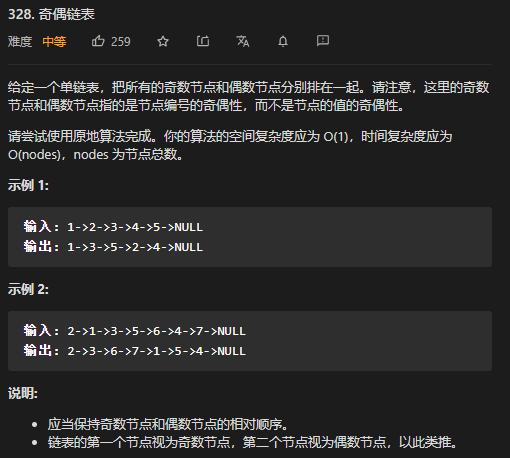

* Kramdown table of contents
{:toc .toc}
# LeetCode 相关题目整理


## 单链表结构

```java
class ListNode {
    int val;
    ListNode next;

    ListNode() {
    }

    ListNode(int val) {
        this.val = val;
    }

    ListNode(int val, ListNode next) {
        this.val = val;
        this.next = next;
    }
}
```

## [21. 合并两个有序链表](https://leetcode-cn.com/problems/merge-two-sorted-lists/)

> 将两个升序链表合并为一个新的 **升序** 链表并返回。新链表是通过拼接给定的两个链表的所有节点组成的。 

**迭代法**

```java
class Solution {
    public ListNode mergeTwoLists(ListNode l1, ListNode l2) {
        if (l1 == null || l2 == null) {
            return l1 == null ? l2 : l1;
        }
        ListNode dummy = new ListNode(-1);
        ListNode cur = dummy;
        while (l1 != null && l2 != null) {
            if (l1.val < l2.val) {
                cur.next = l1;
                l1 = l1.next;
            } else {
                cur.next = l2;
                l2 = l2.next;
            }
            cur = cur.next;
        }
        cur.next = l1 == null ? l2 : l1;
        return dummy.next;
    }
}
```

**递归法**

```java
class Solution {
    public ListNode mergeTwoLists(ListNode l1, ListNode l2) {
        if (l1 == null || l2 == null) {
            return l1 == null ? l2 : l1;
        }
        if (l1.val < l2.val) {
            l1.next = mergeTwoLists(l1.next, l2);
            return l1;
        } else {
            l2.next = mergeTwoLists(l1, l2.next);
            return l2;
        }
    }
}
```

## [23. 合并K个升序链表](https://leetcode-cn.com/problems/merge-k-sorted-lists/)


> 解题思路：
>
> 借助优先级队列 PriorityQueue 来解答。

```java
class Solution {
    public ListNode mergeKLists(ListNode[] lists) {
        PriorityQueue<ListNode> queue = new PriorityQueue<>((o1, o2) -> o1.val - o2.val);
        for (ListNode node : lists) {
            if (node != null) {
                queue.add(node);
            }
        }
        ListNode dummy = new ListNode(-1);
        ListNode cur = dummy;
        while (!queue.isEmpty()) {
            ListNode node = queue.poll();
            cur.next = node;
            if (node != null && node.next != null) {
                queue.add(node.next);
            }
            cur = cur.next;
        }
        return dummy.next;
    }
}
```

## [876. 链表的中间结点](https://leetcode-cn.com/problems/middle-of-the-linked-list/)

> 给定一个带有头结点 `head` 的非空单链表，返回链表的中间结点。如果有两个中间结点，则返回第二个中间结点。
>

```java
class Solution {
    // 获取链表的中间结点
    public ListNode middleNode(ListNode head) {
        ListNode fast = head, slow = head;
        while (fast != null && fast.next != null) {
            fast = fast.next.next;
            slow = slow.next;
        }
        return slow;
    }
}
```

## [206. 反转链表](https://leetcode-cn.com/problems/reverse-linked-list/)

> 反转一个单链表。


**迭代法**

```java
class Solution {
    public ListNode reverseList(ListNode head) {
        if (head == null ||head.next == null) {
            return head;
        }
        ListNode cur = head,pre = null;
        while (cur!=null) {
            ListNode temp = cur.next;
            cur.next = pre;
            pre = cur;
            cur = temp;
        }
        return pre;
    }
}
```

**递归法**

```java
class Solution {
    public ListNode reverseList(ListNode head) {
        if (head == null || head.next == null) {
            return head;
        }
        ListNode newHead = reverseList(head.next);
        head.next.next = head;
        head.next = null;
        return newHead;
    }
}
```

## [92. 反转链表 II](https://leetcode-cn.com/problems/reverse-linked-list-ii/)

> 反转从位置 *m* 到 *n* 的链表。请使用一趟扫描完成反转。
>
> **说明:**
> 1 ≤ *m* ≤ *n* ≤ 链表长度。

```java
class Solution {
    public ListNode reverseBetween(ListNode head, int m, int n) {
        ListNode dummy = new ListNode(-1);
        dummy.next = head;
        ListNode left = dummy;
        for (int i = 1; i < m; i++) {
            left = left.next;
        }
        ListNode pre = null, cur = left.next;
        for (int i = m; i <= n; i++) {
            ListNode temp = cur.next;
            cur.next = pre;
            pre = cur;
            cur = temp;
        }
        left.next.next = cur;
        left.next = pre;
        return dummy.next;
    }
}
```

## [143. 重排链表](https://leetcode-cn.com/problems/reorder-list/)

```java
class Solution {
    public void reorderList(ListNode head) {
        if (head == null || head.next == null) {
            return;
        }
        ListNode fast = head, slow = head;
        // 1. 获取链表的中间结点
        while (fast.next != null && fast.next.next != null) {
            fast = fast.next.next;
            slow = slow.next;
        }

        // 2. 从中间结点开始反转后半部分链表, 反转后 pre 为新头结点
        ListNode pre = null, cur = slow.next;
        while (cur != null) {
            ListNode temp = cur.next;
            cur.next = pre;
            pre = cur;
            cur = temp;
        }
        slow.next = null; // 前半部分结点从中间结点处断开

        // 3. 合并两部分链表
        ListNode first = head, second = pre, next;
        while (first != null && second != null) {
            next = second.next; // 保存后部分当前结点的下一个结点
            second.next = first.next; // 将后半部分当前结点指向前半部分的当前结点下一个结点
            first.next = second; // 将前半部分第一个当前结点指向后半部分结点
            first = second.next; // 前半部分结点向后移动
            second = next; // 后半部分结点向后移动
        }
    }
}
```

## [141. 环形链表](https://leetcode-cn.com/problems/linked-list-cycle/)

> 给定一个链表，判断链表中是否有环。

> 解题思路:
>
> 判断链表是否有环应该是老生常谈的一个话题了，最简单的一种方式就是快慢指针，慢指针针每次走一步，快指针每次走两步，如果相遇就说明有环，如果有一个为空说明没有环。

```java
class Solution {
    public boolean hasCycle(ListNode head) {
        if (head == null || head.next == null) {
            return false;
        }
        ListNode slow = head, fast = head;
        while (fast != null && fast.next != null) {
            slow = slow.next;
            fast = fast.next.next;
            if (slow == fast) {
                return true;
            }
        }
        return false;
    }
}
```

## [142. 环形链表 II](https://leetcode-cn.com/problems/linked-list-cycle-ii/)

> 给定一个链表，返回链表开始入环的第一个节点。 如果链表无环，则返回 `null`。


> 解题思路:
>
> 利用"快慢指针"思想解答。
>
> a+n(b+c)+b=a+(n+1)b+nc
> a+(n+1)b+nc=2(a+b)⟹a=c+(n−1)(b+c)
> **a=c+(n−1)(b+c)**

```java
class Solution {
    public ListNode detectCycle(ListNode head) {
        if (head == null || head.next == null) {
            return null;
        }
        ListNode slow = head, fast = head;
        while (fast != null && fast.next != null) {
            slow = slow.next;
            fast = fast.next.next;
            if (slow == fast) {
                slow = head;
                while (slow != fast) {
                    slow = slow.next;
                    fast = fast.next;
                }
                return slow;
            }
        }
        return null;
    }
}
```

## [160. 相交链表](https://leetcode-cn.com/problems/intersection-of-two-linked-lists/)

> 编写一个程序，找到两个单链表相交的起始节点。


方法一：双指针

> 如果两个链表相交，那么相交点之后的长度是相同的。一种比较巧妙的方式是，分别为链表 A 和链表 B 设置指针 A 和指针 B，然后开始遍历链表，如果遍历完当前链表，则将指针指向另外一个链表的头部继续遍历，直至两个指针相遇。最终两个指针分别走过的路径为：
> 指针 A：a+c+b
> 指针 B：b+c+a
> 明显 a+c+b = b+c+a，因而如果两个链表相交，则指针 A 和指针 B 必定在相交结点相遇。


```java
class Solution {
    public ListNode getIntersectionNode(ListNode headA, ListNode headB) {
        if (headA == null || headB == null) {
            return null;
        }
        ListNode slow = headA, fast = headB;
        while (slow != fast) {
            slow = slow == null ? headB : slow.next;
            fast = fast == null ? headA : fast.next;
        }
        return slow;
    }
}
```

方法二：哈希表

> 利用 set 集合解决。

```java
class Solution {
    public ListNode getIntersectionNode(ListNode headA, ListNode headB) {
        if (headA == null || headB == null) {
            return null;
        }
        ListNode A = headA, B = headB;
        Set<ListNode> set = new HashSet<>();
        while (A != null) {
            set.add(A);
            A = A.next;
        }
        while (B != null) {
            if (set.contains(B)) {
                return B;
            }
            B = B.next;
        }
        return null;
    }
}
```

## [19. 删除链表的倒数第N个节点](https://leetcode-cn.com/problems/remove-nth-node-from-end-of-list/)

> 给定一个链表，删除链表的倒数第 *n* 个节点，并且返回链表的头结点。
>
> 示例：
>
> 给定一个链表: 1->2->3->4->5, 和 n = 2.
>
> 当删除了倒数第二个节点后，链表变为 1->2->3->5.

```java
class Solution {
    public ListNode removeNthFromEnd(ListNode head, int n) {
        ListNode dummy = new ListNode(-1);
        dummy.next = head;
        ListNode fast = dummy, slow = dummy;
        for (int i = 0; i <= n; i++) {
            fast = fast.next;
        }
        while (fast != null) {
            fast = fast.next;
            slow = slow.next;
        }
        slow.next = slow.next.next; // slow 是要删除节点的上一个节点
        return dummy.next;
    }
}
```

## [剑指 Offer 22. 链表中倒数第k个节点](https://leetcode-cn.com/problems/lian-biao-zhong-dao-shu-di-kge-jie-dian-lcof/)


```java
class Solution {
    public ListNode getKthFromEnd(ListNode head, int k) {
        ListNode slow = head, fast = head;
        for (int i = 0; i < k; i++) {
            fast = fast.next;
        }
        while (fast != null) {
            fast = fast.next;
            slow = slow.next;
        }
        return slow;
    }
}
```

## [2. 两数相加](https://leetcode-cn.com/problems/add-two-numbers/)


```java
class Solution {
    public ListNode addTwoNumbers(ListNode l1, ListNode l2) {
        if (l1 == null || l2 == null) {
            return l1 == null ? l2 : l1;
        }
        ListNode dummy = new ListNode(-1);
        ListNode cur = dummy;
        int sum, cnt = 0;
        while (l1 != null || l2 != null) {
            sum = cnt;
            if (l1 != null) {
                sum += l1.val;
                l1 = l1.next;
            }
            if (l2 != null) {
                sum += l2.val;
                l2 = l2.next;
            }
            cur.next = new ListNode(sum % 10);
            cur = cur.next;
            cnt = sum / 10;
        }
        if (cnt != 0) {
            cur.next = new ListNode(cnt);
        }
        return dummy.next;
    }
}
```

## [445. 两数相加 II](https://leetcode-cn.com/problems/add-two-numbers-ii/)


> 解题思路:
>
> 头插法，类似于反转单链表。

```java
class Solution {
    public ListNode addTwoNumbers(ListNode l1, ListNode l2) {
        if (l1 == null || l2 == null) {
            return l1 == null ? l2 : l1;
        }
        Stack<Integer> s1 = new Stack<>();
        Stack<Integer> s2 = new Stack<>();
        while (l1 != null) {
            s1.push(l1.val);
            l1 = l1.next;
        }
        while (l2 != null) {
            s2.push(l2.val);
            l2 = l2.next;
        }
        ListNode cur = null;
        ListNode pre = null;
        int sum, cnt = 0;
        while (!s1.isEmpty() || !s2.isEmpty()) {
            sum = cnt;
            if (!s1.isEmpty()) {
                sum += s1.pop();
            }
            if (!s2.isEmpty()) {
                sum += s2.pop();
            }

            cur = new ListNode(sum % 10);
            cur.next = pre;
            pre = cur;

            cnt = sum / 10;
        }
        if (cnt != 0) {
            cur = new ListNode(cnt);
            cur.next = pre;
        }
        return cur;
    }
}
```

## [234. 回文链表](https://leetcode-cn.com/problems/palindrome-linked-list/)


> 解题思路:
>
> 1. 利用栈"后进先出"的特性
>
> 2. 利用"数组"的特性
>
> 3. 利用"快慢指针"思想解决

方法一：利用栈"后进先出"的特性

```java
class Solution {
    public boolean isPalindrome(ListNode head) {
        if (head == null || head.next == null) {
            return true;
        }
        ListNode cur = head;
        Stack<Integer> stack = new Stack<>();
        while (cur != null) {
            stack.push(cur.val);
            cur = cur.next;
        }
        while (!stack.isEmpty()) {
            if (!stack.pop().equals(head.val)) {
                return false;
            } else {
                head = head.next;
            }
        }
        return true;
    }
}
```

方法二：利用"数组"的特性

```java
class Solution {
    public boolean isPalindrome(ListNode head) {
        if (head == null || head.next == null) {
            return true;
        }
        List<Integer> list = new ArrayList<>();
        while (head != null) {
            list.add(head.val);
            head = head.next;
        }
        for (int i = 0; i < list.size() / 2; i++) {
            if (!list.get(i).equals(list.get(list.size() - 1 - i))) {
                return false;
            }
        }
        return true;
    }
}
```

方法三：利用"快慢指针"思想解决

> 将链表看成左右两部分，反转右半部分，然后比较左右两部分是否一样。

```java
class Solution {
    public boolean isPalindrome(ListNode head) {
        if (head == null || head.next == null) {
            return true;
        }
        ListNode slow = head, fast = head;
        while (fast != null && fast.next != null) { // 获取链表的中间节点
            fast = fast.next.next;
            slow = slow.next;
        }
        if (fast != null) {
            slow = slow.next; // 奇数个节点的时候，slow 为正中间节点的右半部分第一个节点。
        }
        slow = reverse(slow);
        fast = head;
        while (slow != null) {
            if (slow.val != fast.val) {
                return false;
            }
            slow = slow.next;
            fast = fast.next;
        }
        return true;
    }

    // 反转单链表
    public ListNode reverse(ListNode head) {
        ListNode pre = null;
        while (head != null) {
            ListNode next = head.next;
            head.next = pre;
            pre = head;
            head = next;
        }
        return pre;
    }
}
```

## [328. 奇偶链表](https://leetcode-cn.com/problems/odd-even-linked-list/)



## [83. 删除排序链表中的重复元素](https://leetcode-cn.com/problems/remove-duplicates-from-sorted-list/)


```java
class Solution {
    public ListNode deleteDuplicates(ListNode head) {
        ListNode cur = head;
        while (cur != null && cur.next != null) {
            if (cur.val == cur.next.val) {
                cur.next = cur.next.next;
            } else {
                cur = cur.next;
            }
        }
        return head;
    }
}
```

## [82. 删除排序链表中的重复元素 II](https://leetcode-cn.com/problems/remove-duplicates-from-sorted-list-ii/)


```java
class Solution {
    public ListNode deleteDuplicates(ListNode head) {
        if (head == null || head.next == null) {
            return head;
        }
        if (head.val == head.next.val) {
            while (head != null && head.next != null && head.val == head.next.val) {
                head = head.next;
            }
            return deleteDuplicates(head.next);
        } else {
            head.next = deleteDuplicates(head.next);
            return head;
        }
    }
}
```

```java
class Solution {
    public ListNode deleteDuplicates(ListNode head) {
        if (head == null || head.next == null) {
            return head;
        }
        Map<Integer, Integer> map = new TreeMap<>();
        ListNode dummy = new ListNode(-1);
        ListNode cur = head;
        while (cur != null) {
            map.put(cur.val, map.getOrDefault(cur.val, 0) + 1);
            cur = cur.next;
        }
        cur = dummy;
        for (Map.Entry<Integer, Integer> entry : map.entrySet()) {
            if (entry.getValue() == 1) {
                cur.next = new ListNode(entry.getKey());
                cur = cur.next;
            }
        }
        return dummy.next;
    }
}
```

## [86. 分隔链表](https://leetcode-cn.com/problems/partition-list/)


## [25. K 个一组翻转链表](https://leetcode-cn.com/problems/reverse-nodes-in-k-group/)

## [147. 对链表进行插入排序](https://leetcode-cn.com/problems/insertion-sort-list/)


```java
class Solution {
    public ListNode insertionSortList(ListNode head) {
        if (head == null || head.next == null) {
            return head;
        }
        ListNode helper = new ListNode(0);
        ListNode cur = head;
        ListNode pre = helper;
        ListNode next = null;
        while (cur != null) {
            next = cur.next;
            while (pre.next != null && pre.next.val < cur.val) {
                pre = pre.next;
            }
            cur.next = pre.next;
            pre.next = cur;
            pre = helper;
            cur = next;
        }
        return helper.next;
    }
}
```

## [148. 排序链表](https://leetcode-cn.com/problems/sort-list/)

> 单链表插入排序(超时)
>
> 单链表选择排序(超时)
>
> 单链表归并排序(最好)
>
> 单链表快速排序(通过)

方法一：归并排序


```java
class Solution {
    public ListNode sortList(ListNode head) {
        if (head == null || head.next == null) {
            return head;
        }
        // 1. 获取链表的中间结点，分割链表
        ListNode pre = null, slow = head, fast = head;
        while (fast != null && fast.next != null) {
            pre = slow;
            fast = fast.next.next;
            slow = slow.next;
        }

        pre.next = null;

        // 2. 排序左右部分链表
        ListNode l1 = sortList(head);
        ListNode l2 = sortList(slow);

        // 3. 合并两个有序链表
        return merge(l1, l2);
    }

    public ListNode merge(ListNode l1, ListNode l2) {
        if (l1 == null || l2 == null) {
            return l1 == null ? l2 : l1;
        }
        ListNode dummy = new ListNode(-1);
        ListNode cur = dummy;
        while (l1 != null && l2 != null) {
            if (l1.val < l2.val) {
                cur.next = l1;
                l1 = l1.next;
            } else {
                cur.next = l2;
                l2 = l2.next;
            }
            cur = cur.next;
        }
        cur.next = l1 == null ? l2 : l1;
        return dummy.next;
    }
}
```

方法二：选择排序

```java
class Solution {
    public ListNode sortList(ListNode head) {
        if (head == null || head.next == null) {
            return head;
        }
        ListNode dummy = new ListNode(0);
        ListNode cur = head;
        dummy.next = cur;
        while (cur != null) {
            ListNode temp = cur;
            ListNode min = cur;  // 存放每轮遍历的最小值的结点
            while (temp != null) {
                if (temp.val < min.val) {
                    min = temp;
                }
                temp = temp.next;
            }
            // 交换两结点的值
            int t = cur.val;
            cur.val = min.val;
            min.val = t;
            cur = cur.next;
        }
        return dummy.next;
    }
}
```

方法三：插入排序

```java
class Solution {
    public ListNode sortList(ListNode head) {
        if (head == null || head.next == null) {
            return head;
        }
        ListNode helper = new ListNode(0);
        ListNode cur = head;
        ListNode pre = helper;
        ListNode next = null;
        while (cur != null) {
            next = cur.next;
            while (pre.next != null && pre.next.val < cur.val) {
                pre = pre.next;
            }
            cur.next = pre.next;
            pre.next = cur;
            pre = helper;
            cur = next;
        }
        return helper.next;
    }
}
```

方法四：快速排序

```java
class Solution {
    public ListNode sortList(ListNode head) {
        quickSort(head, null);
        return head;
    }

    public static void quickSort(ListNode head, ListNode end) {
        if (head != end) {
            ListNode node = partion(head, end);
            quickSort(head, node);
            quickSort(node.next, end);
        }
    }

    public static ListNode partion(ListNode head, ListNode end) {
        ListNode p1 = head, p2 = head.next;
        //走到末尾才停
        while (p2 != end) {
            //大于key值时，p1向前走一步，交换p1与p2的值
            if (p2.val < head.val) {
                p1 = p1.next;
                int temp = p1.val;
                p1.val = p2.val;
                p2.val = temp;
            }
            p2 = p2.next;
        }

        //当有序时，不交换p1和key值
        if (p1 != head) {
            int temp = p1.val;
            p1.val = head.val;
            head.val = temp;
        }
        return p1;
    }
}
```

# 参考资料

- [https://www.nowcoder.com/ta/job-code-high](https://www.nowcoder.com/ta/job-code-high)