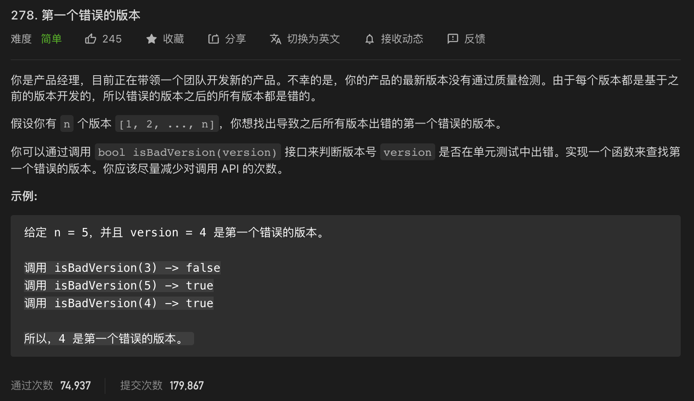

* Kramdown table of contents
{:toc .toc}
# 二分查找

## 实现一个有序数组的二分查找算法

### [704. 二分查找](https://leetcode-cn.com/problems/binary-search/)

```java
class Solution {
    public int search(int[] nums, int target) {
        int left = 0, right = nums.length - 1;
        while (left <= right) {
            int mid = left + (right - left) / 2;
            if (nums[mid] == target) {
                return mid;
            } else if (nums[mid] < target) {
                left = mid + 1;
            } else if (nums[mid] > target) {
                right = mid - 1;
            }
        }
        return -1;
    }
}
```

## 实现模糊的二分查找算法

> 比如**大于等于**给定值的第一个元素，**寻找右侧边界的二分查找**；比如**小于等于**给定值的第一个元素，**寻找左侧边界的二分搜索**。

### [34. 在排序数组中查找元素的第一个和最后一个位置](https://leetcode-cn.com/problems/find-first-and-last-position-of-element-in-sorted-array/)

```java
class Solution {
    public int[] searchRange(int[] nums, int target) {
        if (nums == null || nums.length == 0) {
            return new int[]{-1, -1};
        }
        int left = searchLeftRange(nums, target);
        int right = searchRightRange(nums, target);
        return new int[]{left, right};
    }

    public int searchLeftRange(int[] nums, int target) {
        if (nums == null || nums.length == 0) {
            return -1;
        }
        int left = 0, right = nums.length - 1;
        while (left <= right) {
            int mid = left + (right - left) / 2;
            if (nums[mid] == target) {
                right = mid - 1;
            } else if (nums[mid] < target) {
                left = mid + 1;
            } else if (nums[mid] > target) {
                right = mid - 1;
            }
        }
        if (left >= nums.length || nums[left] != target) {
            return -1;
        }
        return left;
    }

    public int searchRightRange(int[] nums, int target) {
        if (nums == null || nums.length == 0) {
            return -1;
        }
        int left = 0, right = nums.length - 1;
        while (left <= right) {
            int mid = left + (right - left) / 2;
            if (nums[mid] == target) {
                left = mid + 1;
            } else if (nums[mid] < target) {
                left = mid + 1;
            } else if (nums[mid] > target) {
                right = mid - 1;
            }
        }
        if (right < 0 || nums[right] != target) {
            return -1;
        }
        return right;
    }
}
```

## LeetCode 二分查找高频题

### [35. 搜索插入位置](https://leetcode-cn.com/problems/search-insert-position/)

```java
class Solution {
    public int searchInsert(int[] nums, int target) {
        int left = 0, right = nums.length - 1;
        while (left <= right) {
            int mid = left + (right - left) / 2;
            if (nums[mid] == target) {
                return mid;
            } else if (nums[mid] < target) {
                left = mid + 1;
            } else if (nums[mid] > target) {
                right = mid - 1;
            }
        }
        return left;
    }
}
```

### [278. 第一个错误的版本](https://leetcode-cn.com/problems/first-bad-version/)



```java
/* The isBadVersion API is defined in the parent class VersionControl.
      boolean isBadVersion(int version); */

public class Solution extends VersionControl {
    public int firstBadVersion(int n) {
        int left = 1, right = n;
        while (left <= right) {
            int mid = left + (right - left) / 2;
            if (!isBadVersion(mid)) {
                left = mid + 1;
            } else {
                right = mid - 1;
            }
        }
        return left;
    }
}
```

### [744. 寻找比目标字母大的最小字母](https://leetcode-cn.com/problems/find-smallest-letter-greater-than-target/)

```java
class Solution {
    public char nextGreatestLetter(char[] letters, char target) {
        int left = 0, right = letters.length - 1;
        while (left <= right) {
            int mid = left + (right - left) / 2;
            if (letters[mid] <= target) {
                left++;
            } else {
                right = mid - 1;
            }
        }
        if (left >= letters.length) {
            return letters[0];
        }
        return letters[left];
    }
}
```

## 参考资料

- [我写了首诗，让你闭着眼睛也能写对二分搜索](https://labuladong.gitbook.io/algo/di-ling-zhang-bi-du-xi-lie-qing-an-shun-xu-yue-du/er-fen-cha-zhao-xiang-jie)