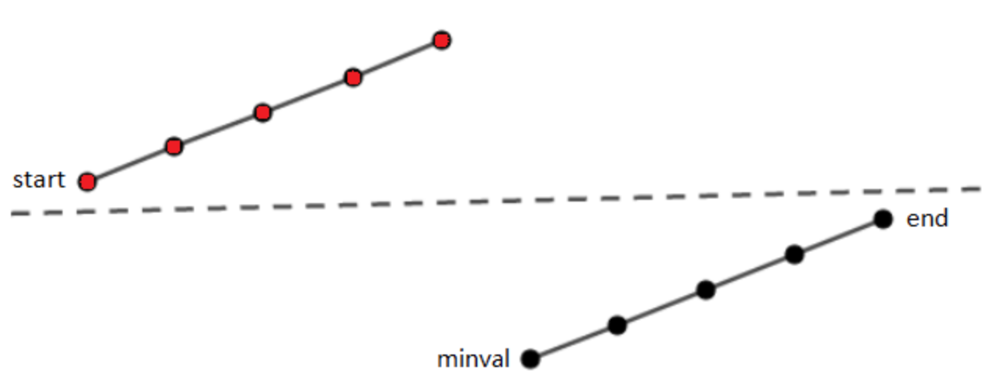

* Kramdown table of contents
{:toc .toc}
## 二分查找

### 实现一个有序数组的二分查找算法

#### [704. 二分查找](https://leetcode-cn.com/problems/binary-search/)

```java
class Solution {
    public int search(int[] nums, int target) {
        int left = 0, right = nums.length - 1;
        while (left <= right) {
            int mid = left + (right - left) / 2;
            if (nums[mid] == target) {
                return mid;
            } else if (nums[mid] < target) {
                left = mid + 1;
            } else if (nums[mid] > target) {
                right = mid - 1;
            }
        }
        return -1;
    }
}
```

### 实现模糊的二分查找算法

> 比如**大于等于**给定值的第一个元素，**寻找右侧边界的二分查找**；比如**小于等于**给定值的第一个元素，**寻找左侧边界的二分搜索**。

#### [34. 在排序数组中查找元素的第一个和最后一个位置](https://leetcode-cn.com/problems/find-first-and-last-position-of-element-in-sorted-array/)

```java
class Solution {
    public int[] searchRange(int[] nums, int target) {
        if (nums == null || nums.length == 0) {
            return new int[]{-1, -1};
        }
        int left = searchLeftRange(nums, target);
        int right = searchRightRange(nums, target);
        return new int[]{left, right};
    }

    public int searchLeftRange(int[] nums, int target) {
        if (nums == null || nums.length == 0) {
            return -1;
        }
        int left = 0, right = nums.length - 1;
        while (left <= right) {
            int mid = left + (right - left) / 2;
            if (nums[mid] == target) {
                right = mid - 1;
            } else if (nums[mid] < target) {
                left = mid + 1;
            } else if (nums[mid] > target) {
                right = mid - 1;
            }
        }
        if (left >= nums.length || nums[left] != target) {
            return -1;
        }
        return left;
    }

    public int searchRightRange(int[] nums, int target) {
        if (nums == null || nums.length == 0) {
            return -1;
        }
        int left = 0, right = nums.length - 1;
        while (left <= right) {
            int mid = left + (right - left) / 2;
            if (nums[mid] == target) {
                left = mid + 1;
            } else if (nums[mid] < target) {
                left = mid + 1;
            } else if (nums[mid] > target) {
                right = mid - 1;
            }
        }
        if (right < 0 || nums[right] != target) {
            return -1;
        }
        return right;
    }
}
```

## LeetCode 二分查找高频题

### [35. 搜索插入位置](https://leetcode-cn.com/problems/search-insert-position/)

```java
class Solution {
    public int searchInsert(int[] nums, int target) {
        int left = 0, right = nums.length - 1;
        while (left <= right) {
            int mid = left + (right - left) / 2;
            if (nums[mid] == target) {
                return mid;
            } else if (nums[mid] < target) {
                left = mid + 1;
            } else if (nums[mid] > target) {
                right = mid - 1;
            }
        }
        return left;
    }
}
```

### [278. 第一个错误的版本](https://leetcode-cn.com/problems/first-bad-version/)


```java
/* The isBadVersion API is defined in the parent class VersionControl.
      boolean isBadVersion(int version); */

public class Solution extends VersionControl {
    public int firstBadVersion(int n) {
        int left = 1, right = n;
        while (left <= right) {
            int mid = left + (right - left) / 2;
            if (!isBadVersion(mid)) {
                left = mid + 1;
            } else {
                right = mid - 1;
            }
        }
        return left;
    }
}
```

```java
/* The isBadVersion API is defined in the parent class VersionControl.
      boolean isBadVersion(int version); */

public class Solution extends VersionControl {
    public int firstBadVersion(int n) {
        int left = 1, right = n;
        while (left < right) {
            int mid = left + (right - left) / 2;
            if (isBadVersion(mid)) {
                right = mid;
            } else {
                left = mid + 1;
            }
        }
        return left;
    }
}
```

### [744. 寻找比目标字母大的最小字母](https://leetcode-cn.com/problems/find-smallest-letter-greater-than-target/)

```java
class Solution {
    public char nextGreatestLetter(char[] letters, char target) {
        int left = 0, right = letters.length - 1;
        while (left <= right) {
            int mid = left + (right - left) / 2;
            if (letters[mid] <= target) {
                left++;
            } else {
                right = mid - 1;
            }
        }
        if (left >= letters.length) {
            return letters[0];
        }
        return letters[left];
    }
}
```

### [162. 寻找峰值](https://leetcode-cn.com/problems/find-peak-element/)


```java
class Solution {
    public int findPeakElement(int[] nums) {
        if (nums == null || nums.length == 0) {
            return -1;
        }
        int left = 0, right = nums.length - 1;
        while (left < right) {
            int mid = left + (right - left) / 2;
            if (nums[mid] < nums[mid + 1]) {
                left = mid + 1;
            } else {
                right = mid;
            }
        }
        return left;
    }
}
```

### [852. 山脉数组的峰顶索引](https://leetcode-cn.com/problems/peak-index-in-a-mountain-array/)


```java
class Solution {
    public int peakIndexInMountainArray(int[] arr) {
        int left = 0, right = arr.length - 1;
        while(left < right) {
            int mid = left + (right - left) / 2;
            if(arr[mid] < arr[mid + 1]) {
                left = mid + 1;
            } else {
                right = mid;
            }
        }
        return left;
    }
}
```

### [1095. 山脉数组中查找目标值](https://leetcode-cn.com/problems/find-in-mountain-array/)

### 百度面试题: 求一个已排序的数组中绝对值最小的元素

```java
class Solution {
    /**
     * 35. 搜索插入位置
     * 给定一个排序数组和一个目标值，在数组中找到目标值，并返回其索引。
     * 如果目标值不存在于数组中，返回它将会被按顺序插入的位置。
     *
     * @param nums
     * @param target
     * @return
     */
    public static int searchInsert(int[] nums, int target) {
        int left = 0, right = nums.length - 1;
        while (left <= right) {
            int mid = left + (right - left) / 2;
            if (nums[mid] == target) {
                return mid;
            } else if (nums[mid] < target) {
                left = mid + 1;
            } else if (nums[mid] > target) {
                right = mid - 1;
            }
        }
        return left;
    }

    public static int search(int[] nums) {
        if (nums == null || nums.length == 0) {
            return -1; // 特殊情况，没有找到绝对值最小的数
        }
        // 数组只有一个元素
        if (nums.length == 1) {
            return Math.abs(nums[0]);
        }
        // 数组元素非负
        if (nums[0] >= 0) {
            return nums[0];
        }
        int n = nums.length;
        // 数组元素非正
        if (nums[n - 1] <= 0) {
            return Math.abs(nums[n - 1]);
        }
        int target = 0;
        int index = searchInsert(nums, target);
        return Math.min(Math.abs(nums[index]), Math.abs(nums[index - 1]));
    }

    public static void main(String[] args) {
        int[] nums = {-20, -13, -4, 6, 77, 200};
        int result = search(nums);
        System.out.println(result);
    }
}
```

## 搜索旋转排序数组

### [33. 搜索旋转排序数组](https://leetcode-cn.com/problems/search-in-rotated-sorted-array/)




```java
class Solution {
    public int search(int[] nums, int target) {
        int left = 0, right = nums.length - 1;
        while(left <= right) {
            int mid = left + (right - left) / 2;
            if(nums[mid] == target) {
                return mid;
            }
            if(nums[mid] > nums[right]) {
                if(target>=nums[left] && target < nums[mid]) {
                    right = mid - 1;
                }  else {
                    left = mid + 1;
                }
            } else {
                if(target > nums[mid] && target <= nums[right]) {
                    left = mid + 1;
                } else {
                    right = mid - 1;
                }
            }
        }
        return -1;
    }
}
```

### [153. 寻找旋转排序数组中的最小值](https://leetcode-cn.com/problems/find-minimum-in-rotated-sorted-array/)


```java
class Solution {
    public int findMin(int[] nums) {
        int left = 0, right = nums.length - 1;
        while (left < right) { // 注意：最小值是一定存在的，结束条件为 left == right.
            int mid = left + (right - left) / 2;
            if (nums[mid] > nums[right]) {
                left = mid + 1;
            } else {
                right = mid;
            }
        }
        return nums[left];
    }
}
```

## 参考资料

- [我写了首诗，让你闭着眼睛也能写对二分搜索](https://labuladong.gitbook.io/algo/di-ling-zhang-bi-du-xi-lie-qing-an-shun-xu-yue-du/er-fen-cha-zhao-xiang-jie)