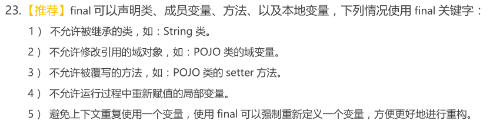

* Kramdown table of contents
{:toc .toc}
## final 关键字

> 根据上下文环境，Java 的关键字 final 的含义存在着细微的区别，但通常它指的是“这是无法改变的。”不想做改变可能出于两种理由：设计或效率。由于这两个原因相差很远，所以关键字 final 有可能被误用。
>
> 一个既是 static 又是 final 的域只占据一段不能改变的存储空间。
>
> 当对对象引用而不是基本类型运用 final 时，其含义会有一点令人迷惑。对于基本类型，final 使数值恒定不变；而用于对象引用，final 使引用恒定不变。一旦引用被初始化指向一个对象，就无法再把它改为指向另一个对象。然而，对象其自身却是可以被修改的，Java 并未提供使任何对象恒定不变的途径（但可以自己编写类以取得使对象恒定不变的效果）。这一限制同样适用数组，它也是对象。
>
> final 和 private 关键字
>
> 类中所有的 private 方法都隐式地指定为是 final 的。由于无法取用 private 方法，所以也就无法覆盖它。可以对 private 方法添加 final 修饰词，但这并不能给该方法增加任何额外的意义。这一问题会造成混淆。因为，如果你试图覆盖一个 private 方法（隐含是 final 的），似乎是奏效的，而且编译器也不会给出错误信息。
>
> final 修饰的类，为最终类，该类不能被继承。如 String、Integer、Date 类。
>
> final 修饰的方法可以被继承和重载，但不能被重写。      
>
> final 修饰的变量不能被修改，是个常量。对于基本类型，final 使数值恒定不变；而用于对象引用，final 使引用恒定不变。一旦引用被初始化指向一个对象，就无法再把它改为指向另一个对象。

## final 关键字常考面试题

- final 关键字的用法和作用。
- final 关键字的用法？知道哪些用法，在什么场景表示什么意思？
- final 关键字修饰类，方法等的限制。
- final 和 finally 的区别，finally 中的代码是否一定会执行？
- 谈谈 final,finally,finalize() 区别,finalize() 的使用场景。
- 谈谈 final、finally、finalize 的区别。
- finalize() 方法在什么时候调用。
- 有一个 public static final 的 HashMap，里边对象的属性能不能修改？
- final 修饰的对象可以改变引用吗，可以改变值吗？
- final 关键字，为什么 String 设置成 final 类型？常量池和堆里对象的区别？
- static 关键字和 final 关键字的使用情况，一个类不能被继承，除了 final 关键字之外，还有什么方法？（从构造函数考虑）
- final 修饰的方法能否被继承？
- 了解什么叫不可变类么？或者是叫不可变对象？
- final 的含义是什么？
- 成员变量都是 final 修饰的话，如何进行赋值？

以下关于 final 关键字说法正确的是（多选）

> A. final 是 java 中的修饰符，可以修饰类、接口、抽象类、方法和属性
>
> B. final 修饰的类肯定不能被继承
>
> C. final 修饰的方法不能被重载
>
> D. final 修饰的变量不允许被再次赋值

<a class="button show-hidden">点击查看结果</a>

<blockquote>
<b>参考答案</b>
BD

</blockquote>

## final 关键字总结

> 下面总结了一些使用 final 关键字的好处：
>
> （1）final 关键字提高了性能。JVM 和 Java 应用都会缓存 final 变量。
>
> （2）final 变量可以安全的在多线程环境下进行共享，而不需要额外的同步开销。
>
> （3）使用 final 关键字，JVM 会对方法、变量及类进行优化。
>
> 不可变类：
>
> 创建不可变类要使用 final 关键字。不可变类是指它的对象一旦被创建了就不能被更改了。String 是不可变类的代表。不可变类有很多好处，譬如它们的对象是只读的，可以在多线程环境下安全的共享，不用额外的同步开销等等。
>
> 关于 final 的重要知识点：
>
> （1）final 关键字可以用于成员变量、本地变量、方法以及类。
>
> （2）final 成员变量必须在声明的时候初始化或者在构造器中初始化，否则就会报编译错误。
>
> （3） 你不能够对 final 变量再次赋值。
>
> （4）本地变量必须在声明时赋值。
>
> （5）在匿名类中所有变量都必须是 final 变量。
>
> （6）final 方法不能被重写。
>
> （7）final 类不能被继承。
>
> （8）final 关键字不同于 finally 关键字，后者用于异常处理。
>
> （9）final 关键字容易与 finalize() 方法搞混，后者是在 Object 类中定义的方法，是在垃圾回收之前被 JVM 调用的方法。
>
> （10）接口中声明的所有变量本身是 final 的。
>
> （11）final 和 abstract 这两个关键字是反相关的，final 类就不可能是 abstract 的。
>
> （12）final 方法在编译阶段绑定，称为静态绑定 (static binding)。
>
> （13）没有在声明时初始化 final 变量的称为空白 final 变量 (blank final variable)，它们必须在构造器中初始化，或者调用 this() 初始化。不这么做的话，编译器会报错"final 变量 (变量名) 需要进行初始化"。
>
> （14）将类、方法、变量声明为 final 能够提高性能，这样 JVM 就有机会进行估计，然后优化。
>
> （15）按照 Java 代码惯例，final 变量就是常量，而且通常常量名要大写。

## 推荐阅读

- [浅析Java中的final关键字](https://www.cnblogs.com/dolphin0520/p/3736238.html)
- [深入理解Java中的不可变对象](https://www.cnblogs.com/dolphin0520/p/10693891.html)
