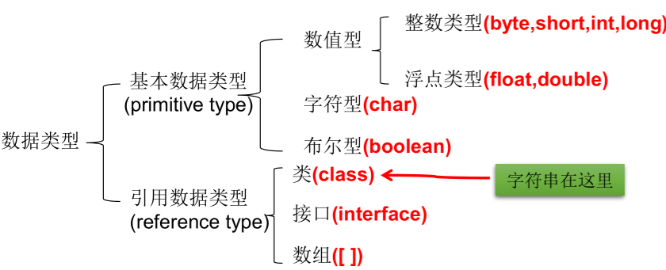
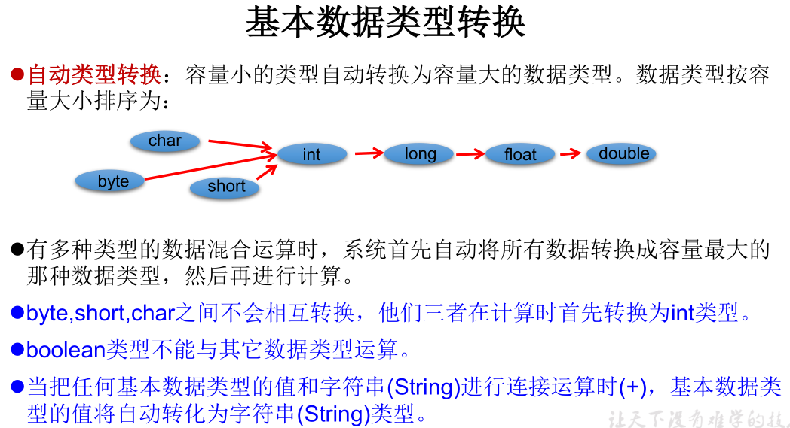
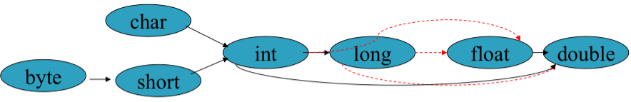
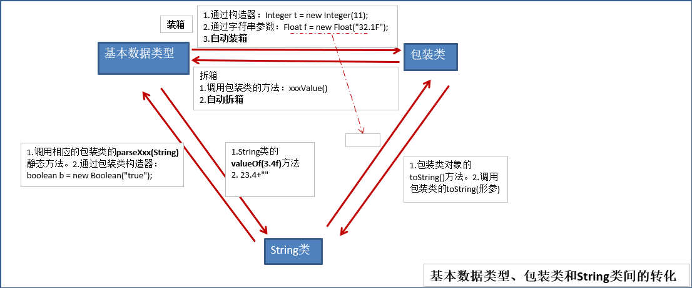
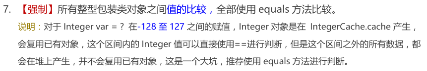
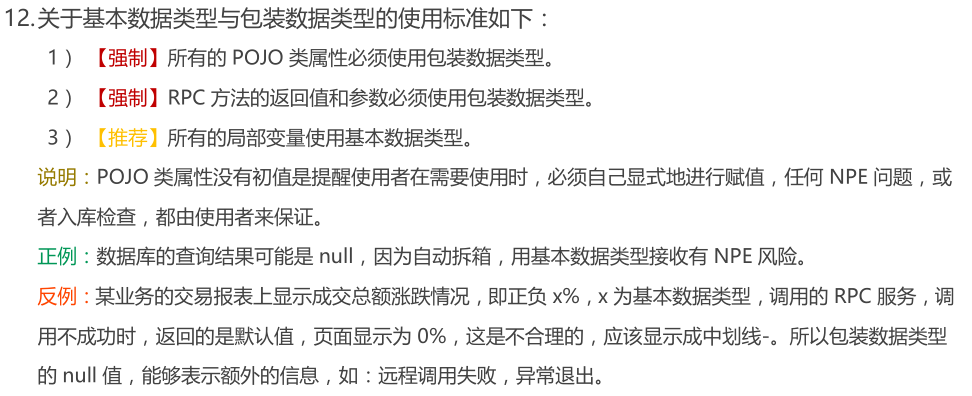
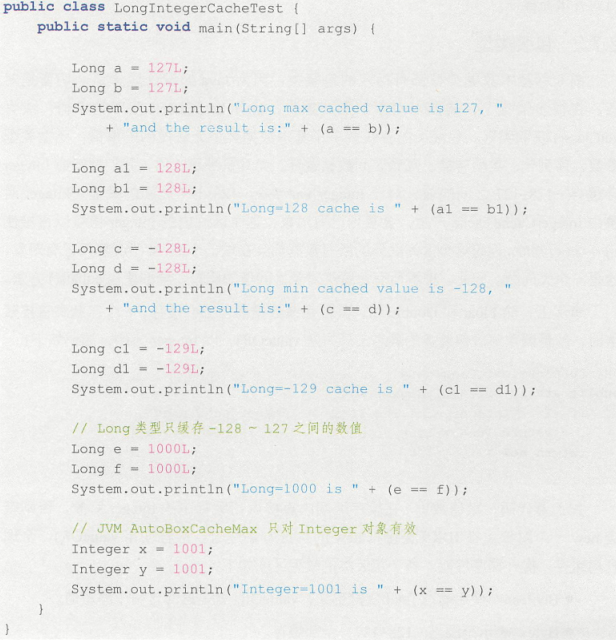
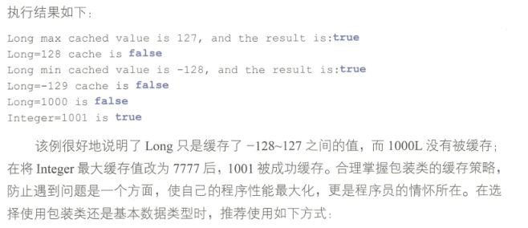

---

layout: post
title: "Java 基础-基本数据类型和包装类"
permalink: /blog/81480102
categories: [Java 基础]
tags: [Java 基础]
date: 2020-10-25 22:51:45
---

* Kramdown table of contents
{:toc .toc}
## 包装类及其缓存机制

Java 中除了 Float、Double 外，其余 6 个包装类都会缓存，因此推荐所有包装类对象之间值的比较全部使用 equals() 方法。

```java
// Float 类
public static Float valueOf(String s) throws NumberFormatException {
    return new Float(parseFloat(s));
}

public static Float valueOf(float f) {
    return new Float(f);
}

// Double 类
public static Double valueOf(double d) {
    return new Double(d);
}

public static double parseDouble(String s) throws NumberFormatException {
    return FloatingDecimal.parseDouble(s);
}
```

> 各个包装类缓存值范围:
>
> Boolean: true 或者 false。
>
> Byte: [-128, 127]
>
> Short: [-128, 127]
>
> Character: [0, 127]
>
> Integer: [-128, 127], 上限可以通过虚拟机参数设置。
>
> Long: [-128, 127]
>
> 特别注意：对于 Float 和 Double 没有缓存。

## Java 数据类型划分和基本数据类型转换







## 基本数据类型、包装类和 String 类间的转换



## 阿里巴巴 Java 开发规范





## Integer 类常考面试题

```java
public class TestInteger {
    public static void main(String[] args) {
        Integer a = 129;
        Integer b = 129;
        System.out.println(a == b);
        System.out.println(a > b);
        System.out.println(a < b);
    }
}
```

<a class="button show-hidden">点击查看结果</a>

<div class="hidden">
<blockquote><p><b>参考答案</b>
false
false
false
</p></blockquote>
</div>
```java
public class IntegerDemo {
    public static void main(String[] args) {
        Integer a = new Integer(1);
        Integer b = 1;
        int c = 1;
        System.out.println(a == b);
        System.out.println(a == c);
        System.out.println(b == c);

        Integer f1 = 100, f2 = 100, f3 = 150, f4 = 150;
        System.out.println(f1 == f2);
        System.out.println(f3 == f4);
    }
}
```

<a class="button show-hidden">点击查看结果</a>

<div class="hidden">
<blockquote><p><b>参考答案</b>
false
true
true
true
false
</p></blockquote>
</div>

```java
public class IntegerDemo {
    public static void main(String[] args) {
        Integer a = new Integer(1);
        Integer b = Integer.valueOf(1);
        int c = 1;
        System.out.println(a == b);
        System.out.println(a.intValue() == c);
        System.out.println(b.intValue() == c);

        Integer f1 = Integer.valueOf(100);
        Integer f2 = Integer.valueOf(100);
        Integer f3 = Integer.valueOf(150);
        Integer f4 = Integer.valueOf(150);
        System.out.println(f1 == f2);
        System.out.println(f3 == f4);
    }
}
```

<a class="button show-hidden">点击查看结果</a>

<div class="hidden">
<blockquote><p><b>参考答案</b>
false
true
true
true
false
</p></blockquote>
</div>


```java
public class Test {
    public static void main(String[] args) {
        Integer a = 1;
        Integer b = 2;
        Integer c = 3;
        Integer d = 3;
        Integer e = 321;
        Integer f = 321;
        Long g = 3L;
        System.out.println(c == d);
        System.out.println(e == f);
        System.out.println(c == (a + b));
        System.out.println(c.equals(a + b));
        System.out.println(g == (a + b));
        System.out.println(g.equals(a + b));
    }
}
```

<a class="button show-hidden">点击查看结果</a>

<div class="hidden">
<blockquote><p><b>参考答案</b>
true
false
true
true
true
false
<font>解析：包装类的"=="运算在不遇到算术运算的情况下不会自动拆箱，以及它们 equals() 方法不处理数据转型的关系。</font>
</p></blockquote>
</div>

上述代码反编译如下

```java
public class Test {
    public static void main(String[] args) {
        Integer a = Integer.valueOf(1);
        Integer b = Integer.valueOf(2);
        Integer c = Integer.valueOf(3);
        Integer d = Integer.valueOf(3);
        Integer e = Integer.valueOf(321);
        Integer f = Integer.valueOf(321);
        Long g = Long.valueOf(3L);
        System.out.println(c == d);
        System.out.println(e == f);
        System.out.println(c.intValue() == a.intValue() + b.intValue());
        System.out.println(c.equals(Integer.valueOf(a.intValue() + b.intValue())));
        System.out.println(g.longValue() == a.intValue() + b.intValue());
        System.out.println(g.equals(Integer.valueOf(a.intValue() + b.intValue())));
    }
}
```

```java
public class Main {
    private static int x = 10;
    private static Integer y = 10;

    public static void updateX(int value) {
        value = 3 * value;
    }

    public static void updateY(Integer value) {
        value = 3 * value;
    }

    public static void main(String[] args) {
        updateX(x);
        updateY(y);
    }
}
```

执行以上程序后，x 和 y 的值分别是多少？

<a class="button show-hidden">点击查看结果</a>

<div class="hidden">
<blockquote><p><b>参考答案</b>
10 10
</p></blockquote>
</div>
```java
public class Test {
    public static void main(String[] args) {
        int a = 100, b = 50, c = a-- - b, d = a-- - b;
        System.out.println(a);
        System.out.println(b);
        System.out.println(c);
        System.out.println(d);
    }
}
```

<a class="button show-hidden">点击查看结果</a>

<div class="hidden">
<blockquote><p><b>参考答案</b>
98
50
50
49
</p></blockquote>
</div>



**运行结果**



- Java 是什么类型的，值类型、引用类型？
- Java 基本数据类型有哪些。自动拆装箱如何实现。
- Java 的基本类型有哪几个？String 是不是 Java 的基本类型？String 为什么要是 final 类型的？
- Java 基本类型的比较用什么，对象比较呢。
- 传值和传引用的区别，Java 是怎么样的，有没有传引用。Java 传引用的方式。
- 什么是值传递和引用传递，区别及应用。
- 什么是值传递和引用传递?
- Java 的基本类型有哪些？它们的长度分别是多少呢？自动装拆箱？
- Java 包装类的作用。
- Java 支持的数据类型有哪些?什么是自动拆装箱?
- 什么时候拆箱，什么时候装箱？
- 基本数据类型有哪些，各占多少位，浮点型能否精确的表示小数，int 的范围。
- Java 基本数据类型有哪些？Java 的特性？装箱和拆箱知道怎么实现的么？
- 包装类型和基本类型比较问题。（例如，Integer类型的变量能否==int类型变量，能否作比较，什么时候不能作比较。）
- Java 中 8 种基本数据类型有哪些，它们占用的字节数分别是多少。
- Java 中 char 占几个字节。

## Integer、new Integer()、int 之间的比较问题

注：以下都是在数值相等的前提下

> - int 和 int 进行 == 比较，肯定为 true。另外基本数据类型没有 equals 方法。
> - int 和 Integer、new Integer 进行比较，Integer、new Integer 会自动拆箱，int 会自动装箱，== 和 equals 肯定都为 true。
> - Integer 和 Integer 进行 == 比较，如果两个变量的值在区间[-128，127] 时为 true，否则为 false。
> - Integer 和 Integer 进行 equals 比较，由于 Integer 对 equals 方法进行了重写，比较的是内容，所以为 true。
> - Integer 和 new Integer 进行 == 比较，肯定为 false。Integer 和 new Integer 之间进行 equals 比较，肯定为 true。
> - new Integer 和 new Integer 进行 == 比较，肯定为 false。new Integer 和 new Integer 进行 equals 比较，肯定为 true。

## 推荐阅读

- [https://www.cnblogs.com/dolphin0520/p/3780005.html](https://www.cnblogs.com/dolphin0520/p/3780005.html)

