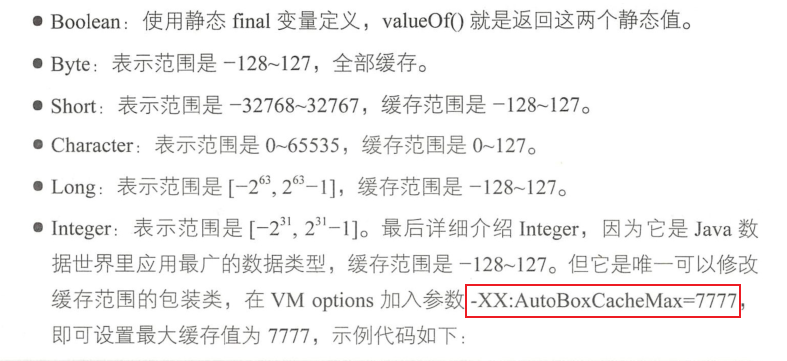
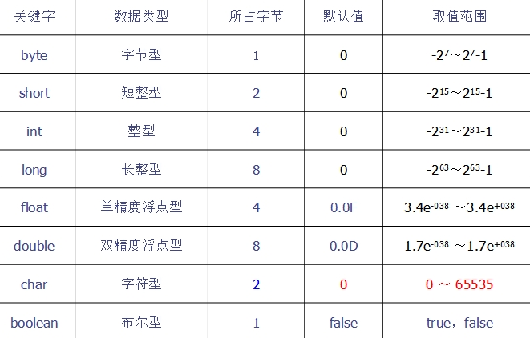
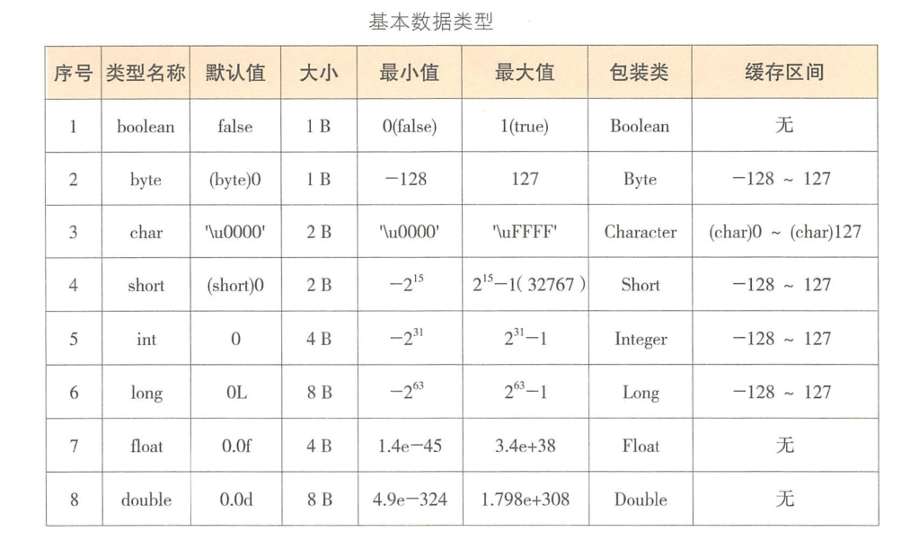
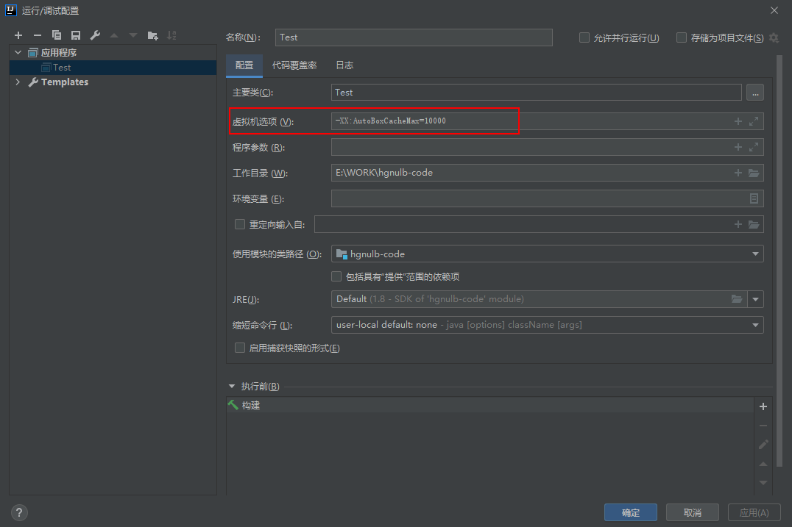

---

layout: post
title: "Java 基础-基本数据类型和包装类"
permalink: /blog/81480102
categories: [Java 基础]
tags: [Java 基础]
date: 2020-10-25 22:51:45
---

* Kramdown table of contents
{:toc .toc}
## 问题思考

- Java 为什么分为基本数据类型和引用数据类型？
- Java 是值传递还是引用传递？传值和传引用的区别？Java 传引用的方式？
- Java 中包装类的作用？什么时候装箱？什么时候拆箱？装箱和拆箱是怎么实现的？
- Java 基本数据类型有哪些？它们的长度分别是多少？它们占用的字节数分别是多少？
- 浮点型能否精确的表示小数？int 的范围？char 占几个字节？String 是不是基本数据类型的？String 为什么要是 final 类型的？

## 包装类及其缓存机制

Java 中除了 Float、Double 外，其余 6 个包装类都会缓存，因此推荐所有包装类对象之间值的比较全部使用 equals() 方法。

```java
// Float 类
public static Float valueOf(String s) throws NumberFormatException {
    return new Float(parseFloat(s));
}

public static Float valueOf(float f) {
    return new Float(f);
}

// Double 类
public static Double valueOf(String s) throws NumberFormatException {
    return new Double(parseDouble(s));
}

public static Double valueOf(double d) {
    return new Double(d);
}
```

各个包装类缓存值范围如下

| 基本数据类型 | 包装类型  | 缓存范围      |
| :----------- | :-------- | :------------ |
| byte         | Byte      | -128 ~ 127    |
| short        | Short     | -128 ~ 127    |
| int          | Integer   | -128 ~ 127    |
| long         | Long      | -128 ~ 127    |
| char         | Character | 0 ~ 127       |
| boolean      | Boolean   | true or false |
| float        | Float     | 无            |
| double       | Double    | 无            |

> 注：两种浮点数类型的包装类 Float 和 Double 并没有实现常量池缓存技术。只有 Integer 包装类可以通过`-XX:AutoBoxCacheMax=7777`设置上限值，其它的包装类不行。




**运行结果**


## Java 数据类型划分和基本数据类型转换







## 基本数据类型、包装类、String 类间的转换


## 阿里巴巴 Java 开发规范


## 自动装箱、拆箱与遍历循环

```java
public class Test {
    public static void main(String[] args) {
        List<Integer> list = Arrays.asList(1, 2, 3, 4);
        int sum = 0;
        for (int i : list) {
            sum += i;
        }
        System.out.println(sum);
    }
}
```

自动装箱的陷阱

```java
public class IntegerTest {
    public static void main(String[] args) {
        Integer a = 1;
        Integer b = 2;
        Integer c = 3;
        Integer d = 3;
        Integer e = 321;
        Integer f = 321;
        Long g = 3L;
        System.out.println(c == d);
        System.out.println(e == f);
        System.out.println(c == (a + b));
        System.out.println(c.equals(a + b));
        System.out.println(g == (a + b));
        System.out.println(g.equals(a + b));
    }
}
```

<a class="button show-hidden">点击查看结果</a>

<div class="hidden">
<blockquote><p><b>参考答案</b>
true
false
true
true
true
false
</p></blockquote>
</div>

> 解析：包装类的"=="运算在不遇到算术运算的情况下不会自动拆箱，以及它们 equals() 方法不处理数据转型的关系。

上述代码反编译如下

```java
public class Test {
    public static void main(String[] args) {
        Integer a = Integer.valueOf(1);
        Integer b = Integer.valueOf(2);
        Integer c = Integer.valueOf(3);
        Integer d = Integer.valueOf(3);
        Integer e = Integer.valueOf(321);
        Integer f = Integer.valueOf(321);
        Long g = Long.valueOf(3L);
        System.out.println(c == d);
        System.out.println(e == f);
        System.out.println(c.intValue() == a.intValue() + b.intValue());
        System.out.println(c.equals(Integer.valueOf(a.intValue() + b.intValue())));
        System.out.println(g.longValue() == a.intValue() + b.intValue());
        System.out.println(g.equals(Integer.valueOf(a.intValue() + b.intValue())));
    }
}
```

## int 和 Integer 有什么区别

> （1）Integer 是 int 的包装类；int 是基本数据类型；
>
> （2）Integer 变量必须实例化后才能使用；int 变量不需要；
>
> （3）Integer 实际是对象的引用，指向此 new 的 Integer 对象；int 是直接存储数据值；
>
> （4）Integer 的默认值是 null；int 的默认值是 0。

## Integer、new Integer()、int 之间的比较

**注：以下都是在数值相等的前提下**

> - int 和 int 进行 == 比较，肯定为 true。另外基本数据类型没有 equals 方法。
> - int 和 Integer、new Integer 进行比较，Integer、new Integer 会自动拆箱，int 会自动装箱，== 和 equals 肯定都为 true。
> - Integer 和 Integer 进行 == 比较，如果两个变量的值在区间[-128，127] 时为 true，否则为 false。
> - Integer 和 Integer 进行 equals 比较，由于 Integer 对 equals 方法进行了重写，比较的是内容，所以为 true。
> - Integer 和 new Integer 进行 == 比较，肯定为 false。Integer 和 new Integer 之间进行 equals 比较，肯定为 true。
> - new Integer 和 new Integer 进行 == 比较，肯定为 false。new Integer 和 new Integer 进行 equals 比较，肯定为 true。

## Integer 类常考面试题

```java
public class Test {
    public static void main(String[] args) {
        Integer a1 = new Integer(7);
        Integer b1 = new Integer(7);
        System.out.println(a1 == b1);

        int a2 = 7;
        Integer b2 = new Integer(7);
        System.out.println(a2 == b2);

        Integer a3 = 10000;
        Integer b3 = 10000;
        System.out.println(a3 == b3);

        Integer a4 = 100;
        Integer b4 = 100;
        System.out.println(a4 == b4);

        Integer a5 = 1;
        Integer b5 = new Integer(1);
        Integer c5 = Integer.valueOf(1);
        System.out.println(a5 == b5);
        System.out.println(b5 == c5);
        System.out.println(a5 == c5);

        Integer a6 = 200;
        Integer b6 = new Integer(200);
        Integer c6 = Integer.valueOf(200);
        System.out.println(a6 == b6);
        System.out.println(b6 == c6);
        System.out.println(a6 == c6);
    }
}
```

<a class="button show-hidden">点击查看结果</a>

<div class="hidden">
<blockquote><p><b>参考答案</b>
false
true
false
true
false
false
true
false
false
false
</p></blockquote>
</div>


修改虚拟机参数`-XX:AutoBoxCacheMax=10000`再次运行，结果如下



> false
> true
> true
> true
> false
> false
> true
> false
> false
> true

```java
public class Test {
    public static void main(String[] args) {
        int a = 155;
        int b = 155;
        Integer c = 155;
        Integer d = 155;

        System.out.println(a == b);
        System.out.println(c == d);
        System.out.println(c == a);
        System.out.println(c.equals(a));
    }
}
```

<a class="button show-hidden">点击查看结果</a>

<div class="hidden">
<blockquote><p><b>参考答案</b>
true
false
true
true
</p></blockquote>
</div>

```java
public class TestInteger {
    public static void main(String[] args) {
        Integer a = 129;
        Integer b = 129;
        System.out.println(a == b);
        System.out.println(a > b);
        System.out.println(a < b);
    }
}
```

<a class="button show-hidden">点击查看结果</a>

<div class="hidden">
<blockquote><p><b>参考答案</b>
false
false
false
</p></blockquote>
</div>
```java
public class IntegerDemo {
    public static void main(String[] args) {
        Integer a = new Integer(1);
        Integer b = 1;
        int c = 1;
        System.out.println(a == b);
        System.out.println(a == c);
        System.out.println(b == c);

        Integer f1 = 100, f2 = 100, f3 = 150, f4 = 150;
        System.out.println(f1 == f2);
        System.out.println(f3 == f4);
    }
}
```

<a class="button show-hidden">点击查看结果</a>

<div class="hidden">
<blockquote><p><b>参考答案</b>
false
true
true
true
false
</p></blockquote>
</div>

```java
public class IntegerDemo {
    public static void main(String[] args) {
        Integer a = new Integer(1);
        Integer b = Integer.valueOf(1);
        int c = 1;
        System.out.println(a == b);
        System.out.println(a.intValue() == c);
        System.out.println(b.intValue() == c);

        Integer f1 = Integer.valueOf(100);
        Integer f2 = Integer.valueOf(100);
        Integer f3 = Integer.valueOf(150);
        Integer f4 = Integer.valueOf(150);
        System.out.println(f1 == f2);
        System.out.println(f3 == f4);
    }
}
```

<a class="button show-hidden">点击查看结果</a>

<div class="hidden">
<blockquote><p><b>参考答案</b>
false
true
true
true
false
</p></blockquote>
</div>
```java
public class Test {
    public static void main(String[] args) {
        Integer a = 1;
        Integer b = 2;
        Integer c = 3;
        Integer d = 3;
        Integer e = 321;
        Integer f = 321;
        Long g = 3L;
        Long h = 2L;

        System.out.println(c == d);
        System.out.println(e == f);
        System.out.println(c == (a + b));
        System.out.println(c.equals(a + b));
        System.out.println(g == (a + b));
        System.out.println(g.equals(a + b));
        System.out.println(g.equals(a + h));
    }
}
```

<a class="button show-hidden">点击查看结果</a>

<div class="hidden">
<blockquote><p><b>参考答案</b>
true
false
true
true
true
false
true
</p></blockquote>
</div>

```java
public class Main {
    private static int x = 10;
    private static Integer y = 10;

    public static void updateX(int value) {
        value = 3 * value;
    }

    public static void updateY(Integer value) {
        value = 3 * value;
    }

    public static void main(String[] args) {
        updateX(x);
        updateY(y);
    }
}
```

执行以上程序后，x 和 y 的值分别是多少？

<a class="button show-hidden">点击查看结果</a>

<div class="hidden">
<blockquote><p><b>参考答案</b>
10 10
</p></blockquote>
</div>
```java
public class Test {
    public static void main(String[] args) {
        int a = 100, b = 50, c = a-- - b, d = a-- - b;
        System.out.println(a);
        System.out.println(b);
        System.out.println(c);
        System.out.println(d);
    }
}
```

<a class="button show-hidden">点击查看结果</a>

<div class="hidden">
<blockquote><p><b>参考答案</b>
98
50
50
49
</p></blockquote>
</div>
## 推荐阅读

- [https://www.cnblogs.com/dolphin0520/p/3780005.html](https://www.cnblogs.com/dolphin0520/p/3780005.html)

