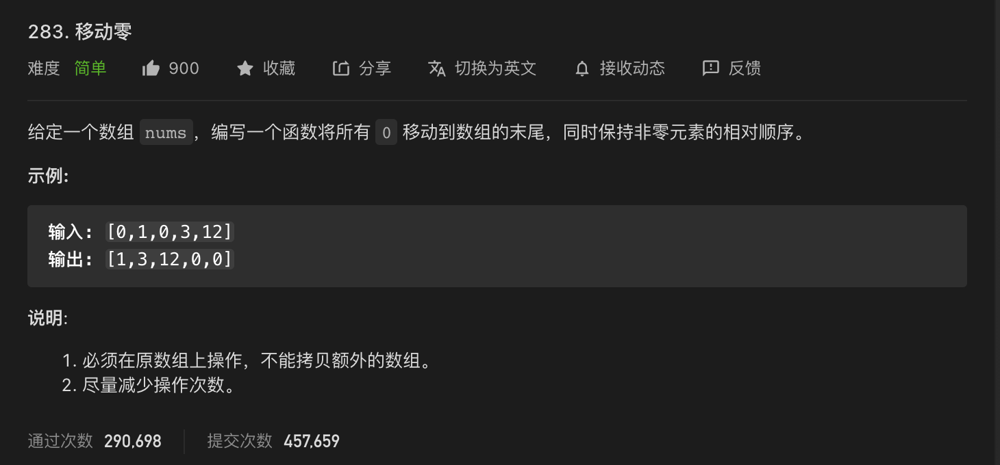

* Kramdown table of contents
{:toc .toc}
# LeetCode 相关题目整理

## [11. 盛最多水的容器](https://leetcode-cn.com/problems/container-with-most-water/)

## [88. 合并两个有序数组](https://leetcode-cn.com/problems/merge-sorted-array/)

## [283. 移动零](https://leetcode-cn.com/problems/move-zeroes/)



```java
class Solution {
    public void moveZeroes(int[] nums) {
        if (nums == null || nums.length == 0) {
            return;
        }
        int j = 0;
        for (int i = 0; i < nums.length; i++) {
            if (nums[i] != 0) {
                nums[j++] = nums[i];
            }
        }
        for (int i = j; i < nums.length; i++) {
            nums[i] = 0;
        }
    }
}
```

