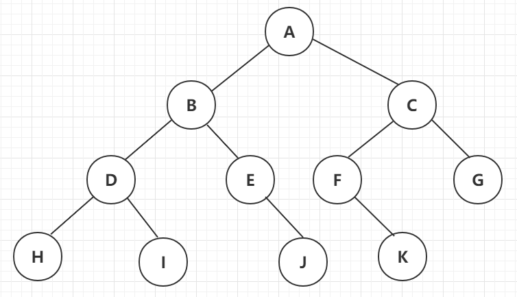
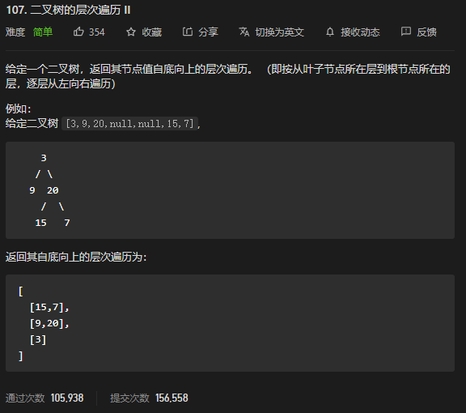
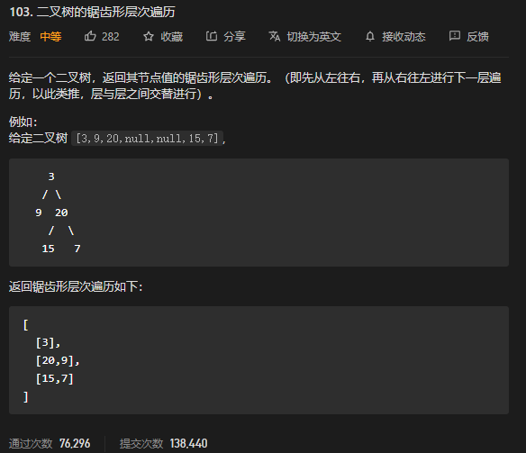
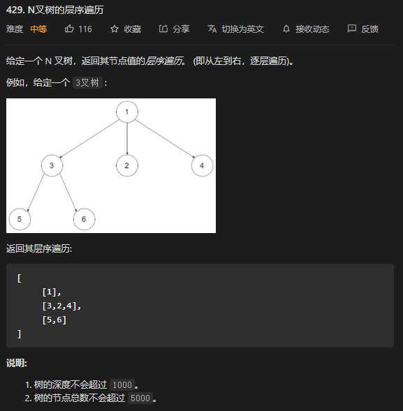
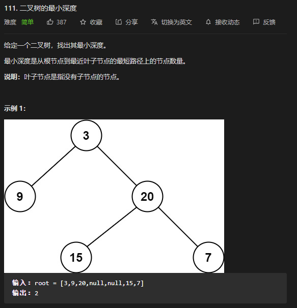

* Kramdown table of contents
{:toc .toc}
# 树和二叉树

## 二叉树

二叉树的四种遍历方式有前序遍历、中序遍历、后序遍历、层序遍历。



前序遍历：A, B, D, H, I, E, J, C, F, K, G

中序遍历：H, D, I, B, E, J, A, F, K, C, G

后序遍历：H, I, D, J, E, B, K, F, G, C, A

层序遍历：A, B, C, D, E, F, G, H, I, J, K

### 斜树

### 满二叉树

### 完全二叉树

### 平衡二叉树

### 二叉搜索树

## 红黑树

# LeetCode 相关题目整理

## 二叉树结构

```java
class TreeNode {
    int val;
    TreeNode left;
    TreeNode right;

    TreeNode() {
    }

    TreeNode(int val) {
        this.val = val;
    }

    TreeNode(int val, TreeNode left, TreeNode right) {
        this.val = val;
        this.left = left;
        this.right = right;
    }
}
```

## N查树结构

```java
class Node {
    public int val;
    public List<Node> children;

    public Node() {
    }

    public Node(int _val) {
        val = _val;
    }

    public Node(int _val, List<Node> _children) {
        val = _val;
        children = _children;
    }
}
```

## [144. 二叉树的前序遍历](https://leetcode-cn.com/problems/binary-tree-preorder-traversal/)

> 根->左子树->右子树

```java
class Solution {
    public List<Integer> preorderTraversal(TreeNode root) {
        List<Integer> res = new ArrayList<>();
        if (root == null) {
            return res;
        }
        preorder(root, res);
        return res;
    }

    public void preorder(TreeNode root, List<Integer> list) {
        if (root == null) {
            return;
        }
        list.add(root.val);
        preorder(root.left, list);
        preorder(root.right, list);
    }
}
```

## [94. 二叉树的中序遍历](https://leetcode-cn.com/problems/binary-tree-inorder-traversal/)

> 左子树->根->右子树

```java
class Solution {
    public List<Integer> inorderTraversal(TreeNode root) {
        List<Integer> res = new ArrayList<>();
        if (root == null) {
            return res;
        }
        inorder(root, res);
        return res;
    }

    public void inorder(TreeNode root, List<Integer> list) {
        if (root == null) {
            return;
        }
        inorder(root.left, list);
        list.add(root.val);
        inorder(root.right, list);
    }
}
```

## [145. 二叉树的后序遍历](https://leetcode-cn.com/problems/binary-tree-postorder-traversal/)

> 左子树->右子树->根

```java
class Solution {
    public List<Integer> postorderTraversal(TreeNode root) {
        List<Integer> res = new ArrayList<>();
        if (root == null) {
            return res;
        }
        postorder(root, res);
        return res;
    }

    public void postorder(TreeNode root, List<Integer> list) {
        if (root == null) {
            return;
        }
        postorder(root.left, list);
        postorder(root.right, list);
        list.add(root.val);
    }
}
```

## [589. N叉树的前序遍历](https://leetcode-cn.com/problems/n-ary-tree-preorder-traversal/)

```java
class Solution {
    public List<Integer> ans = new ArrayList();
    public List<Integer> preorder(Node root) {
        if(root == null) {
            return ans;
        }
        ans.add(root.val);
        for(Node node: root.children) {
            preorder(node);
        }
        return ans;
    }
}
```

## [590. N叉树的后序遍历](https://leetcode-cn.com/problems/n-ary-tree-postorder-traversal/)

```java
class Solution {
    public List<Integer> ans = new ArrayList();

    public List<Integer> postorder(Node root) {
        if (root == null) {
            return ans;
        }
        for (Node node : root.children) {
            postorder(node);
        }
        ans.add(root.val);
        return ans;
    }
}
```

## [102. 二叉树的层序遍历](https://leetcode-cn.com/problems/binary-tree-level-order-traversal/)

> 给你一个二叉树，请你返回其按 **层序遍历** 得到的节点值。（即逐层地，从左到右访问所有节点）。

> 解题思路:
>
> 需要借助队列"先进先出"的特性。

```java
class Solution {
    public List<List<Integer>> levelOrder(TreeNode root) {
        List<List<Integer>> res = new ArrayList<>();
        if (root == null) {
            return res;
        }
        Queue<TreeNode> queue = new LinkedList<>();
        queue.add(root);
        while (!queue.isEmpty()) {
            int size = queue.size();
            List<Integer> list = new ArrayList<>();
            for (int i = 0; i < size; i++) {
                TreeNode node = queue.poll();
                list.add(node.val);
                if (node.left != null) {
                    queue.add(node.left);
                }
                if (node.right != null) {
                    queue.add(node.right);
                }
            }
            res.add(list);
        }
        return res;
    }
}
```

## [107. 二叉树的层次遍历 II](https://leetcode-cn.com/problems/binary-tree-level-order-traversal-ii/)

> 给定一个二叉树，返回其节点值自底向上的层次遍历。（即按从叶子节点所在层到根节点所在的层，逐层从左向右遍历）

> 解题思路:
>
> 和 102 题一样，利用队列先进先出的特性，然后利用 LinkedList 头插法特点实现自底向上的层序遍历。



```java
class Solution {
    public List<List<Integer>> levelOrderBottom(TreeNode root) {
        List<List<Integer>> res = new ArrayList<>();
        if (root == null) {
            return res;
        }
        Queue<TreeNode> queue = new LinkedList<>();
        queue.add(root);
        while (!queue.isEmpty()) {
            int size = queue.size();
            List<Integer> list = new ArrayList<>();
            for (int i = 0; i < size; i++) {
                TreeNode node = queue.poll();
                list.add(node.val);
                if (node.left != null) {
                    queue.add(node.left);
                }
                if (node.right != null) {
                    queue.add(node.right);
                }
            }
            res.add(0, list); // 头插法
        }
        return res;
    }
}
```

## [637. 二叉树的层平均值](https://leetcode-cn.com/problems/average-of-levels-in-binary-tree/)

> 给定一个非空二叉树, 返回一个由每层节点平均值组成的数组。

```java
class Solution {
    public List<Double> averageOfLevels(TreeNode root) {
        List<Double> res = new ArrayList<>();
        if (root == null) {
            return res;
        }
        Queue<TreeNode> queue = new LinkedList<>();
        queue.add(root);
        while (!queue.isEmpty()) {
            int size = queue.size();
            double sum = 0.0;
            for (int i = 0; i < size; i++) {
                TreeNode node = queue.poll();
                sum += node.val;
                if (node.left != null) {
                    queue.add(node.left);
                }
                if (node.right != null) {
                    queue.add(node.right);
                }
            }
            res.add(sum / size);
        }
        return res;
    }
}
```

## [103. 二叉树的锯齿形层次遍历](https://leetcode-cn.com/problems/binary-tree-zigzag-level-order-traversal/)



> 解题思路:
>
> 通过每一层的奇数和偶数来判断是头插法还是尾插法。

```java
class Solution {
    public List<List<Integer>> zigzagLevelOrder(TreeNode root) {
        List<List<Integer>> res = new ArrayList<>();
        if (root == null) {
            return res;
        }
        Queue<TreeNode> queue = new LinkedList<>();
        queue.add(root);
        int level = 0;
        while (!queue.isEmpty()) {
            level++;
            List<Integer> list = new ArrayList<>();
            int size = queue.size();
            for (int i = 0; i < size; i++) {
                TreeNode node = queue.poll();
                if (level % 2 != 0) {
                    list.add(node.val);
                } else {
                    list.add(0, node.val);
                }
                if (node.left != null) {
                    queue.add(node.left);
                }
                if (node.right != null) {
                    queue.add(node.right);
                }
            }
            res.add(list);

        }
        return res;
    }
}
```

## [429. N叉树的层序遍历](https://leetcode-cn.com/problems/n-ary-tree-level-order-traversal/)



```java
class Solution {
    public List<List<Integer>> levelOrder(Node root) {
        List<List<Integer>> ans = new ArrayList<>();
        if (root == null) {
            return ans;
        }
        Queue<Node> queue = new LinkedList<>();
        queue.add(root);
        while (!queue.isEmpty()) {
            int size = queue.size();
            List<Integer> list = new ArrayList<>();
            for (int i = 0; i < size; i++) {
                Node pre = queue.poll();
                list.add(pre.val);
                for (Node node : pre.children) {
                    queue.add(node);
                }
            }
            ans.add(list);
        }
        return ans;
    }
}
```

## [111. 二叉树的最小深度](https://leetcode-cn.com/problems/minimum-depth-of-binary-tree/)



> 解题思路:
>
> 首先可以想到使用深度优先搜索的方法，遍历整棵树，记录最小深度。
>
> 对于每一个非叶子节点，我们只需要分别计算其左右子树的最小叶子节点深度。这样就将一个大问题转化为了小问题，可以递归地解决该问题。
>

```java
class Solution {
    public int minDepth(TreeNode root) {
        if (root == null) {
            return 0;
        }
        if (root.left == null && root.right == null) {
            return 1;
        }
        int minDepth = Integer.MAX_VALUE;
        if (root.left != null) {
            minDepth = Math.min(minDepth(root.left), minDepth);
        }
        if (root.right != null) {
            minDepth = Math.min(minDepth(root.right), minDepth);
        }
        return minDepth + 1;
    }
}
```

## [104. 二叉树的最大深度](https://leetcode-cn.com/problems/maximum-depth-of-binary-tree/)

```java
class Solution {
    public int maxDepth(TreeNode root) {
        if (root == null) {
            return 0;
        }
        if (root.left == null && root.right == null) {
            return 1;
        }
        int maxDepth = Integer.MIN_VALUE;
        if (root.left != null) {
            maxDepth = Math.max(maxDepth(root.left), maxDepth);
        }
        if (root.right != null) {
            maxDepth = Math.max(maxDepth(root.right), maxDepth);
        }
        return maxDepth + 1;
    }
}
```

```java
class Solution {
    public int maxDepth(TreeNode root) {
        if (root == null) {
            return 0;
        }
        int leftDepth = maxDepth(root.left);
        int rightDepth = maxDepth(root.right);
        return Math.max(leftDepth, rightDepth) + 1;
    }
}
```

