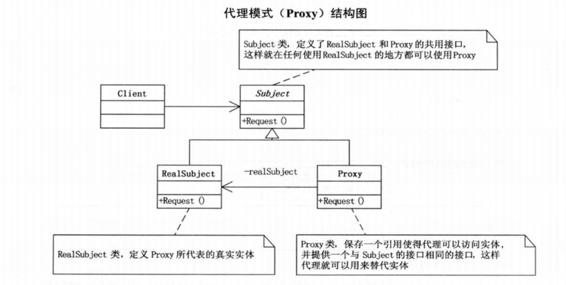
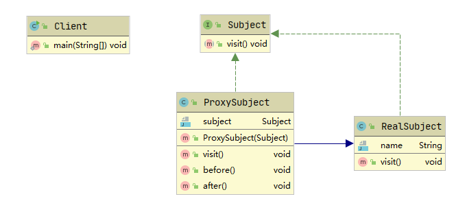

* Kramdown table of contents
{:toc .toc}
## 问题思考

- 动态代理原理，应用场景？动态代理的好处和坏处。
- 动态代理都有什么？区别是什么？实现原理？
- 动态代理的两种方式，以及区别。
- JDK 动态代理与 CGLIB 动态代理与的区别？
- 说一说静态代理和动态代理的区别？动态代理的底层是怎么实现的？

## 代理模式

代理模式：为其他对象提供一种代理以控制这个对象的访问。



## 静态代理

Java 的静态代理实现比较简单，就是代理对象持有了被代理对象的引用。

一个典型的静态代理通常有三个角色，共同接口、真实对象、代理对象，这里称之为代理三要素。



共同接口

```java
public interface Subject {
    void visit();
}
```

真实对象

```java
public class RealSubject implements Subject {
    private String name = "dog";

    @Override
    public void visit() {
        System.out.println(name);
    }
}
```

代理对象

```java
public class ProxySubject extends RealSubject implements Subject {
    private Subject subject;

    public ProxySubject(Subject subject) {
        this.subject = subject;
    }

    @Override
    public void visit() {
        before();
        subject.visit();
        after();
    }

    public void before() {
        System.out.println("before...");
    }

    public void after() {
        System.out.println("after...");
    }
}
```

```java
public class Client {
    public static void main(String[] args) {
        ProxySubject subject = new ProxySubject(new RealSubject());
        subject.visit();
    }
}
```

> before...
> dog
> after...

> 静态代理虽然效率较高，但其也有不可避免的缺陷。

## 动态代理

### JDK 动态代理

JDK 动态代理类位于 `java.lang.reflect` 包下，主要有两个类：`InvocationHandler` 和 `Proxy`。在实现代理模式时，只需要实现 `InvocationHandler` 接口即可。

```java
public interface Subject {
    void doSomething();
}
```

```java
public class RealSubject implements Subject {
    @Override
    public void doSomething() {
        System.out.println("RealSubject do something");
    }
}
```

```java
import java.lang.reflect.InvocationHandler;
import java.lang.reflect.Method;
import java.lang.reflect.Proxy;

public class JDKDynamicProxyHandler implements InvocationHandler {
    /**
     * 真实对象
     */
    private Object target;

    public JDKDynamicProxyHandler(Object target) {
        this.target = target;
    }

    public <T> T getProxy() {
        return (T) Proxy.newProxyInstance(target.getClass().getClassLoader(), target.getClass().getInterfaces(), this);
    }

    /**
     * @param proxy  代理对象
     * @param method 代理对象调用的方法
     * @param args   调用的方法中的参数
     * @return
     * @throws Throwable
     */
    @Override
    public Object invoke(Object proxy, Method method, Object[] args) throws Throwable {
        before();
        Object result = method.invoke(target, args);
        after();
        return result;
    }

    public void before() {
        System.out.println("Do something before");
    }

    public void after() {
        System.out.println("Do something after");
    }
}
```

```java
public class Client {
    public static void main(String[] args) {
        // 保存生成的代理类的字节码文件
        System.getProperties().put("sun.misc.ProxyGenerator.saveGeneratedFiles", "true");
        // JDK 动态代理
        Subject subject = new JDKDynamicProxyHandler(new RealSubject()).getProxy();
        subject.doSomething();
    }
}
```

> Do something before
> RealSubject do something
> Do something after

JDK 动态代理是基于拦截器和反射来实现的。JDK 动态代理是不需要第三方库支持的，只需要 JDK 环境就可以进行代理。

JDK 动态代理的实现步骤为：

> 1）创建被代理的类以及接口；
>
> 2）创建一个类实现 `InvocationHandler` 接口，并且实现里面的 invoke 方法；
>
> 3）通过 `Proxy` 的静态方法 `public static Object newProxyInstance(ClassLoader loader, Class<?>[] interfaces, InvocationHandler h)` 创建一个代理对象；
>
> 4）通过代理对象调用目标方法；

> JDK 的动态代理只能代理实现了接口的类，而不能实现接口的类就不能使用 JDK 的动态代理，CGLIB 动态代理是针对类来实现代理的，它的原理是对指定的目标类生成一个子类，并覆盖其中方法来实现增强，但因为采用的是继承，所以不能对 final 修饰的类进行代理。

### CGLIB 动态代理

```java
public interface UserManager {
    // 新增用户抽象方法
    void addUser(String userName, String password);

    // 删除用户抽象方法
    void delUser(String userName);
}
```

```java
// 用户管理实现类，实现用户管理接口
public class UserManagerImpl implements UserManager {
    // 重写新增用户方法
    @Override
    public void addUser(String userName, String password) {
        System.out.println("调用了新增的方法！");
        System.out.println("传入参数为 userName: " + userName + " password: " + password);
    }

    // 重写删除用户方法
    @Override
    public void delUser(String userName) {
        System.out.println("调用了删除的方法！");
        System.out.println("传入参数为 userName: " + userName);
    }
}
```

```java
import java.lang.reflect.InvocationHandler;
import java.lang.reflect.Method;
import java.lang.reflect.Proxy;

// JDK 动态代理实现 InvocationHandler 接口
public class JDKProxy implements InvocationHandler {
    private Object target;// 需要代理的目标对象

    @Override
    public Object invoke(Object proxy, Method method, Object[] args) throws Throwable {
        System.out.println("JDK 动态代理，监听开始！");
        Object result = method.invoke(target, args);
        System.out.println("JDK 动态代理，监听结束！");
        return result;
    }

    // 定义获取代理对象方法
    private Object getJDKProxy(Object targetObject) {
        // 为目标对象 target 赋值
        this.target = targetObject;
        // JDK 动态代理只能针对实现了接口的类进行代理，newProxyInstance 函数所需参数就可看出
        return Proxy.newProxyInstance(targetObject.getClass().getClassLoader(), targetObject.getClass().getInterfaces(), this);
    }

    public static void main(String[] args) {
        JDKProxy jdkProxy = new JDKProxy();// 实例化 JDKProxy 对象
        UserManager user = (UserManager) jdkProxy.getJDKProxy(new UserManagerImpl());// 获取代理对象
        user.addUser("admin", "123123");// 执行新增方法
    }
}
```

> JDK 动态代理，监听开始！
> 调用了新增的方法！
> 传入参数为 userName: admin password: 123456
> JDK 动态代理，监听结束！

```java
import net.sf.cglib.proxy.Enhancer;
import net.sf.cglib.proxy.MethodInterceptor;
import net.sf.cglib.proxy.MethodProxy;

import java.lang.reflect.Method;

// CGLIB 动态代理，实现 MethodInterceptor 接口
public class CGLIBProxy implements MethodInterceptor {
    private Object target;// 需要代理的目标对象

    // 重写拦截方法
    @Override
    public Object intercept(Object obj, Method method, Object[] arr, MethodProxy proxy) throws Throwable {
        System.out.println("CGLIB 动态代理，监听开始！");
        Object invoke = method.invoke(target, arr);// 方法执行，参数：target->目标对象，arr->参数数组
        System.out.println("CGLIB 动态代理，监听结束！");
        return invoke;
    }

    // 定义获取代理对象方法
    public Object getCglibProxy(Object objectTarget) {
        // 为目标对象 target 赋值
        this.target = objectTarget;
        Enhancer enhancer = new Enhancer();
        // 设置父类，因为 CGLIB 是针对指定的类生成一个子类，所以需要指定父类
        enhancer.setSuperclass(objectTarget.getClass());
        enhancer.setCallback(this);// 设置回调
        Object result = enhancer.create();// 创建并返回代理对象
        return result;
    }

    public static void main(String[] args) {
        CGLIBProxy cglib = new CGLIBProxy();// 实例化 CGLIBProxy 对象
        UserManager user = (UserManager) cglib.getCglibProxy(new UserManagerImpl());// 获取代理对象
        user.delUser("admin");// 执行删除方法
    }
}
```

> CGLIB 动态代理，监听开始！
> 调用了删除的方法！
> 传入参数为 userName: admin
> CGLIB 动态代理，监听结束！

> CGLIB 不能代理被 final、private 修饰的方法，如果方法无法被覆盖重写，CGLIB 是无法代理这个方法的。

## JDK 动态代理和 CGLIB 动态代理的区别

> 1）JDK 动态代理只能对实现了接口的类进行代理，而不能针对类。
>
> 2）CGLIB 是针对类实现代理，主要是对指定的类生成一个子类，并覆盖其中方法实现增强，但是因为采用的是继承，所以该类或方法最好不要声明成 final，对于 final 类或方法，是无法继承的。

## Spring AOP 中的动态代理使用的使用策略

> 1）如果目标对象实现了接口，默认情况下会采用 JDK 的动态代理实现 AOP。
>
> 2）如果目标对象实现了接口，可以强制使用 CGLIB 实现 AOP。在 Spring 配置文件中加入 `<aop:aspectj-autoproxy proxy-target-class="true"/>`。
>
> 3）如果目标对象没有实现了接口，必须采用 CGLIB 库，Spring 会自动在 JDK 动态代理和 CGLIB 之间转换。

## 推荐阅读

- [https://docs.spring.io/spring-framework/docs/3.0.0.M3/reference/html/ch08s06.html](https://docs.spring.io/spring-framework/docs/3.0.0.M3/reference/html/ch08s06.html)
- [https://www.tianqiweiqi.com/java-design-pattern-04.html](https://www.tianqiweiqi.com/java-design-pattern-04.html)
- [http://www.itsoku.com/article/295](http://www.itsoku.com/article/295)

