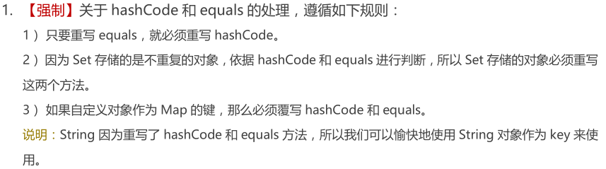

* Kramdown table of contents
{:toc .toc}
## hashCode 和 equals 的若干问题

> • hashCode 主要用于提升查询效率提高哈希表性能，来确定在散列结构中对象的存储地址。
> • 重写 equals() 必须重写 hashCode()。
> • 哈希存储结构中，添加元素重复性校验的标准就是先检查 hashCode 值，后判断 equals()。
> • 两个对象 equals() 相等，hashCode() 必定相等。
> • 两个对象 hashCode() 不等，equals() 必定也不等。
> • 两个对象 hashCode() 相等，对象不一定相等，需要通过 equals() 进一步判断。

## 常考面试题

- Object 类的方法有哪些。
- Object 类 equals() 方法是怎么实现的？
- Object 类有哪些方法，hashCode() 有什么用。
- Object 类中 clone() 和 hashCode() 的关系。
- = 和 equals() 的区别，实际项目中是如何重写 equals() 方法？
- 如何设计一个类的 equals() 方法和 hashCode() 方法。
- HashCode() 方法。
- ==、equals() 与 hashCode() 的区别和联系。
- 常量和变量的 equals() 比较问题。
- hashCode() 与 equals() 方法的区别。
- hashCode() 方法的底层实现。
- hashCode() 和 equals() 的关系？
- hashCode() 和 equals() 分别有什么作用，equals() 为 true 的两个对象，hashCode() 相等吗？hashCode() 相等的两个对象，equals() 为 true 吗？
- hashCode() 值相等，两个对象是否一定相等？为什么？
- 两个对象值相同(x.equals(y) == true)，但却可有不同的 hash code，这句话对不对?
- equals() 和==判断，String 是否相等用哪个？判断对象是否相等用哪个？
- 重写 equals() 要注意什么。
- =和 equals() 的区别，实际项目中是如何重写 equals() 方法？
- == 和 equals() 的区别。
- hashCode() 的值相等，两个对象是否一定相等？为什么？
- 如果重写 equals() 方法 为什么要重写 hashCode()。
- ==和 equals() 的区别？类的 hashCode() 是什么？如果两个对象的 hashCode() 相同，equals() 一定为 true 吗？
- hashCode() 和 equals() 分别有什么作用，equals() 为 true 的两个对象，hashCode() 相等吗？hashCode() 相等的两个对象，equals() 为 true 吗？
- equals() 何时被重写。
- 重写 equels() 需要重写 hashCode() 吗，为什么？
- ==和 equals() 的区别。

## 推荐阅读

- [https://www.cnblogs.com/dolphin0520/p/3681042.html](https://www.cnblogs.com/dolphin0520/p/3681042.html)
- [https://www.cnblogs.com/dolphin0520/p/3592500.html](https://www.cnblogs.com/dolphin0520/p/3592500.html)
- [浅见equals()与hashCode()之间的关系](https://blog.csdn.net/zai_xia/article/details/81806446)