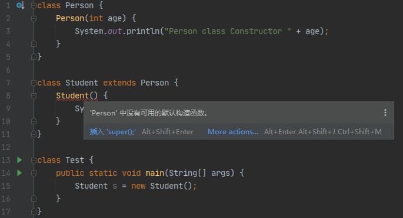

* Kramdown table of contents
{:toc .toc}
# super 关键字的应用

- 当子类与父类中有同名的实例属性时，可以使用 super 显式调用父类中声明的实例属性。
- 在子类覆写父类方法时，可以使用 super 调用父类同名的实例方法。
- 子类构造方法隐含调用 super()。

## 当子类与父类中有同名的实例属性时，可以使用 super 显式调用父类中声明的实例属性。

```java
class Vehicle {
    int maxSpeed = 120;
}

class Car extends Vehicle {
    int maxSpeed = 180;

    void display() {
        System.out.println("Maximum Speed: " + maxSpeed);
        System.out.println("Maximum Speed: " + super.maxSpeed);
    }
}

class Test {
    public static void main(String[] args) {
        Car small = new Car();
        small.display();
    }
}
```

> Maximum Speed: 180
> Maximum Speed: 120

## 在子类覆写父类方法时，可以使用 super 调用父类同名的实例方法。

```java
class Person {
    void message() {
        System.out.println("This is person class");
    }
}

class Student extends Person {
    void message() {
        System.out.println("This is student class");
    }

    void display() {
        message();
        super.message();
    }
}

class Test {
    public static void main(String args[]) {
        Student s = new Student();
        s.display();
    }
}
```

> This is student class
> This is person class

## 子类构造方法隐含调用 super()。

```java
class Person {
    Person() {
        System.out.println("Person class Constructor");
    }
}

class Student extends Person {
    Student() {
        super();
        System.out.println("Student class Constructor");
    }
}

class Test {
    public static void main(String[] args) {
        Student s = new Student();
    }
}
```

> Person class Constructor
> Student class Constructor

```java
class Person {
    Person() {
        System.out.println("Person class Constructor");
    }
}

class Student extends Person {
    Student() {
        System.out.println("Student class Constructor");
    }
}

class Test {
    public static void main(String[] args) {
        Student s = new Student();
    }
}
```

> Person class Constructor
> Student class Constructor

# this 和 super 常考面试题

以下关于 super 关键字的说法中，正确的是（   ）

- [ ] A. super() 与 this() 可以同时存在于同一个构造方法中
- [x] B. super() 与 this() 不能同时存在于同一个构造方法中
- [x] C. super 关键字可以调用父类的成员方法
- [x] D. super 关键字可以调用父类的构造方法

<a class="button show-hidden">点击查看结果</a>

<div class="hidden">
<blockquote><p><b>参考答案</b>
BCD
</p></blockquote>
</div>

关于 super 关键字以下说法哪些是正确的（   ）

- [x] A. super 关键字可以调用父类的构造方法
- [x] B. super 关键字可以调用父类的普通方法
- [ ] C. super 与 this 不能同时存在于同一个构造方法中
- [ ] D. super 与 this 可以同时存在于同一个构造方法中

<a class="button show-hidden">点击查看结果</a>

<div class="hidden">
<blockquote><p><b>参考答案</b>
AB
</p></blockquote>
</div>

在使用 super 和 this 关键字时，以下描述错误的是（   ）

- [ ] A. 在子类构造方法中使用 super() 显示调用父类的构造方法，super() 必须写在子类构造方法的第一行，否则编译不通过
- [x] B. super() 和 this() 不一定要放在构造方法内第一行
- [x] C. this() 和 super() 可以同时出现在一个构造函数中
- [x] D. this() 和 super() 可以在 static 环境中使用，包括 static 方法和 static 语句块

<a class="button show-hidden">点击查看结果</a>

<div class="hidden">
<blockquote><p><b>参考答案</b>
BCD
</p></blockquote>
</div>

以下关于 this 和 super 关键字的说法错误的是（   ）

- [ ] A. this 和 super 关键字都可以访问成员属性，成员方法和构造方法
- [x] B. 在 main 方法中可以存在 this 或 super 关键字，但不能同时存在
- [x] C. 在一个类的构造方法中可以同时使用 this 和 super 来调用其他构造方法
- [ ] D. this 关键字指向当前对象自身，super 关键字指向当前对象的直接父类

<a class="button show-hidden">点击查看结果</a>

<div class="hidden">
<blockquote><p><b>参考答案</b>
BC
</p></blockquote>
</div>

```java
class Base {
    public void methodOne() {
        System.out.print("A");
        methodTwo();
    }

    public void methodTwo() {
        System.out.print("B");
    }
}

class Derived extends Base {
    public void methodOne() {
        super.methodOne();
        System.out.print("C");
    }

    public void methodTwo() {
        super.methodTwo();
        System.out.print("D");
    }
}

public class Test {
    public static void main(String[] args) {
        Base b = new Derived();
        b.methodOne();
    }
}
```

假定 `Base b = new Derived();` 调用执行 `b.methodOne()` 后，输出结果是什么？

<a class="button show-hidden">点击查看结果</a>

<div class="hidden">
<blockquote><p><b>参考答案</b>
ABDC
</p></blockquote>
</div>

# this 和 super 注意事项

- 由于 this 和 super 都在实例化阶段调用，所以不能在静态方法和静态代码块中使用 this 和 super 关键字。
- 一个实例变量可以通过 this 赋值另一个实例变量；一个实例方法可以通过 this 调用另一个实例方法；甚至一个构造方法都可以通过 this 调用另一个构造方法。如果 this 和 super 指代构造方法，则必须位于方法体的第一行。换句话说，在一个构造方法中，this 和 super 只能出现一个，且只能出现一次，否则在实例化对象时，会因子类调用到多个父类构造方法而造成混乱。
- 任何类在创建之初，都有一个默认的空构造方法，它是 super() 的一条默认通路。构造方法的参数列表决定了调用通路的选择；如果子类指定调用父类的某个构造方法，super 就会不断往上溯源；如果没有指定，则默认调用 super()。如果父类没有提供默认的构造方法，子类在继承时就会出现编译错误。如果父类坚持不提供默认的无参构造方法，必须在本类的无参构造方法中使用 super 方式调用父类的有参构造方法。



```java
class Person {
    Person(int age) {
        System.out.println("Person class Constructor " + age);
    }
}

class Student extends Person {
    Student() {
        super(25);
        System.out.println("Student class Constructor");
    }
}

class Test {
    public static void main(String[] args) {
        Student s = new Student();
    }
}
```

> Person class Constructor 25
> Student class Constructor

# 参考资料

- [https://www.geeksforgeeks.org/super-keyword/](https://www.geeksforgeeks.org/super-keyword/)