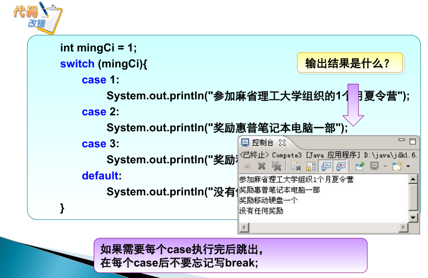
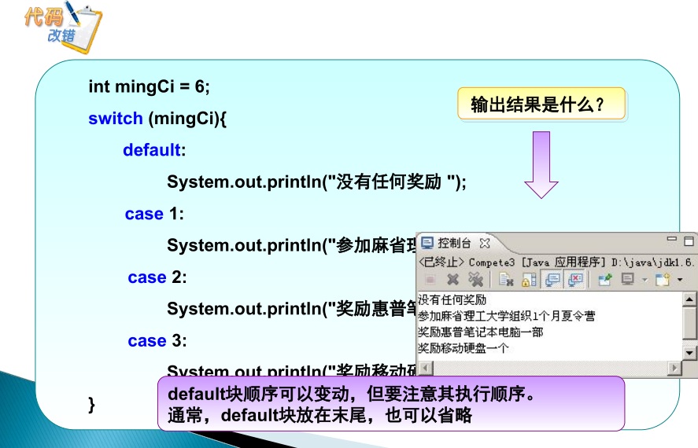
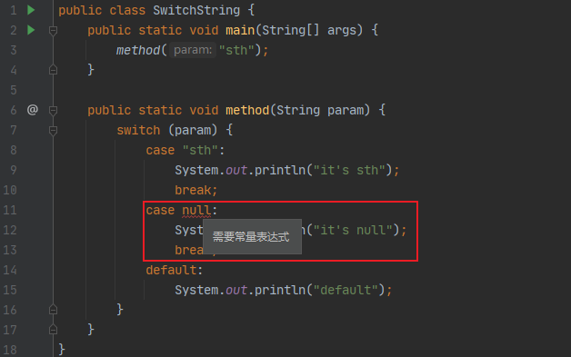
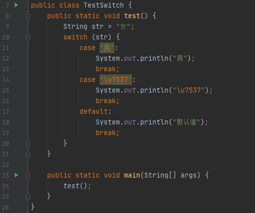
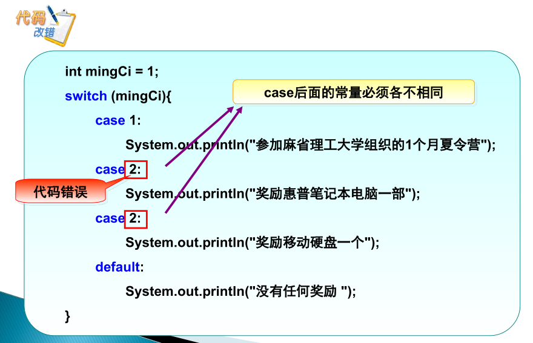
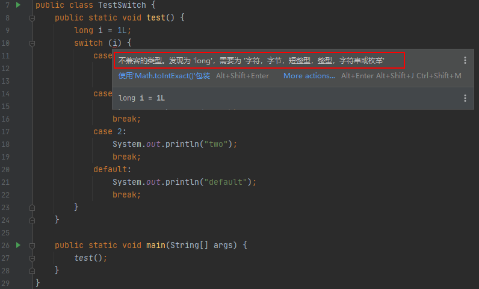
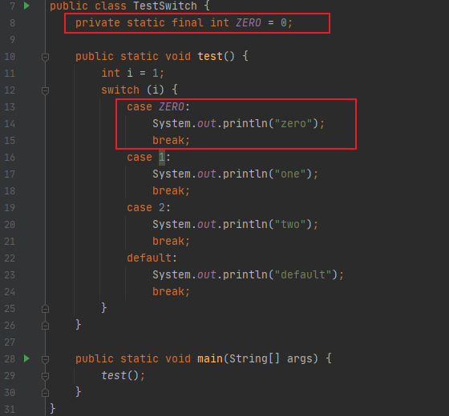
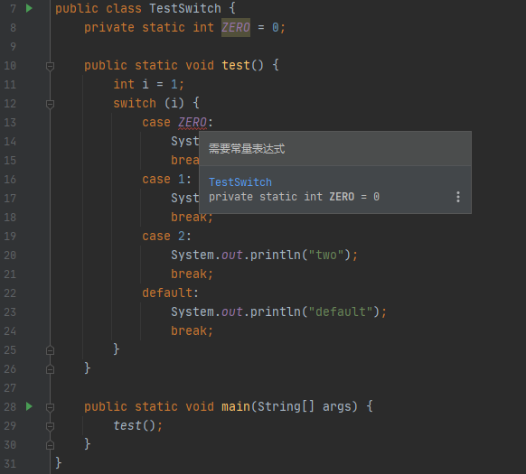
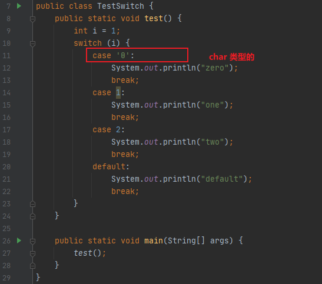
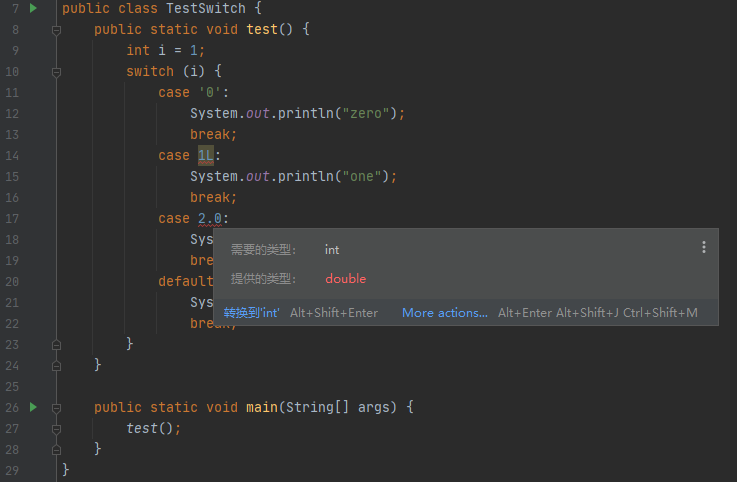

* Kramdown table of contents
{:toc .toc}
## switch 关键字概述

在 JDK 1.7 之前，switch 只能支持 byte、short、char、int 或者其对应的包装类以及 Enum 类型。在 JDK 1.7 中，呼吁很久的 String 也终于被加上了，但是目前为止 switch 还不支持 long 类型。

在 switch 语句中，表达式的值不能是 null，否则会在运行时抛出 NullPointerException。在 case 子句中也不能使用 null，否则会出现编译错误。同时，case 子句的值是不能重复的。对于字符串类型的也一样，但是字符串中可以包含 Unicode 转义字符。重复值的检查是在 Java 编译器对 Java 源代码进行相关的词法转换之后才进行的。也就是说，有些 case 字句的值虽然在源代码中看起来是不同的，但是经词法转换之后是一样的，就会在成编译错误。比如："男"和"\u7537"就是一个意思。

注意 default：当所有的 case 都没有匹配上就会执行，可以省略不写，可以任意位置。break 不写会发生一个 case 穿透的现象。

## switch 重点注意事项

- 在 switch 语句中，表达式的值不能是 null，否则会在运行时抛出 NullPointerException。
- 在 case 子句中也不能使用 null，否则会出现编译错误。
- case 值不允许重复，如果 case 值重复，则会产生编译错误。
- case 值的类型和 switch 表达式的类型必须相同。
- case 值必须是常量或字面量，不允许是变量。
- switch 表达式必须是 byte、short、char、int 以及它们对应的包装类(Byte、Short、Character、Integer)、枚举、字符串，不支持 long 类型。
- default 语句是可选的，可以出现在 switch 语句的任意位置，如果不是在末尾，最好在默认语句保留一个 break，以忽略下一个 case 语句的执行。

## 阿里巴巴 Java 开发规范

> **【强制】**在一个 switch 块内，每个 case 要么通过 continue/break/return 等来终止，要么注释说明程序将继续执行到哪一个 case 为止；在一个 switch 块内，都必须包含一个 default 语句并且放在最后，即使它什么代码也没有。
> **说明：**注意 break 是退出 switch 语句块，而 return 是退出方法体。

> 【强制】当 switch 括号内的变量类型为 String 并且此变量为外部参数时，必须先进行 null 判断。
> **反例：**如下的代码输出是什么？

```java
public class SwitchString {
    public static void main(String[] args) {
        method(null);
    }

    public static void method(String param) {
        switch (param) {
            // 肯定不是进入这里
            case "sth":
                System.out.println("it's sth");
                break;
            // 也不是进入这里
            case "null":
                System.out.println("it's null");
                break;
            // 也不是进入这里
            default:
                System.out.println("default");
        }
    }
}
```

> java.lang.NullPointerException

## switch 常见用法讲解





在 switch 语句中，表达式的值不能是 null，否则会在运行时抛出 NullPointerException。

```java
public class SwitchString {
    public static void main(String[] args) {
        method(null);
    }

    public static void method(String param) {
        switch (param) {
            case "sth":
                System.out.println("it's sth");
                break;
            case "null":
                System.out.println("it's null");
                break;
            default:
                System.out.println("default");
        }
    }
}
```

> java.lang.NullPointerException

在 case 子句中也不能使用 null，否则会出现编译错误。



case 值不允许重复，如果 case 值重复，则会产生编译错误。





switch 表达式不支持 long 类型。



case 值必须是常量或字面量，不允许是变量。





case 值的类型和 switch 表达式的类型必须相同。





```java
public static void test(){
    int i = 5;
    switch (i){
        case 5:
            System.out.println("是个5");
            break;
        case 10:
            System.out.println("是个10");
            break;
        case 4:
            System.out.println("是个4");
            break;
        default:
            System.out.println("默认值");
            break;
    }
}
```

> 是个5

```java
public static void test() {
    int i = 11;
    switch (i) {
        case 5:
        case 11:
        case 12:
            System.out.println("是个5");
            break;
        case 10:
            System.out.println("是个10");
            break;
        case 4:
            System.out.println("是个4");
            break;
        default:
            System.out.println("默认值");
            break;
    }
}
```

> 是个5

```java
public static void test() {
    int i = 11;
    switch (i) {
        case 5:
        case 11:
        case 12:
            System.out.println("是个5");
        case 10:
            System.out.println("是个10");
            break;
        case 4:
            System.out.println("是个4");
            break;
        default:
            System.out.println("默认值");
            break;
    }
}
```

> 是个5
> 是个10

```java
    public static void test() {
        int i = 10;
        switch (i) {
            case 5:
            case 11:
            case 12:
                System.out.println("是个5");
            case 10:
                System.out.println("是个10");
                break;
            case 4:
                System.out.println("是个4");
                break;
            default:
                System.out.println("默认值");
                break;
        }
    }
```

> 是个10

```java
public static void test() {
    int i = 4;
    switch (i) {
        case 5:
            System.out.println("是个5");
            break;
        case 10:
            System.out.println("是个10");
            break;
        case 4:
            System.out.println("是个4");
        default:
            System.out.println("默认值");
            break;
    }
}
```

> 是个4
> 默认值

```java
public static void test() {
    int i = 1;
    switch (i) {
        case 0:
            System.out.println("zero");
            // break;
        case 1:
            System.out.println("one");
        case 2:
            System.out.println("two");
        default:
            System.out.println("other");
    }
}
```

> one
> two
> other

```java
public static void test() {
    int x = 2;
    int y = 3;
    switch (x) {
        default:
            y++;
            break;
        case 3:
            y++;
        case 4:
            y++;
    }
    System.out.println("y = " + y);
}
```

> y = 4

```java
public static void test() {
    int x = 2;
    int y = 3;
    switch (x) {
        default:
            y++;
        case 3:
            y++;
        case 4:
            y++;
    }
    System.out.println("y = " + y);
}
```

> y = 6

```java
public static void test() {
    String msg = "dragon";
    switch (msg) {
        case "rabbit":
            System.out.println("rabbit");
        case "dragon":
            System.out.println("happy new year");
        default:
            System.out.println("what");
        case "monkey":
            System.out.println("monkey");
            break;
        case "viper":
            System.out.println("viper");
    }
}
```

> happy new year
> what
> monkey

```java
public static void test() {
    int i = 9;
    switch (i) {
        default:
            System.out.println("default");
        case 0:
            System.out.println("zero");
            break;
        case 1:
            System.out.println("one");
        case 2:
            System.out.println("two");
    }
}
```

> default
> zero

```java
public static void test() {
    int day = 5;
    String dayString;

    switch (day) {
        case 1:
            dayString = "Monday";
            break;
        case 2:
            dayString = "Tuesday";
            break;
        case 3:
            dayString = "Wednesday";
            break;
        case 4:
            dayString = "Thursday";
            break;
        case 5:
            dayString = "Friday";
            break;
        case 6:
            dayString = "Saturday";
            break;
        case 7:
            dayString = "Sunday";
            break;
        default:
            dayString = "Invalid day";
    }
    System.out.println(dayString);
}
```

> Friday

```java
public static void test() {
    int day = 2;
    String dayType;
    String dayString;

    switch (day) {
        case 1:
            dayString = "Monday";
            break;
        case 2:
            dayString = "Tuesday";
            break;
        case 3:
            dayString = "Wednesday";
            break;
        case 4:
            dayString = "Thursday";
            break;
        case 5:
            dayString = "Friday";
            break;
        case 6:
            dayString = "Saturday";
            break;
        case 7:
            dayString = "Sunday";
            break;
        default:
            dayString = "Invalid day";
    }

    switch (day) {
        case 1:
        case 2:
        case 3:
        case 4:
        case 5:
            dayType = "Weekday";
            break;
        case 6:
        case 7:
            dayType = "Weekend";
            break;
        default:
            dayType = "Invalid daytype";
    }
    System.out.println(dayString + " is a " + dayType);
}
```

> Tuesday is a Weekday

```java
public static void test() {
    String Branch = "CSE";
    int year = 2;

    switch (year) {
        case 1:
            System.out.println("elective courses : Advance english, Algebra");
            break;
        case 2:
            switch (Branch) {
                case "CSE":
                case "CCE":
                    System.out.println("elective courses : Machine Learning, Big Data");
                    break;
                case "ECE":
                    System.out.println("elective courses : Antenna Engineering");
                    break;
                default:
                    System.out.println("Elective courses : Optimization");
            }
    }
}
```

> elective courses : Machine Learning, Big Data

```java
public static void test() {
    String str = "two";
    switch (str) {
        case "one":
            System.out.println("one");
            break;
        case "two":
            System.out.println("two");
            break;
        case "three":
            System.out.println("three");
            break;
        default:
            System.out.println("no match");
    }
}
```

> two

```java
public static void test() {
    int num = 2;
    switch (num + 2) {
        case 1:
            System.out.println("Case1: Value is: " + num);
        case 2:
            System.out.println("Case2: Value is: " + num);
        case 3:
            System.out.println("Case3: Value is: " + num);
        default:
            System.out.println("Default: Value is: " + num);
    }
}
```

> Default: Value is: 2

```java
public static void test() {
    int i = 2;
    switch (i) {
        case 1:
            System.out.println("Case1 ");
        case 2:
            System.out.println("Case2 ");
        case 3:
            System.out.println("Case3 ");
        case 4:
            System.out.println("Case4 ");
        default:
            System.out.println("Default ");
    }
}
```

> Case2 
> Case3 
> Case4 
> Default 

```java
public static void test() {
    int i = 2;
    switch (i) {
        case 1:
            System.out.println("Case1 ");
            break;
        case 2:
            System.out.println("Case2 ");
            break;
        case 3:
            System.out.println("Case3 ");
            break;
        case 4:
            System.out.println("Case4 ");
            break;
        default:
            System.out.println("Default ");
    }
}
```

> Case2

```java
public static void test() {
    char ch = 'b';
    switch (ch) {
        case 'd':
            System.out.println("Case1 ");
            break;
        case 'b':
            System.out.println("Case2 ");
            break;
        case 'x':
            System.out.println("Case3 ");
            break;
        case 'y':
            System.out.println("Case4 ");
            break;
        default:
            System.out.println("Default ");
    }
}
```

> Case2

```java
public class Test {
    public static void main(String[] args) {
        System.out.println(getValue(2));
    }

    public static int getValue(int i) {
        int Test = 0;
        switch (i) {
            default:
                System.out.println("default");
            case 1:
                Test = Test + i;
            case 2:
                Test = Test + i * 2;
            case 3:
                Test = Test + i * 3;
        }
        return Test;
    }
}
```

> 10

## switch 关键字常考面试题

- [ ] switch 用 String 类型作参数可行么？跟 JDK 有关么？switch 是否可用于 String 类型的判断，Java 哪个版本之后有此功能的。

<a class="button show-hidden">点击查看结果</a>

<div class="hidden">
<blockquote><p><b>参考答案</b>
可以，JDK 1.7 及其以后。switch 语句中的表达式可以是 byte、short、int、char、String、Enum 类型的值，目前不支持 long 类型的。
</p></blockquote>
</div>


- [ ] 下面的 switch 语句中，x 可以是哪些类型的数据（）

```java
switch (x) {
    default:
        System.out.println("hello");
}
```

> A. long
>
> B. char
>
> C. float
>
> D. byte
>
> E. double
>
>
> F. Object
>

<a class="button show-hidden">点击查看结果</a>

<div class="hidden">
<blockquote><p><b>参考答案</b>
BD
</p></blockquote>
</div>

- [ ] 关于 switch 语句的描述中，正确的是（）

> A. switch 语句中 default 子句可以没有，也可有一个
>
> B. switch 语句中每个 case 语句序列中必须有 break 语句
>
> C. switch 语句中 default 子句只能放在最后
>
> D. switch 语句中 case 子句后面的表达式只能是整型表达式
>

<a class="button show-hidden">点击查看结果</a>

<div class="hidden">
<blockquote><p><b>参考答案</b>
A
</p></blockquote>
</div>
- [ ] 以下程序输出（）

```java
public class Test {
    public static void main(String[] args) {
        int num = 2;
        switch (num) {
            case 1:
                ++num;
            case 2:
                ++num;
            case 3:
                ++num;
            default:
                ++num;
                break;
        }
        System.out.println(num);
    }
}
```

> A. 2
>
> B. 3
>
> C. 4
>
> D. 5
>

<a class="button show-hidden">点击查看结果</a>

<div class="hidden">
<blockquote><p><b>参考答案</b>
D
</p></blockquote>
</div>
- [ ] 下面的方法，当输入为 2 的时候返回值是（）

```java
public class Test {
    public static int getValue(int i) {
        int result = 0;
        switch (i) {
            case 1:
                result = result + i;
            case 2:
                result = result + i * 2;
            case 3:
                result = result + i * 3;
        }
        return result;
    }
}
```

> A. 0
>
> B. 2
>
> C. 4
>
> D. 10
>

<a class="button show-hidden">点击查看结果</a>

<div class="hidden">
<blockquote><p><b>参考答案</b>
D
</p></blockquote>
</div>
- [ ] 下面代码输出什么？


```java
public class ReadOne {
    public static void main(String[] args) {
        int count = 0;
        for (int index = 0; index <= 20; index++) {
            switch (index++ % 4) {
                case 0:
                    count = ++index;
                case 1:
                    count += index;
                    break;
                default:
                    System.out.println(count);
            }
        }
    }
}
```

<a class="button show-hidden">点击查看结果</a>

<div class="hidden">
<blockquote><p><b>参考答案</b>
4
10
20
34
52
</p></blockquote>
</div>
- [ ] 下面代码输出什么？

```java
public class ReadOne {
    public static void main(String[] args) {
        int i = 9;
        switch (i) {
            case 1:
                System.out.println("success");
            default:
                System.out.println("Error");
            case 2:
                System.out.println("Good");
            case 3:
                System.out.println("Best");
        }
    }
}
```

<a class="button show-hidden">点击查看结果</a>

<div class="hidden">
<blockquote><p><b>参考答案</b>
Error
Good
Best
</p></blockquote>
</div>
- [ ] 根据给出的程序，选出正确的运行结果。


```java
public class SwitchClass {
    final static short a = 3;
    public static int b = 1;
    public static void main(String[] args) {
        for (int c = 0; c < 5; c++) {
            switch (c) {
                case b: System.out.println("4");
                case a - 1: System.out.print("5");
                case a: System.out.print("6");
            }
        }
    }
}
```

> A. 4 5 6
>
> B. 4 5 6 5 6 6
>
> C. 第 6 行编译错误
>
> D. 第 7 行编译错误
>
> E. 第 8 行编译错误
>
> F. 第 9 行编译错误
>
> G. 运行时出现异常
>

<a class="button show-hidden">点击查看结果</a>

<div class="hidden">
<blockquote><p><b>参考答案</b>
D
此题考查 switch 语句的用法，在使用 case 关键字时，需要注意两点：
（1）跟在 case 后面的值必须是个常量，不能是变量或者表达式；
（2）一个 case 后面一般要接一个 break 语句才能结束判断，否则将继续执行其他 case 而不进行任何判断，那么就失去了“多中择其一”的用意了。因为在 case b: 中 b 是一个变量，所以在编译时就会出错。
</p></blockquote>
</div>
## 推荐阅读

- [https://docs.oracle.com/javase/tutorial/java/nutsandbolts/switch.html](https://docs.oracle.com/javase/tutorial/java/nutsandbolts/switch.html)
- [https://www.javatpoint.com/java-switch](https://www.javatpoint.com/java-switch)
- [http://tutorials.jenkov.com/java/switch.html](http://tutorials.jenkov.com/java/switch.html)
