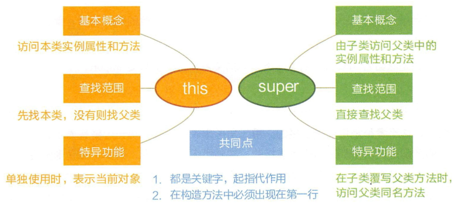

* Kramdown table of contents
{:toc .toc}
## this 关键字的应用

> 1. 使用 this 关键字引用当前类的实例变量
> 2. 使用 this 关键字调用当前类的实例方法
> 3. 在构造方法中使用 this 关键字作为参数
> 4. 使用 this 关键字作为方法调用中的参数传递
> 5. 使用 this() 关键字调用当前类的其它构造方法(必须放在构造方法的第一行)
> 6. 使用 this 关键字返回当前类的实例



### 使用 this 关键字引用当前类的实例变量

```java
class Test {
    int a;
    int b;

    Test(int a, int b) {
        this.a = a;
        this.b = b;
    }

    void display() {
        System.out.println("a = " + a + "  b = " + b);
    }

    public static void main(String[] args) {
        Test object = new Test(10, 20);
        object.display();
    }
}
```

> a = 10  b = 20

### 使用 this 关键字调用当前类的实例方法

```java
class Test {
    void display() {
        this.show();
        System.out.println("Inside display function");
    }

    void show() {
        System.out.println("Inside show funcion");
    }


    public static void main(String args[]) {
        Test t1 = new Test();
        t1.display();
    }
}
```

> Inside show funcion
> Inside display function

### 在构造方法中使用 this 关键字作为参数

```java
class A {
    B obj;

    A(B obj) {
        this.obj = obj;
        obj.display();
    }
}

class B {
    int x = 5;

    B() {
        A obj = new A(this);
    }

    void display() {
        System.out.println("Value of x in Class B : " + x);
    }

    public static void main(String[] args) {
        B obj = new B();
    }
}
```

> Value of x in Class B : 5

### 使用 this 关键字作为方法调用中的参数传递

```java
class Test {
    int a;
    int b;

    Test() {
        a = 10;
        b = 20;
    }

    void display(Test obj) {
        System.out.println("a = " + obj.a + "  b = " + obj.b);
    }

    void get() {
        display(this);
    }

    public static void main(String[] args) {
        Test object = new Test();
        object.get();
    }
}
```

> a = 10  b = 20

### 使用 this() 关键字调用当前类的其它构造方法(必须放在构造方法的第一行)

```java
class Test {
    int a;
    int b;

    Test() {
        this(10, 20);
        System.out.println("Inside  default constructor \n");
    }

    Test(int a, int b) {
        this.a = a;
        this.b = b;
        System.out.println("Inside parameterized constructor");
    }

    public static void main(String[] args) {
        Test object = new Test();
    }
}
```

> Inside parameterized constructor
> Inside  default constructor 

### 使用 this 关键字返回当前类的实例

```java
class Test {
    int a;
    int b;

    Test() {
        a = 10;
        b = 20;
    }

    Test get() {
        return this;
    }

    void display() {
        System.out.println("a = " + a + "  b = " + b);
    }

    public static void main(String[] args) {
        Test object = new Test();
        object.get().display();
    }
}
```

> a = 10  b = 20

## 参考资料

- [https://www.javatpoint.com/this-keyword](https://www.javatpoint.com/this-keyword)
- [https://www.geeksforgeeks.org/this-reference-in-java/](https://www.geeksforgeeks.org/this-reference-in-java/)