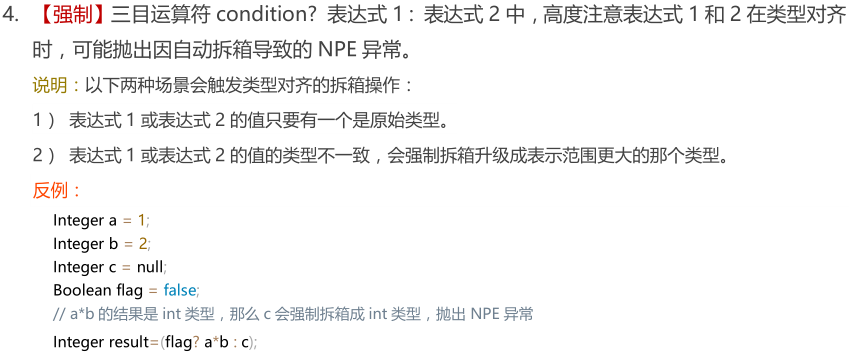

---

layout: post
title: "Java 基础-三目运算符"
permalink: /blog/74769514
categories: [Java 基础]
tags: [Java 基础]
date: 2020-10-26 13:30:29
---

* Kramdown table of contents
{:toc .toc}
## 三目运算符



- 若两个操作数不可转换，则不做转换，返回值为 Object 类型。
- 若两个操作数是明确类型的表达式（比如变量），则按照正常的二进制数字来转换，int 类型转换为 long 类型，long 类型转换为 float 类型等。
- 若两个操作数中有一个是数字 S,另外一个是表达式，且其类型标示为 T，那么，若数字 S 在 T 的范围内，则转换为 T 类型；若 S 超出了 T 类型的范围，则 T 转换为 S 类型。
- 若两个操作数都是直接量数字，则返回值类型为范围较大者。

### 若两个操作数不可转换，则不做转换，返回值为 Object 类型。

```java
public class Test {
    public static void main(String[] args) {
        Object value = true ? new String("Hello") : new Double(2.0);
        System.out.println(value);
    }
}
```

> Hello

### 若两个操作数是明确类型的表达式（比如变量），则按照正常的二进制数字来转换，int 类型转换为 long 类型，long 类型转换为 float 类型等。

```java
public class Test {
    public static void main(String[] args) {
        int x = 10;
        long y = 100L;
        long value = true ? x : y;
        System.out.println(value);
    }
}
```

> 10

### 若两个操作数中有一个是数字 S，另外一个是表达式，且其类型标示为 T，那么，若数字 S 在 T 的范围内，则转换为 T 类型；若 S 超出了 T 类型的范围，则 T 转换为 S 类型。

```java
public class Test {
    public static void main(String[] args) {
        char x = 'x';
        int i = 10;
        System.out.println(false ? i : x);
        System.out.println(false ? 10 : x);
    }
}
```

> 120
> x

### 若两个操作数都是直接量数字，则返回值类型为范围较大者。

```java
public class Test {
    public static void main(String[] args) {
        int a = 5;
        System.out.println("value is :" + ((a < 5) ? 10.9 : 9));
    }
}
```
> value is :9.0

```java
public class Test {
    public static void main(String[] args) {
        double value = true ? new Integer(1) : new Double(2.0);
        System.out.println(value);
    }
}
```

> 1.0