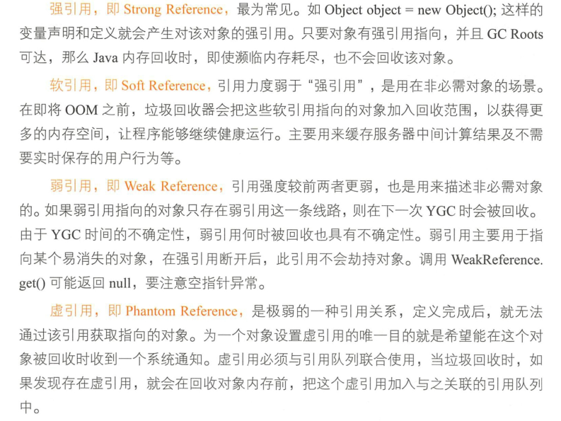
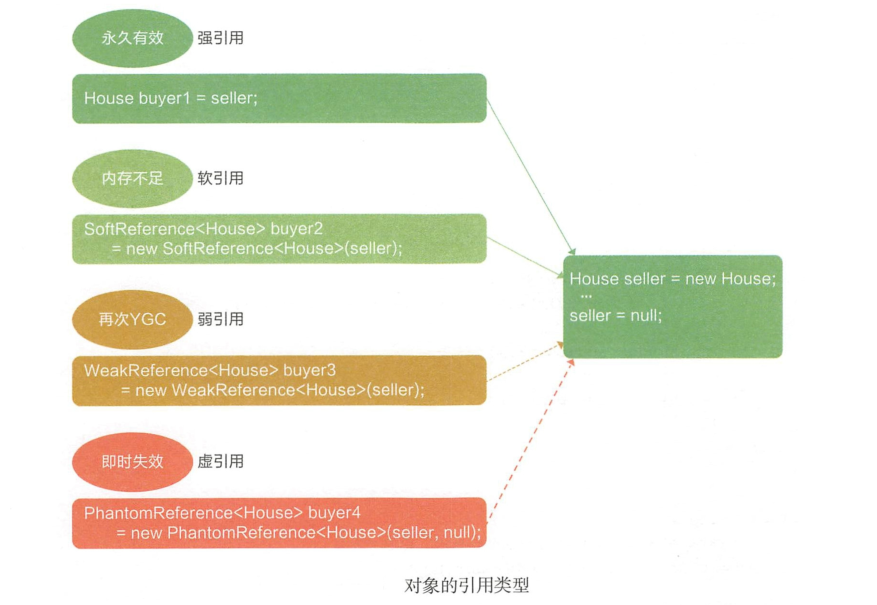
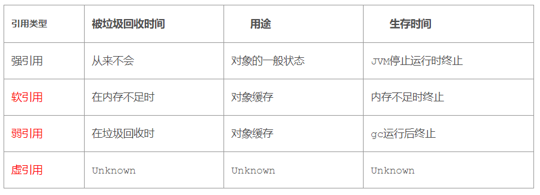

* Kramdown table of contents
{:toc .toc}
## Java 中的四种引用

根据引用类型语义的强弱来决定垃圾回收的阶段，我们可以把引用分为**强引用、软引用、弱引用和虚引用**四类。后三类引用，本质上是可以让开发工程师通过代码方式来决定对象的垃圾回收时机。我们先简要了解一下这四类引用。

> 1. 强引用：不会被垃圾回收器回收
>
> 2. 软引用：只有在内存不足的时候 JVM 才会回收该对象
>
> 3. 弱引用：被弱引用关联的对象在 JVM 进行垃圾回收时总会被回收
>
> 4. 虚引用：在任何时候都可能被垃圾回收器回收
>

## 四种引用常考面试题

- 四种引用讲讲，它们之间的区别是什么?
- 引用有哪些，虚引用的作用详细描述一下。
- 说说 Java 中的软引用、弱引用、虚引用的适用场景以及释放机制。
- 软引用什么时候会被释放。弱引用什么时候会被释放。
- Java 中的四种引用。
- Java 中的引用类型有哪些?分别在什么场景下用，有些什么特点呢?

## 推荐阅读

- [Java的四种引用方式(强引用，软引用，弱引用，虚引用)](https://blog.csdn.net/qq_39192827/article/details/85611873)
- https://www.cnblogs.com/javaee6/p/4763190.html
- [浅谈Java中的四种引用](https://www.yimipuzi.com/1041.html)