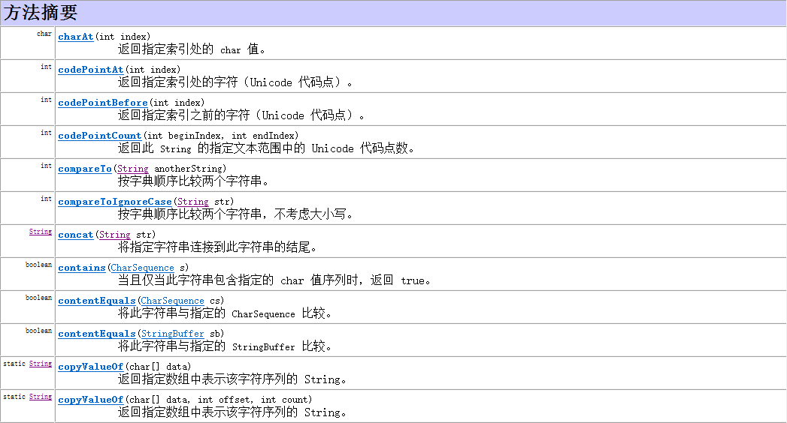

* Kramdown table of contents
{:toc .toc}
## 问题思考

- String，StringBuffer，StringBuilder 的区别，为什么 String 是不可变的，StringBuffer 和 StringBuilder 哪个是线程安全的，他们分别适用于什么场景。
- String，StringBuffer，StringBuilder 的异同以及各自的实现。
- 对 String 类的理解。String 能不能继承？为什么 String 是不可变类，String 是不可变类有什么好处。如果自己写 String 类可以把原来的 String 类覆盖吗？
- StringBuilder 为什么线程不安全？
- String = "abc"和 String = new String("abc") 这两种创建字符串之间的区别？
- String str1 = "aaa"; String str2 = "aaa"; String str3 = new String("aaa");比较结果，要求画出内存中的模型。
- String x = "string"与 String y = "string",使用 equals() 和==比较分别会有什么结果。
- String a = "abc" + "def"这个字符串拼接过程中+的过程是怎么实现的？编译期是个什么过程呢？
- String s = new String("abc"),创建了几个对象，每个对象分别在什么位置？
- final 关键字，为什么 String 设置成 final 类型？常量池和堆里对象的区别？
- String 比较结果，要求画出内存中的模型。
- Java 中 String 用==比较，回答了两种情况，顺便说了 intern()。
- switch 用 String 类型作参数可行么？跟 JDK 有关么？
- String 不可变的设计原理，以及这样设计的原因。
- String 类为何为 final 的。
- String 怎么存储，汉字怎么存储。
- 数组有没有 length() 方法？String 有没有 length() 方法？

---

## String 类源码解析

```java
public final class String
    implements java.io.Serializable, Comparable<String>, CharSequence {
    /** The value is used for character storage. */
    private final char value[];
    ...
}   
```

## String 类常用方法



## 常用类 String 常考面试题

```java
public class Test {
    public static void main(String[] args) {
        int[] arr = new int[]{8, 2, 1, 0, 3};
        int[] index = new int[]{2, 0, 3, 2, 4, 0, 1, 3, 2, 3, 3};
        String tel = "";
        for (int i = 0; i < index.length; i++) {
            tel += arr[index[i]];
        }
        System.out.println("联系方式：" + tel);
        int length = tel.length();
    }
}
```

> 联系方式：18013820100

```java
public class Test {
    public static void main(String[] args) {
        String s1 = "AB";
        String s2 = new String("AB");
        String s3 = "A";
        String s4 = "B";
        String s5 = "A" + "B";
        String s6 = s3 + s4;
        System.out.println(s1 == s2);
        System.out.println(s1 == s5);
        System.out.println(s1 == s6);
        System.out.println(s1 == s6.intern());
        System.out.println(s2 == s2.intern());
    }
}
```

<a class="button show-hidden">点击查看结果</a>

<div class="hidden">
<blockquote><p><b>参考答案</b>
false
true
false
true
false
</p></blockquote>
</div>

```java
public class Main {
    public static void main(String[] args) {
        String s1 = "abc";
        String s2 = "abc";
        System.out.println(s1 == s2);
        String s3 = new String("abc");
        System.out.println(s1 == s3);
    }
}
```

<a class="button show-hidden">点击查看结果</a>

<div class="hidden">
<blockquote><p><b>参考答案</b>
true
false
</p></blockquote>
</div>
```java
public class Test {
    public static void main(String[] args) {
        String str = "";
        System.out.print(str.split(",").length);
    }
}
```

<a class="button show-hidden">点击查看结果</a>

<div class="hidden">
<blockquote><p><b>参考答案</b>
1
</p></blockquote>
</div>

```java
public class Test {
    public static void main(String[] args) {
        String s1 = "abc";
        System.out.println(func(s1));
        System.out.println(s1);
        StringBuilder s2 = new StringBuilder("abc");
        System.out.println(func(s2));
        System.out.println(s2);
    }

    public static String func(String s) {
        s += "cde";
        return s;
    }

    public static String func(StringBuilder s) {
        s.append("cde");
        return s.toString();
    }
}
```

<a class="button show-hidden">点击查看结果</a>

<div class="hidden">
<blockquote><p><b>参考答案</b>
abccde
abc
abccde
abccde
</p></blockquote>
</div>
```java
public class Example {
    String str = new String("good");
    char[] ch = {'a', 'b', 'c'};

    public static void main(String args[]) {
        Example ex = new Example();
        ex.change(ex.str, ex.ch);
        System.out.print(ex.str + " and ");
        System.out.print(ex.ch);
    }

    public void change(String str, char ch[]) {
        str = "test ok";
        ch[0] = 'g';
    }
}
```

<a class="button show-hidden">点击查看结果</a>

<div class="hidden">
<blockquote><p><b>参考答案</b>
good and gbc
</p></blockquote>
</div>

```java
public class Example {
    public static void main(String[] args) {
        String a = "hello";
        change(a);
        System.out.println(a);
    }

    public static void change(String name) {
        name = "world";
    }
}
```

<a class="button show-hidden">点击查看结果</a>

<div class="hidden">
<blockquote><p><b>参考答案</b>
hello
</p></blockquote>
</div>

```java
public class Test {
    public static void main(String[] args) {
        Test test = new Test();
        int a = 1;
        test.addInt(a);
        System.out.println(a);
        String str = "hello";
        test.addString(str);
        System.out.println(str);
        StringBuilder sb = new StringBuilder("hello");
        test.addBuilder(sb);
        System.out.println(sb.toString());
        Long m = 1L;
        Long n = 1L;
        System.out.println(m == n);
        m = 200L;
        n = 200L;
        System.out.println(m == n);
        String x = new String("hello");
        String y = "hello";
        System.out.println(x.equals(y));
        System.out.println(x == y);
    }

    public void addInt(int a) {
        a = a + 1;
    }

    public void addString(String str) {
        str = str + "world";
    }

    public void addBuilder(StringBuilder sb) {
        sb.append("world");
    }
}
```

<a class="button show-hidden">点击查看结果</a>

<div class="hidden">
<blockquote><p><b>参考答案</b>
1
hello
helloworld
true
false
true
false
</p></blockquote>
</div>

```java
public class Test {
    public static void swap(Integer i, Integer j) {
        Integer temp = new Integer(i);
        i = j;
        j = temp;
    }

    public static void main(String[] args) {
        Integer i = new Integer(10);
        Integer j = new Integer(20);
        swap(i, j);
        System.out.println("i = " + i + ", j = " + j);
    }
}
```

<a class="button show-hidden">点击查看结果</a>

<div class="hidden">
<blockquote><p><b>参考答案</b>
i = 10, j = 20
</p></blockquote>
</div>
```java
public class Test {
    public static void main(String[] args) {
        System.out.print('A' + 'B' + " ");
        StringBuffer sb = new StringBuffer('A');
        sb.append('B');
        sb.append('C');
        System.out.println(sb);
    }
}
```

<a class="button show-hidden">点击查看结果</a>

<div class="hidden">
<blockquote><p><b>参考答案</b>
131 BC
</p></blockquote>
</div>

## 推荐阅读

- [https://www.cnblogs.com/dolphin0520/p/3778589.html](https://www.cnblogs.com/dolphin0520/p/3778589.html)
- [https://blog.csdn.net/ifwinds/article/details/80849184](https://blog.csdn.net/ifwinds/article/details/80849184)
- [https://blog.csdn.net/u013905744/article/details/52414111](https://blog.csdn.net/u013905744/article/details/52414111)
- [https://blog.csdn.net/soonfly/article/details/70147205](https://blog.csdn.net/soonfly/article/details/70147205)
- [你真的了解String类的intern()方法吗](https://blog.csdn.net/seu_calvin/article/details/52291082)
- [https://blog.csdn.net/ZhouHuoCleverset/article/details/61935578](https://blog.csdn.net/ZhouHuoCleverset/article/details/61935578)