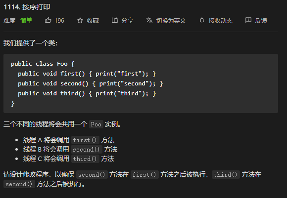

* Kramdown table of contents
{:toc .toc}
## 多线程顺序执行

### [1114. 按序打印](https://leetcode-cn.com/problems/print-in-order/)



**方法一：使用 synchronized**

```java
class Foo {
    private int flag = 0;
    private final Object lock = new Object();
    
    public Foo() {

    }

    public void first(Runnable printFirst) throws InterruptedException {
        synchronized (lock) {
            while (flag % 3 != 0) {
                lock.wait();
            }
            // printFirst.run() outputs "first". Do not change or remove this line.
            printFirst.run();
            flag++;
            lock.notifyAll();
        }
    }

    public void second(Runnable printSecond) throws InterruptedException {
        synchronized (lock) {
            while (flag % 3 != 1) {
                lock.wait();
            }
            // printSecond.run() outputs "second". Do not change or remove this line.
            printSecond.run();
            flag++;
            lock.notifyAll();
        }
    }

    public void third(Runnable printThird) throws InterruptedException {
        synchronized (lock) {
            while (flag % 3 != 2) {
                lock.wait();
            }
            // printThird.run() outputs "third". Do not change or remove this line.
            printThird.run();
            flag++;
            lock.notifyAll();
        }
    }
}
```

**方法二：使用 2 个 CountDownLatch 变量**

```java
class Foo {
    private CountDownLatch c1;
    private CountDownLatch c2;

    public Foo() {
        c1 = new CountDownLatch(1);
        c2 = new CountDownLatch(1);
    }

    public void first(Runnable printFirst) throws InterruptedException {
        // printFirst.run() outputs "first". Do not change or remove this line.
        printFirst.run();
        c1.countDown();
    }

    public void second(Runnable printSecond) throws InterruptedException {
        c1.await();
        // printSecond.run() outputs "second". Do not change or remove this line.
        printSecond.run();
        c2.countDown();
    }

    public void third(Runnable printThird) throws InterruptedException {
        c2.await();
        // printThird.run() outputs "third". Do not change or remove this line.
        printThird.run();
    }
}
```

### 现在有 T1、T2、T3 三个线程，你怎样保证 T2 在 T1 执行完后执行，T3 在 T2 执行完后执行？

**方法一：使用 join**

```java
public class Test {
    public static void main(String[] args) {
        Thread t1 = new Thread(() -> {
            try {
                TimeUnit.SECONDS.sleep(3);
            } catch (InterruptedException e) {
                e.printStackTrace();
            }
            System.out.println(Thread.currentThread().getName());
        }, "t1");

        Thread t2 = new Thread(() -> {
            try {
                t1.join();
                TimeUnit.SECONDS.sleep(3);
            } catch (InterruptedException e) {
                e.printStackTrace();
            }
            System.out.println(Thread.currentThread().getName());
        }, "t2");

        Thread t3 = new Thread(() -> {
            try {
                t2.join();
            } catch (InterruptedException e) {
                e.printStackTrace();
            }
            System.out.println(Thread.currentThread().getName());
        }, "t3");

        t3.start();
        t2.start();
        t1.start();
    }
}
```

**方法二：使用 Executors 中的 newSingleThreadExecutor() 方法**

```java
public class Test {
    public static void main(String[] args) {
        Thread t1 = new Thread(() -> System.out.println("t1"));
        Thread t2 = new Thread(() -> System.out.println("t2"));
        Thread t3 = new Thread(() -> System.out.println("t3"));
        ExecutorService es = Executors.newSingleThreadExecutor();
        // 必须按照 t1->t2->t3 的顺序往线程池提交任务
        es.execute(t1);
        es.execute(t2);
        es.execute(t3);
        es.shutdown();
    }
}
```
