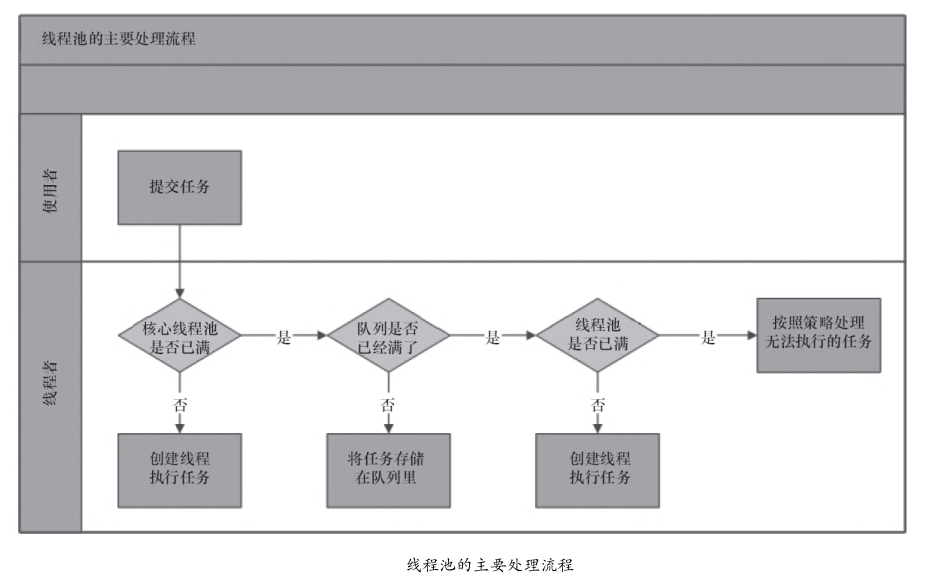
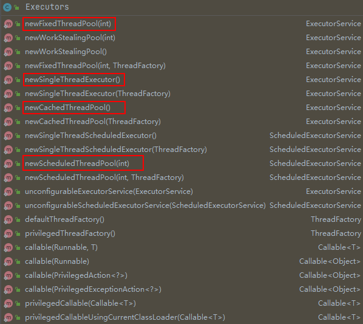

* Kramdown table of contents
{:toc .toc}
## 深入理解 Java 中的线程池

### 使用线程池的好处

- 降低资源消耗。
- 提高响应速度。
- 提高线程的可管理性。

### 线程池的实现原理

ThreadPoolExecutor 执行 execute() 方法示意图如下



### 线程池的 7 大核心参数

ThreadPoolExecutor 类的 4 个构造方法

```java
public ThreadPoolExecutor(int corePoolSize,
                          int maximumPoolSize,
                          long keepAliveTime,
                          TimeUnit unit,
                          BlockingQueue<Runnable> workQueue) {
    this(corePoolSize, maximumPoolSize, keepAliveTime, unit, workQueue,
         Executors.defaultThreadFactory(), defaultHandler);
}

public ThreadPoolExecutor(int corePoolSize,
                          int maximumPoolSize,
                          long keepAliveTime,
                          TimeUnit unit,
                          BlockingQueue<Runnable> workQueue,
                          ThreadFactory threadFactory) {
    this(corePoolSize, maximumPoolSize, keepAliveTime, unit, workQueue,
         threadFactory, defaultHandler);
}

public ThreadPoolExecutor(int corePoolSize,
                          int maximumPoolSize,
                          long keepAliveTime,
                          TimeUnit unit,
                          BlockingQueue<Runnable> workQueue,
                          RejectedExecutionHandler handler) {
    this(corePoolSize, maximumPoolSize, keepAliveTime, unit, workQueue,
         Executors.defaultThreadFactory(), handler);
}

public ThreadPoolExecutor(int corePoolSize,
                          int maximumPoolSize,
                          long keepAliveTime,
                          TimeUnit unit,
                          BlockingQueue<Runnable> workQueue,
                          ThreadFactory threadFactory,
                          RejectedExecutionHandler handler) {
    if (corePoolSize < 0 ||
        maximumPoolSize <= 0 ||
        maximumPoolSize < corePoolSize ||
        keepAliveTime < 0)
        throw new IllegalArgumentException();
    if (workQueue == null || threadFactory == null || handler == null)
        throw new NullPointerException();
    this.acc = System.getSecurityManager() == null ?
            null :
            AccessController.getContext();
    this.corePoolSize = corePoolSize;
    this.maximumPoolSize = maximumPoolSize;
    this.workQueue = workQueue;
    this.keepAliveTime = unit.toNanos(keepAliveTime);
    this.threadFactory = threadFactory;
    this.handler = handler;
}
```

- corePoolSize：线程池的核心线程数量，当提交一个任务到线程池时，线程池会创建一个线程来执行任务，即使其他空闲的基本线程能够执行新任务也会创建线程，等到需要执行的任务数大于线程池基本大小时就不再创建。如果调用了线程池的 prestartAllCoreThreads() 方法，线程池会提前创建并启动所有基本线程。
- maximumPoolSize：线程池允许创建的最大线程数量。如果队列满了，并且已创建的线程数小于最大线程数，则线程池会再创建新的线程执行任务。值得注意的是，如果使用了无界的任务队列这个参数就没什么效果。
- keepAliveTime：空闲线程的存活时间，线程池的工作线程空闲后，保持存活的时间。所以，如果任务很多，并且每个任务执行的时间比较短，可以调大时间，提高线程的利用率。
- unit：keepAliveTime 参数的时间单位，TimeUnit 枚举类定义了 7 个属性。

> TimeUnit.DAYS;              //天
>
> TimeUnit.HOURS;             //小时
>
> TimeUnit.MINUTES;           //分钟
>
> TimeUnit.SECONDS;           //秒
>
> TimeUnit.MILLISECONDS;      //毫秒
>
> TimeUnit.MICROSECONDS;      //微妙
>
> TimeUnit.NANOSECONDS;       //纳秒

- workQueue：阻塞队列，用于保存等待执行的任务的阻塞队列。可以选择以下几个阻塞队列。

> ArrayBlockingQueue：是一个基于数组结构的有界阻塞队列，此队列按 FIFO（先进先出）原则对元素进行排序。
>
> LinkedBlockingQueue：一个基于链表结构的阻塞队列，此队列按 FIFO 排序元素，吞吐量通常要高于 ArrayBlockingQueue。静态工厂方法 Executors.newFixedThreadPool() 使用了这个队列。
>
> SynchronousQueue：一个不存储元素的阻塞队列。
>
> PriorityBlockingQueue：一个具有优先级的无限阻塞队列。

- threadFactory：线程工厂，用于设置创建线程的工厂，可以通过线程工厂给每个创建出来的线程设置更有意义的名字。
- handler：拒绝策略，当队列和线程池都满了，说明线程池处于饱和状态，那么必须采取一种策略处理新提交的任务。这个策略默认情况下是 AbortPolicy，表示无法处理新任务时抛出异常。在 JDK 1.5 中 Java 线程池框架提供了以下 4 种策略。

> ThreadPoolExecutor.AbortPolicy：丢弃任务并抛出 RejectedExecutionException 异常。 
>
> ThreadPoolExecutor.DiscardPolicy：丢弃任务但是不抛出异常。 
>
> ThreadPoolExecutor.DiscardOldestPolicy：丢弃队列最前面的任务，然后重新尝试执行任务。(重复此过程)
>
> ThreadPoolExecutor.CallerRunsPolicy：由调用者线程处理该任务。

当然，也可以根据应用场景需要来实现 RejectedExecutionHandler 接口自定义策略。如记录日志或持久化存储不能处理的任务。

```java
public interface RejectedExecutionHandler {
    void rejectedExecution(Runnable r, ThreadPoolExecutor executor);
}
```

### 线程池的状态

线程池的 5 种状态：RUNNING、SHUTDOWN、STOP、TIDYING、TERMINATED。


- RUNNING

状态说明：线程池处在 RUNNING 状态时，能够接收新任务，以及对已添加的任务进行处理。

状态转换：线程池的初始化状态是 RUNNING。换句话说，线程池被一旦被创建，就处于 RUNNING 状态，并且线程池中的任务数为 0。

- SHUTDOWN

状态说明：不接收新任务，但能处理已添加的任务。 

状态转换：调用线程池的 shutdown() 方法时线程池由 RUNNING -> SHUTDOWN。

- STOP

状态说明： 不接收新任务，不处理已添加的任务，并且会中断正在处理的任务。

状态转换：调用线程池的 shutdownNow() 方法时线程池由 (RUNNING or SHUTDOWN) -> STOP。

- TIDYING

状态说明：当所有的任务已终止，ctl 记录"任务数量"为 0，线程池会变为 TIDYING 状态。当线程池变为 TIDYING 状态时，会执行钩子函数 terminated()。terminated() 在 ThreadPoolExecutor 类中是空的，若用户想在线程池变为 TIDYING 时进行相应的处理；可以通过重载 terminated() 函数来实现。

状态转换：当线程池在 SHUTDOWN 状态下，阻塞队列为空并且线程池中执行的任务也为空时，就会由 SHUTDOWN -> TIDYING。 当线程池在 STOP 状态下，线程池中执行的任务为空时，就会由 STOP -> TIDYING。

- TERMINATED

状态说明：线程池彻底终止，就变成 TERMINATED 状态。

状态转换：线程池处在 TIDYING 状态时，执行完 terminated() 之后，就会由 TIDYING -> TERMINATED。

### 向线程池提交任务

可以使用 execute() 和 submit() 方法向线程池提交任务。

execute() 方法用于提交不需要返回值的任务，所以无法判断任务是否被线程池执行成功。

submit() 方法用于提交需要返回值的任务。

### 如何关闭线程池？

```java
public void shutdown()
public List<Runnable> shutdownNow()
```

shutdown()：不会立即终止线程池，而是要等所有任务缓存队列中的任务都执行完后才终止，但再也不会接受新的任务。

shutdownNow()：立即终止线程池，并尝试打断正在执行的任务，并且清空任务缓存队列，返回尚未执行的任务。

### 合理地配置线程池

```java
Runtime.getRuntime().availableProcessors();
```

### 线程池的监控

```java
public int getPoolSize() {}
public int getActiveCount() {}
public int getLargestPoolSize() {}
public long getTaskCount() {}
public long getCompletedTaskCount() {}
```

### 线程池的动态调整

```java
public void setCorePoolSize(int corePoolSize){}
public void setMaximumPoolSize(int maximumPoolSize){}
public void setKeepAliveTime(long time, TimeUnit unit){}
public void setThreadFactory(ThreadFactory threadFactory){}
public void setRejectedExecutionHandler(RejectedExecutionHandler handler){}
```

## Executor 框架

Executors 工厂类常用方法如下



- newFixedThreadPool：固定线程数的线程池
- newSingleThreadExecutor：单个线程数的线程池
- newCachedThreadPool：带缓存的线程池
- newScheduledThreadPool：定长线程池，支持定时及周期性任务执行

## 线程池常考面试题

- 线程池的作用，基本用法，常见线程池的基本参数以及功能，能比较全面描述实现原理 (基于参数深入说明)。
- 线程池的实现原理？为什么不建议使用 Executors 来创建线程池？核心线程和工作线程的区别。
- 线程池的运行机制是什么？如何创建线程池以及线程池的状态？
- Executor 框架中 Executers 有几个方法？都有什么作用？
- ExecutorService 下的四种线程池分别用在什么场景下？workqueue 分别是什么？为什么单个线程池和固定线程池使用的阻塞队列是 LinkedBlockingQueue，而带缓存的线程池使用的是 SynchronousQueue 呢？
- 如何创建一个线程池，核心参数分别是什么含义？线程池是怎么实现维持核心线程数的？怎么实现一个自定义的拒绝策略？
- 线程池的创建方式，线程池的核心参数，实现原理，为什么要用线程池，使用线程池的好处？阻塞队列有哪些？为什么线程池到达核心线程数后要添加任务到阻塞队列而不是继续创建线程直到最大？
- 线程池的 execute() 和 submit() 区别？
- 线程池如何保证当前线程获取池内任务的时候不产生争用？
- 线程池什么时候到达最大线程数，到达最大线程后继续提交的表现。
- 如何实现一个线程池，Java 中线程池如何进行配置。
- 线程池的应用场景，哪几种工作队列？
- 线程池的线程数怎么确定？
- 说下线程池的原理？有没有在项目中用过线程池？怎么用的？核心线程和非核心线程有什么区别？你在项目里怎么确定核心线程数的。
- 线程池的实现类及对应的阻塞队列、拒绝策略、核心参数、ScheduledThreadPool 有三种构造方法，分别代表什么含义？
- 线程池的核心参数、拒绝策略、减少线程的机制。具体实现类及对应的阻塞队列，阻塞队列有什么特点，为什么用这个阻塞队列，线程复用的原理。
- 线程池设置了 corePoolSize 和 maximumPoolSize 之后，如果线程数量已经达到了 corePoolSize，这个时候进来一个任务，会怎么处理。

## 推荐阅读

- [https://tech.meituan.com/2020/04/02/java-pooling-pratice-in-meituan.html](https://tech.meituan.com/2020/04/02/java-pooling-pratice-in-meituan.html)
- [https://www.cnblogs.com/dolphin0520/p/3932921.html](https://www.cnblogs.com/dolphin0520/p/3932921.html)
- [一文读懂线程池的工作原理](https://mp.weixin.qq.com/s/2dlWmcE3YZkPtU7mzTk8wQ)
