* Kramdown table of contents
{:toc .toc}
# 阿里巴巴 Java 开发手册


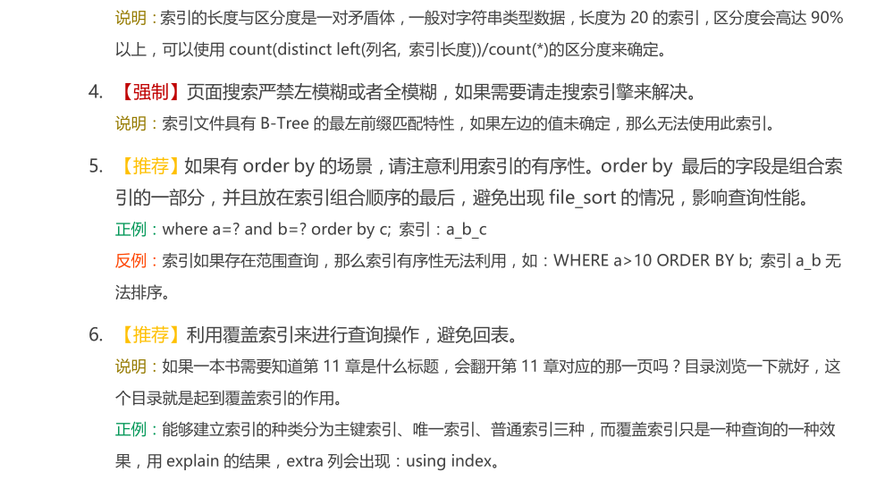

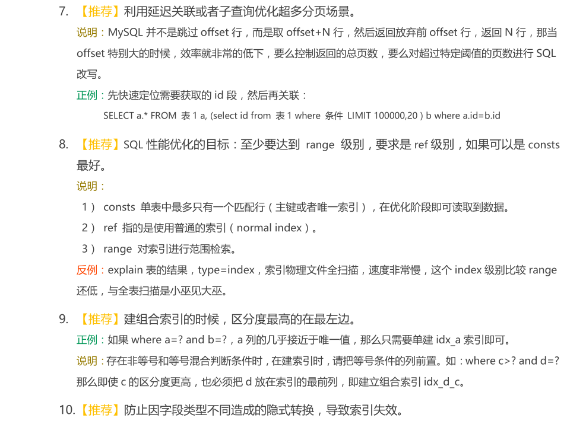


# 单表使用索引常见的索引失效情况

## 插入数据

### emp 和 dept 建表语句

```sql
DROP TABLE IF EXISTS `emp`;
CREATE TABLE `emp` (
  `id` int NOT NULL AUTO_INCREMENT,
  `empno` int NOT NULL,
  `name` varchar(20) DEFAULT NULL,
  `age` int DEFAULT NULL,
  `deptId` int DEFAULT NULL,
  PRIMARY KEY (`id`),
  KEY `idx_age_deptId_name` (`age`,`deptId`,`name`)
) ENGINE=InnoDB DEFAULT CHARSET=utf8;

DROP TABLE IF EXISTS `dept`;
CREATE TABLE `dept` (
  `id` int NOT NULL AUTO_INCREMENT,
  `deptName` varchar(30) DEFAULT NULL,
  `address` varchar(40) DEFAULT NULL,
  `ceo` int DEFAULT NULL,
  PRIMARY KEY (`id`)
) ENGINE=InnoDB DEFAULT CHARSET=utf8;
```

### 设置参数

```sql
SHOW VARIABLES LIKE 'log_bin_trust_function_creators';

SET GLOBAL log_bin_trust_function_creators = 1;
```

### 编写随机函数

**随机产生字符串**

```sql
DELIMITER $$
CREATE FUNCTION rand_string ( n INT ) RETURNS VARCHAR ( 255 ) BEGIN
	DECLARE
		chars_str VARCHAR ( 100 ) DEFAULT 'abcdefghijklmnopqrstuvwxyzABCDEFJHIJKLMNOPQRSTUVWXYZ';
	DECLARE
		return_str VARCHAR ( 255 ) DEFAULT '';
	DECLARE
		i INT DEFAULT 0;
	WHILE
			i < n DO
			
			SET return_str = CONCAT(
				return_str,
			SUBSTRING( chars_str, FLOOR( 1+RAND ()* 52 ), 1 ));
		
		SET i = i + 1;
		
	END WHILE;
	RETURN return_str;

END $$
```

**随机产生部门编号**

```sql
DELIMITER $$
CREATE FUNCTION rand_num ( from_num INT, to_num INT ) RETURNS INT ( 11 ) BEGIN
	DECLARE
		i INT DEFAULT 0;
	
	SET i = FLOOR(
		from_num + RAND()*(
			to_num - from_num + 1 
		));
	RETURN i;

END $$
```

### 创建存储过程

**创建往 emp 表中插入数据的存储过程**

```sql
DELIMITER $$
CREATE PROCEDURE insert_emp ( start INT, max_num INT ) BEGIN
	DECLARE
		i INT DEFAULT 0;
	
	SET autocommit = 0;
	REPEAT
			
			SET i = i + 1;
		INSERT INTO emp ( empno, name, age, deptId )
		VALUES
			((
					start + i 
					),
				rand_string ( 6 ),
				rand_num ( 30, 50 ),
			rand_num ( 1, 10000 ));
		UNTIL i = max_num 
	END REPEAT;
	COMMIT;

END $$
```

**创建往 dept 表中插入数据的存储过程**

```sql
DELIMITER $$
CREATE PROCEDURE `insert_dept` ( max_num INT ) BEGIN
	DECLARE
		i INT DEFAULT 0;
	
	SET autocommit = 0;
	REPEAT
			
			SET i = i + 1;
		INSERT INTO dept ( deptname, address, ceo )
		VALUES
			(
				rand_string ( 8 ),
				rand_string ( 10 ),
			rand_num ( 1, 500000 ));
		UNTIL i = max_num 
	END REPEAT;
	COMMIT;

END $$
```

### 调用存储过程

**添加数据到部门表**

```sql
DELIMITER;
CALL insert_dept ( 10000 );
```

**添加数据到员工表**

```sql
DELIMITER;
CALL insert_emp ( 100000, 500000 );
```

### 创建和删除索引

```sql
DROP INDEX idx_age_deptId_name ON emp;
CREATE INDEX idx_age_deptId_name ON emp ( age, deptId, name );
```

## 全值匹配

```sql
EXPLAIN SELECT SQL_NO_CACHE * FROM emp WHERE emp.age=30;
EXPLAIN SELECT SQL_NO_CACHE * FROM emp WHERE emp.age=30 and emp.deptId=4;
EXPLAIN SELECT SQL_NO_CACHE * FROM emp WHERE emp.age=30 and emp.deptId=4 and emp.name='abcd';
EXPLAIN SELECT SQL_NO_CACHE * FROM emp WHERE emp.age=30 and emp.name='abcd' and emp.deptId=4;
```

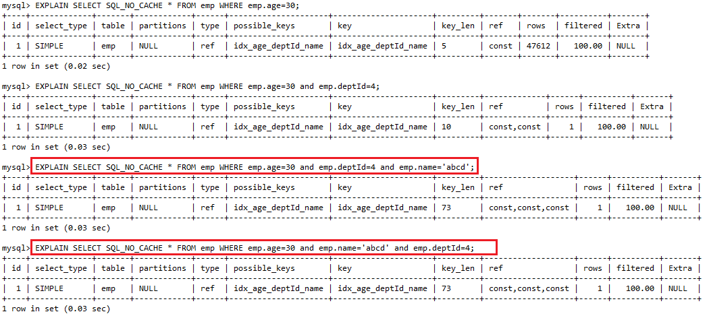

> 结论：全值匹配指的是和索引中的所有列进行匹配。
>
> SQL 中查询字段的顺序跟使用索引中字段的顺序没有关系，优化器会在不影响 SQL 执行结果的前提下给你自动地优化。

## 匹配最左前缀

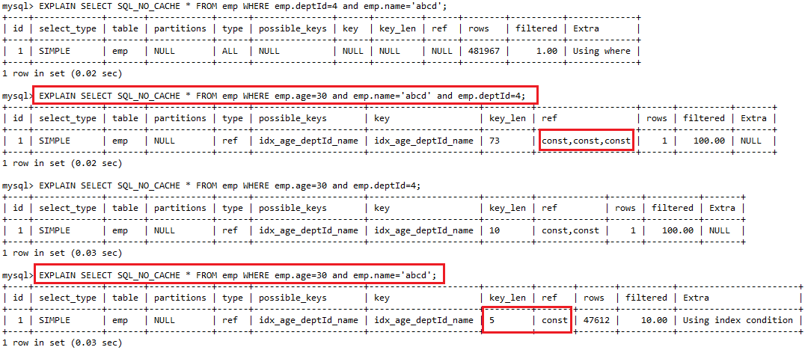

> 结论：查询字段与索引字段顺序的不同会导致索引无法充分使用甚至索引失效，过滤条件要使用索引必须按照索引建立时的顺序依次满足，一旦跳过某个字段，索引后面的字段都无法被使用。
> 
> 原因：使用复合索引，要遵守最左前缀匹配，指的是查询从索引的最左前列开始并且不跳过索引中的列。

## 独立的列

```sql
EXPLAIN SELECT SQL_NO_CACHE * FROM emp WHERE emp.age=30;
EXPLAIN SELECT SQL_NO_CACHE * FROM emp WHERE emp.age+1=31;
EXPLAIN SELECT SQL_NO_CACHE * FROM emp WHERE ABS(emp.age)=30;
EXPLAIN SELECT SQL_NO_CACHE * FROM emp WHERE emp.age=30 and emp.deptId=4 and emp.name='30000';
EXPLAIN SELECT SQL_NO_CACHE * FROM emp WHERE emp.age=30 and emp.deptId=4 and emp.name=30000;
```

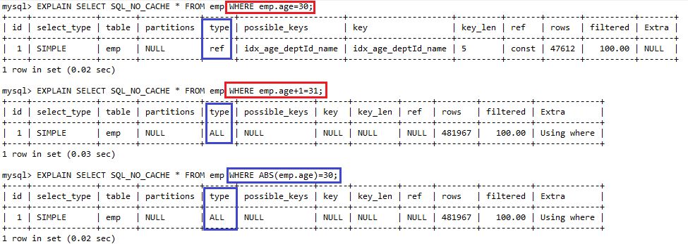

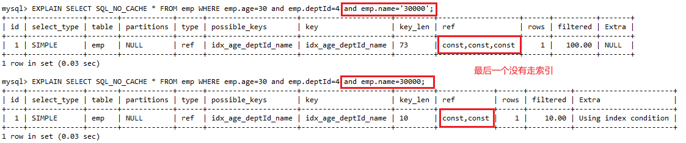

> 不在索引列上做任何操作（计算、函数、(自动 or 手动) 类型转换），会导致索引失效而转向全表扫描。
>
> 我们通常会看到一些查询不当地使用索引，或者使得 MySQL 无法使用已有的索引。如果查询中的列不是独立的，则 MySQL 就不会使用索引。"独立的列"是指索引列不能是表达式的一部分，也不能是函数的参数。

## 索引列上不能有范围查询(匹配范围值、精确匹配某一列并范围匹配另外一列)

```sql
EXPLAIN SELECT SQL_NO_CACHE * FROM emp WHERE emp.age=50 and emp.deptId=5 and emp.name='emZkcJ';
EXPLAIN SELECT SQL_NO_CACHE * FROM emp WHERE emp.age<50 and emp.deptId=5 and emp.name='qrOSYp';
EXPLAIN SELECT SQL_NO_CACHE * FROM emp WHERE emp.age<=50 and emp.deptId=5 and emp.name='qrOSYp';
EXPLAIN SELECT SQL_NO_CACHE * FROM emp WHERE emp.age=50 and emp.deptId<5 and emp.name='emZkcJ';
EXPLAIN SELECT SQL_NO_CACHE * FROM emp WHERE emp.age=50 and emp.deptId<=5 and emp.name='emZkcJ';
```

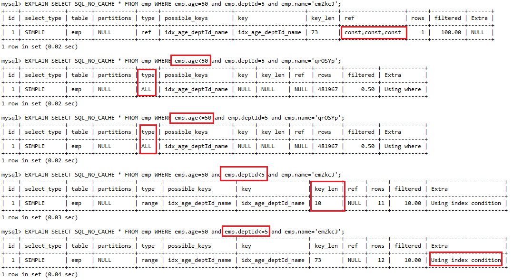

> 将可能做范围查询的字段的索引顺序放在最后

## 尽量使用覆盖索引(只访问索引的查询)

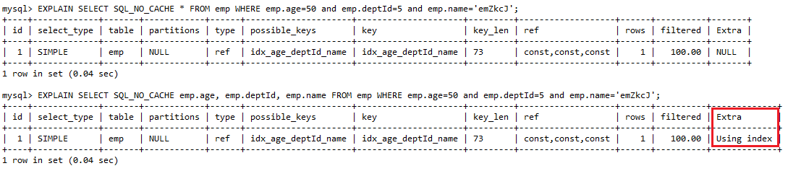

## 使用不等于(!= 或者<>)的时候

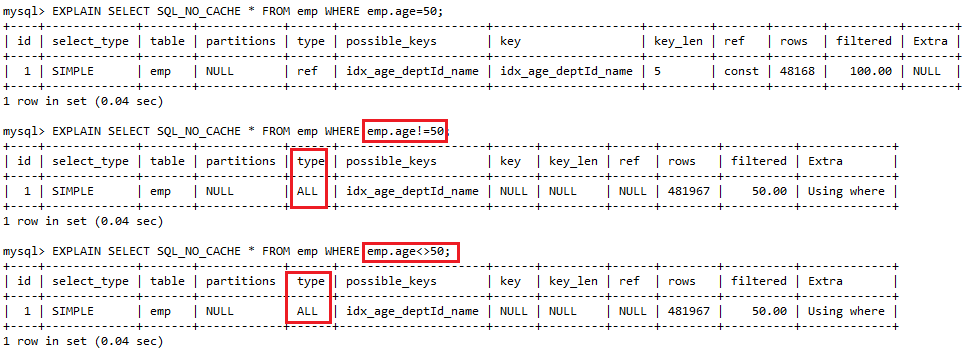

## 字段的 is not null 和 is null

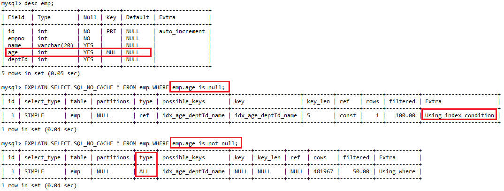
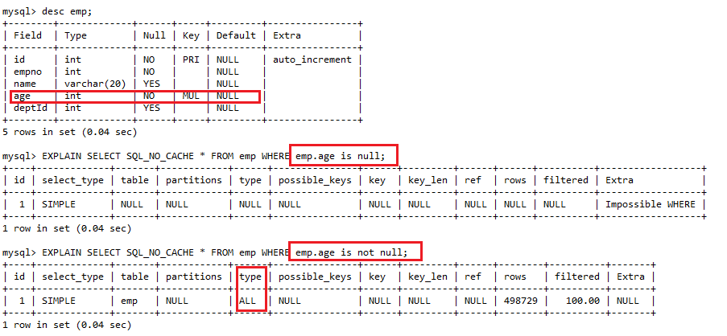

> 当字段允许为 NULL 的条件下：is not null 用不到索引，is null 可以用到索引。

## like 的前后模糊匹配(匹配列前缀)

创建单列索引

```sql
create index idx_name on emp(name);
```

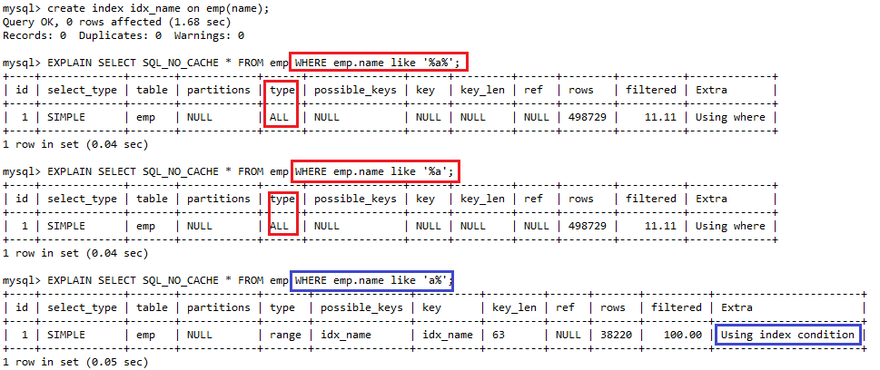

## 减少使用 or

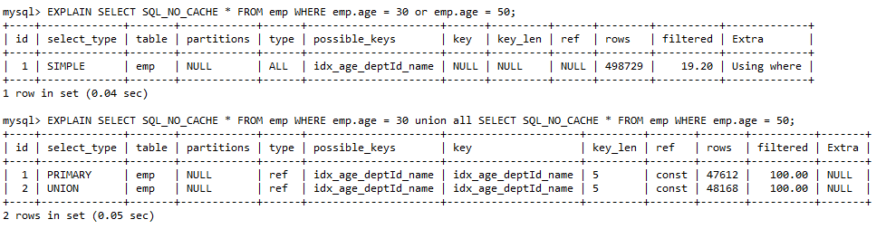

> 减少使用 or，使用 union all 或者 union 来替代。

## 练习题

假设索引为 index(a,b,c)，a b 字段都可以为 NULL。后面四个模糊查询修改 b 字段为 varchar 类型的。

```sql
EXPLAIN select * from test_idx where a = 3;
EXPLAIN select * from test_idx where a = 3 and b = 5;
EXPLAIN select * from test_idx where a = 3 and b = 5 and c = 4;
EXPLAIN select * from test_idx where b = 3;
EXPLAIN select * from test_idx where b = 3 and c = 4;
EXPLAIN select * from test_idx where c = 4;
EXPLAIN select * from test_idx where a = 3 and c = 5;
EXPLAIN select * from test_idx where a = 3 and b > 4 and c = 5;
EXPLAIN select * from test_idx where a = 3 and b >= 4 and c = 5;	
EXPLAIN select * from test_idx where a is null;
EXPLAIN select * from test_idx where a is not null;
EXPLAIN select * from test_idx where a is null and b is not null;
EXPLAIN select * from test_idx where a is null and b is null;
EXPLAIN select * from test_idx where a is not null and b is not null;
EXPLAIN select * from test_idx where a is not null and b is null;
EXPLAIN select * from test_idx where a <> 3;
EXPLAIN select * from test_idx where a != 3;
EXPLAIN select * from test_idx where abs(a) = 3;
EXPLAIN select * from test_idx where a = 3 and b like 'kk%' and c = 4;
EXPLAIN select * from test_idx where a = 3 and b like '%kk' and c = 4;
EXPLAIN select * from test_idx where a = 3 and b like '%kk%' and c = 4;
EXPLAIN select * from test_idx where a = 3 and b like 'k%kk%' and c = 4;
```

| where 语句                                                   | 索引是否被使用       |
| ------------------------------------------------------------ | -------------------- |
| EXPLAIN select * from test_idx where a = 3;                  | 可以，a 使用索引     |
| EXPLAIN select * from test_idx where a = 3 and b = 5;        | 可以，a b 使用索引   |
| EXPLAIN select * from test_idx where a = 3 and b = 5 and c = 4; | 可以，a b c 使用索引 |
| EXPLAIN select * from test_idx where b = 3;                  | 不可以               |
| EXPLAIN select * from test_idx where b = 3 and c = 4;        | 不可以               |
| EXPLAIN select * from test_idx where c = 4;                  | 不可以               |
| EXPLAIN select * from test_idx where a = 3 and c = 5;        | 可以，a 使用索引     |
| EXPLAIN select * from test_idx where a = 3 and b > 4 and c = 5; | 可以，a b 使用索引   |
| EXPLAIN select * from test_idx where a = 3 and b >= 4 and c = 5; | 可以，a b c 使用索引 |
| EXPLAIN select * from test_idx where a is null;              | 可以，a 使用索引     |
| EXPLAIN select * from test_idx where a is not null;          | 不可以               |
| EXPLAIN select * from test_idx where a is null and b is not null; | 可以，a b 使用索引   |
| EXPLAIN select * from test_idx where a is null and b is null; | 可以，a b 使用索引   |
| EXPLAIN select * from test_idx where a is not null and b is not null; | 不可以               |
| EXPLAIN select * from test_idx where a is not null and b is null; | 不可以               |
| EXPLAIN select * from test_idx where a <> 3;                 | 不可以               |
| EXPLAIN select * from test_idx where a != 3;                 | 不可以               |
| EXPLAIN select * from test_idx where abs(a) = 3;             | 不可以               |
| EXPLAIN select * from test_idx where a = 3 and b like 'kk%' and c = 4; | 可以，a b c 使用索引 |
| EXPLAIN select * from test_idx where a = 3 and b like '%kk' and c = 4; | 可以，a 使用索引     |
| EXPLAIN select * from test_idx where a = 3 and b like '%kk%' and c = 4; | 可以，a 使用索引     |
| EXPLAIN select * from test_idx where a = 3 and b like 'k%kk%' and c = 4; | 可以，a b c 使用索引 |

# 推荐阅读

- [MySQL索引原理及慢查询优化](https://tech.meituan.com/2014/06/30/mysql-index.html)
- [Innodb中的事务隔离级别和锁的关系](https://tech.meituan.com/2014/08/20/innodb-lock.html)
- [https://dev.mysql.com/doc/refman/8.0/en/optimization-indexes.html](https://dev.mysql.com/doc/refman/8.0/en/optimization-indexes.html)

