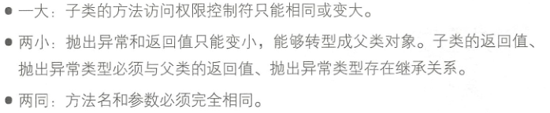
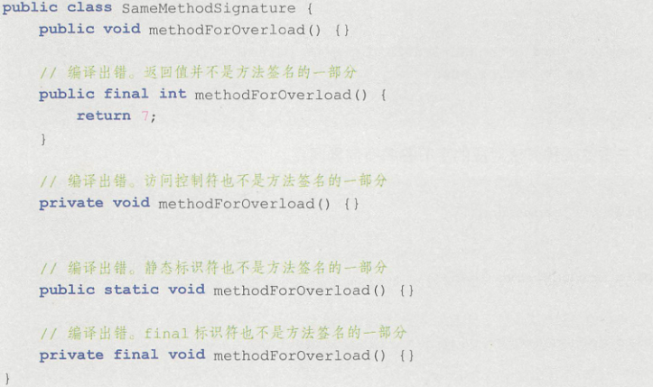
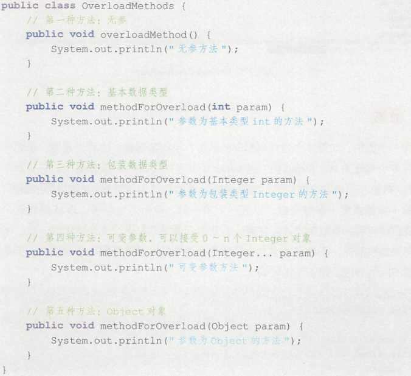

* Kramdown table of contents
{:toc .toc}
## 问题思考

- 请简述方法重写和方法重载的区别。
- private、final、static 修饰的方法可以重写吗?
- 什么叫方法的重载？构造方法可以重载吗？构造方法可以重写吗？

## 方法重写

向上转型时，通过父类引用执行子类方法时需要注意以下两点：

> （1）无法调用到子类中存在而父类本身不存在的方法。
> （2）可以调用到子类中覆写了父类的方法，这是一种多态实现。

想成功地覆写父类方法，需要满足以下 4 个条件：

> （1）访问权限不能变小。访问控制权限变小意味着在调用时父类的可见方法无法被子类多态执行，比如父类中方法是用 public 修饰的，子类覆写时变成 private。
> （2）返回类型能够向上转型成为父类的返回类型。
> （3）异常也要能向上转型成为父类的异常。
> （4）方法名、参数类型及个数必须严格一致。

方法重写的注意事项：

- 声明为 final 的方法不能被重写。可以被继承和重载。
- 声明为 static 的方法不能被重写，只能被 static 方法隐藏，实例方法和 static 方法不能相互隐藏覆盖。可以被继承和重载。
- 如果在实例方法的声明中加上 final，则表示该方法不会被子类的方法重写。如果在静态方法的声明中加上 final，则表示该方法不会被子类的方法隐藏。如果试图重写或隐藏 final 方法，编译时会提示错误。
- 如果不能继承一个方法，则不能重写这个方法。Java 中的私有方法、构造方法不能被重写。
- 声明为 private 的方法不能被重写。可以被重载。
- 构造方法不能被继承，不能被重写。可以被重载。
- final、static、private、构造方法无法被重写，final 修饰的方法可以被继承。
- 实例方法不能覆盖静态方法，静态方法也不能隐藏实例方法。
- 如果不能继承一个方法，则不能重写这个方法。

重写的规则：（两同一大两小）

- 重写方法的方法名和参数列表必须与被重写方法的完全相同，否则不能称其为重写而是重载。两同
- 重写方法的访问修饰符一定要不小于被重写方法的访问修饰符（public>protected>default>private）。一大
- 重写的方法的返回值类型必须和被重写方法的返回值类型一致或者是其子类。两小
- 重写的方法所抛出的异常必须和被重写的方法所抛出的异常一致或者是其子类。两小
- 被重写的方法不能为 private，否则在其子类中只是新定义了一个方法，并没有对其进行重写。
- 静态方法不能被重写为非静态的方法（会编译出错）。



```java
class A {
    static void fun() {
        System.out.println("A.fun()");
    }
}

class B extends A {
    static void fun() {
        System.out.println("B.fun()");
    }
}

public class Main {
    public static void main(String args[]) {
        A a = new B();
        a.fun();

        B b = new B();
        b.fun();
    }
}
```

> A.fun()
>
> B.fun()

```java
class Derived {
    protected static void getDetails() {
        System.out.println("Derived class");
    }
}

public class Test extends Derived {
    protected static void getDetails() {
        System.out.println("Test class");
    }

    public static void main(String[] args) {
        Derived obj = new Test();
        obj.getDetails();
    }
}
```
> Derived class

```java
class Derived {
    protected void getDetails() {
        System.out.println("Derived class");
    }
}

public class Test extends Derived {
    protected void getDetails() {
        System.out.println("Test class");
    }

    public static void main(String[] args) {
        Derived obj = new Test();
        obj.getDetails();
    }
}
```

> Test class

```java
class Base {
    public static void display() {
        System.out.println("Static or class method from Base");
    }

    public void print() {
        System.out.println("Non-static or Instance method from Base");
    }
}

class Derived extends Base {
    public static void display() {
        System.out.println("Static or class method from Derived");
    }

    public void print() {
        System.out.println("Non-static or Instance method from Derived");
    }
}

public class Test {
    public static void main(String args[]) {
        Base derived = new Derived();
        derived.display();
        derived.print();
    }
}
```

> Static or class method from Base
>
> Non-static or Instance method from Derived

```java
class Base {
    public void fun() {
        System.out.println("Base fun");
    }
}

class Derived extends Base {
    public void fun() { // overrides the Base's fun()
        System.out.println("Derived fun");
    }

    public static void main(String[] args) {
        Base obj = new Derived();
        obj.fun();
    }
}
```

> Derived fun

```java
class Base {
    private void fun() {
        System.out.println("Base fun");
    }
}

class Derived extends Base {
    private void fun() {
        System.out.println("Derived fun");
    }
    public static void main(String[] args) {
        Base obj = new Derived();
        obj.fun();
    }
}
```

> 编译错误。'fun()' 在 'base.Base' 中具有 private 访问权限

```java
class Base {
    private void fun() {
        System.out.println("Base fun");
    }
}

class Derived extends Base {
    private void fun() {
        System.out.println("Derived fun");
    }
    public static void main(String[] args) {
        Base obj = new Derived();
        ((Derived) obj).fun();
    }
}
```
> Derived fun

```java
class Outer {
    private String msg = "GeeksforGeeks";

    private void fun() {
        System.out.println("Outer fun()");
    }

    class Inner extends Outer {
        private void fun() {
            System.out.println("Accessing Private Member of Outer: " + msg);
        }
    }

    public static void main(String args[]) {
        Outer o = new Outer();
        Inner i = o.new Inner();
        i.fun();
        o = i;
        o.fun();
    }
}
```

> **运行结果:**
>
> Accessing Private Member of Outer: GeeksforGeeks
>
> Outer fun()
>
> **说明：**一个内部类可以访问其外部类的私有成员。私有方法是在编译时绑定的，并且引用变量的类型(而不是它所引用的对象的类型)决定了要调用的方法。

## 方法重载

方法重载是指在一个类中，多个方法的方法名相同，但是参数列表不同。参数列表不同指的是参数个数、参数类型或者参数的顺序不同。

> 在同一个类中，如果多个方法有相同的名字、不同的参数，即称为重载，比如一个类中有多个构造方法。在编译器的眼里，方法名称+参数类型+参数个数，组成一个唯一键，称为方法签名，JVM 通过这个唯一键决定调用哪种重载的方法。注意，方法返回值并非是这个组合体中的一员，所以在使用重载机制时，不能有两个方法名称完全相同，参数类型和个数也相同，但是返回类型不同的方法。

方法重载的规则：

- 方法名必须相同，参数列表必须不同。参数列表不同包括参数个数、参数类型、参数顺序不同。
- 方法的返回值类型、访问权限、抛出的异常可以相同也可以不相同。
- 方法重载可以声明新的或更广的检查异常。
- 方法重载能够在同一个类中或者在一个子类中被重载。
- 无法以返回值类型、访问权限、抛出的异常作为方法重载的区分标准。
- main 方法也可以被重载。构造方法也可以重载。



如果调用 `methodForOverload(7)` 的话，猜猜，到底调用的是谁呢？



JVM 在重载方法中，选择合适的目标方法的顺序如下：

> （1）精确匹配。
> （2）如果是基本数据类型，自动转换成更大表示范围的基本类型。
> （3）通过自动拆箱与装箱。
> （4）通过子类向上转型继承路线依次匹配。
> （5）通过可变参数匹配。

```java
public class GFG {
    private GFG(Object o) {
        System.out.println("Object");
    }

    private GFG(double[] d) {
        System.out.println("double array");
    }

    public static void main(String[] args) {
        new GFG(null);
    }
}
```

<a class="button show-hidden">点击查看结果</a>

<div class="hidden">
<blockquote><p><b>参考答案</b>
double array
</p></blockquote>
</div>

下列关于方法重载的说法中，正确的是（  ）

> A. 方法名相同，参数的个数不同可以形成方法重载。
>
> B. 方法名相同，参数的类型不同可以形成方法重载。
>
> C. 方法名相同，参数的类型排列顺序不同可以形成方法重载。
>
> D. 方法名相同，返回值类型不同可以形成方法重载。
>

<a class="button show-hidden">点击查看结果</a>

<div class="hidden">
<blockquote><p><b>参考答案</b>
ABC
</p></blockquote>
</div>

关于方法重载的的描述，以下选项中哪些是正确的（  ）

> A. 方法名必须一致
>
> B. 返回值类型必须一致
>
> C. 参数个数必须一致
>
> D. 参数的个数或类型不一致
>

<a class="button show-hidden">点击查看结果</a>

<div class="hidden">
<blockquote><p><b>参考答案</b>
AD
</p></blockquote>
</div>

在 Java 中，以下关于方法重载和方法重写描述正确的是（  ）

> A. 方法重载和方法的重写实现的功能相同
>
> B. 方法重载出现在父子关系中，方法重写是在同一类中
>
> C. 方法重载的返回值类型必须一致，参数项必须不同
>
> D. 方法重写的返回值类型必须相同或相容
>

<a class="button show-hidden">点击查看结果</a>

<div class="hidden">
<blockquote><p><b>参考答案</b>
D
</p></blockquote>
</div>

Java 里关于方法的重写和重载，下面说法正确的是（  ）

> A. 方法重写是指父类与子类之间多态性的一种表现
>
> B. 方法重载是指同一个类中多态性的一种表现
>
> C. 子类中定义的某方法与其父类中的某方法有相同的签名 (名称、参数、返回值)，称之为方法重写
>
> D. 一个类中定义了多个同名的方法，但方法签名 (名称、参数、返回值) 不相同，称之为方法重载
>

<a class="button show-hidden">点击查看结果</a>

<div class="hidden">
<blockquote><p><b>参考答案</b>
ABCD
</p></blockquote>
</div>

在 Java 中区分方法重载的依据是（  ）

> A. 不同的形参名称
>
> B. 不同的返回值类型
>
> C. 不同的形参列表
>
> D. 不同的访问权限
>

<a class="button show-hidden">点击查看结果</a>

<div class="hidden">
<blockquote><p><b>参考答案</b>
C
</p></blockquote>
</div>

以下哪些项可以让两个同名的方法实现合法的重载（  ）

> A. 形式参数个数不同
>
> B. 返回值类型不同
>
> C. 形式参数类型不同
>
> D. 形式参数名称不同
>

<a class="button show-hidden">点击查看结果</a>

<div class="hidden">
<blockquote><p><b>参考答案</b>
AC
</p></blockquote>
</div>

下列选项中，可以和 `int max(int a, int b, double c)` 方法构成重载关系的是（  ）

> A. `double max(int a, int b)`
>
> B. `void max(int a, double b, int c)`
>
> C. `double max(double a, double b)`
>
> D. `int max(int x, int y, double z)`
>

<a class="button show-hidden">点击查看结果</a>

<div class="hidden">
<blockquote><p><b>参考答案</b>
ABC
</p></blockquote>
</div>

下面哪个方法是 `public void  example(){...}` 的重载方法（  ）

> A. `public void Example(int m) {...}`
>
> B. `public int example() {...}`
>
> C. `public void example2() {...}`
>
> D. `public int example(int m, float f) {...}`
>

<a class="button show-hidden">点击查看结果</a>

<div class="hidden">
<blockquote><p><b>参考答案</b>
D
</p></blockquote>
</div>
## 推荐阅读

- [https://docs.oracle.com/javase/tutorial/java/IandI/override.html](https://docs.oracle.com/javase/tutorial/java/IandI/override.html)
- [Output of Java program - Set 18 (Overriding)](https://www.geeksforgeeks.org/output-java-program-set-18-overriding/)
- [Output of Java program - Set 22 (Overloading)](https://www.geeksforgeeks.org/output-java-program-set-22-overloading/)
- [https://www.geeksforgeeks.org/g-fact-63/](https://www.geeksforgeeks.org/g-fact-63/)