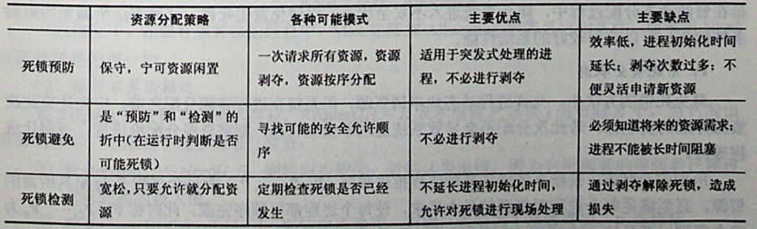
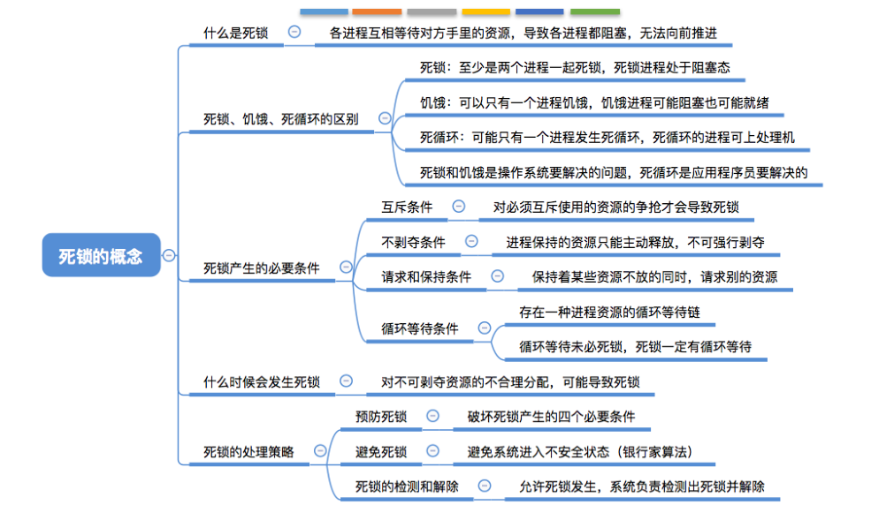
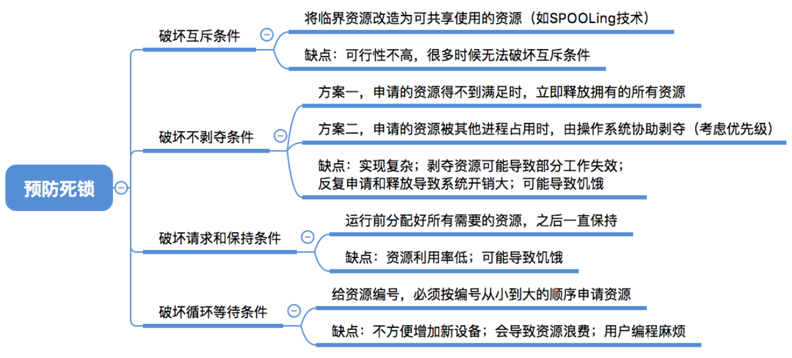
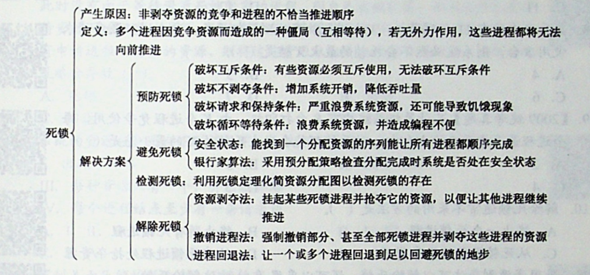

* Kramdown table of contents
{:toc .toc}
## 死锁

锁是个非常有用的工具，运用场景非常多，因为它使用起来非常简单，而且易于理解。但同时它也会带来一些困扰，那就是可能会引起死锁，一旦产生死锁，就会造成系统功能不可用。让我们先来看一段代码，这段代码会引起死锁，使线程 t1 和线程 t2 互相等待对方释放锁。

```java
public class DeadLockDemo {
    private static final String A = "A";
    private static final String B = "B";

    public static void main(String[] args) {
        new DeadLockDemo().deadLock();
    }

    private void deadLock() {
        Thread t1 = new Thread(() -> {
            synchronized (A) {
                try {
                    Thread.sleep(2000);
                } catch (InterruptedException e) {
                    e.printStackTrace();
                }
                synchronized (B) {
                    System.out.println("1");
                }
            }
        }, "t1");

        Thread t2 = new Thread(() -> {
            synchronized (B) {
                synchronized (A) {
                    System.out.println("2");
                }
            }
        }, "t2");

        t1.start();
        t2.start();
    }
}
```

## 什么是死锁

死锁是指两个或两个以上的进程在执行过程中，由于竞争资源或者由于彼此通信而造成的一种阻塞的现象，若无外力作用，它们都将无法推进下去。此时称系统处于死锁状态或系统产生了死锁，这些永远在互相等待的进程称为死锁进程。

## 产生死锁的原因

（1）系统资源的竞争。

（2）进程推进顺序非法。

## 死锁产生的四个必要条件

（1）互斥条件：进程要求对所分配的资源进行排它性控制，即在一段时间内某资源仅为一进程所占用。

（2）请求与保持条件：当进程因请求资源而阻塞时，对已获得的资源保持不放。

（3）不剥夺条件：进程已获得的资源在未使用完之前，不能剥夺，只能在使用完时由自己释放。

（4）循环等待条件：在发生死锁时，必然存在一个进程——资源的环形链。

## 死锁的处理策略





### 死锁预防



防止死锁的发生只需破坏死锁产生的 4 个必要条件之一即可。

（1）破坏互斥条件

（2）破坏不剥夺条件

（3）破坏请求并保持条件

（4）破坏循环等待条件

### 避免死锁

（1）系统安全状态

（2）银行家算法

### 死锁的检测及解除

（1）资源剥夺法

（2）撤销进程法(终止进程法)

（3）进程回退法



## 参考资料

- [https://developer.ibm.com/zh/articles/j-lo-deadlock/](https://developer.ibm.com/zh/articles/j-lo-deadlock/)
- [https://www.cnblogs.com/wkfvawl/p/11598647.html](https://www.cnblogs.com/wkfvawl/p/11598647.html)