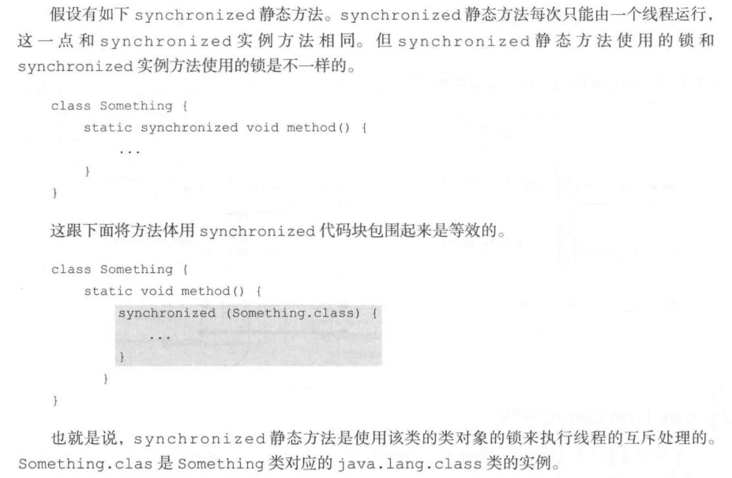
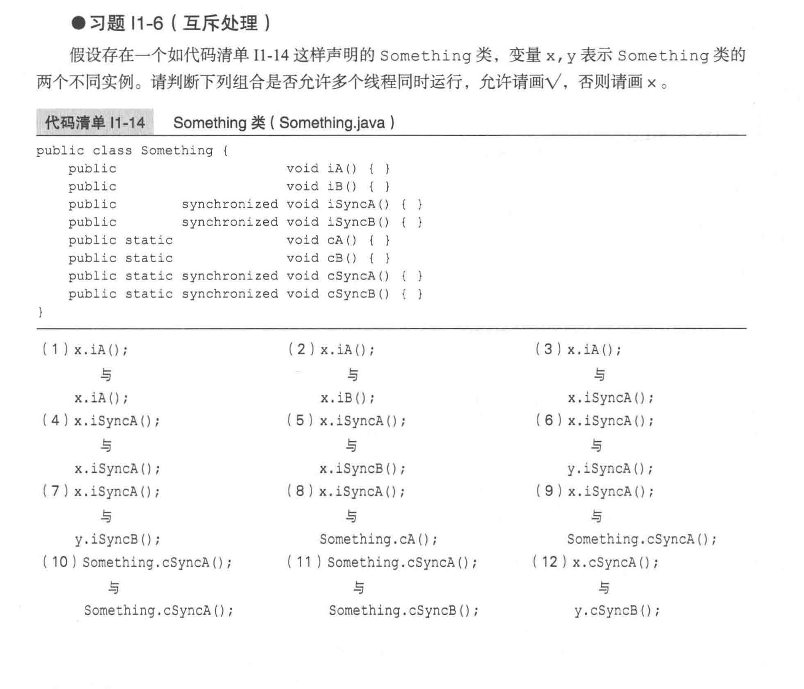

* Kramdown table of contents
{:toc .toc}
## synchronized 关键字概述

Java 平台中的任何一个对象都有唯一一个与之关联的锁。这种锁被称为监视器或者内部锁。内部锁是一种排他锁，它能够保障**原子性、可见性和有序性**。

内部锁是通过 synchronized 关键字实现的。synchronized 关键字可以用来**修饰方法以及代码块**。

synchronized 关键字修饰的方法就被称为同步方法。synchronized 修饰的静态方法就被称为**静态同步方法**，synchronized 修饰的实例方法就被称为**实例同步方法**。同步方法的整个方法体就是一个临界区。

synchronized 关键字修饰的代码块被称为同步块，其语法如下所示：

```java
synchronized(锁句柄){
    
}
```

**注意:** 作为锁句柄的变量通常采用 private final 修饰，如：private final Object lock = new Object();

### synchronized 实例方法和 synchronized 代码块

假设有如下synchronized 实例方法。

```java
synchronized void method() {
        
}
```

这跟下面将方法体用 synchronized 代码块包围起来是等效的。

```java
void method() {
    synchronized (this) {

    }
}
```

也就是说，synchronized 实例方法是使用 this 的锁来执行线程的互斥处理的。

### synchronized 静态方法和 synchronized 代码块




## synchronized 线程八锁



<a class="button show-hidden">点击查看结果</a>

<div class="hidden">
<blockquote><p><b>参考答案</b>
(1) √ (2) √ (3) √
(4) ✘ (5) ✘ (6) √
(7) √ (8) √ (9) √
(10) ✘ (11) ✘ (12) ✘
</p></blockquote>
</div>

### 两个普通同步方法，两个 Number 对象？不同步。

```java
public class Test {
    public static void main(String[] args) {
        Number number1 = new Number();
        Number number2 = new Number();
        new Thread(() -> {
            number1.getOne();
        }).start();

        new Thread(() -> {
            number2.getTwo();
        }).start();
    }
}

class Number {
    public synchronized void getOne() {
        System.out.println("one");
        try {
            Thread.sleep(3000);
        } catch (InterruptedException e) {
        }
    }

    public synchronized void getTwo() {
        System.out.println("two");
    }
}
```

### 两个静态同步方法，两个 Number 对象？同步。

```java
public class Test {
    public static void main(String[] args) {
        Number number1 = new Number();
        Number number2 = new Number();

        new Thread(() -> {
            number1.getOne();
        }).start();

        new Thread(() -> {
            number2.getTwo();
        }).start();
    }
}

class Number {
    public static synchronized void getOne() {
        System.out.println("one");
        try {
            Thread.sleep(3000);
        } catch (InterruptedException e) {
        }
    }

    public static synchronized void getTwo() {
        System.out.println("two");
    }
}
```

### 一个静态同步方法，一个非静态同步方法，两个 Number 对象？不同步。

```java
public class Test {
    public static void main(String[] args) {
        Number number1 = new Number();
        Number number2 = new Number();

        new Thread(() -> {
            number1.getOne();
        }).start();

        new Thread(() -> {
            number2.getTwo();
        }).start();
    }
}

class Number {
    public static synchronized void getOne() {
        System.out.println("one");
        try {
            Thread.sleep(3000);
        } catch (InterruptedException e) {
        }
    }

    public synchronized void getTwo() {
        System.out.println("two");
    }
}
```

### 两个静态同步方法，一个 Number 对象？同步。

```java
public class Test {
    public static void main(String[] args) {
        Number number = new Number();

        new Thread(() -> {
            number.getOne();
        }).start();

        new Thread(() -> {
            number.getTwo();
        }).start();
    }
}

class Number {
    public static synchronized void getOne() {
        System.out.println("one");
        try {
            Thread.sleep(3000);
        } catch (InterruptedException e) {
        }
    }

    public static synchronized void getTwo() {
        System.out.println("two");
    }
}
```

### 两个普通同步方法，一个 Number 对象？同步。

```java
public class Test {
    public static void main(String[] args) {
        Number number = new Number();
        new Thread(() -> {
            number.getOne();
        }).start();

        new Thread(() -> {
            number.getTwo();
        }).start();
    }
}

class Number {
    public synchronized void getOne() {
        System.out.println("one");
        try {
            Thread.sleep(3000);
        } catch (InterruptedException e) {
        }
    }

    public synchronized void getTwo() {
        System.out.println("two");
    }
}
```

### 一个静态同步方法，一个非静态同步方法，一个 Number 对象？不同步。

```java
public class Test {
    public static void main(String[] args) {
        Number number = new Number();
        new Thread(() -> {
            number.getOne();
        }).start();

        new Thread(() -> {
            number.getTwo();
        }).start();
    }
}

class Number {
    public static synchronized void getOne() {
        System.out.println("one");
        try {
            Thread.sleep(3000);
        } catch (InterruptedException e) {
        }
    }

    public synchronized void getTwo() {
        System.out.println("two");
    }
}
```

### 一个(静态or非静态)同步方法，一个(静态or非静态)非同步方法，一个 Number 对象？不同步。

```java
public class Test {
    public static void main(String[] args) {
        Number number = new Number();
        new Thread(() -> {
            number.getOne();
        }).start();

        new Thread(() -> {
            number.getTwo();
        }).start();
    }
}

class Number {
    public synchronized void getOne() {
        System.out.println("one");
        try {
            Thread.sleep(3000);
        } catch (InterruptedException e) {
        }
    }

    public void getTwo() {
        System.out.println("two");
    }
}
```

### 一个(静态or非静态)同步方法，一个(静态or非静态)非同步方法，两个 Number 对象？不同步。

```java
public class Test {
    public static void main(String[] args) {
        Number number1 = new Number();
        Number number2 = new Number();
        new Thread(() -> {
            number1.getOne();
        }).start();

        new Thread(() -> {
            number2.getTwo();
        }).start();
    }
}

class Number {
    public synchronized void getOne() {
        System.out.println("one");
        try {
            Thread.sleep(3000);
        } catch (InterruptedException e) {
        }
    }

    public void getTwo() {
        System.out.println("two");
    }
}
```

## synchronized 关键字的特点

- [ ] 可重入性，当一个线程再次请求自己持有对象锁的临界资源时，这种情况属于重入锁，请求将会成功。

> 从互斥锁的设计上来说，当一个线程试图操作一个由其他线程持有的对象锁的临界资源时，将会处于阻塞状态，但当一个线程再次请求自己持有对象锁的临界资源时，这种情况属于重入锁，请求将会成功，在 Java 中 synchronized 是基于原子性的内部锁机制，是可重入的，因此在一个线程调用 synchronized 方法的同时在其方法体内部调用该对象另一个 synchronized 方法，也就是说一个线程得到一个对象锁后再次请求该对象锁，是允许的，这就是 synchronized 的可重入性。

- [ ] 自动释放锁，当代码段执行结束或出现异常后会自动释放对监视器的锁定。
- [ ] 非公平锁，在等待获取锁的过程中不可被中断。
- [ ] 互斥性，被 synchronized 修饰的方法同时只能由一个线程执行。

## synchronized 的使用

> 普通方法和代码块中使用 this 是同一个监视器(锁)，即某个具体调用该代码的对象。
>
> 静态方法和代码块中使用该类的 class 对象是同一个监视器，任何该类的对象调用该段代码时都是在争夺同一个监视器的锁定。
>
> **注意：**作为锁句柄的变量通常采用 private final 修饰，如：private final Object lock = new Object();

```java
public class SynchronizedTest implements Runnable {
    private static int i = 0;

    public static synchronized void increase() {
        i++;
    }

    @Override
    public void run() {
        for (int j = 0; j < 10000000; j++) {
            increase();
        }
    }

    public static void main(String[] args) throws InterruptedException {
        Thread t1 = new Thread(new SynchronizedTest());
        Thread t2 = new Thread(new SynchronizedTest());
        t1.start();
        t2.start();
        t1.join();
        t2.join();
        System.out.println(i);
    }
}
```

```java
public class SynchronizedTest {
    public synchronized void method1() {
        System.out.println("Method 1 start");
        try {
            System.out.println("Method 1 execute");
            Thread.sleep(3000);
        } catch (InterruptedException e) {
            e.printStackTrace();
        }
        System.out.println("Method 1 end");
    }

    public synchronized void method2() {
        System.out.println("Method 2 start");
        try {
            System.out.println("Method 2 execute");
            Thread.sleep(1000);
        } catch (InterruptedException e) {
            e.printStackTrace();
        }
        System.out.println("Method 2 end");
    }

    public static void main(String[] args) {
        SynchronizedTest test = new SynchronizedTest();
        new Thread(test::method1).start();
        new Thread(test::method2).start();
    }
}
```

```java
public class SynchronizedTest {
    public synchronized void method1() {
        System.out.println("Method 1 start");
        try {
            System.out.println("Method 1 execute");
            Thread.sleep(3000);
        } catch (InterruptedException e) {
            e.printStackTrace();
        }
        System.out.println("Method 1 end");
    }

    public void method2() {
        System.out.println("Method 2 start");
        try {
            System.out.println("Method 2 execute");
            Thread.sleep(1000);
        } catch (InterruptedException e) {
            e.printStackTrace();
        }
        System.out.println("Method 2 end");
    }

    public static void main(String[] args) {
        SynchronizedTest test = new SynchronizedTest();
        new Thread(test::method1).start();
        new Thread(test::method2).start();
    }
}
```

```java
public class SynchronizedTest {
    public synchronized void method1() {
        System.out.println("Method 1 start");
        try {
            System.out.println("Method 1 execute");
            Thread.sleep(3000);
        } catch (InterruptedException e) {
            e.printStackTrace();
        }
        System.out.println("Method 1 end");
    }

    public void method2() {
        System.out.println("Method 2 start");
        try {
            System.out.println("Method 2 execute");
            Thread.sleep(1000);
        } catch (InterruptedException e) {
            e.printStackTrace();
        }
        System.out.println("Method 2 end");
    }

    public static void main(String[] args) {
        SynchronizedTest test1 = new SynchronizedTest();
        SynchronizedTest test2 = new SynchronizedTest();

        new Thread(test1::method1).start();
        new Thread(test2::method2).start();
    }
}
```

```java
public class SynchronizedTest implements Runnable {
    private static final SynchronizedTest instance = new SynchronizedTest();
    private static int i = 0;

    @Override
    public void run() {
        synchronized (instance) {
            for (int j = 0; j < 10000000; j++) {
                i++;
            }
        }
    }

    public static void main(String[] args) throws InterruptedException {
        Thread t1 = new Thread(instance);
        Thread t2 = new Thread(instance);
        t1.start();
        t2.start();
        t1.join();
        t2.join();
        System.out.println(i);
    }
}
```

```java
//this当前实例对象锁
synchronized (this) {
    for (int j = 0; j < 1000000; j++) {
        i++;
    }
}

//class对象锁
synchronized (AccountingSync.class) {
    for (int j = 0; j < 1000000; j++) {
        i++;
    }
}
```

## synchronized 关键字常见面试题

- [ ] Java 中有哪些锁？synchronized 与 Lock 有哪些区别？什么是公平锁和非公平锁？他们的底层怎么实现的？
- [ ] 谈谈 synchronized 关键字的理解？
- [ ] synchronized 修饰同一个类的两个静态方法同步吗，为什么。
- [ ] synchronized 分别修饰在实例方法上和静态方法上，多线程并发时是否会竞争锁？synchronized 修饰在方法上和代码块上有什么区别，底层是怎么实现的？Lock 接口的实现类 ReentrantLock 和 synchronized 有什么区别？ReentrantReadWriteLock 呢？
- [ ] synchronized 什么情况下会释放锁?
- [ ] 如果一个对象有多个方法加了 synchronized，那么该对象有几把锁。【一把锁】

> **对象锁：**
> synchronized 同步代码块(非静态变量、非类对象)
> synchronized 同步方法(修饰非静态方法)
>
> **类锁：**
>
> synchronized 同步代码块(静态变量、类对象)
> synchronized 同步方法(修饰静态方法)

- [ ] synchronized 和 Lock 的区别。
- [ ] synchronized 和 ReentrantLock 的异同？
- [ ] synchronized 和 ReentrantLock 的实现原理以及区别？
- [ ] synchronized 和 ReentrantLock 的底层实现。
- [ ] synchronized 的实现原理。
- [ ] synchronized 和 java.util.concurrent.locks.Lock 的比较。
- [ ] 有看过 synchronized 的源码吗？
- [ ] 谈谈 synchronized 关键字的理解？
- [ ] synchronized 底层相关，跟 ReentrantLock 的区别？
- [ ] 说下 synchronized 的用法，说下对其的优化？
- [ ] JDK 对 synchronized 的优化。
- [ ] synchronized 的实现，锁的升级过程。
- [ ] synchronized 的锁升级过程讲一下。
- [ ] synchronized 能否锁静态方法，锁的升降级。
- [ ] synchronized 关键字的作用、原理、锁升级、锁粗化、锁消除。
- [ ] synchronized 了解偏向锁、轻量级锁、重量级锁的概念以及升级机制和 ReentrantLock 的区别。
- [ ] Java 中的锁有哪几种？synchronized 的特性和底层实现？ReentrantLock 了解么？AQS 锁了解么？
- [ ] Java 中有哪些锁？synchronized 与 Lock 有哪些区别？什么是公平锁和非公平锁？他们的底层怎么实现的？
- [ ] synchronized 用过么，具体用法，同步作用域。
- [ ] 为什么要用 synchronized？原理？效率？
- [ ] synchronized 是可重入锁么。
- [ ] synchronized 为什么说他比较重。
- [ ] synchronized 的用法？
- [ ] volatile、synchronized 的用法，比如 synchronized 在静态方法和普通方法上面时，能否同时进入？
- [ ] volatile、synchronized、Lock 的区别？
- [ ] volatile 和 synchronized 的区别是什么?
- [ ] 说说你用到 volatile 和 synchronized 的一些场景。（说了个双重校验单例模式 DCL）
- [ ] synchronized 底层实现原理以及和 volatile 的区别？
- [ ] synchronized 和 volatile 的区别是什么？他们能保证原子性吗？能保证可见性吗？
- [ ] CAS 和 synchronized 有什么区别？都用 synchronized 不行么？
- [ ] 说一下 Java 的内存模型？说一下 volatile 关键字？他的原理是什么？volatile 是线程安全的吗？说一下 volatile 和 synchronized 这两个关键字的区别？

## synchronized 关键字参考资料

- [深入理解Java并发之synchronized实现原理](https://blog.csdn.net/javazejian/article/details/72828483)
- [不可不说的Java“锁”事](https://tech.meituan.com/2018/11/15/java-lock.html)