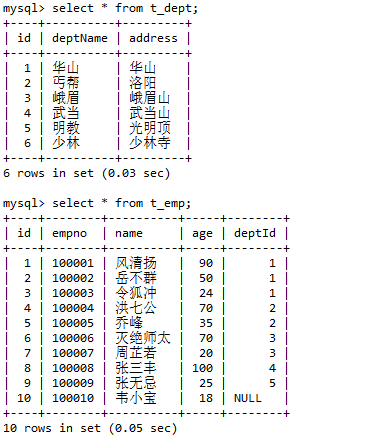
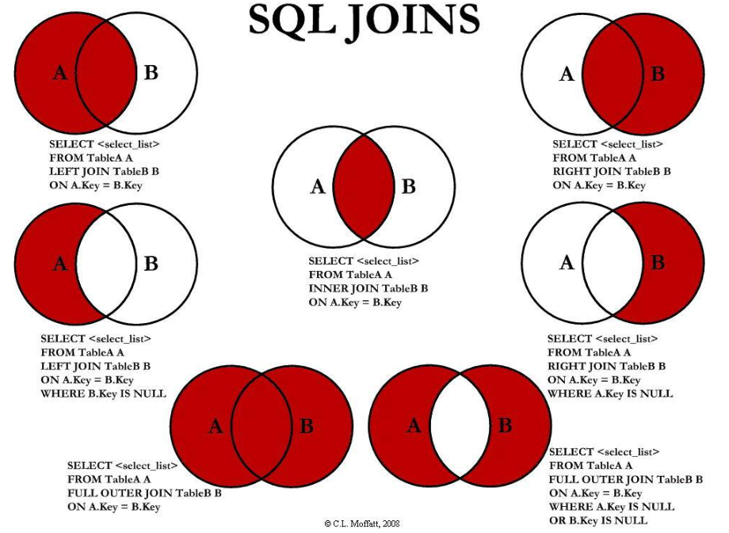
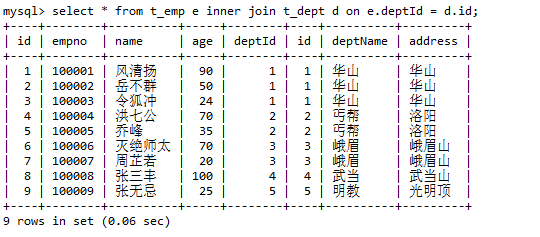
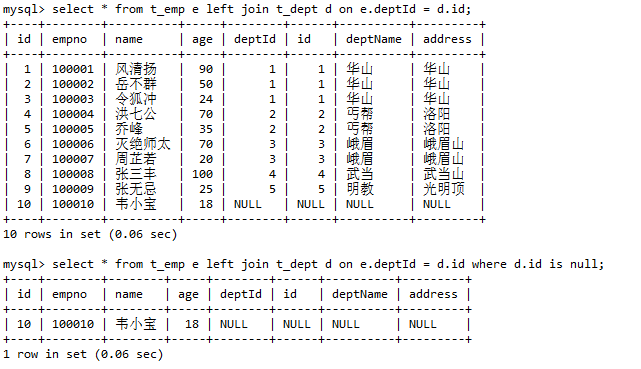
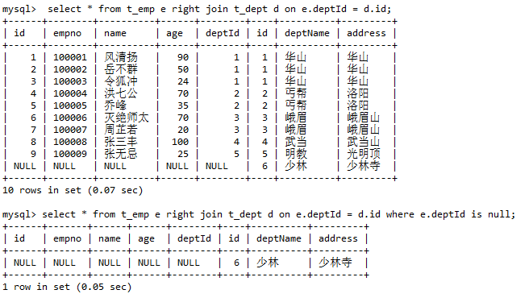
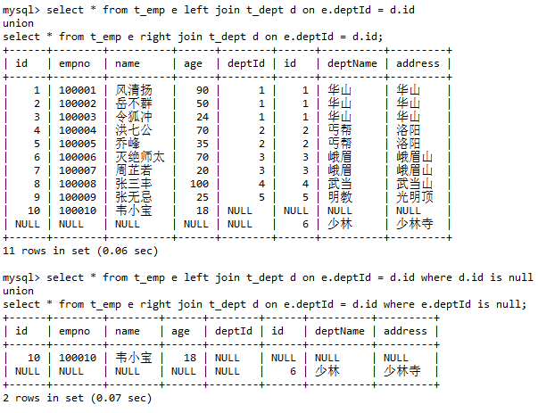

* Kramdown table of contents
{:toc .toc}
## 深入理解 MySQL 内连接、左外连接、右外连接、全外连接

## 前期准备

### 建表语句

```sql
DROP TABLE IF EXISTS `t_dept`;
CREATE TABLE `t_dept` (
  `id` int NOT NULL AUTO_INCREMENT,
  `deptName` varchar(30) DEFAULT NULL,
  `address` varchar(40) DEFAULT NULL,
  PRIMARY KEY (`id`)
) ENGINE=InnoDB DEFAULT CHARSET=utf8;

DROP TABLE IF EXISTS `t_emp`;
CREATE TABLE `t_emp` (
  `id` int NOT NULL AUTO_INCREMENT,
  `empno` int NOT NULL,
  `name` varchar(20) DEFAULT NULL,
  `age` int DEFAULT NULL,
  `deptId` int DEFAULT NULL,
  PRIMARY KEY (`id`),
  KEY `idx_dept_id` (`deptId`)
) ENGINE=InnoDB DEFAULT CHARSET=utf8;

INSERT INTO `t_dept`(`deptName`, `address`) VALUES ('华山', '华山');
INSERT INTO `t_dept`(`deptName`, `address`) VALUES ('丐帮', '洛阳');
INSERT INTO `t_dept`(`deptName`, `address`) VALUES ('峨眉', '峨眉山');
INSERT INTO `t_dept`(`deptName`, `address`) VALUES ('武当', '武当山');
INSERT INTO `t_dept`(`deptName`, `address`) VALUES ('明教', '光明顶');
INSERT INTO `t_dept`(`deptName`, `address`) VALUES ('少林', '少林寺');

INSERT INTO `t_emp`(`empno`, `name`, `age`, `deptId`) VALUES (100001, '风清扬', 90, 1);
INSERT INTO `t_emp`(`empno`, `name`, `age`, `deptId`) VALUES (100002, '岳不群', 50, 1);
INSERT INTO `t_emp`(`empno`, `name`, `age`, `deptId`) VALUES (100003, '令狐冲', 24, 1);
INSERT INTO `t_emp`(`empno`, `name`, `age`, `deptId`) VALUES (100004, '洪七公', 70, 2);
INSERT INTO `t_emp`(`empno`, `name`, `age`, `deptId`) VALUES (100005, '乔峰', 35, 2);
INSERT INTO `t_emp`(`empno`, `name`, `age`, `deptId`) VALUES (100006, '灭绝师太', 70, 3);
INSERT INTO `t_emp`(`empno`, `name`, `age`, `deptId`) VALUES (100007, '周芷若', 20, 3);
INSERT INTO `t_emp`(`empno`, `name`, `age`, `deptId`) VALUES (100008, '张三丰', 100, 4);
INSERT INTO `t_emp`(`empno`, `name`, `age`, `deptId`) VALUES (100009, '张无忌', 25, 5);
INSERT INTO `t_emp`(`empno`, `name`, `age`, `deptId`) VALUES (100010, '韦小宝', 18, NULL);
```

### 单表查询

```sql
-- 部门表信息
select * from t_dept;
```

```sql
-- 员工表信息
select * from t_emp;
```



## 常见的 join 查询图



## 内连接

```sql
select * from t_emp e inner join t_dept d on e.deptId = d.id;
```



## 左外连接

> left [outer] join 左外连接以左表为基表

```sql
select * from t_emp e left join t_dept d on e.deptId = d.id;
```

## 左外连接变种

```sql
select * from t_emp e left join t_dept d on e.deptId = d.id where d.id is null;
```



## 右外连接

> right [outer] join 右外连接以右表为基表

```sql
select * from t_emp e right join t_dept d on e.deptId = d.id;
```

## 右外连接变种

```sql
select * from t_emp e right join t_dept d on e.deptId = d.id where e.deptId is null;
```



## 全外连接

> MySQL 不支持 full [outer] join 语法

```sql
select * from t_emp e left join t_dept d on e.deptId = d.id
union
select * from t_emp e right join t_dept d on e.deptId = d.id;
```

## 全外连接变种

```sql
select * from t_emp e left join t_dept d on e.deptId = d.id where d.id is null 
union
select * from t_emp e right join t_dept d on e.deptId = d.id where e.deptId is null;
```

