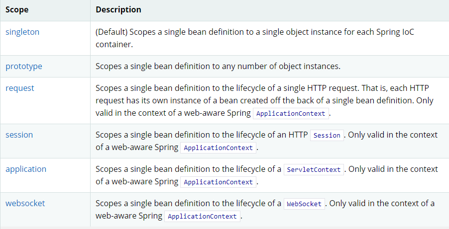

* Kramdown table of contents
{:toc .toc}
## Spring 中 Bean 的作用域

- singleton：单例，默认值，调用 getBean 方法返回是同一个对象，实例会被缓存起来，效率比较高，当一个 bean 被标识为 singleton 时候，spring 的 IOC 容器中只会存在一个该 bean。
- prototype：多例，调用 getBean 方法创建不同的对象，会频繁的创建和销毁对象造成很大的开销。

## Spring 中 Bean 的生命周期

## 推荐阅读

- [Spring Bean的作用域](https://blog.csdn.net/kongmin_123/article/details/82048392)
- [关于Spring Bean的生命周期](https://blog.csdn.net/Apeopl/article/details/82964799)
- [https://docs.spring.io/spring-framework/docs/current/reference/html/](https://docs.spring.io/spring-framework/docs/current/reference/html/)