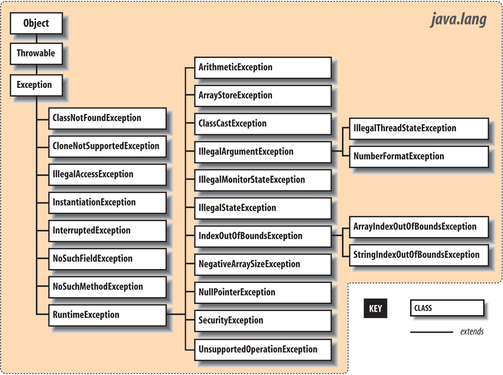

* Kramdown table of contents
{:toc .toc}
## 问题思考

- Java 异常体系。
- Java 的异常分类。
- 异常分哪些类型？
- Java 的异常有哪些，那些是需要 catch 的。
- 在 try 代码块里 return，finally 是否还会执行。
- Java 异常分为哪些类型？
- 列举几个你了解的几个常见的运行时异常?
- Error 和 Exception 的直接父类是 Object 吗？
- try 语句块中有一个 return 语句，那么紧跟在这个 try 后的 finally{} 代码会不会被执行，是在 return 之后还是之前执行？
- 在 try 代码块里 return，finally 是否还会执行。
- Java 异常了解吗？说说平时遇到的异常？说出 6 种常见的 Java 异常。写程序遇到过哪些异常，运行时异常有哪些？知道异常链吗？
- NOClassDefFoundError 和 ClassNotFoundException 有什么区别？
- finally 的用法？
- Error 和 Exception 的区别。举例子说明一下。
- Error 和 Exception 的直接父类是 Object 吗？
- 简单介绍 Java 异常框架? Error 与 Exception 有什么区别?
- throw 和 throws 的区别？
- Java 中的 throw 和 throws 关键字有什么区别?
- IOException 需要捕获吗？
- Java 的异常处理机制，Error 和 Exception 的区别。
- Java 哪些异常不需要被捕获？

## 异常的分类

Java 中的异常分为 Checked Exception 和 Unchecked Exception(即 RuntimeException)。

RuntimeException 是那些可能在 Java 虚拟机正常运行期间抛出的异常的超类。可能在执行方法期间抛出但未被捕获的 RuntimeException 的任何子类都无需在 throws 子句中进行声明。也就是说，非 RuntimeException 异常类或者其子类的的异常都要声明捕捉。只有 RuntimeException 或者是其子类的异常是不需要进行声明捕捉的。

## Java 异常体系结构





## Java 异常处理关键字

try、catch、finally、throw、throws

## Java 异常处理机制

在 Java 应用程序中，异常处理机制为：抛出异常，捕获异常。        

Java 异常处理机制主要依赖于 try、catch、finally、throw、throws 五个关键字。

## 处理异常

```java
try {
    // 可能发生异常的程序代码
} catch (Exception e) {
    // 捕获异常并处理
} finally {
    // 必须执行的代码
}
```

```java
try {
    // 可能发生异常的程序代码
} finally {
    // 必须执行的代码
}
```

## 自定义异常

Java 的异常处理机制中所定义的所有异常不可能预见所有可能出现的错误，某些特定的情境下，则需要我们自定义异常类型来向上报告某些错误信息。

而自定义异常类型也是相当简单的，你可以选择继承 Throwable、Exception 或它们的子类，甚至你不需要实现和重写父类的任何方法即可完成一个异常类型的定义。

## Java 异常处理机制常考面试题

列举几个你了解的几个常见的运行时异常?

> ArithmeticException（算术异常）
> ClassCastException（类转换异常）
> IllegalArgumentException（非法参数异常）
> IndexOutOfBoundsException（下标越界异常）
> NullPointerException（空指针异常）
> SecurityException（安全异常）

```java
public class Main {
    public static void main(String[] args) {
        System.out.print(fun1());
    }

    public static String fun1() {
        try {
            System.out.print("A");
            return fun2();
        } finally {
            System.out.print("B");
        }
    }

    public static String fun2() {
        System.out.print("C");
        return "D";
    }
}
```

<a class="button show-hidden">点击查看结果</a>

<div class="hidden">
<blockquote><p><b>参考答案</b>
ACBD
</p></blockquote>
</div>

```java
public class Test {
    public static void main(String[] args) {
        System.out.println(test());
    }

    public static int test() {
        try {
            int i = 1 / 0;
            return 1;
        } catch (Exception e) {
            return 2;
        } finally {
            return 3;
        }
    }
}
```

<a class="button show-hidden">点击查看结果</a>

<div class="hidden">
<blockquote><p><b>参考答案</b>
3
</p></blockquote>
</div>

```java
public class Test {
    public static void main(String[] args) {
        try {
            System.out.printf("1");
            int sum = 9 / 0;
            System.out.printf("2");
        } catch (ArithmeticException e) {
            System.out.printf("3");
        } catch (Exception e) {
            System.out.printf("4");
        } finally {
            System.out.printf("5");
        }
    }
} 
```

<a class="button show-hidden">点击查看结果</a>

<div class="hidden">
<blockquote><p><b>参考答案</b>
135
</p></blockquote>
</div>

```java
public class Test {
    private void m1() {
        m2();
        System.out.printf("1");
    }

    private void m2() {
        m3();
        System.out.printf("2");
    }

    private void m3() {
        System.out.printf("3");
        try {
            int sum = 4 / 0;
            System.out.printf("4");
        } catch (ArithmeticException e) {
            System.out.printf("5");
        }
        System.out.printf("7");
    }

    public static void main(String[] args) {
        Test obj = new Test();
        obj.m1();
    }
}
```

<a class="button show-hidden">点击查看结果</a>

<div class="hidden">
<blockquote><p><b>参考答案</b>
35721
</p></blockquote>
</div>

```java
public class Test {
    public static void main(String[] args) {
        try {
            System.out.printf("1");
            int data = 5 / 0;
        } catch (ArithmeticException e) {
            System.out.printf("2");
            System.exit(0);
        } finally {
            System.out.printf("3");
        }
        System.out.printf("4");
    }
}
```

<a class="button show-hidden">点击查看结果</a>

<div class="hidden">
<blockquote><p><b>参考答案</b>
12
</p></blockquote>
</div>

```java
public class Test {
    public static void main(String[] args) {
        try {
            System.out.printf("1");
            int data = 5 / 0;
        } catch (ArithmeticException e) {
            Throwable obj = new Throwable("Sample");
            try {
                throw obj;
            } catch (Throwable e1) {
                System.out.printf("8");
            }
        } finally {
            System.out.printf("3");
        }
        System.out.printf("4");
    }
}
```

<a class="button show-hidden">点击查看结果</a>

<div class="hidden">
<blockquote><p><b>参考答案</b>
1834
</p></blockquote>
</div>

```java
public class Test {
    public static void main(String[] args) {
        try {
            System.out.printf("1");
            int value = 10 / 0;
            throw new IOException();
        } catch (EOFException e) {
            System.out.printf("2");
        } catch (ArithmeticException e) {
            System.out.printf("3");
        } catch (NullPointerException e) {
            System.out.printf("4");
        } catch (IOException e) {
            System.out.printf("5");
        } catch (Exception e) {
            System.out.printf("6");
        }
    }
}
```

<a class="button show-hidden">点击查看结果</a>

<div class="hidden">
<blockquote><p><b>参考答案</b>
13
</p></blockquote>
</div>

关于 java 的异常处理机制，以下说法正确的是（   ）

> A. 当某个线程抛出 OutOfMemoryError 时，其他线程有可能不受影响
>
> B. 当大量抛出 RuntimeException 时，不会影响系统的吞吐量
>
> C. java.lang.Exception 是 java.lang.Error 的父类
>
> D. finally 块代码一定会被执行
>

<a class="button show-hidden">点击查看结果</a>

<div class="hidden">
<blockquote><p><b>参考答案</b>
A
</p></blockquote>
</div>

下列关于 final、finally、finalize 说法正确的是（   ）

> A. final 可以用来修饰类、方法、变量
>
> B. finally 是 java 保证重点代码一定要被执行的一种机制
>
> C. 变量被 final 修饰后不能再指向其他对象，但可以重写
>
> D. finalize 设计的目的是保证对象在被垃圾收集前完成特定资源的回收
>

<a class="button show-hidden">点击查看结果</a>

<div class="hidden">
<blockquote><p><b>参考答案</b>
ABD
</p></blockquote>
</div>
下列哪种异常属于 Unchecked Exception 即运行时异常（   ）

> A. SQLException
>
> B. NumberFormatException
>
> C. NullPointerException
>
> D. IOException

<a class="button show-hidden">点击查看结果</a>

<div class="hidden">
<blockquote><p><b>参考答案</b>
BC
</p></blockquote>
</div>
```java
public class Test {
    String str = "a";

    void A() {
        try {
            str += "b";
            B();
        } catch (Exception e) {
            str += "c";
        }
    }

    void B() throws Exception {
        try {
            str += "d";
            C();
        } catch (Exception e) {
            throw new Exception();
        } finally {
            str += "e";
        }
        str += "f";
    }

    void C() throws Exception {
        throw new Exception();
    }

    void display() {
        System.out.println(str);
    }

    public static void main(String[] args) {
        Test object = new Test();
        object.A();
        object.display();
    }
}
```

> A. abdef
> B. abdec
> C. abdefc

<a class="button show-hidden">点击查看结果</a>

<div class="hidden">
<blockquote><p><b>参考答案</b>
B
</p></blockquote>
</div>

```java
class Geeks {
    public static void main(String[] args) {
        try {
            System.out.println(1 / 0);
        } catch (ArithmeticException e) {
            System.out.println(e.getMessage());
        }
    }
}
```

> 1. java.lang.ArithmeticExcetion
> 2. / by zero
> 3. java.lang.ArithmeticExcetion:/ by zero
> 4. ArithmeticExcetion
>

<a class="button show-hidden">点击查看结果</a>

<div class="hidden">
<blockquote><p><b>参考答案</b>
2
</p></blockquote>
</div>

```java
class Geeks {
    public static void main(String[] args) {
        try {
            System.out.println(1 / 0);
        } catch (ArithmeticException e) {
            System.out.println("Hello Geeks");
        } catch (Exception e) {
            System.out.println("Welcome");
        }
    }
} 
```

> 1. Hello Geeks
> 2. No Output
> 3. Compile-time error
> 4. welcome
>

<a class="button show-hidden">点击查看结果</a>

<div class="hidden">
<blockquote><p><b>参考答案</b>
1
</p></blockquote>
</div>

```java
class Geeks {
    public static void main(String[] args) {
        try {
            System.out.println(1 / 0);
        } catch (Exception e) {
            System.out.println("Hello Geeks");
        } catch (ArithmeticException e) {
            System.out.println("Welcome");
        }
    }
}
```

> 1. Hello Geeks
> 2. No Output
> 3. Compile-time error
> 4. welcome
>

<a class="button show-hidden">点击查看结果</a>

<div class="hidden">
<blockquote><p><b>参考答案</b>
3
</p></blockquote>
</div>

```java
class Geeks {
    public static void main(String[] args) {
        try {
            System.out.println(1 / 0);
        }
    }
} 
```

> 1. Run-time Exception
> 2. Compile-time error
> 3. No Output
> 4. Compile-time Exception
>

<a class="button show-hidden">点击查看结果</a>

<div class="hidden">
<blockquote><p><b>参考答案</b>
2
</p></blockquote>
</div>

```java
class Geeks {
    public static void main(String[] args) {
        try {
            System.out.println(1 / 0);
        }
        System.out.println("Hello GEEKS"); 
      catch(ArithmeticException e)
        {
            System.out.println("Welcome");
        }
    }
} 
```

> 1. Hello Geeks
> 2. Hello Geeks
> Welome
> 3. Run-time Exception
> 4. Compile-time error
>

<a class="button show-hidden">点击查看结果</a>

<div class="hidden">
<blockquote><p><b>参考答案</b>
4
</p></blockquote>
</div>

## 推荐阅读

- [https://falkhausen.de/Java-8/java.lang/Exceptions.html](https://falkhausen.de/Java-8/java.lang/Exceptions.html)
- [https://www.geeksforgeeks.org/java-gq/exception-handling-2-gq/](https://www.geeksforgeeks.org/java-gq/exception-handling-2-gq/)
- [https://www.geeksforgeeks.org/output-java-programs-set-41-try-catch/](https://www.geeksforgeeks.org/output-java-programs-set-41-try-catch/)
- [https://www.geeksforgeeks.org/quiz-corner-gq/](https://www.geeksforgeeks.org/quiz-corner-gq/)