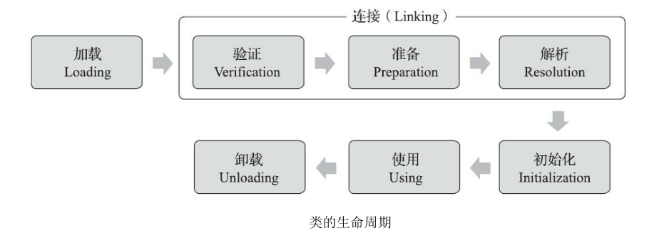
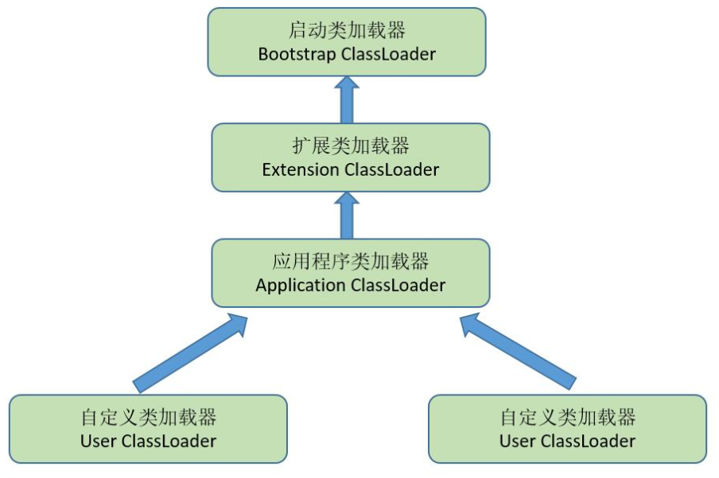

* Kramdown table of contents
{:toc .toc}
## 类加载的时机

一个类型从被加载到虚拟机内存中开始，到卸载出内存为止，它的整个生命周期将会经历加载、验证、准备、解析、初始化、使用和卸载七个阶段，其中验证、准备、解析三个部分统称为连接。这七个阶段的发生顺序如图所示。

对于初始化阶段，《Java 虚拟机规范》则是严格规定了有且只有六种情况必须立即对类进行"初始化"。

> 1）遇到 new、getstatic、putstatic 或 invokestatic 这四条字节码指令时，如果类型没有进行过初始化，则需要先触发其初始化阶段。能够生成这四条指令的典型 Java 代码场景有：
>
> - 使用 new 关键字实例化对象的时候。
> - 读取或设置一个类型的静态字段（被 final 修饰、已在编译期把结果放入常量池的静态字段除外）的时候。
> - 调用一个类型的静态方法的时候。
>
> 2）使用 `java.lang.reflect` 包的方法对类型进行反射调用的时候，如果类型没有进行过初始化，则需要先触发其初始化。
>
> 3）当初始化类的时候，如果发现其父类还没有进行过初始化，则需要先触发其父类的初始化。
>
> 4）当虚拟机启动时，用户需要指定一个要执行的主类（包含 main() 方法的那个类），虚拟机会先初始化这个主类。
>
> 5）当使用 JDK 7 新加入的动态语言支持时，如果一个 `java.lang.invoke.MethodHandle` 实例最后的解析结果为 REF_getStatic、REF_putStatic、REF_invokeStatic、REF_newInvokeSpecial 四种类型的方法句柄，并且这个方法句柄对应的类没有进行过初始化，则需要先触发其初始化。
>
> 6）当一个接口中定义了 JDK 8 新加入的默认方法（被 default 关键字修饰的接口方法）时，如果有这个接口的实现类发生了初始化，那该接口要在其之前被初始化。

对于这六种会触发类型进行初始化的场景，《Java 虚拟机规范》中使用了一个非常强烈的限定语——"有且只有"，这六种场景中的行为称为对一个类型进行主动引用。除此之外，所有引用类型的方式都不会触发初始化，称为被动引用。

## 类与类加载器

类加载器虽然只用于实现类的加载动作，但它在 `Java` 程序中起到的作用却远超类加载阶段。对于任意一个类，都必须由加载它的类加载器和这个类本身一起共同确立其在 Java 虚拟机中的唯一性，每一个类加载器，都拥有一个独立的类名称空间。这句话可以表达得更通俗一些：比较两个类是否"相等"，只有在这两个类是由同一个类加载器加载的前提下才有意义，否则，即使这两个类来源于同一个 Class 文件，被同一个 Java 虚拟机加载，只要加载它们的类加载器不同，那这两个类就必定不相等。

## 双亲委派模型

- 启动类加载器
- 扩展类加载器
- 应用程序类加载器

双亲委派模型的工作过程是：如果一个类加载器收到了类加载的请求，它首先不会自己去尝试加载这个类，而是把这个请求委派给父类加载器去完成，每一个层次的类加载器都是如此，因此所有的加载请求最终都应该传送到最顶层的启动类加载器中，只有当父加载器反馈自己无法完成这个加载请求（它的搜索范围中没有找到所需的类）时，子加载器才会尝试自己去完成加载。

使用双亲委派模型来组织类加载器之间的关系，一个显而易见的好处就是 Java 中的类随着它的类加载器一起具备了一种带有优先级的层次关系。

## 问题思考

- 了解双亲委派模型，能说出三种基本类加载器。
- 准确描述双亲委派流程，理解双亲委派机制的作用。
- 能结合中间件或实践经验描述类加载机制，比如 tomcat 类加载机制。

## 参考资料

- [https://developer.ibm.com/zh/languages/java/articles/j-lo-classloader/](https://developer.ibm.com/zh/languages/java/articles/j-lo-classloader/)
- 深入理解 Java 虚拟机 JVM 高级特性与最佳实践（第 3 版）周志明 著