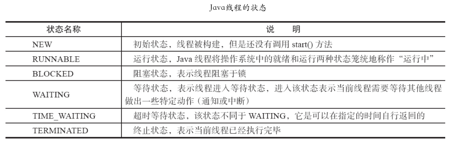
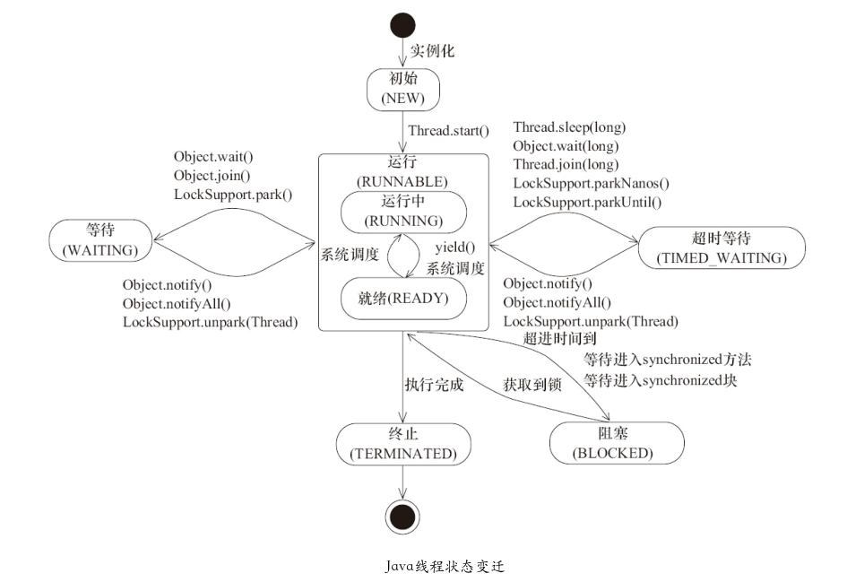
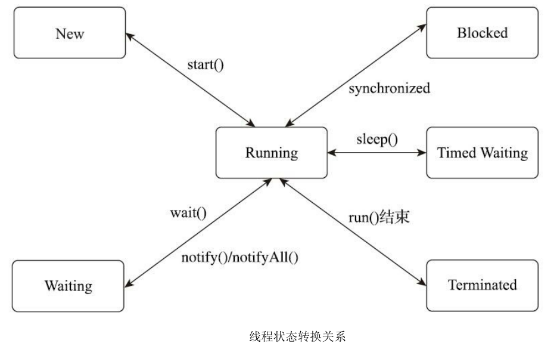

* Kramdown table of contents
{:toc .toc}
## Java 线程的状态

Java 线程在运行的生命周期中可能处于 6 种不同的状态，在给定的一个时刻，线程只能处于其中的一个状态。

Java 语言定义了 6 种线程状态，在任意一个时间点中，一个线程只能有且只有其中的一种状态，并且可以通过特定的方法在不同状态之间转换。这 6 种状态分别是：

> - 新建(NEW)：创建后尚未启动的线程处于这种状态。
> - 运行(RUNNABLE)：包括操作系统线程状态中的 Running 和 Ready，也就是处于此状态的线程有可能正在执行，也有可能正在等待着操作系统为它分配执行时间。
> - 阻塞(BLOCKED)：线程被阻塞了，"阻塞状态"与"等待状态"的区别是"阻塞状态"在等待着获取到一个排它锁，这个事件将在另外一个线程放弃这个锁的时候发生；而"等待状态"则是在等待一段时间，或者唤醒动作的发生。在程序等待进入同步区域的时候，线程将进入这种状态。
> - 无限期等待(WAITING)：处于这种状态的线程不会被分配处理器执行时间，它们要等待被其他线程显式唤醒。
> - 限期等待(TIMED_WAITING)：处于这种状态的线程也不会被分配处理器执行时间，不过无须等待被其他线程显式唤醒，在一定时间之后它们会由系统自动唤醒。
> - 结束(TERMINATED)：已终止线程的线程状态，线程已经结束执行。

```java
public enum State {
    NEW,

    RUNNABLE,

    BLOCKED,

    WAITING,

    TIMED_WAITING,

    TERMINATED;
}
```



## Java 线程状态转换

上述 6 种状态在遇到特定事件发生的时候将会互相转换，它们的转换关系如图所示。





```java
@Slf4j(topic = "c.TestState")
public class TestState {
    public static void main(String[] args) {
        Thread t1 = new Thread("t1") {
            @Override
            public void run() {
                log.debug("running...");
            }
        };

        Thread t2 = new Thread("t2") {
            @Override
            public void run() {
                while (true) {
                }
            }
        };
        t2.start();

        Thread t3 = new Thread("t3") {
            @Override
            public void run() {
                log.debug("running...");
            }
        };
        t3.start();

        Thread t4 = new Thread("t4") {
            @Override
            public void run() {
                synchronized (TestState.class) {
                    try {
                        Thread.sleep(1000000);
                    } catch (InterruptedException e) {
                        e.printStackTrace();
                    }
                }
            }
        };
        t4.start();

        Thread t5 = new Thread("t5") {
            @Override
            public void run() {
                try {
                    t2.join();
                } catch (InterruptedException e) {
                    e.printStackTrace();
                }
            }
        };
        t5.start();

        Thread t6 = new Thread("t6") {
            @Override
            public void run() {
                synchronized (TestState.class) {
                    try {
                        Thread.sleep(1000000);
                    } catch (InterruptedException e) {
                        e.printStackTrace();
                    }
                }
            }
        };
        t6.start();

        try {
            Thread.sleep(500);
        } catch (InterruptedException e) {
            e.printStackTrace();
        }

        log.debug("t1 state {}", t1.getState());
        log.debug("t2 state {}", t2.getState());
        log.debug("t3 state {}", t3.getState());
        log.debug("t4 state {}", t4.getState());
        log.debug("t5 state {}", t5.getState());
        log.debug("t6 state {}", t6.getState());
    }
}
```

> 20:14:49:094 [t3] c.TestState - running...
> 20:14:49:592 [main] c.TestState - t1 state NEW
> 20:14:49:597 [main] c.TestState - t2 state RUNNABLE
> 20:14:49:597 [main] c.TestState - t3 state TERMINATED
> 20:14:49:597 [main] c.TestState - t4 state TIMED_WAITING
> 20:14:49:597 [main] c.TestState - t5 state WAITING
> 20:14:49:597 [main] c.TestState - t6 state BLOCKED

> 也可以使用 jps jstack 命令来查看线程的状态信息。