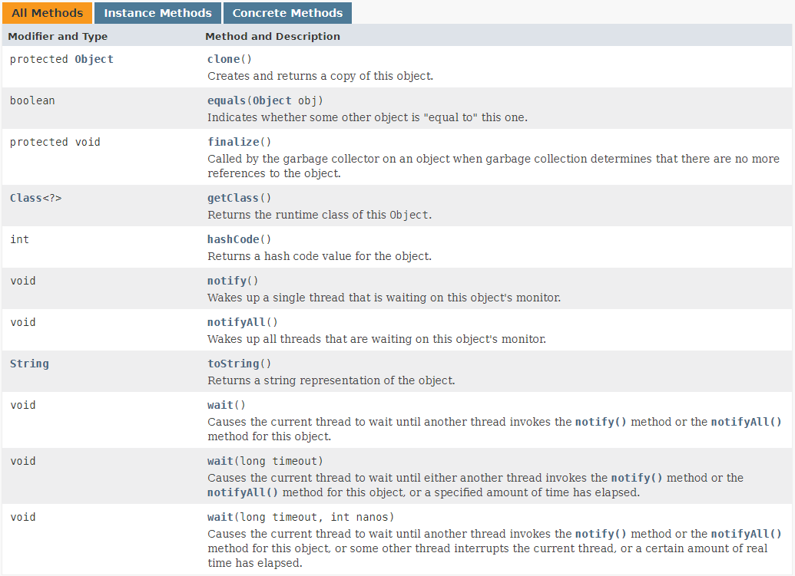

* Kramdown table of contents
{:toc .toc}
## Object 类概述

类 Object 是类层次结构的根类。每个类都使用 Object 作为超类。所有对象（包括数组）都实现这个类的方法。 

## Java 根类 Object 的方法说明

[https://docs.oracle.com/javase/8/docs/api/java/lang/Object.html](https://docs.oracle.com/javase/8/docs/api/java/lang/Object.html)



```java
package java.lang;

public class Object {
    private static native void registerNatives();

    static {
        registerNatives();
    }

    public final native Class<?> getClass();

    public native int hashCode();

    public boolean equals(Object obj) {
        return (this == obj);
    }

    protected native Object clone() throws CloneNotSupportedException;

    public String toString() {
        return getClass().getName() + "@" + Integer.toHexString(hashCode());
    }

    public final native void notify();

    public final native void notifyAll();

    public final native void wait(long timeout) throws InterruptedException;

    public final void wait(long timeout, int nanos) throws InterruptedException {
        if (timeout < 0) {
            throw new IllegalArgumentException("timeout value is negative");
        }

        if (nanos < 0 || nanos > 999999) {
            throw new IllegalArgumentException(
                    "nanosecond timeout value out of range");
        }

        if (nanos > 0) {
            timeout++;
        }

        wait(timeout);
    }

    public final void wait() throws InterruptedException {
        wait(0);
    }

    protected void finalize() throws Throwable {
    }
}
```

## Object 类常考面试题

- [ ] java.lang.Object 类有哪些方法。

> Java 中的 Object 类是所有类的父类，它提供了以下 11 个方法：
>
> 1. public final native Class<?> getClass()
> 2. public native int hashCode()
> 3. public boolean equals(Object obj)
> 4. protected native Object clone() throws CloneNotSupportedException
> 5. public String toString()
> 6. public final native void notify()
> 7. public final native void notifyAll()
> 8. public final native void wait(long timeout) throws InterruptedException
> 9. public final void wait(long timeout, int nanos) throws InterruptedException
> 10. public final void wait() throws InterruptedException
> 11. protected void finalize() throws Throwable { }