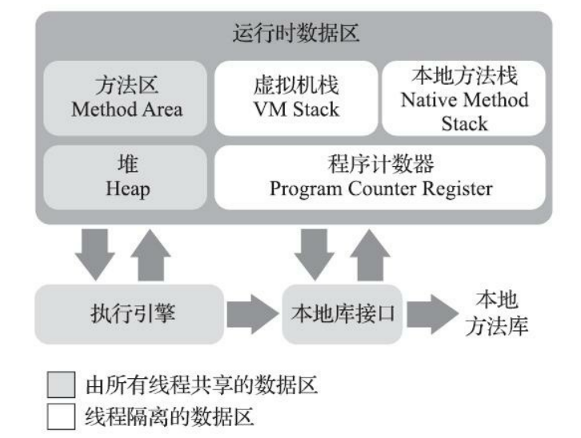

* Kramdown table of contents
{:toc .toc}
## Java 虚拟机运行时数据区

根据《Java 虚拟机规范》的规定，Java 虚拟机所管理的内存将会包括以下几个运行时数据区域。

## 问题思考

- 了解基本的内存区域划分，不同区域采取的 GC 策略。
- 了解 OOM 在哪些情况下发生，如何打印 GC 日志。
- 熟悉 JVM 参数调优，熟悉利用常用命令来定位 JVM 问题。
- 问：垃圾回收器的类型有哪些？
- 问：每种垃圾回收器的回收方式是什么？
- 问：不同的代用哪种？有什么区别？
- 问：不同场景下新生代、老年代的比例如何控制。
- 问：在 JDK 1.8 中元空间存在的意义。
- 问：大内存场景的内存分配和使用策略。比如一个 20G 内存的服务器跑一个服务。