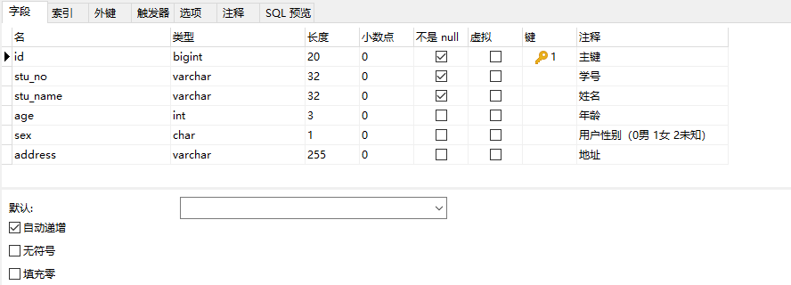

* Kramdown table of contents
{:toc .toc}
## mybatis + mysql 批量增删改
### Student 表结构


### 批量插入

```java
public int insertBatchStudent(List<Student> students);
```

```xml
<insert id="insertBatchStudent" parameterType="java.util.List" useGeneratedKeys="true">
    <selectKey resultType="Long" keyProperty="id" order="AFTER">
        SELECT LAST_INSERT_ID()
    </selectKey>
    insert into student(stu_no,stu_name,age,sex,address)
    values
    <foreach collection="list" item="stu" index="index" separator=",">
        (#{stu.stuNo},
        #{stu.stuName},
        #{stu.age},
        #{stu.sex},
        #{stu.address})
    </foreach>
</insert>
```

### 根据数组批量删除

```java
public int deleteStudentByIds(String[] ids);
```

```xml
<delete id="deleteStudentByIds" parameterType="String">
    delete from student where id in
    <foreach item="id" collection="array" open="(" separator="," close=")">
        #{id}
    </foreach>
</delete>
```

### 根据集合批量删除

```java
public int deleteStudentByIds(List<String> ids);
```

```xml
<delete id="deleteStudentByIds" parameterType="java.util.List">
    delete from student where id in
    <foreach item="id" collection="list" open="(" separator="," close=")">
        #{id}
    </foreach>
</delete>
```

### 批量更新

```java
public int updateBatchStudent(List<Student> students);
```

```xml
<update id="updateBatchStudent" parameterType="java.util.List">
    update student set
    stu_no =
    <foreach collection="list" item="stu" index="index" separator=" " open="case id" close="end">
        when #{stu.id} then #{stu.stuNo}
    </foreach>
    ,stu_name =
    <foreach collection="list" item="stu" index="index" separator=" " open="case id" close="end">
        when #{stu.id} then #{stu.stuName}
    </foreach>
    ,age =
    <foreach collection="list" item="stu" index="index" separator=" " open="case id" close="end">
        when #{stu.id} then #{stu.age}
    </foreach>
    ,sex =
    <foreach collection="list" item="stu" index="index" separator=" " open="case id" close="end">
        when #{stu.id} then #{stu.sex}
    </foreach>
    ,address =
    <foreach collection="list" item="stu" index="index" separator=" " open="case id" close="end">
        when #{stu.id} then #{stu.address}
    </foreach>
    where id in
    <foreach collection="list" item="stu" index="index" separator="," open="(" close=")">
        #{stu.id}
    </foreach>
</update>
```

### 参考代码

```java
package cn.hgnulb.student.domain;

import com.baomidou.mybatisplus.annotation.TableId;
import com.baomidou.mybatisplus.annotation.TableName;
import org.apache.commons.lang3.builder.ToStringBuilder;
import org.apache.commons.lang3.builder.ToStringStyle;

import java.io.Serializable;

@TableName("student")
public class Student implements Serializable {
    private static final long serialVersionUID = 1L;

    /** 主键 */
    @TableId
    private Long id;
    
    /** 学号 */
    private String stuNo;
    
    /** 姓名 */
    private String stuName;
    
    /** 年龄 */
    private Integer age;
    
    /** 用户性别（0男 1女 2未知） */
    private String sex;
    
    /** 地址 */
    private String address;
    
    public void setId(Long id) {
        this.id = id;
    }
    
    public Long getId() {
        return id;
    }
    
    public void setStuNo(String stuNo) {
        this.stuNo = stuNo;
    }
    
    public String getStuNo() {
        return stuNo;
    }
    
    public void setStuName(String stuName) {
        this.stuName = stuName;
    }
    
    public String getStuName() {
        return stuName;
    }
    
    public void setAge(Integer age) {
        this.age = age;
    }
    
    public Integer getAge() {
        return age;
    }
    
    public void setSex(String sex) {
        this.sex = sex;
    }
    
    public String getSex() {
        return sex;
    }
    
    public void setAddress(String address) {
        this.address = address;
    }
    
    public String getAddress() {
        return address;
    }
    
    @Override
    public String toString() {
        return new ToStringBuilder(this, ToStringStyle.MULTI_LINE_STYLE)
                .append("id", getId())
                .append("stuNo", getStuNo())
                .append("stuName", getStuName())
                .append("age", getAge())
                .append("sex", getSex())
                .append("address", getAddress())
                .toString();
    }
}
```

```java
package cn.hgnulb.student.mapper;

import cn.hgnulb.student.domain.Student;
import com.baomidou.mybatisplus.core.mapper.BaseMapper;

import java.util.List;

public interface StudentMapper extends BaseMapper<Student> {
    Student selectStudentById(Long id);

    List<Student> selectStudentList(Student student);
    
    int insertStudent(Student student);
    
    int insertBatchStudent(List<Student> students);
    
    int updateBatchStudent(List<Student> students);
    
    int updateStudent(Student student);
    
    int deleteStudentById(Long id);
    
    int deleteStudentByArrayIds(String[] ids);
    
    int deleteStudentByListIds(List<String> ids);
}
```

```xml
<mapper namespace="cn.hgnulb.student.mapper.StudentMapper">
    <resultMap type="Student" id="StudentResult">
        <result property="id" column="id"/>
        <result property="stuNo" column="stu_no"/>
        <result property="stuName" column="stu_name"/>
        <result property="age" column="age"/>
        <result property="sex" column="sex"/>
        <result property="address" column="address"/>
    </resultMap>

    <sql id="selectStudentVo">
        select id, stu_no, stu_name, age, sex, address from student
    </sql>
    
    <!--按条件查询-->
    <select id="selectStudentList" parameterType="Student" resultMap="StudentResult">
        <include refid="selectStudentVo"/>
        <where>
            <if test="stuNo != null  and stuNo != ''">and stu_no = #{stuNo}</if>
            <if test="stuName != null  and stuName != ''">and stu_name like concat('%', #{stuName}, '%')</if>
            <if test="age != null ">and age = #{age}</if>
            <if test="sex != null  and sex != ''">and sex = #{sex}</if>
        </where>
    </select>
    
    <!--按ID查询-->
    <select id="selectStudentById" parameterType="Long" resultMap="StudentResult">
        <include refid="selectStudentVo"/>
        where id = #{id}
    </select>
    
    <!--插入-->
    <insert id="insertStudent" parameterType="Student" useGeneratedKeys="true" keyProperty="id">
        insert into student
        <trim prefix="(" suffix=")" suffixOverrides=",">
            <if test="stuNo != null  and stuNo != ''">stu_no,</if>
            <if test="stuName != null  and stuName != ''">stu_name,</if>
            <if test="age != null ">age,</if>
            <if test="sex != null  and sex != ''">sex,</if>
            <if test="address != null  and address != ''">address,</if>
        </trim>
        <trim prefix="values (" suffix=")" suffixOverrides=",">
            <if test="stuNo != null  and stuNo != ''">#{stuNo},</if>
            <if test="stuName != null  and stuName != ''">#{stuName},</if>
            <if test="age != null ">#{age},</if>
            <if test="sex != null  and sex != ''">#{sex},</if>
            <if test="address != null  and address != ''">#{address},</if>
        </trim>
    </insert>
    
    <!--按ID删除-->
    <delete id="deleteStudentById" parameterType="Long">
        delete from student where id = #{id}
    </delete>
    
    <!--按ID更新-->
    <update id="updateStudent" parameterType="Student">
        update student
        <trim prefix="SET" suffixOverrides=",">
            <if test="stuNo != null  and stuNo != ''">stu_no = #{stuNo},</if>
            <if test="stuName != null  and stuName != ''">stu_name = #{stuName},</if>
            <if test="age != null ">age = #{age},</if>
            <if test="sex != null  and sex != ''">sex = #{sex},</if>
            <if test="address != null  and address != ''">address = #{address},</if>
        </trim>
        where id = #{id}
    </update>
    
    <!--批量插入-->
    <insert id="insertBatchStudent" parameterType="java.util.List" useGeneratedKeys="true">
        <selectKey resultType="Long" keyProperty="id" order="AFTER">
            SELECT LAST_INSERT_ID()
        </selectKey>
        insert into student(stu_no,stu_name,age,sex,address)
        values
        <foreach collection="list" item="stu" index="index" separator=",">
            (#{stu.stuNo},
            #{stu.stuName},
            #{stu.age},
            #{stu.sex},
            #{stu.address})
        </foreach>
    </insert>
    
    <!--按数组批量删除-->
    <delete id="deleteStudentByArrayIds" parameterType="String">
        delete from student where id in
        <foreach item="id" collection="array" open="(" separator="," close=")">
            #{id}
        </foreach>
    </delete>
    
    <!--按集合批量删除-->
    <delete id="deleteStudentByListIds" parameterType="java.util.List">
        delete from student where id in
        <foreach item="id" collection="list" open="(" separator="," close=")">
            #{id}
        </foreach>
    </delete>
    
    <!--批量更新-->
    <update id="updateBatchStudent" parameterType="java.util.List">
        update student set
        stu_no =
        <foreach collection="list" item="stu" index="index" separator=" " open="case id" close="end">
            when #{stu.id} then #{stu.stuNo}
        </foreach>
        ,stu_name =
        <foreach collection="list" item="stu" index="index" separator=" " open="case id" close="end">
            when #{stu.id} then #{stu.stuName}
        </foreach>
        ,age =
        <foreach collection="list" item="stu" index="index" separator=" " open="case id" close="end">
            when #{stu.id} then #{stu.age}
        </foreach>
        ,sex =
        <foreach collection="list" item="stu" index="index" separator=" " open="case id" close="end">
            when #{stu.id} then #{stu.sex}
        </foreach>
        ,address =
        <foreach collection="list" item="stu" index="index" separator=" " open="case id" close="end">
            when #{stu.id} then #{stu.address}
        </foreach>
        where id in
        <foreach collection="list" item="stu" index="index" separator="," open="(" close=")">
            #{stu.id}
        </foreach>
    </update>
</mapper>
```

## 推荐阅读

- [https://mybatis.org/mybatis-3/zh/index.html](https://mybatis.org/mybatis-3/zh/index.html)