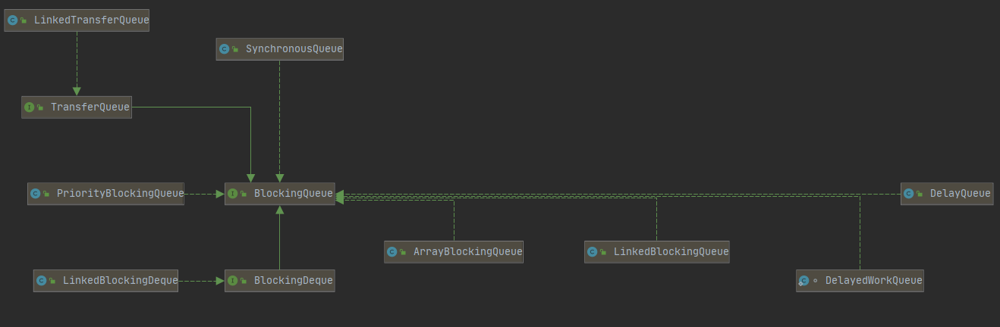

* Kramdown table of contents
{:toc .toc}
## BlockingQueue 的常用实现类

> ArrayBlockingQueue
> LinkedBlockingQueue
> LinkedBlockingDeque
> PriorityBlockingQueue
> SynchronousQueue
> DelayQueue
> LinkedTransferQueue

