* Kramdown table of contents
{:toc .toc}
Oracle 11g 安装教程

步骤 1

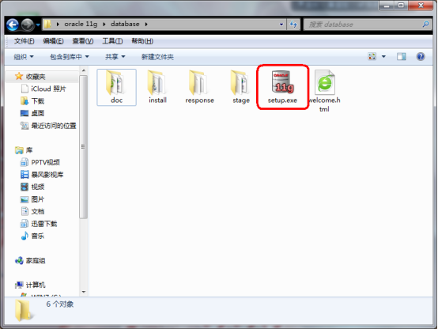

步骤 2

步骤 3

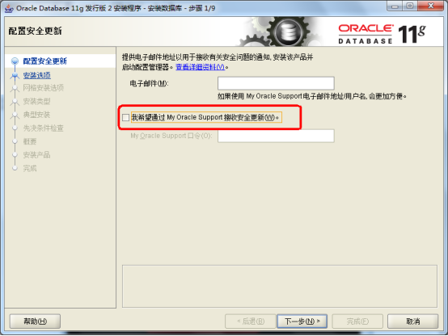

步骤 4

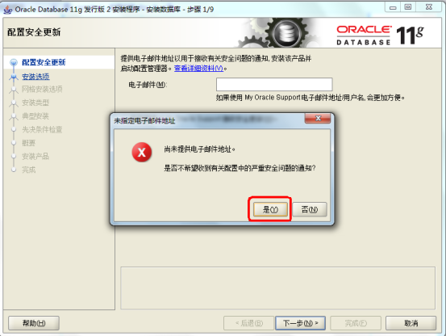

步骤 5

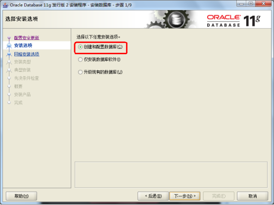

步骤 6

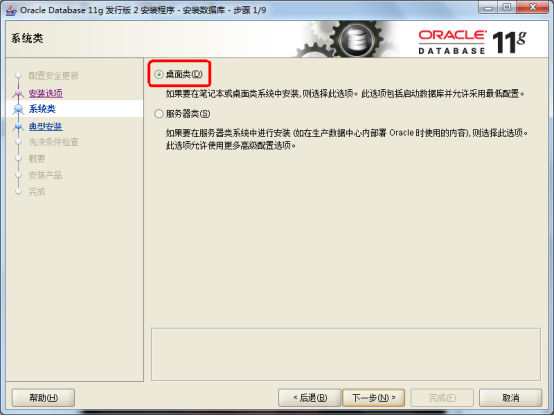

步骤 7

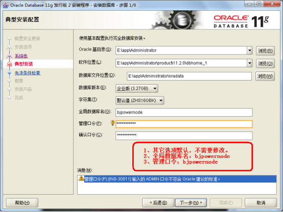

步骤 8

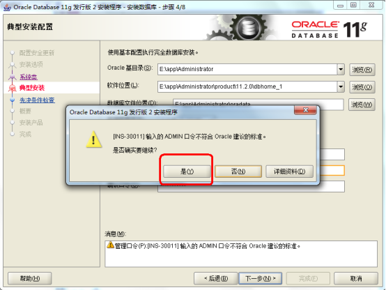

步骤 9

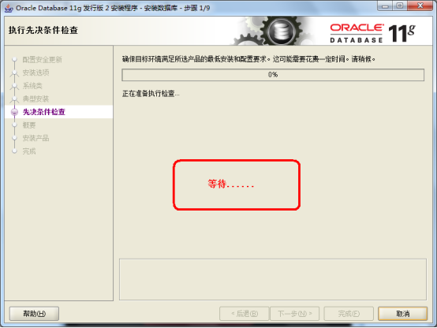

步骤 10

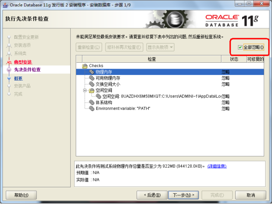

步骤 11

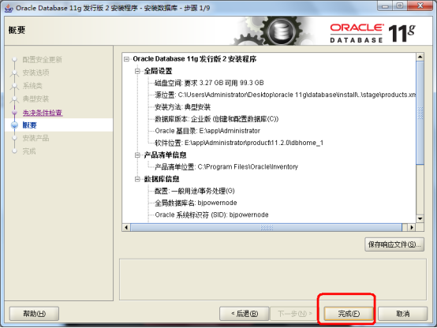

步骤 12

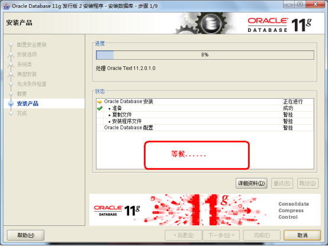

步骤 13

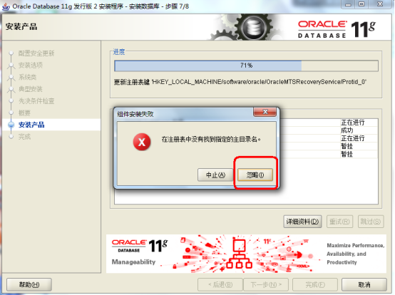

步骤 14

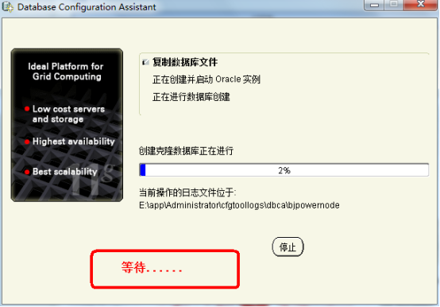

步骤 15

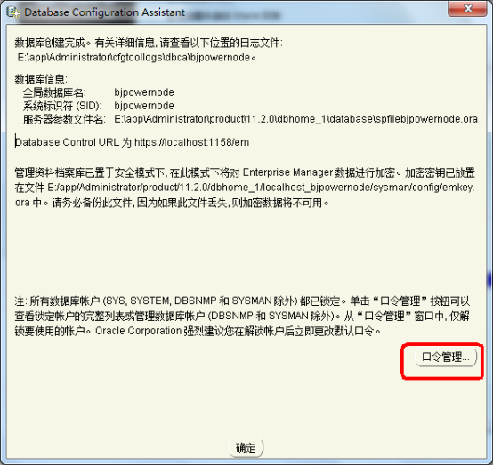

步骤 16

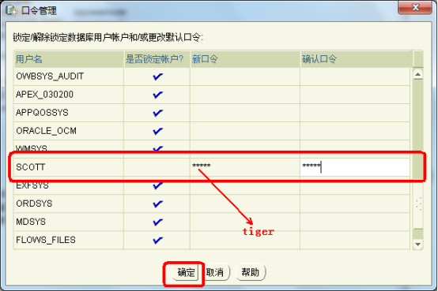

步骤 17

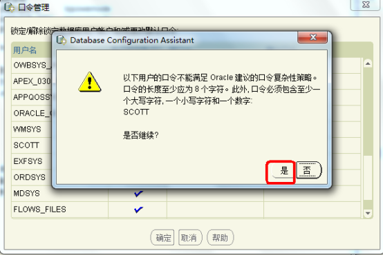

步骤 18

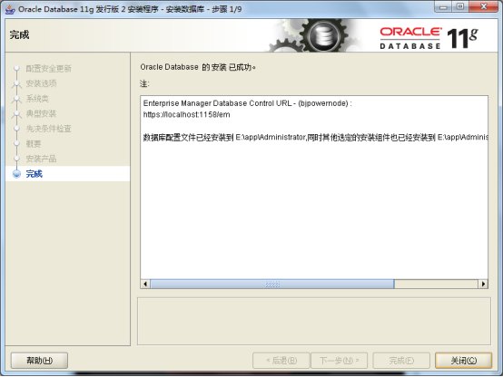

步骤 19

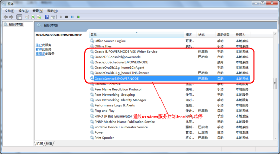

步骤 20

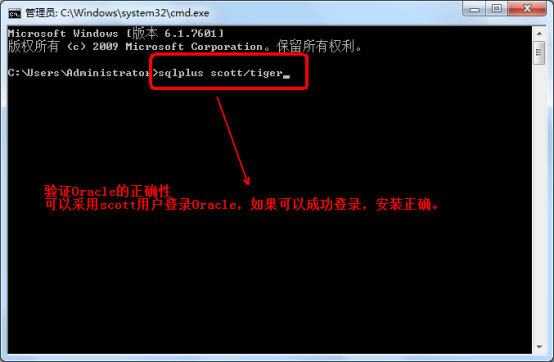

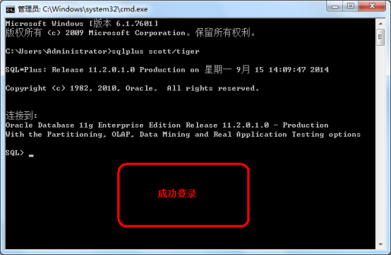