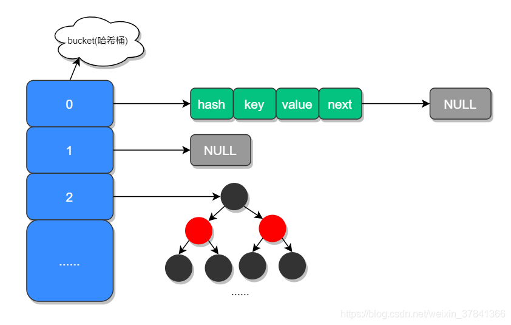
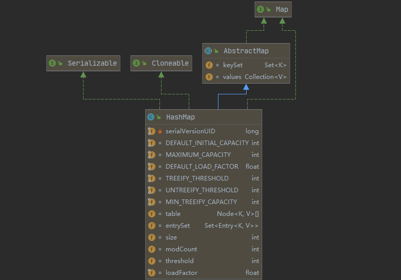
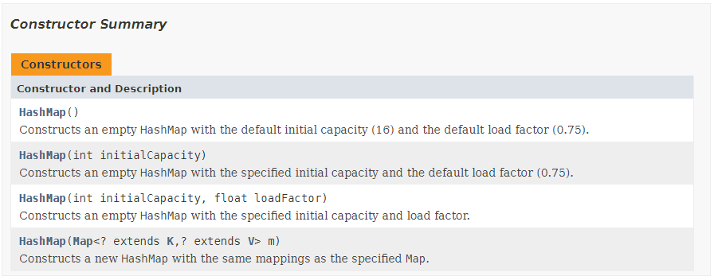
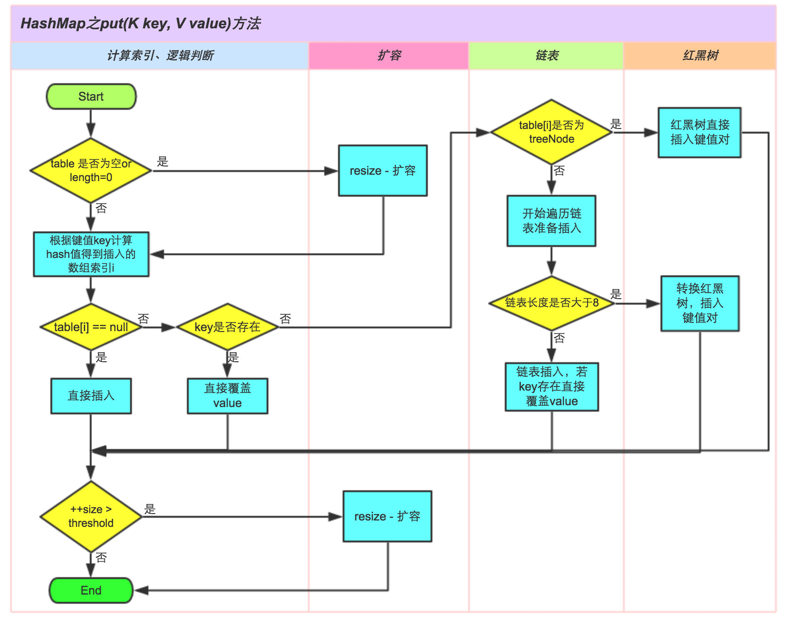
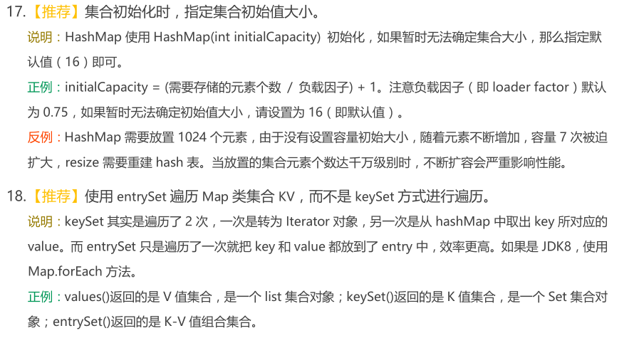
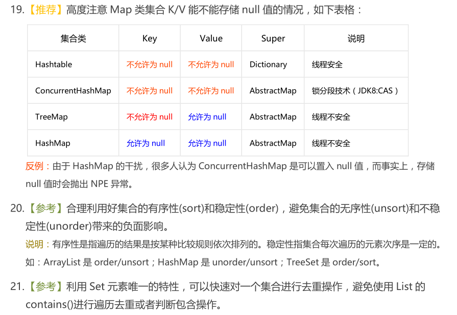

* Kramdown table of contents
{:toc .toc}
## HashMap 源码分析

### HashMap 底层数据结构

JDK 1.8 对 HashMap 进行了比较大的优化，底层实现由之前的"数组+链表"改为"数组+链表+红黑树"。数组是存储数据的主体，链表是为了解决哈希冲突而存在的。

当链表长度大于 8 并且数组容量大于等于 64 时，链表结构会转换成红黑树结构，当链表长度小于 6 时会将红黑树结构转换成链表结构，它的组成结构如下图所示：




Node 数组

```java
transient Node<K,V>[] table;
```

Node 是单向链表，它实现了 Map.Entry 接口。

```java
static class Node<K,V> implements Map.Entry<K,V> {
    final int hash;
    final K key;
    V value;
    Node<K,V> next;

    Node(int hash, K key, V value, Node<K,V> next) {
        this.hash = hash;
        this.key = key;
        this.value = value;
        this.next = next;
    }

    public final K getKey()        { return key; }
    public final V getValue()      { return value; }
    public final String toString() { return key + "=" + value; }
    public final int hashCode() {}
    public final V setValue(V newValue) {}
    public final boolean equals(Object o) {}
}
```

红黑树

```java
static final class TreeNode<K,V> extends LinkedHashMap.Entry<K,V> {
}
```

### HashMap 中的重要属性



```java
// 默认初始容量-必须为 2 的幂次方
static final int DEFAULT_INITIAL_CAPACITY = 1 << 4; // aka 16

// 最大容量
static final int MAXIMUM_CAPACITY = 1 << 30;

// 默认加载因子
static final float DEFAULT_LOAD_FACTOR = 0.75f;

// 链表转红黑树的阈值，当链表长度大于 8 并且数组容量大于等于 64 时，链表结构会转换成红黑树结构。
static final int TREEIFY_THRESHOLD = 8;

// 红黑树转链表的阈值，当链表长度小于 6 时会将红黑树结构转换成链表结构。
static final int UNTREEIFY_THRESHOLD = 6;

// 链表转红黑树的阈值，当链表长度大于 8 并且数组容量大于等于 64 时，链表结构会转换成红黑树结构。
static final int MIN_TREEIFY_CAPACITY = 64;

// table 数组的长度必须是 2 的幂次方
transient Node<K,V>[] table;

// Map.Entry<K,V> 缓存集合
transient Set<Map.Entry<K,V>> entrySet;

// HashMap 中存储的键值对的数量
transient int size;

// 修改次数，用于在迭代的时候执行快速失败策略。
transient int modCount;

// 扩容阈值，当 size>=threshold 时，就会扩容。(capacity * load factor)
int threshold;

// 加载因子
final float loadFactor;
```

### HashMap 中的重要方法

HashMap 的 4 个构造方法



tableSizeFor 返回大于等于输入参数且最近的 2 的整数次幂的数

```java
static final int tableSizeFor(int cap) {
    int n = cap - 1;
    n |= n >>> 1;
    n |= n >>> 2;
    n |= n >>> 4;
    n |= n >>> 8;
    n |= n >>> 16;
    return (n < 0) ? 1 : (n >= MAXIMUM_CAPACITY) ? MAXIMUM_CAPACITY : n + 1;
}
```

getOrDefault 获取或者设置默认值

```java
@Override
public V getOrDefault(Object key, V defaultValue) {
    Node<K,V> e;
    return (e = getNode(hash(key), key)) == null ? defaultValue : e.value;
}
```

HashMap put() 方法执行过程



```java
public V put(K key, V value) {
    return putVal(hash(key), key, value, false, true);
}
```

```java
final V putVal(int hash, K key, V value, boolean onlyIfAbsent,
               boolean evict) {
    Node<K,V>[] tab; Node<K,V> p; int n, i;
    if ((tab = table) == null || (n = tab.length) == 0)
        n = (tab = resize()).length;
    if ((p = tab[i = (n - 1) & hash]) == null)
        tab[i] = newNode(hash, key, value, null);
    else {
        Node<K,V> e; K k;
        if (p.hash == hash &&
            ((k = p.key) == key || (key != null && key.equals(k))))
            e = p;
        else if (p instanceof TreeNode)
            e = ((TreeNode<K,V>)p).putTreeVal(this, tab, hash, key, value);
        else {
            for (int binCount = 0; ; ++binCount) {
                if ((e = p.next) == null) {
                    p.next = newNode(hash, key, value, null);
                    if (binCount >= TREEIFY_THRESHOLD - 1) // -1 for 1st
                        treeifyBin(tab, hash);
                    break;
                }
                if (e.hash == hash &&
                    ((k = e.key) == key || (key != null && key.equals(k))))
                    break;
                p = e;
            }
        }
        if (e != null) { // existing mapping for key
            V oldValue = e.value;
            if (!onlyIfAbsent || oldValue == null)
                e.value = value;
            afterNodeAccess(e);
            return oldValue;
        }
    }
    ++modCount;
    if (++size > threshold)
        resize();
    afterNodeInsertion(evict);
    return null;
}
```

HashMap 的容量为什么是 2 的 幂次方？

> 当 HashMap 的容量 length 为 2 的幂次方时，h & (length - 1) == h % length，位运算快。

```java
static final int hash(Object key) {
    int h;
    return (key == null) ? 0 : (h = key.hashCode()) ^ (h >>> 16);
}
```

```java
static int indexFor(int h, int length) {
    return h & (length - 1);
}
```


HashMap 中 containsKey() 方法的时间复杂度是多少。

```java
public boolean containsKey(Object key) {
    return getNode(hash(key), key) != null;
}
```

```java
final Node<K,V> getNode(int hash, Object key) {
    Node<K,V>[] tab; Node<K,V> first, e; int n; K k;
    if ((tab = table) != null && (n = tab.length) > 0 &&
        (first = tab[(n - 1) & hash]) != null) {
        if (first.hash == hash && // always check first node
            ((k = first.key) == key || (key != null && key.equals(k))))
            return first;
        if ((e = first.next) != null) {
            if (first instanceof TreeNode)
                return ((TreeNode<K,V>)first).getTreeNode(hash, key);
            do {
                if (e.hash == hash &&
                    ((k = e.key) == key || (key != null && key.equals(k))))
                    return e;
            } while ((e = e.next) != null);
        }
    }
    return null;
}
```

## HashMap 常见的遍历方式

```java
public class TestMap {
    public static void main(String[] args) {
        Map<String, String> map = new HashMap<>();
        map.put("key a", "value a");
        map.put("key b", "value b");
        map.put("key c", "value c");
        map.put("key d", "value d");
        map.put("key e", "value e");

        // 方式一： map.entrySet()
        System.out.println("方式一： map.entrySet()");
        for (Map.Entry<String, String> entry : map.entrySet()) {
            entry.getKey();
            entry.getValue();
            System.out.println("key: " + entry.getKey() + ",  value: " + entry.getValue());
        }

        // 方式二：map.keySet()
        System.out.println("方式二：map.keySet()");
        Set<String> set = map.keySet();
        Collection<String> values = map.values();
        Iterator<String> iterator1 = map.keySet().iterator();
        Iterator<String> iterator2 = map.values().iterator();
        while (iterator1.hasNext()) {
            System.out.println("key: " + iterator1.next());
        }
        while (iterator2.hasNext()) {
            System.out.println("value: " + iterator2.next());
        }

        // 根据key查找值, 效率很低。
        System.out.println("根据key查找值, 效率很低。");
        for (String key : map.keySet()) {
            System.out.println("key: " + key + ",  value: " + map.get(key));
        }

        // 方式三：map.entrySet().iterator()
        System.out.println("方式三：map.entrySet().iterator()");
        Iterator<Map.Entry<String, String>> iterator3 = map.entrySet().iterator();
        while (iterator3.hasNext()) {
            Map.Entry<String, String> entry = iterator3.next();
            String key = entry.getKey();
            String value = entry.getValue();
            System.out.println("key: " + key + ",  value: " + value);
        }

        // 方式四: forEach
        System.out.println("方式四: forEach");
        map.forEach((key, value) -> System.out.println("Key = " + key + ", Value = " + value));

        // 方式五：map.entrySet().stream().forEach
        System.out.println("方式五：map.entrySet().stream().forEach");
        map.entrySet().stream().forEach(entry -> System.out.println("Key = " + entry.getKey() + ", Value = " + entry.getValue()));
    }
}
```

## 阿里巴巴 Java 开发规范





> 【参考】HashMap 在容量不够进行 resize 时由于高并发可能出现死链，导致 CPU 飙升，在开发过程中注意规避此风险。

## HashMap 线程不安全的原因

推荐阅读：[HashMap线程不安全的体现](https://www.cnblogs.com/developer_chan/p/10450908.html)

> 首先 HashMap 是线程不安全的，其主要体现：
>
> 1.在 JDK1.7 中，在多线程环境下，扩容时会造成环形链或数据丢失。
>
> 2.在 JDK1.8 中，在多线程环境下，会发生数据覆盖的情况。

## HashMap 的若干问题

- HashMap 和 Hashtable 的区别。它们的初始容量分别是多少，如何扩容的，底层数据结构是怎样的，线程安全吗。
- HashMap 的底层数据结构，默认容量是多少？处理 hash 冲突用的哪种方法。在什么情况下链表会转换为红黑树呢？为什么链表需要转换成红黑树呢？红黑树在什么情况下会转换成链表呢？
- HashMap 在多线程操作下会导致什么问题呢？怎么解决？get 需要加锁么，为什么？
- HashMap 在 JDK 1.8 中是线程安全的吗？为什么是线程不安全的？怎么让 HashMap 变得线程安全呢？
- HashMap 不是线程安全的，在高并发环境中做插入操作会出现什么情况？为什么？JDK 1.8 版本之前的 HashMap 有什么问题。HashMap 在什么情况下会出现死循环？JDK 1.8 之前并发操作 HashMap 时为什么会有死循环的问题？
- HashMap 的并发操作不安全体现在哪？HashMap 在扩容时，对读写操作有什么特殊处理?
- HashMap 的扩容时机 (什么时候会触发扩容)，扩容因子以及扩容机制是什么？扩容时避免 rehash 的优化。HashMap 扩容时每个 entry 需要再计算一次 hash 吗？HashMap 的数组长度为什么是 2 的 n 次幂？
- HashMap 的 set 和 get 方法的时间复杂度是多少？为什么是 O(1)？put 方法时如何确定元素的位置？
- HashMap 中使用到自定义类作为 key 时，需要怎么做？
- JDK 1.8 对 HashMap 做了一定的优化，大概是优化在哪里？为什么要做这样的优化？
- 一个非常多元素的 HashMap，rehash 非常耗时，所以需要在它 rehash 过程中还能 get、put，你有什么解决方案或者思路，谈谈你的理解。
- Java 中 HashMap 的存储，冲突，扩容， 并发访问分别是怎么解决的。
- HashMap 遍历元素的两种方式?HashMap 的数据结构能描述一下吗?put 的过程?get 的过程?什么时候触发 resize()?
- HashMap 有几种构造构造函数。HashMap 的遍历有几种方式，分别使用什么场景。
- HashMap 中 containsKey() 方法的时间复杂度是多少。

## 推荐阅读

- [https://coolshell.cn/articles/9606.html](https://coolshell.cn/articles/9606.html)
- [https://tech.meituan.com/2016/06/24/java-hashmap.html](https://tech.meituan.com/2016/06/24/java-hashmap.html)
- [https://docs.oracle.com/javase/8/docs/api/java/util/HashMap.html](https://docs.oracle.com/javase/8/docs/api/java/util/HashMap.html)
- [https://joonwhee.blog.csdn.net/article/details/78996181](https://joonwhee.blog.csdn.net/article/details/78996181)
- [https://www.xiaoheidiannao.com/66865.html](https://www.xiaoheidiannao.com/66865.html)
- [http://www.spring4all.com/article/15190](http://www.spring4all.com/article/15190)