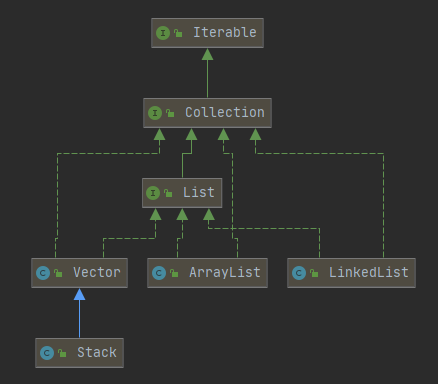

* Kramdown table of contents
{:toc .toc}
## 问题思考

- List 常用的实现类有哪些。
- ArrayList 和 LinkedList 的区别?ArrayList 和 LinkedList 特点及各自应用场景。这两种集台哪个比较占内存？
- 如何在遍历 ArrayList 时安全删除其中一个元素？
- CopyOnWriteArrayList 是如何保证线程安全的
- ArrayList 内部数据结构，数组扩容机制。
- LinkedList 内部数据结构，为什么使用双向链表。
- ArrayList 如何去重。
- ArrayList、LinkedList、Vector 的区别，怎么扩容的，有默认大小么？
- List、Set、Map 之间的区别？
- ArrayList 或者 HashMap 在 for 循环中可以调用 remove 方法移除集合中的元素吗？为什么？如果有这样的需求，需要怎么实现？
- ArrayList 的 add 方法有两种，add 到指定位置是怎么实现的？
- ArrayList 和 HashSet 之间有什么不同？在调用移除元素时，哪个效率更高？LinkedList 和以上两者有什么区别？
- 如何删除 ArrayList 中奇数位置的元素？

## List 接口概述

