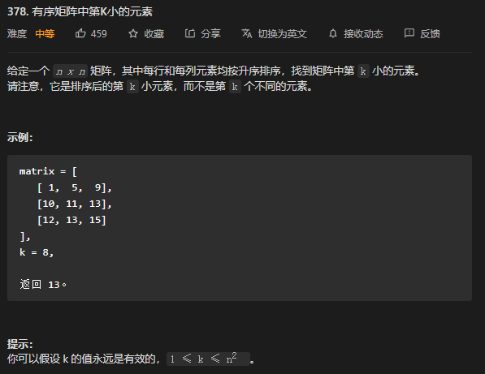

* Kramdown table of contents
{:toc .toc}
## 优先队列 PriorityQueue

## LeetCode 相关题目整理

### [23. 合并K个升序链表](https://leetcode-cn.com/problems/merge-k-sorted-lists/)

```java
class ListNode {
    int val;
    ListNode next;

    ListNode() {
    }

    ListNode(int val) {
        this.val = val;
    }

    ListNode(int val, ListNode next) {
        this.val = val;
        this.next = next;
    }
}

class Solution {
    public ListNode mergeKLists(ListNode[] lists) {
        PriorityQueue<ListNode> queue = new PriorityQueue<>((o1, o2) -> o1.val - o2.val);
        for (ListNode node : lists) {
            if (node != null) {
                queue.add(node);
            }
        }
        ListNode dummy = new ListNode(-1);
        ListNode cur = dummy;
        while (!queue.isEmpty()) {
            ListNode node = queue.poll();
            cur.next = node;
            if (node != null && node.next != null) {
                queue.add(node.next);
            }
            cur = cur.next;
        }
        return dummy.next;
    }
}
```

### [215. 数组中的第K个最大元素](https://leetcode-cn.com/problems/kth-largest-element-in-an-array/)

```java
class Solution {
    public int findKthLargest(int[] nums, int k) {
        PriorityQueue<Integer> queue = new PriorityQueue<>();
        for (int num : nums) {
            queue.add(num);
            if (queue.size() > k) {
                queue.poll();
            }
        }
        return queue.peek();
    }
}
```

### [239. 滑动窗口最大值](https://leetcode-cn.com/problems/sliding-window-maximum/)

★★★★☆

```java
class Solution {
    public int[] maxSlidingWindow(int[] a, int k) {
        if (a == null || k <= 0) {
            return new int[0];
        }
        int n = a.length;
        int[] r = new int[n - k + 1];
        int ri = 0;
        // store index
        Deque<Integer> q = new ArrayDeque<>();
        for (int i = 0; i < a.length; i++) {
            // remove numbers out of range k
            while (!q.isEmpty() && q.peek() < i - k + 1) {
                q.poll();
            }
            // remove smaller numbers in k range as they are useless
            while (!q.isEmpty() && a[q.peekLast()] < a[i]) {
                q.pollLast();
            }
            // q contains index... r contains content
            q.offer(i);
            if (i >= k - 1) {
                r[ri++] = a[q.peek()];
            }
        }
        return r;
    }
}
```

### [264. 丑数 II](https://leetcode-cn.com/problems/ugly-number-ii/)

★★★★☆

```java
class Solution {
    public int nthUglyNumber(int n) {
        PriorityQueue<Long> queue = new PriorityQueue<>();
        long ugly = 1;
        for (int i = 1; i < n; i++) {
            queue.add(ugly * 2);
            queue.add(ugly * 3);
            queue.add(ugly * 5);
            ugly = queue.poll();
            while (!queue.isEmpty() && ugly == queue.peek()) {
                queue.poll();
            }
        }
        return (int) ugly;
    }
}
```

```java
class Solution {
    public int nthUglyNumber(int n) {
        if (n <= 0) {
            throw new IllegalArgumentException("您输出的参数不正确！(n>=1的正整数)");
        }
        int[] ugly = new int[n];
        int idx2 = 0, idx3 = 0, idx5 = 0;
        int factor2 = 2, factor3 = 3, factor5 = 5;
        ugly[0] = 1;
        for (int i = 1; i < n; i++) {
            int min = Math.min(factor2, Math.min(factor3, factor5));
            ugly[i] = min;
            if (factor2 == min) {
                factor2 = 2 * ugly[++idx2];
            }
            if (factor3 == min) {
                factor3 = 3 * ugly[++idx3];
            }
            if (factor5 == min) {
                factor5 = 5 * ugly[++idx5];
            }
        }
        return ugly[n - 1];
    }
}
```

### [295. 数据流的中位数](https://leetcode-cn.com/problems/find-median-from-data-stream/)

### [剑指 Offer 41. 数据流中的中位数](https://leetcode-cn.com/problems/shu-ju-liu-zhong-de-zhong-wei-shu-lcof/)

### [面试题 17.20. 连续中值](https://leetcode-cn.com/problems/continuous-median-lcci/)


```java
class MedianFinder {
    private PriorityQueue<Integer> min;
    private PriorityQueue<Integer> max;

    /**
     * initialize your data structure here.
     */
    public MedianFinder() {
        min = new PriorityQueue<>(); // 最小堆，存储输入数据较大的一半
        max = new PriorityQueue<>((o1, o2) -> o2 - o1); // 最大堆，存储输入数据较小的一半
    }

    public void addNum(int num) {
        max.add(num);
        min.add(max.poll());
        if (max.size() < min.size()) {
            max.add(min.poll());
        }
    }

    public double findMedian() {
        if (max.size() == min.size()) {
            return (max.peek() + min.peek()) / 2.0;
        }
        return max.peek();
    }
}
```

### [347. 前 K 个高频元素](https://leetcode-cn.com/problems/top-k-frequent-elements/)

```java
class Solution {
    public int[] topKFrequent(int[] nums, int k) {
        Map<Integer, Integer> map = new HashMap<>();
        for (int num : nums) {
            map.put(num, map.getOrDefault(num, 0) + 1);
        }
        PriorityQueue<Map.Entry<Integer, Integer>> queue = new PriorityQueue<>((o1, o2) -> o2.getValue() - o1.getValue());
        for (Map.Entry<Integer, Integer> entry : map.entrySet()) {
            queue.add(entry);
        }
        int[] res = new int[k];
        for (int i = 0; i < k; i++) {
            res[i] = queue.poll().getKey();
        }
        return res;
    }
} 
```

```java
class Solution {
    public int[] topKFrequent(int[] nums, int k) {
        Map<Integer, Integer> map = new HashMap<>();
        for (int num : nums) {
            map.put(num, map.getOrDefault(num, 0) + 1);
        }
        PriorityQueue<Map.Entry<Integer, Integer>> queue = new PriorityQueue<>((o1, o2) -> o1.getValue() - o2.getValue());
        for (Map.Entry<Integer, Integer> entry : map.entrySet()) {
            queue.add(entry);
            if (queue.size() > k) {
                queue.poll();
            }
        }
        int[] res = new int[k];
        for (int i = 0; i < k; i++) {
            res[k - i - 1] = queue.poll().getKey();
        }
        return res;
    }
}
```

### [378. 有序矩阵中第K小的元素](https://leetcode-cn.com/problems/kth-smallest-element-in-a-sorted-matrix/)



```java
class Solution {
    public int kthSmallest(int[][] matrix, int k) {
        PriorityQueue<Integer> queue = new PriorityQueue<>((o1, o2) -> o2 - o1);
        for (int i = 0; i < matrix.length; i++) {
            for (int j = 0; j < matrix[i].length; j++) {
                queue.add(matrix[i][j]);
                if (queue.size() > k) {
                    queue.poll();
                }
            }
        }
        return queue.peek();
    }
}
```

### [451. 根据字符出现频率排序](https://leetcode-cn.com/problems/sort-characters-by-frequency/)

> 首先使用 Map 统计每个字符出现的次数，然后使用优先级队列 PriorityQueue 对次数进行排序。

```java
class Solution {
    public String frequencySort(String s) {
        Map<Character, Integer> map = new HashMap<>();
        for (char c : s.toCharArray()) {
            map.put(c, map.getOrDefault(c, 0) + 1);
        }
        StringBuffer sb = new StringBuffer();
        PriorityQueue<Map.Entry<Character, Integer>> queue = new PriorityQueue<>((o1, o2) -> o2.getValue() - o1.getValue());
        for (Map.Entry<Character, Integer> entry : map.entrySet()) {
            queue.add(entry);
        }
        while (!queue.isEmpty()) {
            Map.Entry<Character, Integer> entry = queue.poll();
            for (int i = 0; i < entry.getValue(); i++) {
                sb.append(entry.getKey());
            }
        }
        return sb.toString();
    }
}
```

### [692. 前K个高频单词](https://leetcode-cn.com/problems/top-k-frequent-words/)

```java
class Solution {
    public List<String> topKFrequent(String[] words, int k) {
        Map<String, Integer> map = new HashMap<>();
        for (String word : words) {
            map.put(word, map.getOrDefault(word, 0) + 1);
        }
        PriorityQueue<Map.Entry<String, Integer>> queue = new PriorityQueue<>((o1, o2) -> {
            if (o1.getValue() == o2.getValue()) {
                return o2.getKey().compareTo(o1.getKey());
            }
            return o1.getValue() - o2.getValue();
        });
        for (Map.Entry<String, Integer> entry : map.entrySet()) {
            queue.add(entry);
            if (queue.size() > k) {
                queue.poll();
            }
        }
        List<String> res = new ArrayList<>();
        while (!queue.isEmpty()) {
            res.add(0, queue.poll().getKey());
        }
        return res;
    }
}
```

### [703. 数据流中的第 K 大元素](https://leetcode-cn.com/problems/kth-largest-element-in-a-stream/)

```java
class KthLargest {
    private final PriorityQueue<Integer> queue;
    private final int k;

    public KthLargest(int k, int[] nums) {
        this.queue = new PriorityQueue<>();
        this.k = k;
        for (int num : nums) {
            add(num);
        }
    }

    public int add(int val) {
        if (queue.size() < k) {
            queue.offer(val);
        } else if (queue.peek() < val) {
            queue.poll();
            queue.offer(val);
        }
        return queue.peek();
    }
}
```

### [767. 重构字符串](https://leetcode-cn.com/problems/reorganize-string/)


### [剑指 Offer 40. 最小的k个数](https://leetcode-cn.com/problems/zui-xiao-de-kge-shu-lcof/)


```java
class Solution {
    public int[] getLeastNumbers(int[] arr, int k) {
        int[] res = new int[k];
        PriorityQueue<Integer> queue = new PriorityQueue<>((o1, o2) -> o2 - o1);
        for (int num : arr) {
            queue.add(num);
            if (queue.size() > k) {
                queue.poll();
            }
        }
        for (int i = 0; i < k; i++) {
            res[k - 1 - i] = queue.poll();
        }
        return res;
    }
}
```

```java
class Solution {
    public int[] getLeastNumbers(int[] arr, int k) {
        int[] res = new int[k];
        QuickSort.quickSort(arr, 0, arr.length - 1);
        for (int i = 0; i < k; i++) {
            res[i] = arr[i];
        }
        return res;
    }
}

class QuickSort {
    // 快速排序
    public static void quickSort(int[] nums, int start, int end) {
        if (start >= end) return;
        int i = start, j = end; // 左右指针
        int point = nums[start]; // 第一个元素作为基准点
        // i == j 的时候退出循环, 此时这个位置存放基准点
        while (i < j) {
            while (i < j && nums[j] > point) j--;
            if (i < j) nums[i++] = nums[j];
            while (i < j && nums[i] < point) i++;
            if (i < j) nums[j--] = nums[i];
        }
        nums[i] = point; // 或者 nums[j] = point; 此时 i == j, 基准点存放的位置
        quickSort(nums, start, i - 1); // 递归左半部分
        quickSort(nums, i + 1, end); // 递归右半部分
    }
}
```

### [面试题 17.14. 最小K个数](https://leetcode-cn.com/problems/smallest-k-lcci/)


```java
class Solution {
    public int[] smallestK(int[] arr, int k) {
        int[] res = new int[k];
        PriorityQueue<Integer> queue = new PriorityQueue<>((o1, o2) -> o2 - o1);
        for (int num : arr) {
            queue.add(num);
            if (queue.size() > k) {
                queue.poll();
            }
        }
        for (int i = 0; i < k; i++) {
            res[k - 1 - i] = queue.poll();
        }
        return res;
    }
}
```

```java
public class Solution {
    public int[] smallestK(int[] arr, int k) {
        int[] res = new int[k];
        QuickSort.quickSort(arr, 0, arr.length - 1);
        for (int i = 0; i < k; i++) {
            res[i] = arr[i];
        }
        return res;
    }
}

class QuickSort {
    // 快速排序
    public static void quickSort(int[] nums, int start, int end) {
        if (start >= end) return;
        int i = start, j = end; // 左右指针
        int point = nums[start]; // 第一个元素作为基准点
        // i == j 的时候退出循环, 此时这个位置存放基准点
        while (i < j) {
            while (i < j && nums[j] > point) j--;
            if (i < j) nums[i++] = nums[j];
            while (i < j && nums[i] < point) i++;
            if (i < j) nums[j--] = nums[i];
        }
        nums[i] = point; // 或者 nums[j] = point; 此时 i == j, 基准点存放的位置
        quickSort(nums, start, i - 1); // 递归左半部分
        quickSort(nums, i + 1, end); // 递归右半部分
    }
}
```

### [面试题 17.09. 第 k 个数](https://leetcode-cn.com/problems/get-kth-magic-number-lcci/)


## 推荐阅读

- [https://www.cnblogs.com/wmyskxz/p/9301021.html](https://www.cnblogs.com/wmyskxz/p/9301021.html)
- [https://leetcode-cn.com/problemset/all/](https://leetcode-cn.com/problemset/all/)