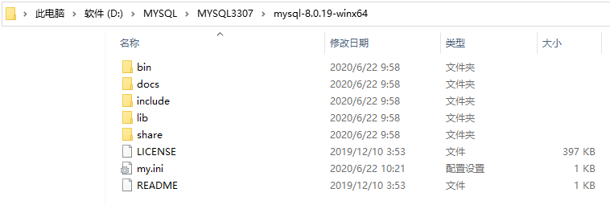

* Kramdown table of contents
{:toc .toc}
## 官网下载 MySQL

- [MySQL Community Downloads](https://dev.mysql.com/downloads/)

## 解压 MySQL 到指定的安装目录


## 在 MySQL 根目录下新建 my.ini 配置文件



my.ini 文件配置如下

```shell
[mysqld]
# 设置远程端口
port=3307
# 设置mysql安装目录
basedir=D:\MYSQL\MYSQL3307\mysql-8.0.19-winx64
# 设置mysql数据存放目录
datadir=D:\MYSQL\MYSQL3307\mysql-8.0.19-winx64\data
# 允许最大连接数
max_connections=200
# 允许连接失败的次数
max_connect_errors=10
# 设置服务端使用的字符集默认为utf8mb4
character-set-server=utf8mb4
# 创建新表时将使用的默认存储引擎
default-storage-engine=INNODB
# 默认使用mysql_native_password插件认证
default_authentication_plugin=mysql_native_password
# 去掉sql_mode中的only_full_group_by
sql_mode=strict_trans_tables,no_zero_in_date,no_zero_date,error_for_division_by_zero,no_engine_substitution
[mysql]
# 设置mysql客户端默认字符集
default-character-set=utf8mb4
[client]
# 设置mysql客户端连接服务端时默认使用的端口
port=3307
default-character-set=utf8mb4
```

> **注意事项**
>
> MySQL 端口需要修改两处, [mysqld] 和 [client] 下面的 port。
>
> basedir 和 datadir 需指定为自己 mysql 对应的路径。

## 安装 MySQL

> 进入到 MySQL 解压路径 bin 目录底下操作, 其中 MYSQL3307 为服务名, --defaults-file 指定自己的 my.ini。

### 指定 my.ini 初始化 MySQL

```shell
mysqld --defaults-file=D:\MYSQL\MYSQL3307\mysql-8.0.19-winx64\my.ini --initialize --console
```

### 安装 MySQL 服务

```shell
mysqld --install MYSQL3307 --defaults-file=D:\MYSQL\MYSQL3307\mysql-8.0.19-winx64\my.ini
```

### 启动 MySQL 服务

```shell
net start MYSQL3307
```

### 停止 MySQL 服务

```shell
net stop MYSQL3307
```

### 卸载 MySQL 服务

```shell
mysqld --remove MYSQL3307
```

### 登录 MySQL

```shell
mysql -h localhost -u root -P 3307 -p
```

### 修改 MySQL 密码

```shell
alter user 'root'@'localhost' identified with mysql_native_password by '123456';
flush privileges;
```

## 开启 MySQL 远程访问

### 方式一

```shell
use mysql;

create user 'root'@'%' identified by '123456';

grant all on *.* to 'root'@'%';

alter user 'root'@'%' identified with mysql_native_password by '123456';

flush privileges;
```

### 方式二

```shell
use mysql;

select user,authentication_string,host from user;

update user set host = '%' where user = 'root';

flush privileges;

alter user 'root'@'%' identified with mysql_native_password by '123456';
```

