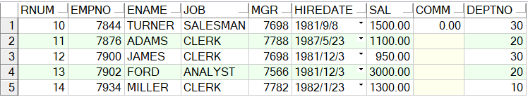

* Kramdown table of contents
{:toc .toc}
## 一、Oracle 数据库分页查询的三种方法

> 不能对 rownum 使用 >（大于或等于 1 的数值）、>=（大于 1 的数值）、=（不等于 1 的数值），否则无结果。所以直接用 rownum 的时候只能从 1 开始，
> 比如 rownum >1 没有记录，因为第一条不满足去掉的话，第二条的 rownum 又成了 1，所以永远没有满足条件的记录。

```sql
SELECT *
FROM emp
WHERE rownum >= 1;
```


以下 sql 均无结果（错误示范）

```sql
SELECT *
FROM emp
WHERE rownum > 1;

SELECT *
FROM emp
WHERE rownum >= 2;

SELECT *
FROM emp
WHERE rownum = 0;

SELECT *
FROM emp
WHERE rownum < 1;
```

## 二、rownum 不从 1 开始分页查询的三种方法

```sql
SELECT *
FROM (
	SELECT rownum AS rnum, e.*
	FROM emp e
)
WHERE rnum >= 10;
```



### 1. 分页查询方式一

```sql
SELECT *
FROM (
	SELECT rownum AS rnum, e.*
	FROM emp e
	WHERE rownum <= 10
)
WHERE rnum >= 5;
```


### 2. 分页查询方式二

```sql
SELECT *
FROM (
	SELECT rownum AS rnum, e.*
	FROM emp e
)
WHERE rnum BETWEEN 3 AND 6;
```


### 3. 分页查询方式三

```sql
SELECT *
FROM (
	SELECT rownum AS rnum, e.*
	FROM (
		SELECT *
		FROM emp
	) e
	WHERE rownum <= 10
)
WHERE rnum >= 8;
```

