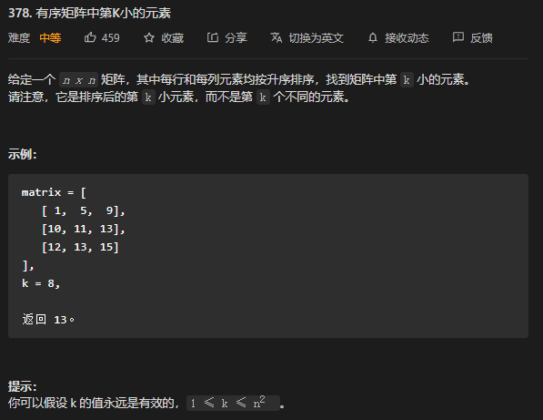
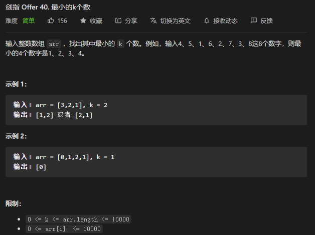
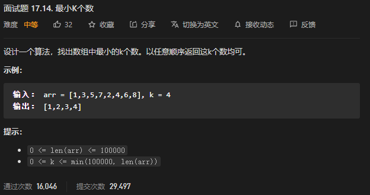
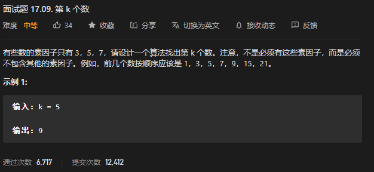

* Kramdown table of contents
{:toc .toc}
## Top k 问题

> Top K 问题一般的解决思路是采用"优先级队列"或者"快速选择算法"。

## LeetCode 相关题目整理

### [215. 数组中的第K个最大元素](https://leetcode-cn.com/problems/kth-largest-element-in-an-array/)

```java
class Solution {
    public int findKthLargest(int[] nums, int k) {
        PriorityQueue<Integer> queue = new PriorityQueue<>();
        for (int num : nums) {
            queue.add(num);
            if (queue.size() > k) {
                queue.poll();
            }
        }
        return queue.peek();
    }
}
```

### [347. 前 K 个高频元素](https://leetcode-cn.com/problems/top-k-frequent-elements/)

```java
class Solution {
    public int[] topKFrequent(int[] nums, int k) {
        Map<Integer, Integer> map = new HashMap<>();
        for (int num : nums) {
            map.put(num, map.getOrDefault(num, 0) + 1);
        }
        PriorityQueue<Map.Entry<Integer, Integer>> queue = new PriorityQueue<>((o1, o2) -> o2.getValue() - o1.getValue());
        for (Map.Entry<Integer, Integer> entry : map.entrySet()) {
            queue.add(entry);
        }
        int[] res = new int[k];
        for (int i = 0; i < k; i++) {
            res[i] = queue.poll().getKey();
        }
        return res;
    }
} 
```

```java
class Solution {
    public int[] topKFrequent(int[] nums, int k) {
        Map<Integer, Integer> map = new HashMap<>();
        for (int num : nums) {
            map.put(num, map.getOrDefault(num, 0) + 1);
        }
        PriorityQueue<Map.Entry<Integer, Integer>> queue = new PriorityQueue<>((o1, o2) -> o1.getValue() - o2.getValue());
        for (Map.Entry<Integer, Integer> entry : map.entrySet()) {
            queue.add(entry);
            if (queue.size() > k) {
                queue.poll();
            }
        }
        int[] res = new int[k];
        for (int i = 0; i < k; i++) {
            res[k - i - 1] = queue.poll().getKey();
        }
        return res;
    }
}
```

### [692. 前K个高频单词](https://leetcode-cn.com/problems/top-k-frequent-words/)

```java
class Solution {
    public List<String> topKFrequent(String[] words, int k) {
        Map<String, Integer> map = new HashMap<>();
        for (String word : words) {
            map.put(word, map.getOrDefault(word, 0) + 1);
        }
        PriorityQueue<Map.Entry<String, Integer>> queue = new PriorityQueue<>((o1, o2) -> {
            if (o1.getValue() == o2.getValue()) {
                return o2.getKey().compareTo(o1.getKey());
            }
            return o1.getValue() - o2.getValue();
        });
        for (Map.Entry<String, Integer> entry : map.entrySet()) {
            queue.add(entry);
            if (queue.size() > k) {
                queue.poll();
            }
        }
        List<String> res = new ArrayList<>();
        while (!queue.isEmpty()) {
            res.add(0, queue.poll().getKey());
        }
        return res;
    }
}
```

### [414. 第三大的数](https://leetcode-cn.com/problems/third-maximum-number/)

### [973. 最接近原点的 K 个点](https://leetcode-cn.com/problems/k-closest-points-to-origin/)

### [378. 有序矩阵中第K小的元素](https://leetcode-cn.com/problems/kth-smallest-element-in-a-sorted-matrix/)



```java
class Solution {
    public int kthSmallest(int[][] matrix, int k) {
        PriorityQueue<Integer> queue = new PriorityQueue<>((o1, o2) -> o2 - o1);
        for (int i = 0; i < matrix.length; i++) {
            for (int j = 0; j < matrix[i].length; j++) {
                queue.add(matrix[i][j]);
                if (queue.size() > k) {
                    queue.poll();
                }
            }
        }
        return queue.peek();
    }
}
```

### [703. 数据流中的第 K 大元素](https://leetcode-cn.com/problems/kth-largest-element-in-a-stream/)

```java
class KthLargest {
    private final PriorityQueue<Integer> queue;
    private final int k;

    public KthLargest(int k, int[] nums) {
        this.queue = new PriorityQueue<>();
        this.k = k;
        for (int num : nums) {
            add(num);
        }
    }

    public int add(int val) {
        if (queue.size() < k) {
            queue.offer(val);
        } else if (queue.peek() < val) {
            queue.poll();
            queue.offer(val);
        }
        return queue.peek();
    }
}
```

### [剑指 Offer 40. 最小的k个数](https://leetcode-cn.com/problems/zui-xiao-de-kge-shu-lcof/)



```java
class Solution {
    public int[] getLeastNumbers(int[] arr, int k) {
        int[] res = new int[k];
        PriorityQueue<Integer> queue = new PriorityQueue<>((o1, o2) -> o2 - o1);
        for (int num : arr) {
            queue.add(num);
            if (queue.size() > k) {
                queue.poll();
            }
        }
        for (int i = 0; i < k; i++) {
            res[k - 1 - i] = queue.poll();
        }
        return res;
    }
}
```

```java
class Solution {
    public int[] getLeastNumbers(int[] arr, int k) {
        int[] res = new int[k];
        QuickSort.quickSort(arr, 0, arr.length - 1);
        for (int i = 0; i < k; i++) {
            res[i] = arr[i];
        }
        return res;
    }
}

class QuickSort {
    // 快速排序
    public static void quickSort(int[] nums, int start, int end) {
        if (start >= end) return;
        int i = start, j = end; // 左右指针
        int point = nums[start]; // 第一个元素作为基准点
        // i == j 的时候退出循环, 此时这个位置存放基准点
        while (i < j) {
            while (i < j && nums[j] > point) j--;
            if (i < j) nums[i++] = nums[j];
            while (i < j && nums[i] < point) i++;
            if (i < j) nums[j--] = nums[i];
        }
        nums[i] = point; // 或者 nums[j] = point; 此时 i == j, 基准点存放的位置
        quickSort(nums, start, i - 1); // 递归左半部分
        quickSort(nums, i + 1, end); // 递归右半部分
    }
}
```

### [面试题 17.14. 最小K个数](https://leetcode-cn.com/problems/smallest-k-lcci/)



```java
class Solution {
    public int[] smallestK(int[] arr, int k) {
        int[] res = new int[k];
        PriorityQueue<Integer> queue = new PriorityQueue<>((o1, o2) -> o2 - o1);
        for (int num : arr) {
            queue.add(num);
            if (queue.size() > k) {
                queue.poll();
            }
        }
        for (int i = 0; i < k; i++) {
            res[k - 1 - i] = queue.poll();
        }
        return res;
    }
}
```

```java
public class Solution {
    public int[] smallestK(int[] arr, int k) {
        int[] res = new int[k];
        QuickSort.quickSort(arr, 0, arr.length - 1);
        for (int i = 0; i < k; i++) {
            res[i] = arr[i];
        }
        return res;
    }
}

class QuickSort {
    // 快速排序
    public static void quickSort(int[] nums, int start, int end) {
        if (start >= end) return;
        int i = start, j = end; // 左右指针
        int point = nums[start]; // 第一个元素作为基准点
        // i == j 的时候退出循环, 此时这个位置存放基准点
        while (i < j) {
            while (i < j && nums[j] > point) j--;
            if (i < j) nums[i++] = nums[j];
            while (i < j && nums[i] < point) i++;
            if (i < j) nums[j--] = nums[i];
        }
        nums[i] = point; // 或者 nums[j] = point; 此时 i == j, 基准点存放的位置
        quickSort(nums, start, i - 1); // 递归左半部分
        quickSort(nums, i + 1, end); // 递归右半部分
    }
}
```

### [面试题 17.09. 第 k 个数](https://leetcode-cn.com/problems/get-kth-magic-number-lcci/)



### [440. 字典序的第K小数字](https://leetcode-cn.com/problems/k-th-smallest-in-lexicographical-order/)

### [373. 查找和最小的K对数字](https://leetcode-cn.com/problems/find-k-pairs-with-smallest-sums/)

### [786. 第 K 个最小的素数分数](https://leetcode-cn.com/problems/k-th-smallest-prime-fraction/)

### [1439. 有序矩阵中的第 k 个最小数组和](https://leetcode-cn.com/problems/find-the-kth-smallest-sum-of-a-matrix-with-sorted-rows/)

### [451. 根据字符出现频率排序](https://leetcode-cn.com/problems/sort-characters-by-frequency/)

### [23. 合并K个升序链表](https://leetcode-cn.com/problems/merge-k-sorted-lists/)

## 推荐阅读

- [https://www.cnblogs.com/wmyskxz/p/9301021.html](https://www.cnblogs.com/wmyskxz/p/9301021.html)
- [https://leetcode-cn.com/problemset/all/](https://leetcode-cn.com/problemset/all/)