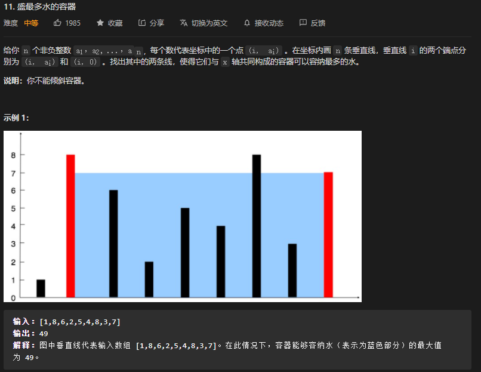

* Kramdown table of contents
{:toc .toc}
## 推荐阅读

- [https://www.nowcoder.com/ta/job-code-high](https://www.nowcoder.com/ta/job-code-high)

## 面试必考真题

### [100. 相同的树](https://leetcode-cn.com/problems/same-tree/)

> 解题思路：递归，深度优先搜索。两个二叉树相同，当且仅当两个二叉树的结构完全相同且所有对应节点的值相同。因此，可以通过搜索的方式判断两个二叉树是否相同。
>

### [572. 另一个树的子树](https://leetcode-cn.com/problems/subtree-of-another-tree/)

### [剑指 Offer 26. 树的子结构](https://leetcode-cn.com/problems/shu-de-zi-jie-gou-lcof/)

### [判断t1树中是否有与t2树拓扑结构完全相同的子树](https://www.nowcoder.com/practice/4eaccec5ee8f4fe8a4309463b807a542)

```java
public class Solution {
    public boolean isContains(TreeNode root1, TreeNode root2) {
        if (root2 == null) {
            return true;
        } else if (root1 == null) {
            return false;
        }
        if (isSameTree(root1, root2)) {
            return true;
        }
        return isContains(root1.left, root2) || isContains(root1.right, root2);
    }

    public boolean isSameTree(TreeNode p, TreeNode q) {
        if (p == null && q == null) {
            return true;
        } else if (p == null || q == null) {
            return false;
        }
        return p.val == q.val && isSameTree(p.left, q.left) && isSameTree(p.right, q.right);
    }
}
```

### [108. 将有序数组转换为二叉搜索树](https://leetcode-cn.com/problems/convert-sorted-array-to-binary-search-tree/)

### [将升序数组转化为平衡二叉搜索树](https://www.nowcoder.com/practice/7e5b00f94b254da599a9472fe5ab283d)

### [109. 有序链表转换二叉搜索树](https://leetcode-cn.com/problems/convert-sorted-list-to-binary-search-tree/)

### [876. 链表的中间结点](https://leetcode-cn.com/problems/middle-of-the-linked-list/)

### [11. 盛最多水的容器](https://leetcode-cn.com/problems/container-with-most-water/)



> 本题是一道经典的面试题，最优的做法是使用「双指针」。如果读者第一次看到这题，不一定能想出双指针的做法。

```java
class Solution {
    public int maxArea(int[] height) {
        int left = 0, right = height.length - 1;
        int max = 0;
        while (left < right) {
            if (height[left] < height[right]) {
                max = Math.max(max, (right - left) * height[left]);
                left++;
            } else {
                max = Math.max(max, (right - left) * height[right]);
                right--;
            }
        }
        return max;
    }
}
```

### [容器盛水问题](https://www.nowcoder.com/practice/31c1aed01b394f0b8b7734de0324e00f)

> 解题思路：双指针，此题比较困难，有待研究。
>

### [比较版本号](https://www.nowcoder.com/practice/2b317e02f14247a49ffdbdba315459e7)

```java
public class Solution {
    public int compare(String version1, String version2) {
        String[] arr1 = version1.split("\\.");
        String[] arr2 = version2.split("\\.");
        int len1 = arr1.length, len2 = arr2.length;
        int index1 = 0, index2 = 0;
        while (index1 < len1 && index2 < len2) {
            if (Integer.parseInt(arr1[index1]) < Integer.parseInt(arr2[index2])) {
                return -1;
            } else if (Integer.parseInt(arr1[index1]) > Integer.parseInt(arr2[index2])) {
                return 1;
            } else {
                index1++;
                index2++;
            }
        }
        if (len1 < len2) {
            return -1;
        } else if (len1 > len2) {
            return 1;
        } else {
            return 0;
        }
    }
}
```

### [大数加法](https://www.nowcoder.com/practice/11ae12e8c6fe48f883cad618c2e81475)

```java
public class Solution {
    public String solve(String s, String t) {
        if (s == null) {
            return t;
        } else if (t == null) {
            return s;
        }
        char[] arr1 = s.toCharArray();
        char[] arr2 = t.toCharArray();
        int index1 = arr1.length - 1, index2 = arr2.length - 1;
        int sum, cnt = 0;
        StringBuffer sb = new StringBuffer();
        while (index1 >= 0 || index2 >= 0) {
            sum = cnt;
            if (index1 >= 0) {
                sum += Integer.parseInt(arr1[index1--] + "");
            }
            if (index2 >= 0) {
                sum += Integer.parseInt(arr2[index2--] + "");
            }
            cnt = sum / 10;
            sb.insert(0, sum % 10);
        }
        if (cnt == 1) {
            sb.insert(0, 1);
        }
        return sb.toString();
    }
}
```

### [415. 字符串相加](https://leetcode-cn.com/problems/add-strings/)

```java
public class Solution {
    public String addStrings(String s, String t) {
        if (s == null) {
            return t;
        } else if (t == null) {
            return s;
        }
        char[] arr1 = s.toCharArray();
        char[] arr2 = t.toCharArray();
        int index1 = arr1.length - 1, index2 = arr2.length - 1;
        int sum, cnt = 0;
        StringBuffer sb = new StringBuffer();
        while (index1 >= 0 || index2 >= 0) {
            sum = cnt;
            if (index1 >= 0) {
                sum += Integer.parseInt(arr1[index1--] + "");
            }
            if (index2 >= 0) {
                sum += Integer.parseInt(arr2[index2--] + "");
            }
            cnt = sum / 10;
            sb.insert(0, sum % 10);
        }
        if (cnt == 1) {
            sb.insert(0, 1);
        }
        return sb.toString();
    }
}
```

### [剑指 Offer 67. 把字符串转换成整数](https://leetcode-cn.com/problems/ba-zi-fu-chuan-zhuan-huan-cheng-zheng-shu-lcof/)

### [43. 字符串相乘](https://leetcode-cn.com/problems/multiply-strings/)

### [93. 复原IP地址](https://leetcode-cn.com/problems/restore-ip-addresses/)

### [数字字符串转化成IP地址](https://www.nowcoder.com/practice/ce73540d47374dbe85b3125f57727e1e)

### [1108. IP 地址无效化](https://leetcode-cn.com/problems/defanging-an-ip-address/)

### [468. 验证IP地址](https://leetcode-cn.com/problems/validate-ip-address/)

### [验证IP地址](https://www.nowcoder.com/practice/55fb3c68d08d46119f76ae2df7566880)

### [102. 二叉树的层序遍历](https://leetcode-cn.com/problems/binary-tree-level-order-traversal/)

> 解题思路：
>
> BFS 广度优先搜索（迭代）
>
> DFS 深度优先搜索 （递归）
>
> 考察过的企业：滴滴

> BFS 广度优先搜索

```java
class Solution {
    public List<List<Integer>> levelOrder(TreeNode root) {
        List<List<Integer>> res = new ArrayList<>();
        if (root == null) {
            return res;
        }
        Queue<TreeNode> queue = new LinkedList<>();
        queue.add(root);
        while (!queue.isEmpty()) {
            int size = queue.size();
            List<Integer> list = new ArrayList<>();
            for (int i = 0; i < size; i++) {
                TreeNode node = queue.poll();
                list.add(node.val);
                if (node.left != null) {
                    queue.add(node.left);
                }
                if (node.right != null) {
                    queue.add(node.right);
                }
            }
            res.add(list);
        }
        return res;
    }
}
```

> DFS 深度优先搜索
>

```java
class Solution {
    public List<List<Integer>> levelOrder(TreeNode root) {
        List<List<Integer>> res = new ArrayList<>();
        if (root == null) {
            return res;
        }
        dfs(res, root, 0);
        return res;
    }

    public void dfs(List<List<Integer>> res, TreeNode root, int height) {
        if (root == null) {
            return;
        }
        if (height == res.size()) {
            res.add(new LinkedList<>());
        }
        res.get(height).add(root.val);
        dfs(res, root.left, height + 1);
        dfs(res, root.right, height + 1);
    }
}
```

### [235. 二叉搜索树的最近公共祖先](https://leetcode-cn.com/problems/lowest-common-ancestor-of-a-binary-search-tree/)

### [2. 两数相加](https://leetcode-cn.com/problems/add-two-numbers/)

### [面试题 02.05. 链表求和](https://leetcode-cn.com/problems/sum-lists-lcci/)

> 输入：(2 -> 4 -> 3) + (5 -> 6 -> 4)
> 输出：7 -> 0 -> 8
> 原因：342 + 465 = 807
>
> 此题的巧妙之处就在于链表的头部就是数字的低位，可以直接遍历链表相加。

```java
class Solution {
    public ListNode addTwoNumbers(ListNode l1, ListNode l2) {
        if (l1 == null || l2 == null) {
            return l1 == null ? l2 : l1;
        }
        ListNode dummy = new ListNode(-1);
        ListNode cur = dummy;
        int sum, cnt = 0;
        while (l1 != null || l2 != null) {
            sum = cnt;
            if (l1 != null) {
                sum += l1.val;
                l1 = l1.next;
            }
            if (l2 != null) {
                sum += l2.val;
                l2 = l2.next;
            }
            cnt = sum / 10;
            cur.next = new ListNode(sum % 10);
            cur = cur.next;
        }
        if (cnt == 1) {
            cur.next = new ListNode(1);
        }
        return dummy.next;
    }
}
```

### [445. 两数相加 II](https://leetcode-cn.com/problems/add-two-numbers-ii/)

```java
class Solution {
    public ListNode addTwoNumbers(ListNode l1, ListNode l2) {
        if (l1 == null || l2 == null) {
            return l1 == null ? l2 : l1;
        }
        Stack<Integer> s1 = new Stack<>();
        Stack<Integer> s2 = new Stack<>();
        while (l1 != null) {
            s1.push(l1.val);
            l1 = l1.next;
        }
        while (l2 != null) {
            s2.push(l2.val);
            l2 = l2.next;
        }
        ListNode cur = null;
        ListNode pre = null;
        int sum, cnt = 0;
        while (!s1.isEmpty() || !s2.isEmpty()) {
            sum = cnt;
            if (!s1.isEmpty()) {
                sum += s1.pop();
            }
            if (!s2.isEmpty()) {
                sum += s2.pop();
            }

            cur = new ListNode(sum % 10);
            cur.next = pre;
            pre = cur;

            cnt = sum / 10;
        }
        if (cnt != 0) {
            cur = new ListNode(cnt);
            cur.next = pre;
        }
        return cur;
    }
}
```

### [剑指 Offer 52. 两个链表的第一个公共节点](https://leetcode-cn.com/problems/liang-ge-lian-biao-de-di-yi-ge-gong-gong-jie-dian-lcof/)

### [160. 相交链表](https://leetcode-cn.com/problems/intersection-of-two-linked-lists/)

> 利用集合 set 唯一性的特点
>

```java
public class Solution {
    public ListNode getIntersectionNode(ListNode headA, ListNode headB) {
        if (headA == null || headB == null) {
            return null;
        }
        Set<ListNode> set = new HashSet<>();
        while (headA != null) {
            set.add(headA);
            headA = headA.next;
        }
        while (headB != null) {
            if (!set.add(headB)) {
                return headB;
            }
            headB = headB.next;
        }
        return null;
    }
}
```

```java
public class Solution {
    public ListNode getIntersectionNode(ListNode headA, ListNode headB) {
        if (headA == null || headB == null) {
            return null;
        }
        ListNode a = headA, b = headB;
        while (a != b) {
            a = a == null ? headB : a.next;
            b = b == null ? headA : b.next;
        }
        return a;
    }
}
```

### [235. 二叉搜索树的最近公共祖先](https://leetcode-cn.com/problems/lowest-common-ancestor-of-a-binary-search-tree/)

```java
class Solution {
    public TreeNode lowestCommonAncestor(TreeNode root, TreeNode p, TreeNode q) {
        int parentVal = root.val;
        if (p.val > parentVal && q.val > parentVal) {
            return lowestCommonAncestor(root.right, p, q);
        } else if (p.val < parentVal && q.val < parentVal) {
            return lowestCommonAncestor(root.left, p, q);
        } else {
            return root;
        }
    }
}
```

### [236. 二叉树的最近公共祖先](https://leetcode-cn.com/problems/lowest-common-ancestor-of-a-binary-tree/)

```java
class Solution {
    public TreeNode lowestCommonAncestor(TreeNode root, TreeNode p, TreeNode q) {
        if (root == null || root == p || root == q) {
            return root;
        }
        TreeNode left = lowestCommonAncestor(root.left, p, q);
        TreeNode right = lowestCommonAncestor(root.right, p, q);
        if (left == null || right == null) {
            return left == null ? right : left;
        }
        return root;
    }
}
```

### [剑指 Offer 09. 用两个栈实现队列](https://leetcode-cn.com/problems/yong-liang-ge-zhan-shi-xian-dui-lie-lcof/)

```java
class CQueue {
    Stack<Integer> input = new Stack();
    Stack<Integer> output = new Stack();

    public CQueue() {

    }
    
    public void appendTail(int value) {
        input.push(value);
    }
    
    public int deleteHead() {
        if(output.isEmpty()) {
            while(!input.isEmpty()) {
                output.push(input.pop());
            }
        }
        if(output.isEmpty()) {
            return -1;
        }
        return output.pop();
    }
}
```

### [232. 用栈实现队列](https://leetcode-cn.com/problems/implement-queue-using-stacks/)

```java
public class MyQueue {
    Stack<Integer> stack1, stack2;

    /** Initialize your data structure here. */
    public MyQueue() {
        stack1 = new Stack();
        stack2 = new Stack();
    }

    /** Push element x to the back of queue. */
    public void push(int x) {
        stack1.push(x);
    }

    /** Removes the element from in front of queue and returns that element. */
    public int pop() {
        peek();
        return stack2.pop();
    }

    /** Get the front element. */
    public int peek() {
        if(stack2.isEmpty()) {
            while(!stack1.isEmpty()) {
                stack2.push(stack1.pop());
            }
        }
        return stack2.peek();
    }

    /** Returns whether the queue is empty. */
    public boolean empty() {
        return stack1.isEmpty() && stack2.isEmpty();
    }
}
```

### [225. 用队列实现栈](https://leetcode-cn.com/problems/implement-stack-using-queues/)

```java
class MyStack {
    Queue<Integer> queue = new LinkedList<>();

    /** Initialize your data structure here. */
    public MyStack() {

    }

    /** Push element x onto stack. */
    public void push(int x) {
        queue.offer(x);
        for (int i = 1; i < queue.size(); i++) {
            queue.offer(queue.remove());
        }
    }

    /** Removes the element on top of the stack and returns that element. */
    public int pop() {
        return queue.remove();
    }

    /** Get the top element. */
    public int top() {
        return queue.element();
    }

    /** Returns whether the stack is empty. */
    public boolean empty() {
        return queue.isEmpty();
    }
}
```

### [704. 二分查找](https://leetcode-cn.com/problems/binary-search/)

> 考察过的企业：博主新东方二面、滴滴一面

```java
class Solution {
    public int search(int[] nums, int target) {
        int left = 0, right = nums.length - 1;
        while (left <= right) {
            int mid = left + (right - left) / 2;
            if (nums[mid] == target) {
                return mid;
            } else if (nums[mid] < target) {
                left = mid + 1;
            } else if (nums[mid] > target) {
                right = mid - 1;
            }
        }
        return -1;
    }
}
```

### [剑指 Offer 24. 反转链表](https://leetcode-cn.com/problems/fan-zhuan-lian-biao-lcof/)

### [206. 反转链表](https://leetcode-cn.com/problems/reverse-linked-list/)

> 考察过的企业：滴滴

### [92. 反转链表 II](https://leetcode-cn.com/problems/reverse-linked-list-ii/)


