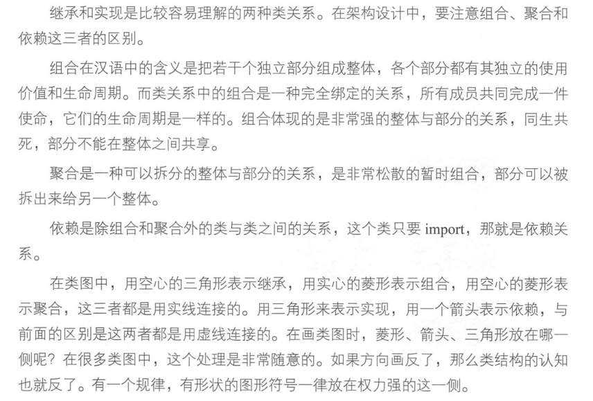
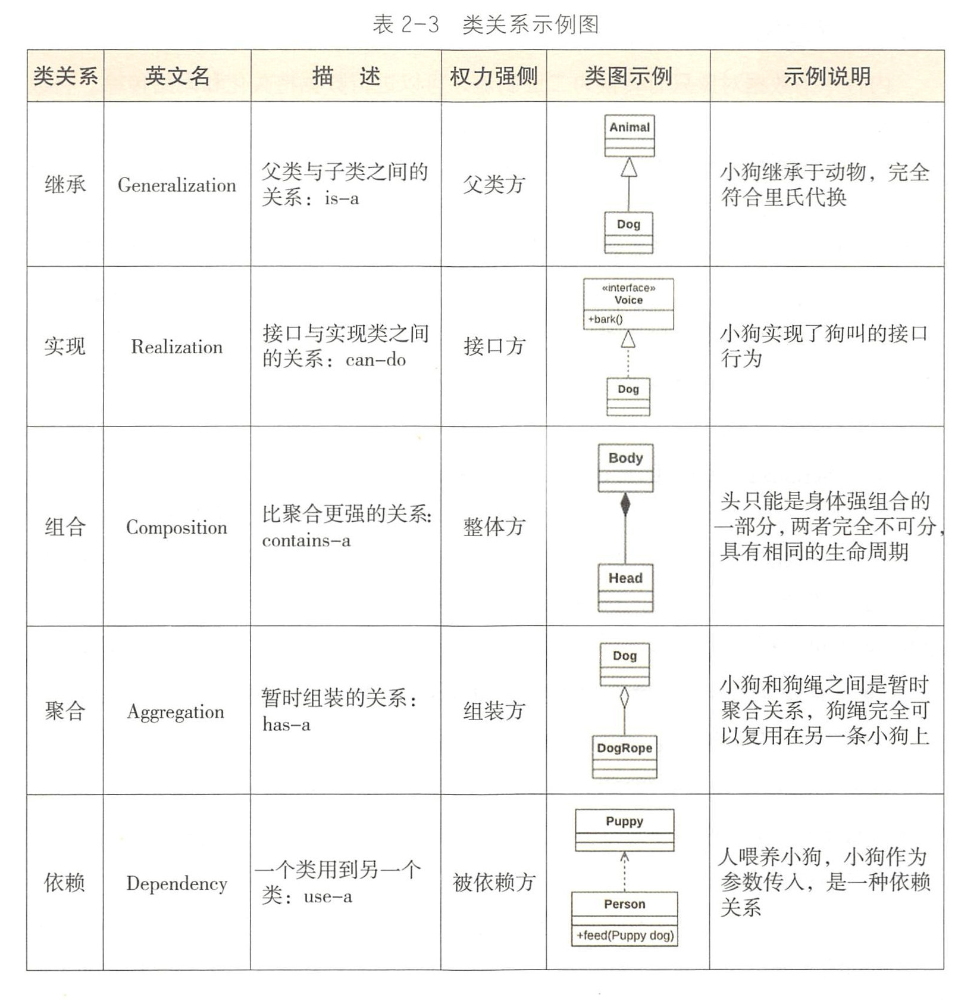

* Kramdown table of contents
{:toc .toc}
## 类关系

关系是指事物之间存在单向或相互的作用力或者影响力的状态。类与类之间的关系可分成两种：有关系与没关系，这似乎是一句非常正确的废话，难点在于确定类与类之间是否存在相互作用。证明类之间没关系是一个涉及业务、架构、模块边界的问题，往往由于业务模型的抽象角度不同而不同，是一件非常棘手的事情。如果找到了没有关系的点，就可以如庖丁解牛一样，进行架构隔离、模块解耦等工作。有关系的情况下，包括如下 5 种类型：

- ［继承］extends（is-a）
- ［实现］implements（can-do）
- ［组合］类是成员变量（contains-a）
- ［聚合］类是成员变量（has-a）
- ［依赖］import 类（use-a）

