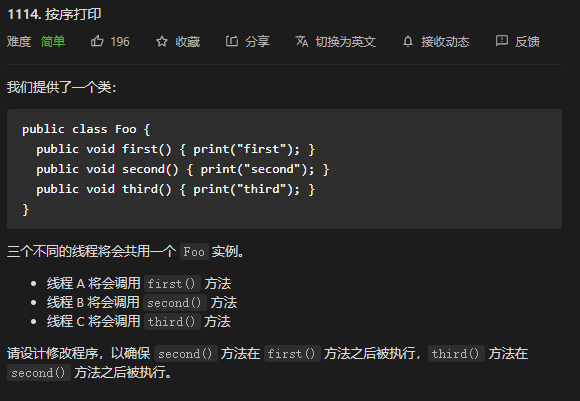

* Kramdown table of contents
{:toc .toc}
## LeetCode 多线程问题汇总

### [1114. 按序打印](https://leetcode-cn.com/problems/print-in-order/)



> 方法一：使用 synchronized 关键字

```java
class Foo {
    private int flag = 0;
    private final Object lock = new Object();
    
    public Foo() {

    }

    public void first(Runnable printFirst) throws InterruptedException {
        synchronized (lock) {
            while (flag % 3 != 0) {
                lock.wait();
            }
            // printFirst.run() outputs "first". Do not change or remove this line.
            printFirst.run();
            flag++;
            lock.notifyAll();
        }
    }

    public void second(Runnable printSecond) throws InterruptedException {
        synchronized (lock) {
            while (flag % 3 != 1) {
                lock.wait();
            }
            // printSecond.run() outputs "second". Do not change or remove this line.
            printSecond.run();
            flag++;
            lock.notifyAll();
        }
    }

    public void third(Runnable printThird) throws InterruptedException {
        synchronized (lock) {
            while (flag % 3 != 2) {
                lock.wait();
            }
            // printThird.run() outputs "third". Do not change or remove this line.
            printThird.run();
            flag++;
            lock.notifyAll();
        }
    }
}
```

> 方法二：使用 2 个 CountDownLatch 变量
>

```java
class Foo {
    private CountDownLatch c1;
    private CountDownLatch c2;

    public Foo() {
        c1 = new CountDownLatch(1);
        c2 = new CountDownLatch(1);
    }

    public void first(Runnable printFirst) throws InterruptedException {
        // printFirst.run() outputs "first". Do not change or remove this line.
        printFirst.run();
        c1.countDown();
    }

    public void second(Runnable printSecond) throws InterruptedException {
        c1.await();
        // printSecond.run() outputs "second". Do not change or remove this line.
        printSecond.run();
        c2.countDown();
    }

    public void third(Runnable printThird) throws InterruptedException {
        c2.await();
        // printThird.run() outputs "third". Do not change or remove this line.
        printThird.run();
    }
}
```

### [1115. 交替打印FooBar](https://leetcode-cn.com/problems/print-foobar-alternately/)

```java
public class FooBar {
    private int n;
    private static int state = 0;
    private static final Lock lock = new ReentrantLock();
    private static final Condition foo = lock.newCondition();
    private static final Condition bar = lock.newCondition();

    public FooBar(int n) {
        this.n = n;
    }

    public void foo(Runnable printFoo) throws InterruptedException {
        lock.lock();
        try {
            for (int i = 0; i < n; i++) {
                while (state % 2 == 1) {
                    foo.await();
                }
                // printFoo.run() outputs "foo". Do not change or remove this line.
                printFoo.run();
                state++;
                bar.signal();
            }
        } finally {
            lock.unlock();
        }
    }

    public void bar(Runnable printBar) throws InterruptedException {
        lock.lock();
        try {
            for (int i = 0; i < n; i++) {
                while (state % 2 == 0) {
                    bar.await();
                }
                // printBar.run() outputs "bar". Do not change or remove this line.
                printBar.run();
                state++;
                foo.signal();
            }
        } finally {
            lock.unlock();
        }
    }
}
```

### [1116. 打印零与奇偶数](https://leetcode-cn.com/problems/print-zero-even-odd/)

### [1195. 交替打印字符串](https://leetcode-cn.com/problems/fizz-buzz-multithreaded/)

```java
public class FizzBuzz {
    private int n;
    private static final Lock lock = new ReentrantLock();
    private int state = 1;

    public FizzBuzz(int n) {
        this.n = n;
    }

    // printFizz.run() outputs "fizz".
    public void fizz(Runnable printFizz) throws InterruptedException {
        while (state <= n) {
            lock.lock();
            try {
                while (state <= n && state % 3 == 0 && state % 5 != 0) {
                    printFizz.run();
                    state++;
                }
            } finally {
                lock.unlock();
            }
        }
    }

    // printBuzz.run() outputs "buzz".
    public void buzz(Runnable printBuzz) throws InterruptedException {
        while (state <= n) {
            lock.lock();
            try {
                while (state <= n && state % 3 != 0 && state % 5 == 0) {
                    printBuzz.run();
                    state++;
                }
            } finally {
                lock.unlock();
            }
        }
    }

    // printFizzBuzz.run() outputs "fizzbuzz".
    public void fizzbuzz(Runnable printFizzBuzz) throws InterruptedException {
        while (state <= n) {
            lock.lock();
            try {
                while (state <= n && state % 3 == 0 && state % 5 == 0) {
                    printFizzBuzz.run();
                    state++;
                }
            } finally {
                lock.unlock();
            }
        }
    }

    // printNumber.accept(x) outputs "x", where x is an integer.
    public void number(IntConsumer printNumber) throws InterruptedException {
        while (state <= n) {
            lock.lock();
            try {
                while (state <= n && state % 3 != 0 && state % 5 != 0) {
                    printNumber.accept(state);
                    state++;
                }
            } finally {
                lock.unlock();
            }
        }
    }
}
```

```java
public class FizzBuzz {
    private int n;
    private CyclicBarrier cyclicBarrier = new CyclicBarrier(4);

    public FizzBuzz(int n) {
        this.n = n;
    }

    // printFizz.run() outputs "fizz".
    public void fizz(Runnable printFizz) throws InterruptedException {
        for (int i = 1; i <= n; i++) {
            if (i % 3 == 0 && i % 5 != 0) {
                printFizz.run();
            }
            try {
                cyclicBarrier.await();
            } catch (BrokenBarrierException e) {
                e.printStackTrace();
            }
        }
    }

    // printBuzz.run() outputs "buzz".
    public void buzz(Runnable printBuzz) throws InterruptedException {
        for (int i = 1; i <= n; i++) {
            if (i % 3 != 0 && i % 5 == 0) {
                printBuzz.run();
            }
            try {
                cyclicBarrier.await();
            } catch (BrokenBarrierException e) {
                e.printStackTrace();
            }
        }
    }

    // printFizzBuzz.run() outputs "fizzbuzz".
    public void fizzbuzz(Runnable printFizzBuzz) throws InterruptedException {
        for (int i = 1; i <= n; i++) {
            if (i % 3 == 0 && i % 5 == 0) {
                printFizzBuzz.run();
            }
            try {
                cyclicBarrier.await();
            } catch (BrokenBarrierException e) {
                e.printStackTrace();
            }
        }
    }

    // printNumber.accept(x) outputs "x", where x is an integer.
    public void number(IntConsumer printNumber) throws InterruptedException {
        for (int i = 1; i <= n; i++) {
            if (i % 3 != 0 && i % 5 != 0) {
                printNumber.accept(i);
            }
            try {
                cyclicBarrier.await();
            } catch (BrokenBarrierException e) {
                e.printStackTrace();
            }
        }
    }
}
```

### [1117. H2O 生成](https://leetcode-cn.com/problems/building-h2o/)

### [1226. 哲学家进餐](https://leetcode-cn.com/problems/the-dining-philosophers/)

## 参考资料

- [https://leetcode-cn.com/problemset/concurrency/](https://leetcode-cn.com/problemset/concurrency/)

