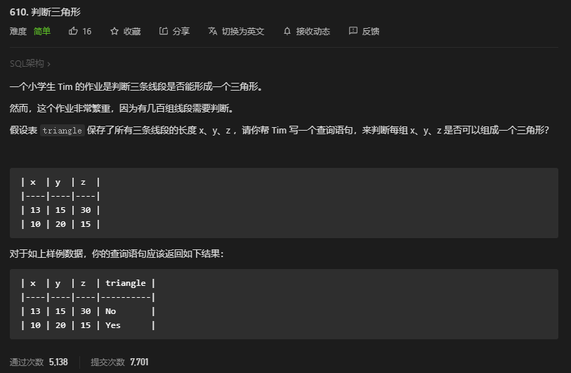
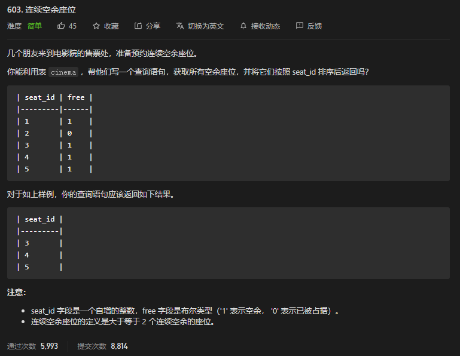

* Kramdown table of contents
{:toc .toc}
## LeetCode 加锁题

### [610. 判断三角形](https://leetcode-cn.com/problems/triangle-judgement/)



```sql
create table if not exists triangle (x int, y int, z int);
truncate table triangle;
insert into triangle (x, y, z) values ('13', '15', '30');
insert into triangle (x, y, z) values ('10', '20', '15');
```

```sql
select x,y,z,if (x+y> z and x+z> y and y+z> x,'yes','no') triangle from triangle;
```

```sql
select x,y,z,(case when x+y> z and x+z> y and y+z> x then 'yes' else 'no' end) triangle from triangle;
```

### [1211. 查询结果的质量和占比](https://leetcode-cn.com/problems/queries-quality-and-percentage/)

```sql
create table if not exists queries (query_name varchar(30), result varchar(50), position int, rating int);
truncate table queries;
insert into queries (query_name, result, position, rating) values ('dog', 'golden retriever', '1', '5');
insert into queries (query_name, result, position, rating) values ('dog', 'german shepherd', '2', '5');
insert into queries (query_name, result, position, rating) values ('dog', 'mule', '200', '1');
insert into queries (query_name, result, position, rating) values ('cat', 'shirazi', '5', '2');
insert into queries (query_name, result, position, rating) values ('cat', 'siamese', '3', '3');
insert into queries (query_name, result, position, rating) values ('cat', 'sphynx', '7', '4');
```

```sql
select
	query_name,
	round( avg( rating / position ), 2 ) quality,
	round( sum( if ( rating < 3, 1, 0 ))* 100 / count(*), 2 ) poor_query_percentage 
from
	queries 
group by
	query_name;
```

### [1141. 查询近30天活跃用户数](https://leetcode-cn.com/problems/user-activity-for-the-past-30-days-i/)

```sql
create table if not exists activity (user_id int, session_id int, activity_date date, activity_type enum('open_session', 'end_session', 'scroll_down', 'send_message'));
truncate table activity;
insert into activity (user_id, session_id, activity_date, activity_type) values ('1', '1', '2019-07-20', 'open_session');
insert into activity (user_id, session_id, activity_date, activity_type) values ('1', '1', '2019-07-20', 'scroll_down');
insert into activity (user_id, session_id, activity_date, activity_type) values ('1', '1', '2019-07-20', 'end_session');
insert into activity (user_id, session_id, activity_date, activity_type) values ('2', '4', '2019-07-20', 'open_session');
insert into activity (user_id, session_id, activity_date, activity_type) values ('2', '4', '2019-07-21', 'send_message');
insert into activity (user_id, session_id, activity_date, activity_type) values ('2', '4', '2019-07-21', 'end_session');
insert into activity (user_id, session_id, activity_date, activity_type) values ('3', '2', '2019-07-21', 'open_session');
insert into activity (user_id, session_id, activity_date, activity_type) values ('3', '2', '2019-07-21', 'send_message');
insert into activity (user_id, session_id, activity_date, activity_type) values ('3', '2', '2019-07-21', 'end_session');
insert into activity (user_id, session_id, activity_date, activity_type) values ('4', '3', '2019-06-25', 'open_session');
insert into activity (user_id, session_id, activity_date, activity_type) values ('4', '3', '2019-06-25', 'end_session');
```

```sql
select activity_date day,count(distinct user_id) active_users from activity where date(activity_date) between '2019-06-28' and '2019-07-27' group by activity_date;
```

```sql
select activity_date day,count(distinct user_id) active_users from activity where datediff('2019-07-27',activity_date)< 30 group by activity_date;
```

### [1082. 销售分析 I ](https://leetcode-cn.com/problems/sales-analysis-i/)

```sql
create table if not exists product (product_id int, product_name varchar(10), unit_price int);
create table if not exists sales (seller_id int, product_id int, buyer_id int, sale_date date, quantity int, price int);
truncate table product;
insert into product (product_id, product_name, unit_price) values ('1', 's8', '1000');
insert into product (product_id, product_name, unit_price) values ('2', 'g4', '800');
insert into product (product_id, product_name, unit_price) values ('3', 'iphone', '1400');
truncate table sales;
insert into sales (seller_id, product_id, buyer_id, sale_date, quantity, price) values ('1', '1', '1', '2019-01-21', '2', '2000');
insert into sales (seller_id, product_id, buyer_id, sale_date, quantity, price) values ('1', '2', '2', '2019-02-17', '1', '800');
insert into sales (seller_id, product_id, buyer_id, sale_date, quantity, price) values ('2', '2', '3', '2019-06-02', '1', '800');
insert into sales (seller_id, product_id, buyer_id, sale_date, quantity, price) values ('3', '3', '4', '2019-05-13', '2', '2800');
```

```
mysql> select * from product;
+------------+--------------+------------+
| product_id | product_name | unit_price |
+------------+--------------+------------+
|          1 | s8           |       1000 |
|          2 | g4           |        800 |
|          3 | iphone       |       1400 |
+------------+--------------+------------+

mysql> select * from sales;
+-----------+------------+----------+------------+----------+-------+
| seller_id | product_id | buyer_id | sale_date  | quantity | price |
+-----------+------------+----------+------------+----------+-------+
|         1 |          1 |        1 | 2019-01-21 |        2 |  2000 |
|         1 |          2 |        2 | 2019-02-17 |        1 |   800 |
|         2 |          2 |        3 | 2019-06-02 |        1 |   800 |
|         3 |          3 |        4 | 2019-05-13 |        2 |  2800 |
+-----------+------------+----------+------------+----------+-------+
```

```sql
select
	seller_id 
from
	sales 
group by
	seller_id 
having
	sum( price )>= all ( select sum( price ) from sales group by seller_id );
```

### [1084. 销售分析III](https://leetcode-cn.com/problems/sales-analysis-iii/)

```sql
create table if not exists product (product_id int, product_name varchar(10), unit_price int);
create table if not exists sales (seller_id int, product_id int, buyer_id int, sale_date date, quantity int, price int);
truncate table product;
insert into product (product_id, product_name, unit_price) values ('1', 's8', '1000');
insert into product (product_id, product_name, unit_price) values ('2', 'g4', '800');
insert into product (product_id, product_name, unit_price) values ('3', 'iphone', '1400');
truncate table sales;
insert into sales (seller_id, product_id, buyer_id, sale_date, quantity, price) values ('1', '1', '1', '2019-01-21', '2', '2000');
insert into sales (seller_id, product_id, buyer_id, sale_date, quantity, price) values ('1', '2', '2', '2019-02-17', '1', '800');
insert into sales (seller_id, product_id, buyer_id, sale_date, quantity, price) values ('2', '2', '3', '2019-06-02', '1', '800');
insert into sales (seller_id, product_id, buyer_id, sale_date, quantity, price) values ('3', '3', '4', '2019-05-13', '2', '2800');
```

```
mysql> select * from product;
+------------+--------------+------------+
| product_id | product_name | unit_price |
+------------+--------------+------------+
|          1 | s8           |       1000 |
|          2 | g4           |        800 |
|          3 | iphone       |       1400 |
+------------+--------------+------------+

mysql> select * from sales;
+-----------+------------+----------+------------+----------+-------+
| seller_id | product_id | buyer_id | sale_date  | quantity | price |
+-----------+------------+----------+------------+----------+-------+
|         1 |          1 |        1 | 2019-01-21 |        2 |  2000 |
|         1 |          2 |        2 | 2019-02-17 |        1 |   800 |
|         2 |          2 |        3 | 2019-06-02 |        1 |   800 |
|         3 |          3 |        4 | 2019-05-13 |        2 |  2800 |
+-----------+------------+----------+------------+----------+-------+
```

> 编写一个 SQL 查询，报告 2019 年春季才售出的产品。即仅在 2019-01-01 至 2019-03-31（含）之间出售的商品。

> 解题思路：先按照 product_id 分组，然后通过 sale_date 的最大值和最小值判断是否在指定区间即可。

```sql
select
	p.product_id,
	p.product_name 
from
	product p,
	sales s 
where
	p.product_id = s.product_id 
group by
	p.product_id 
having
	min( s.sale_date ) >= '2019-01-01' and max( s.sale_date ) <= '2019-03-31';
```

### [1303. 求团队人数](https://leetcode-cn.com/problems/find-the-team-size/)

编写一个 SQL 查询，以求得每个员工所在团队的总人数。

```sql
create table if not exists employee (employee_id int, team_id int);
truncate table employee;
insert into employee (employee_id, team_id) values ('1', '8');
insert into employee (employee_id, team_id) values ('2', '8');
insert into employee (employee_id, team_id) values ('3', '8');
insert into employee (employee_id, team_id) values ('4', '7');
insert into employee (employee_id, team_id) values ('5', '9');
insert into employee (employee_id, team_id) values ('6', '9');
```

```sql
select e.employee_id,t.team_size from employee e,
(select team_id,count(employee_id) team_size from employee group by team_id) t where e.team_id=t.team_id;
```

### [577. 员工奖金](https://leetcode-cn.com/problems/employee-bonus/)

> 选出所有 bonus < 1000 的员工的 name 及其 bonus。

> 主要考察 `IFNULL(expression, alt_value)` 函数的使用。

```sql
create table if not exists employee (empid int, name varchar(255), supervisor int, salary int);
create table if not exists bonus (empid int, bonus int);
truncate table employee;
insert into employee (empid, name, supervisor, salary) values ('1', 'john', '3', '1000');
insert into employee (empid, name, supervisor, salary) values ('2', 'dan', '3', '2000');
insert into employee (empid, name, supervisor, salary) values ('3', 'brad', null, '4000');
insert into employee (empid, name, supervisor, salary) values ('4', 'thomas', '3', '4000');
truncate table bonus;
insert into bonus (empid, bonus) values ('2', '500');
insert into bonus (empid, bonus) values ('4', '2000');
```

employee 表和 bonus 表：

```
mysql> select * from employee;
+-------+--------+------------+--------+
| empid | name   | supervisor | salary |
+-------+--------+------------+--------+
|     1 | john   |          3 |   1000 |
|     2 | dan    |          3 |   2000 |
|     3 | brad   | NULL       |   4000 |
|     4 | thomas |          3 |   4000 |
+-------+--------+------------+--------+
4 rows in set (0.02 sec)

mysql> select * from bonus;
+-------+-------+
| empid | bonus |
+-------+-------+
|     2 |   500 |
|     4 |  2000 |
+-------+-------+
```

输出示例：

```
mysql> select e.name,b.bonus from employee e left join bonus b on e.empid=b.empid where ifnull(b.bonus,0)< 1000;
+------+-------+
| name | bonus |
+------+-------+
| dan  |   500 |
| john | NULL  |
| brad | NULL  |
+------+-------+
```

```sql
select e.name,b.bonus from employee e left join bonus b on e.empid=b.empid where ifnull(b.bonus,0)< 1000;
```

### [1294. 不同国家的天气类型](https://leetcode-cn.com/problems/weather-type-in-each-country/)

建表语句如下：

```sql
create table if not exists countries (country_id int, country_name varchar(20));
create table if not exists weather (country_id int, weather_state int, day date);
truncate table countries;
insert into countries (country_id, country_name) values ('2', 'usa');
insert into countries (country_id, country_name) values ('3', 'australia');
insert into countries (country_id, country_name) values ('7', 'peru');
insert into countries (country_id, country_name) values ('5', 'china');
insert into countries (country_id, country_name) values ('8', 'morocco');
insert into countries (country_id, country_name) values ('9', 'spain');
truncate table weather;
insert into weather (country_id, weather_state, day) values ('2', '15', '2019-11-01');
insert into weather (country_id, weather_state, day) values ('2', '12', '2019-10-28');
insert into weather (country_id, weather_state, day) values ('2', '12', '2019-10-27');
insert into weather (country_id, weather_state, day) values ('3', '-2', '2019-11-10');
insert into weather (country_id, weather_state, day) values ('3', '0', '2019-11-11');
insert into weather (country_id, weather_state, day) values ('3', '3', '2019-11-12');
insert into weather (country_id, weather_state, day) values ('5', '16', '2019-11-07');
insert into weather (country_id, weather_state, day) values ('5', '18', '2019-11-09');
insert into weather (country_id, weather_state, day) values ('5', '21', '2019-11-23');
insert into weather (country_id, weather_state, day) values ('7', '25', '2019-11-28');
insert into weather (country_id, weather_state, day) values ('7', '22', '2019-12-01');
insert into weather (country_id, weather_state, day) values ('7', '20', '2019-12-02');
insert into weather (country_id, weather_state, day) values ('8', '25', '2019-11-05');
insert into weather (country_id, weather_state, day) values ('8', '27', '2019-11-15');
insert into weather (country_id, weather_state, day) values ('8', '31', '2019-11-25');
insert into weather (country_id, weather_state, day) values ('9', '7', '2019-10-23');
insert into weather (country_id, weather_state, day) values ('9', '3', '2019-12-23');
```

> 写一段 SQL 来找到表中每个国家在 2019 年 11 月的天气类型。你可以以任意顺序返回你的查询结果。
>
> 天气类型的定义如下：当 weather_state 的平均值小于或等于 15 返回 Cold，当 weather_state 的平均值大于或等于 25 返回 Hot，否则返回 Warm。
>

```sql
select
	country_name,
	case
	when avg( weather_state ) <= 15 then 'Cold' 
	when avg( weather_state ) >= 25 then 'Hot' 
	else 'Warm' end as weather_type 
from
	countries c,
	weather w 
where
	c.country_id = w.country_id 
	and day between '2019-11-01' 
	and '2019-11-30' 
group by
	c.country_id, c.country_name;
```

### [619. 只出现一次的最大数字](https://leetcode-cn.com/problems/biggest-single-number/)

> 表 my_numbers 的 num 字段包含很多数字，其中包括很多重复的数字。
>
> 你能写一个 SQL 查询语句，找到只出现过一次的数字中，最大的一个数字吗？
>
> 注意：如果没有只出现一次的数字，输出 null。

> 第一次没思路，没做出来。
>
> 参考方法：使用子查询和 max() 函数来解决。

```
create table if not exists my_numbers (num int);
truncate table my_numbers;
insert into my_numbers (num) values ('8');
insert into my_numbers (num) values ('8');
insert into my_numbers (num) values ('3');
insert into my_numbers (num) values ('3');
insert into my_numbers (num) values ('1');
insert into my_numbers (num) values ('4');
insert into my_numbers (num) values ('5');
insert into my_numbers (num) values ('6');
```

```
mysql> select * from my_numbers;
+-----+
| num |
+-----+
|   8 |
|   8 |
|   3 |
|   3 |
|   1 |
|   4 |
|   5 |
|   6 |
+-----+
```

```
+-----+
| num |
+-----+
|   6 |
+-----+
```

```sql
select max(num) num from (select num from my_numbers group by num having count(num)=1) t;
```

### [1241. 每个帖子的评论数](https://leetcode-cn.com/problems/number-of-comments-per-post/)

```sql
create table if not exists submissions (sub_id int, parent_id int);
truncate table submissions;
insert into submissions (sub_id, parent_id) values ('1', NULL);
insert into submissions (sub_id, parent_id) values ('2', NULL);
insert into submissions (sub_id, parent_id) values ('1', NULL);
insert into submissions (sub_id, parent_id) values ('12', NULL);
insert into submissions (sub_id, parent_id) values ('3', '1');
insert into submissions (sub_id, parent_id) values ('5', '2');
insert into submissions (sub_id, parent_id) values ('3', '1');
insert into submissions (sub_id, parent_id) values ('4', '1');
insert into submissions (sub_id, parent_id) values ('9', '1');
insert into submissions (sub_id, parent_id) values ('10', '2');
insert into submissions (sub_id, parent_id) values ('6', '7');
```

> 编写 SQL 语句以查找每个帖子的评论数。
>
> 结果表应包含帖子的 post_id 和对应的评论数 number_of_comments 并且按 post_id 升序排列。
>
> Submissions 可能包含重复的评论。您应该计算每个帖子的唯一评论数。
>
> Submissions 可能包含重复的帖子。您应该将它们视为一个帖子。

```sql
select
	post_id,
	count( sub_id ) as number_of_comments 
from
	(
	select distinct
		post.sub_id as post_id,
		sub.sub_id as sub_id 
	from
		submissions post
		left join submissions sub on post.sub_id = sub.parent_id 
	where
		post.parent_id is null 
	) t 
group by
	post_id 
order by
	post_id asc;
```

### [1251. 平均售价](https://leetcode-cn.com/problems/average-selling-price/)

```sql
create table if not exists prices (product_id int, start_date date, end_date date, price int);
create table if not exists unitssold (product_id int, purchase_date date, units int);
truncate table prices;
insert into prices (product_id, start_date, end_date, price) values ('1', '2019-02-17', '2019-02-28', '5');
insert into prices (product_id, start_date, end_date, price) values ('1', '2019-03-01', '2019-03-22', '20');
insert into prices (product_id, start_date, end_date, price) values ('2', '2019-02-01', '2019-02-20', '15');
insert into prices (product_id, start_date, end_date, price) values ('2', '2019-02-21', '2019-03-31', '30');
truncate table unitssold;
insert into unitssold (product_id, purchase_date, units) values ('1', '2019-02-25', '100');
insert into unitssold (product_id, purchase_date, units) values ('1', '2019-03-01', '15');
insert into unitssold (product_id, purchase_date, units) values ('2', '2019-02-10', '200');
insert into unitssold (product_id, purchase_date, units) values ('2', '2019-03-22', '30');
```

编写 SQL 查询以查找每种产品的平均售价。average_price 应该四舍五入到小数点后两位。

```
mysql> select * from prices;
+------------+------------+------------+-------+
| product_id | start_date | end_date   | price |
+------------+------------+------------+-------+
|          1 | 2019-02-17 | 2019-02-28 |     5 |
|          1 | 2019-03-01 | 2019-03-22 |    20 |
|          2 | 2019-02-01 | 2019-02-20 |    15 |
|          2 | 2019-02-21 | 2019-03-31 |    30 |
+------------+------------+------------+-------+

mysql> select * from unitssold;
+------------+---------------+-------+
| product_id | purchase_date | units |
+------------+---------------+-------+
|          1 | 2019-02-25    |   100 |
|          1 | 2019-03-01    |    15 |
|          2 | 2019-02-10    |   200 |
|          2 | 2019-03-22    |    30 |
+------------+---------------+-------+

+------------+---------------+
| product_id | average_price |
+------------+---------------+
|          1 | 6.96          |
|          2 | 16.96         |
+------------+---------------+
```

```sql
select p.product_id product_id,round(sum(u.units*p.price)/sum(u.units),2) average_price from prices p 
inner join unitssold u on p.product_id=u.product_id 
where u.purchase_date between p.start_date and p.end_date 
group by product_id;
```

### [1050. 合作过至少三次的演员和导演](https://leetcode-cn.com/problems/actors-and-directors-who-cooperated-at-least-three-times/)

```sql
create table if not exists actordirector (actor_id int, director_id int, timestamp int);
truncate table actordirector;
insert into actordirector (actor_id, director_id, timestamp) values ('1', '1', '0');
insert into actordirector (actor_id, director_id, timestamp) values ('1', '1', '1');
insert into actordirector (actor_id, director_id, timestamp) values ('1', '1', '2');
insert into actordirector (actor_id, director_id, timestamp) values ('1', '2', '3');
insert into actordirector (actor_id, director_id, timestamp) values ('1', '2', '4');
insert into actordirector (actor_id, director_id, timestamp) values ('2', '1', '5');
insert into actordirector (actor_id, director_id, timestamp) values ('2', '1', '6');
```

写一条 SQL 查询语句获取合作过至少三次的演员和导演的 id 对 (actor_id, director_id)

```
mysql> select * from actordirector;
+----------+-------------+-----------+
| actor_id | director_id | timestamp |
+----------+-------------+-----------+
|        1 |           1 |         0 |
|        1 |           1 |         1 |
|        1 |           1 |         2 |
|        1 |           2 |         3 |
|        1 |           2 |         4 |
|        2 |           1 |         5 |
|        2 |           1 |         6 |
+----------+-------------+-----------+

mysql> select actor_id ACTOR_ID,director_id DIRECTOR_ID from actordirector group by actor_id,director_id having count(*)>=3;
+----------+-------------+
| ACTOR_ID | DIRECTOR_ID |
+----------+-------------+
|        1 |           1 |
+----------+-------------+
```

```sql
select actor_id ACTOR_ID,director_id DIRECTOR_ID from actordirector group by actor_id,director_id having count(*)>=3;
```

### [586. 订单最多的客户](https://leetcode-cn.com/problems/customer-placing-the-largest-number-of-orders/)

```sql
create table if not exists orders (order_number int, customer_number int, order_date date, required_date date, shipped_date date, status char(15), comment char(200), key(order_number));
truncate table orders;
insert into orders (order_number, customer_number) values ('1', '1');
insert into orders (order_number, customer_number) values ('2', '2');
insert into orders (order_number, customer_number) values ('3', '3');
insert into orders (order_number, customer_number) values ('4', '3');
```

> 在表 orders 中找到订单数最多客户对应的 customer_number 。
>
> 数据保证订单数最多的顾客恰好只有一位。进阶：如果有多位顾客订单数并列最多，你能找到他们所有的 customer_number 吗？

```
mysql> select * from orders;
+--------------+-----------------+------------+---------------+--------------+--------+---------+
| order_number | customer_number | order_date | required_date | shipped_date | status | comment |
+--------------+-----------------+------------+---------------+--------------+--------+---------+
|            1 |               1 | NULL       | NULL          | NULL         | NULL   | NULL    |
|            2 |               2 | NULL       | NULL          | NULL         | NULL   | NULL    |
|            3 |               3 | NULL       | NULL          | NULL         | NULL   | NULL    |
|            4 |               3 | NULL       | NULL          | NULL         | NULL   | NULL    |
+--------------+-----------------+------------+---------------+--------------+--------+---------+
```

```sql
select
	customer_number 
from
	orders 
group by
	customer_number 
order by
	count( customer_number ) desc 
	limit 1;
```

```sql
select
	customer_number 
from
	orders 
group by
	customer_number 
having
	count( order_number ) = ( select max( order_number ) from ( select customer_number, count( order_number ) order_number from orders group by customer_number ) t );
```

### [584. 寻找用户推荐人](https://leetcode-cn.com/problems/find-customer-referee/)

```sql
create table if not exists customer (id int,name varchar(25),referee_id int);
truncate table customer;
insert into customer (id, name, referee_id) values ('1', 'will', NULL);
insert into customer (id, name, referee_id) values ('2', 'jane', NULL);
insert into customer (id, name, referee_id) values ('3', 'alex', '2');
insert into customer (id, name, referee_id) values ('4', 'bill', NULL);
insert into customer (id, name, referee_id) values ('5', 'zack', '1');
insert into customer (id, name, referee_id) values ('6', 'mark', '2');
```

```
mysql> select * from customer;
+----+------+------------+
| id | name | referee_id |
+----+------+------------+
|  1 | will | NULL       |
|  2 | jane | NULL       |
|  3 | alex |          2 |
|  4 | bill | NULL       |
|  5 | zack |          1 |
|  6 | mark |          2 |
+----+------+------------+
```

```sql
select name from customer where referee_id !=2 or referee_id is null;
```

### [1148. 文章浏览 I](https://leetcode-cn.com/problems/article-views-i/)

```sql
Create table If Not Exists Views (article_id int, author_id int, viewer_id int, view_date date)
Truncate table Views
insert into Views (article_id, author_id, viewer_id, view_date) values ('1', '3', '5', '2019-08-01')
insert into Views (article_id, author_id, viewer_id, view_date) values ('1', '3', '6', '2019-08-02')
insert into Views (article_id, author_id, viewer_id, view_date) values ('2', '7', '7', '2019-08-01')
insert into Views (article_id, author_id, viewer_id, view_date) values ('2', '7', '6', '2019-08-02')
insert into Views (article_id, author_id, viewer_id, view_date) values ('4', '7', '1', '2019-07-22')
insert into Views (article_id, author_id, viewer_id, view_date) values ('3', '4', '4', '2019-07-21')
insert into Views (article_id, author_id, viewer_id, view_date) values ('3', '4', '4', '2019-07-21')
```

```
mysql> select * from views;
+------------+-----------+-----------+------------+
| article_id | author_id | viewer_id | view_date  |
+------------+-----------+-----------+------------+
|          1 |         3 |         5 | 2019-08-01 |
|          1 |         3 |         6 | 2019-08-02 |
|          2 |         7 |         7 | 2019-08-01 |
|          2 |         7 |         6 | 2019-08-02 |
|          4 |         7 |         1 | 2019-07-22 |
|          3 |         4 |         4 | 2019-07-21 |
|          3 |         4 |         4 | 2019-07-21 |
+------------+-----------+-----------+------------+
```

此表的每一行都表示某人在某天浏览了某位作者的某篇文章。

请注意，同一人的 author_id 和 viewer_id 是相同的。请编写一条 SQL 查询以找出所有浏览过自己文章的作者，结果按照 id 升序排列。

```sql
select distinct author_id id from views where author_id=viewer_id order by author_id asc;
```

### [603. 连续空余座位](https://leetcode-cn.com/problems/consecutive-available-seats/)



```sql
create table if not exists cinema (seat_id int primary key auto_increment, free bool);
truncate table cinema;
insert into cinema (seat_id, free) values ('1', '1');
insert into cinema (seat_id, free) values ('2', '0');
insert into cinema (seat_id, free) values ('3', '1');
insert into cinema (seat_id, free) values ('4', '1');
insert into cinema (seat_id, free) values ('5', '1');
```

```
mysql> select * from cinema;
+---------+------+
| seat_id | free |
+---------+------+
|       1 |    1 |
|       2 |    0 |
|       3 |    1 |
|       4 |    1 |
|       5 |    1 |
+---------+------+
```

```sql
select distinct
	c1.seat_id 
from
	cinema c1,
	cinema c2 
where
	( c1.free = 1 and c2.free = 1 and c1.seat_id = c2.seat_id - 1 ) 
	or ( c1.free = 1 and c2.free = 1 and c1.seat_id = c2.seat_id + 1 ) 
order by
	c1.seat_id;
```

```sql
select distinct
	a.seat_id 
from
	cinema a
	join cinema b on abs( a.seat_id - b.seat_id ) = 1 
	and a.free = true 
	and b.free = true 
order by
	a.seat_id;
```

### [1113. 报告的记录](https://leetcode-cn.com/problems/reported-posts/)

```sql
create table if not exists actions (user_id int, post_id int, action_date date, action enum('view', 'like', 'reaction', 'comment', 'report', 'share'), extra varchar(10));
truncate table actions;
insert into actions (user_id, post_id, action_date, action, extra) values ('1', '1', '2019-07-01', 'view', NULL);
insert into actions (user_id, post_id, action_date, action, extra) values ('1', '1', '2019-07-01', 'like', NULL);
insert into actions (user_id, post_id, action_date, action, extra) values ('1', '1', '2019-07-01', 'share', NULL);
insert into actions (user_id, post_id, action_date, action, extra) values ('2', '4', '2019-07-04', 'view', NULL);
insert into actions (user_id, post_id, action_date, action, extra) values ('2', '4', '2019-07-04', 'report', 'spam');
insert into actions (user_id, post_id, action_date, action, extra) values ('3', '4', '2019-07-04', 'view', NULL);
insert into actions (user_id, post_id, action_date, action, extra) values ('3', '4', '2019-07-04', 'report', 'spam');
insert into actions (user_id, post_id, action_date, action, extra) values ('4', '3', '2019-07-02', 'view', NULL);
insert into actions (user_id, post_id, action_date, action, extra) values ('4', '3', '2019-07-02', 'report', 'spam');
insert into actions (user_id, post_id, action_date, action, extra) values ('5', '2', '2019-07-04', 'view', NULL);
insert into actions (user_id, post_id, action_date, action, extra) values ('5', '2', '2019-07-04', 'report', 'racism');
insert into actions (user_id, post_id, action_date, action, extra) values ('5', '5', '2019-07-04', 'view', NULL);
insert into actions (user_id, post_id, action_date, action, extra) values ('5', '5', '2019-07-04', 'report', 'racism');
```

```
mysql> select * from actions;
+---------+---------+-------------+--------+--------+
| user_id | post_id | action_date | action | extra  |
+---------+---------+-------------+--------+--------+
|       1 |       1 | 2019-07-01  | view   | NULL   |
|       1 |       1 | 2019-07-01  | like   | NULL   |
|       1 |       1 | 2019-07-01  | share  | NULL   |
|       2 |       4 | 2019-07-04  | view   | NULL   |
|       2 |       4 | 2019-07-04  | report | spam   |
|       3 |       4 | 2019-07-04  | view   | NULL   |
|       3 |       4 | 2019-07-04  | report | spam   |
|       4 |       3 | 2019-07-02  | view   | NULL   |
|       4 |       3 | 2019-07-02  | report | spam   |
|       5 |       2 | 2019-07-04  | view   | NULL   |
|       5 |       2 | 2019-07-04  | report | racism |
|       5 |       5 | 2019-07-04  | view   | NULL   |
|       5 |       5 | 2019-07-04  | report | racism |
+---------+---------+-------------+--------+--------+
```

```sql
select
	extra as report_reason,
	count( distinct post_id ) as report_count 
from
	actions 
where
	datediff( '2019-07-05', action_date ) = 1 
	and extra is not null 
	and action = 'report' 
group by
	report_reason;
```

### [1068. 产品销售分析 I](https://leetcode-cn.com/problems/product-sales-analysis-i/)

```sql
create table if not exists sales (sale_id int, product_id int, year int, quantity int, price int);
create table if not exists product (product_id int, product_name varchar(10));
truncate table sales;
insert into sales (sale_id, product_id, year, quantity, price) values ('1', '100', '2008', '10', '5000');
insert into sales (sale_id, product_id, year, quantity, price) values ('2', '100', '2009', '12', '5000');
insert into sales (sale_id, product_id, year, quantity, price) values ('7', '200', '2011', '15', '9000');
truncate table product;
insert into product (product_id, product_name) values ('100', 'nokia');
insert into product (product_id, product_name) values ('200', 'apple');
insert into product (product_id, product_name) values ('300', 'samsung'); 
```

```
mysql> select * from product;
+------------+--------------+
| product_id | product_name |
+------------+--------------+
|        100 | nokia        |
|        200 | apple        |
|        300 | samsung      |
+------------+--------------+

mysql> select * from sales;
+---------+------------+------+----------+-------+
| sale_id | product_id | year | quantity | price |
+---------+------------+------+----------+-------+
|       1 |        100 | 2008 |       10 |  5000 |
|       2 |        100 | 2009 |       12 |  5000 |
|       7 |        200 | 2011 |       15 |  9000 |
+---------+------------+------+----------+-------+
```

```
mysql> select p.product_name,s.year,s.price from sales s,product p where s.product_id=p.product_id;
+--------------+------+-------+
| product_name | year | price |
+--------------+------+-------+
| nokia        | 2008 |  5000 |
| nokia        | 2009 |  5000 |
| apple        | 2011 |  9000 |
+--------------+------+-------+
```

```sql
select p.product_name,s.year,s.price from sales s,product p where s.product_id=p.product_id;
```

### [1075. 项目员工 I](https://leetcode-cn.com/problems/project-employees-i/)

```sql
create table if not exists project (project_id int, employee_id int);
create table if not exists employee (employee_id int, name varchar(10), experience_years int);
truncate table project;
insert into project (project_id, employee_id) values ('1', '1');
insert into project (project_id, employee_id) values ('1', '2');
insert into project (project_id, employee_id) values ('1', '3');
insert into project (project_id, employee_id) values ('2', '1');
insert into project (project_id, employee_id) values ('2', '4');
truncate table employee;
insert into employee (employee_id, name, experience_years) values ('1', 'khaled', '3');
insert into employee (employee_id, name, experience_years) values ('2', 'ali', '2');
insert into employee (employee_id, name, experience_years) values ('3', 'john', '1');
insert into employee (employee_id, name, experience_years) values ('4', 'doe', '2');
```

```
mysql> select * from project;
+------------+-------------+
| project_id | employee_id |
+------------+-------------+
|          1 |           1 |
|          1 |           2 |
|          1 |           3 |
|          2 |           1 |
|          2 |           4 |
+------------+-------------+

mysql> select * from employee;
+-------------+--------+------------------+
| employee_id | name   | experience_years |
+-------------+--------+------------------+
|           1 | khaled |                3 |
|           2 | ali    |                2 |
|           3 | john   |                1 |
|           4 | doe    |                2 |
+-------------+--------+------------------+
```

```sql
select p.project_id,round(avg(experience_years),2) average_years from project p,employee e where p.employee_id=e.employee_id group by p.project_id;
```

### [511. 游戏玩法分析 I](https://leetcode-cn.com/problems/game-play-analysis-i/)

```sql
create table if not exists activity (player_id int, device_id int, event_date date, games_played int);
truncate table activity;
insert into activity (player_id, device_id, event_date, games_played) values ('1', '2', '2016-03-01', '5');
insert into activity (player_id, device_id, event_date, games_played) values ('1', '2', '2016-05-02', '6');
insert into activity (player_id, device_id, event_date, games_played) values ('2', '3', '2017-06-25', '1');
insert into activity (player_id, device_id, event_date, games_played) values ('3', '1', '2016-03-02', '0');
insert into activity (player_id, device_id, event_date, games_played) values ('3', '4', '2018-07-03', '5');
```

```
mysql> select * from activity;
+-----------+-----------+------------+--------------+
| player_id | device_id | event_date | games_played |
+-----------+-----------+------------+--------------+
|         1 |         2 | 2016-03-01 |            5 |
|         1 |         2 | 2016-05-02 |            6 |
|         2 |         3 | 2017-06-25 |            1 |
|         3 |         1 | 2016-03-02 |            0 |
|         3 |         4 | 2018-07-03 |            5 |
+-----------+-----------+------------+--------------+
```

```sql
select player_id,min(event_date) first_login from activity group by player_id;
```

### [1173. 即时食物配送 I](https://leetcode-cn.com/problems/immediate-food-delivery-i/)

```sql
create table if not exists delivery (delivery_id int, customer_id int, order_date date, customer_pref_delivery_date date);
truncate table delivery;
insert into delivery (delivery_id, customer_id, order_date, customer_pref_delivery_date) values ('1', '1', '2019-08-01', '2019-08-02');
insert into delivery (delivery_id, customer_id, order_date, customer_pref_delivery_date) values ('2', '5', '2019-08-02', '2019-08-02');
insert into delivery (delivery_id, customer_id, order_date, customer_pref_delivery_date) values ('3', '1', '2019-08-11', '2019-08-11');
insert into delivery (delivery_id, customer_id, order_date, customer_pref_delivery_date) values ('4', '3', '2019-08-24', '2019-08-26');
insert into delivery (delivery_id, customer_id, order_date, customer_pref_delivery_date) values ('5', '4', '2019-08-21', '2019-08-22');
insert into delivery (delivery_id, customer_id, order_date, customer_pref_delivery_date) values ('6', '2', '2019-08-11', '2019-08-13');
```

```
mysql> select * from delivery;
+-------------+-------------+------------+-----------------------------+
| delivery_id | customer_id | order_date | customer_pref_delivery_date |
+-------------+-------------+------------+-----------------------------+
|           1 |           1 | 2019-08-01 | 2019-08-02                  |
|           2 |           5 | 2019-08-02 | 2019-08-02                  |
|           3 |           1 | 2019-08-11 | 2019-08-11                  |
|           4 |           3 | 2019-08-24 | 2019-08-26                  |
|           5 |           4 | 2019-08-21 | 2019-08-22                  |
|           6 |           2 | 2019-08-11 | 2019-08-13                  |
+-------------+-------------+------------+-----------------------------+
```

> 如果顾客期望的配送日期和下单日期相同，则该订单称为「即时订单」，否则称为「计划订单」。
> 写一条 SQL 查询语句获取即时订单所占的百分比， 保留两位小数。

```sql
select round ((
select count(*) from delivery where order_date=customer_pref_delivery_date)/(
select count(*) from delivery)*100,2) as immediate_percentage;
```

```sql
select
	round ( sum( case when order_date = customer_pref_delivery_date then 1 else 0 end )/ count(*)* 100, 2 ) as immediate_percentage 
from
	delivery;
```

```sql
select round (sum(order_date=customer_pref_delivery_date)/count(*)*100,2) as immediate_percentage from delivery;
```