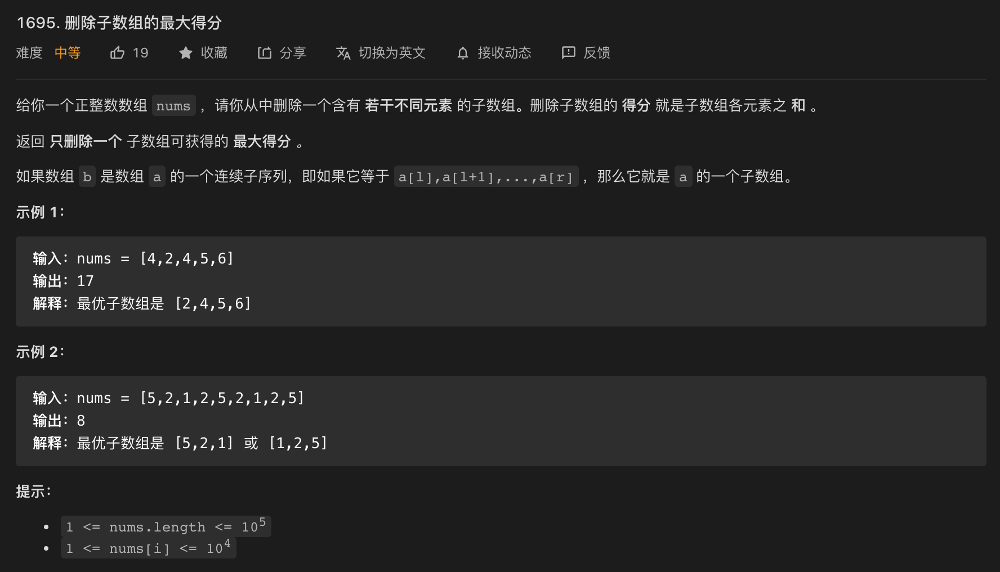

* Kramdown table of contents
{:toc .toc}
### [1695. 删除子数组的最大得分](https://leetcode-cn.com/problems/maximum-erasure-value/)



```java
class Solution {
    public int maximumUniqueSubarray(int[] nums) {
        Set<Integer> set = new HashSet();
        int sum = 0, ans = 0;
        int j = 0;
        int i = 0;
        while (i < nums.length && j < nums.length) {
            if (!set.contains(nums[j])) {
                sum += nums[j];
                ans = Math.max(sum, ans);
                set.add(nums[j++]);
            } else {
                sum = sum - nums[i];
                set.remove(nums[i++]);
            }
        }
        return ans;
    }
}
```

