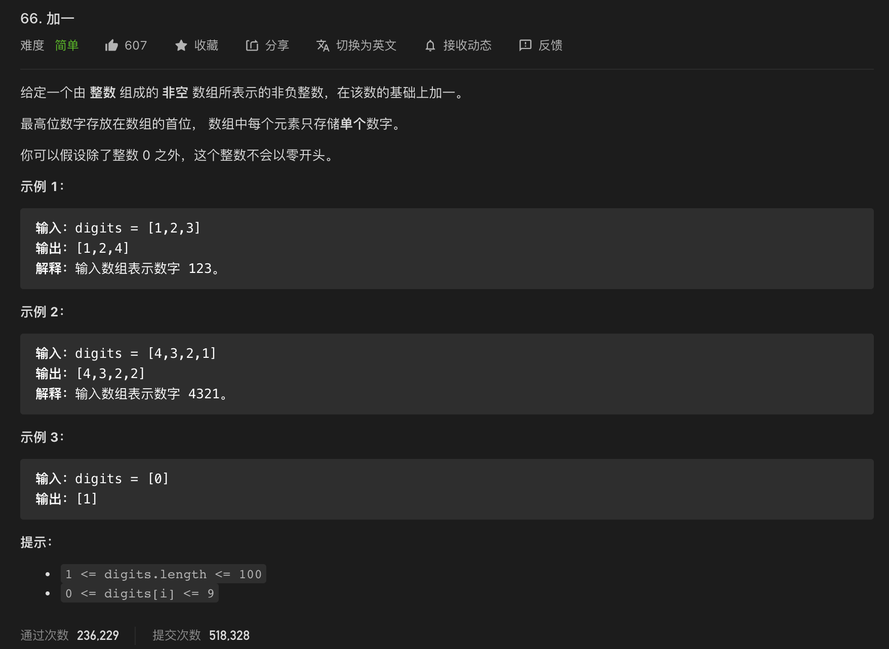

* Kramdown table of contents
{:toc .toc}
## [66. 加一](https://leetcode-cn.com/problems/plus-one/)



```java
class Solution {
    public int[] plusOne(int[] digits) {
        for(int i = digits.length - 1; i >= 0; i--) {
            digits[i]++;
            digits[i] = digits[i] % 10;
            if(digits[i] != 0) {
                return digits;
            }
        }
        int[] res = new int[digits.length + 1];
        res[0] = 1;
        return res;
    }
}
```

