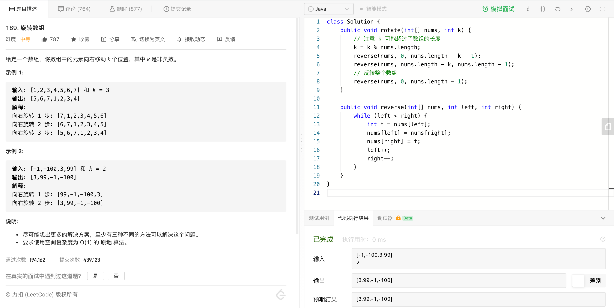

* Kramdown table of contents
{:toc .toc}
### [189. 旋转数组](https://leetcode-cn.com/problems/rotate-array/)



```java
class Solution {
    public void rotate(int[] nums, int k) {
        // 注意 k 可能超过了数组的长度
        k = k % nums.length;
        reverse(nums, 0, nums.length - k - 1);
        reverse(nums, nums.length - k, nums.length - 1);
        // 反转整个数组
        reverse(nums, 0, nums.length - 1);
    }

    public void reverse(int[] nums, int left, int right) {
        while (left < right) {
            int t = nums[left];
            nums[left] = nums[right];
            nums[right] = t;
            left++;
            right--;
        }
    }
}
```

