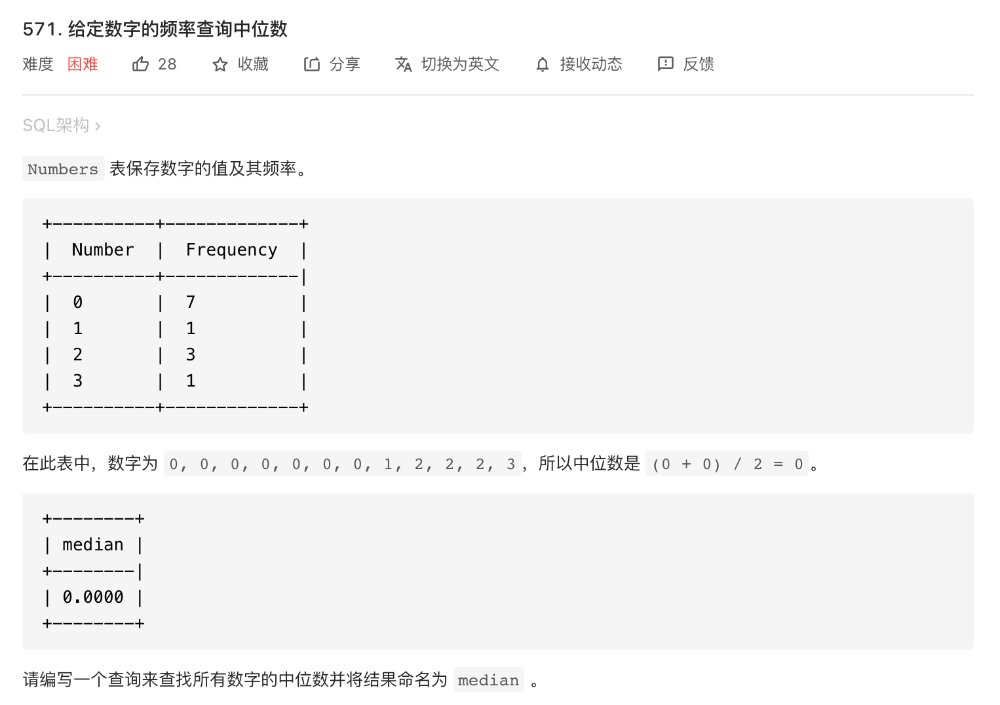

* Kramdown table of contents
{:toc .toc}
### [571. 给定数字的频率查询中位数](https://leetcode-cn.com/problems/find-median-given-frequency-of-numbers/)



```sql
Create table If Not Exists Numbers (Number int, Frequency int);
Truncate table Numbers;
insert into Numbers (Number, Frequency) values ('0', '7');
insert into Numbers (Number, Frequency) values ('1', '1');
insert into Numbers (Number, Frequency) values ('2', '3');
insert into Numbers (Number, Frequency) values ('3', '1');
```

```sql
SELECT
	AVG( NUMBER ) AS MEDIAN 
FROM
	(
	SELECT
		*,
		SUM( FREQUENCY ) OVER ( ORDER BY NUMBER ) AS S1,
		SUM( FREQUENCY ) OVER ( ORDER BY NUMBER DESC ) AS S2 
	FROM
		NUMBERS 
	) AS A 
WHERE
	S1 BETWEEN S2 - FREQUENCY 
	AND S2 + FREQUENCY;
```

