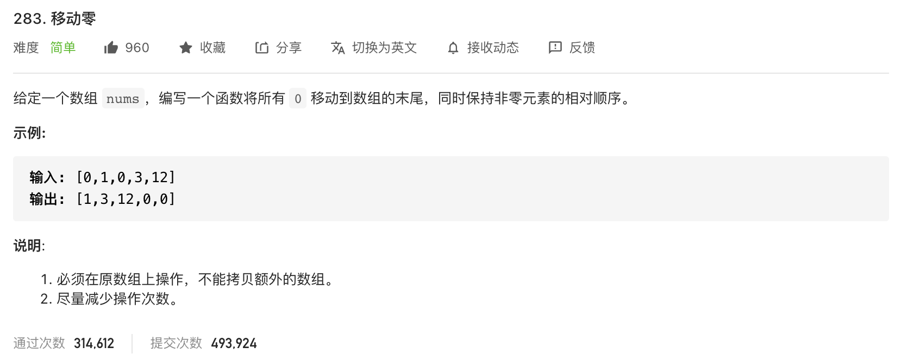

* Kramdown table of contents
{:toc .toc}
### [283. 移动零](https://leetcode-cn.com/problems/move-zeroes/)

>解题思路：
>
>双指针，将非零元素都复制移动到左边，然后将后面的填充零即可。




```java
class Solution {
    public void moveZeroes(int[] nums) {
        if (nums == null || nums.length == 0) {
            return;
        }
        int i = 0;
        for (int j = 0; j < nums.length; j++) {
            if (nums[j] != 0) {
                int temp = nums[j];
                nums[j] = nums[i];
                nums[i++] = temp;
            }
        }
    }
}
```

```java
class Solution {
    public void moveZeroes(int[] nums) {
        if (nums == null || nums.length == 0) {
            return;
        }
        int index = 0;
        for (int i = 0; i < nums.length; i++) {
            if (nums[i] != 0) {
                nums[index++] = nums[i];
            }
        }
        for (int i = index; i < nums.length; i++) {
            nums[i] = 0;
        }
    }
}
```